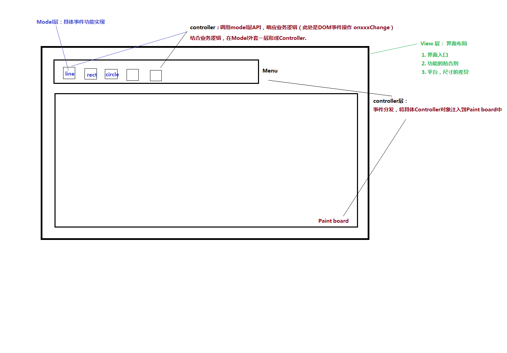

## **怎么设计一个“画图”程序？**
> [相关链接](https://time.geekbang.org/column/article/108887)

### **Model层设计 【功能实现】**
> **能直观体现业务： 浏览器端的 Model 层，代码就是一个 dom.js 文件**
- 1. 添加图形（Shape），可以是 QLine，QRect，QEllipse，QPath 等等。
- 2. 绘制（onpaint）
    ```sh
    # 方案1：为了 View 层能够绘制，需要让 DOM 层把自己的数据暴露给 View 层。【Model只产生数据】
    # 方案2：从简洁的方式来说，是让 Model 层自己来绘制，这样就避免暴露 DOM 层的实现细节。【Model产生数据和UI | 绘图是单一的UI可以使用方案2】
    # 取舍：
    #   a. 耦合 GDI 比暴露 DOM 的数据细节要好，因为 GDI 的接口通常来说更稳定。如果是复杂呈现逻辑，应交由view层去实现。
    #   b. 在依赖选择上，我们会更倾向于依赖接口更为稳定的组件，因为这意味着我们的接口也更稳定。
    ```
- 3. 示例代码
    ```js
    class QLineStyle {
    properties:
    width: number
    color: string
    methods:
    constructor(width: number, color: string)
    }

    class QRect {
    properties:
    x, y, width, height: number
    lineStyle: QLineStyle
    methods:
    constructor(r: Rect, lineStyle: QLineStyle)
    onpaint(ctx: CanvasRenderingContext2D): void
    }

    interface Shape {
    onpaint(ctx: CanvasRenderingContext2D): void
    }

    class QPaintDoc {
    methods:
    addShape(shape: Shape): void
    onpaint(ctx: CanvasRenderingContext2D): void
    }
    ```

### **View and ViewModel层设计 【界面框架、绘制整体呈现】**
> **View 要做的工作一般已浏览器完成**

- ViewModel 层相关内容细节
    1. ViewModel 层主要是一个 index.htm 文件和一个 view.js 文件
        ```sh
        # index.htm 是总控文件
        #   主要包含两个东西：界面布局（Layout）；应用初始化（InitApplication），比如加载哪些 Controllers。
        ```
    2. 屏蔽平台的差异：
        ```sh
        # 如果我们把实际绘制（onpaint）的工作交给 Model 层，那么 View 基本上就只是胶水层了。但是就算如此，View 层仍然承担了极其重要的责任。
        # A. Model 层很容易做到平台无关，除了 GDI 会略微费劲一点；
        # B. Controller 层除了有少量的界面需要处理平台差异外，大部分代码都是响应事件处理业务逻辑
        # C. View 层对事件的抽象得当，也是跨平台的。
        ```
    3. 定义界面布局：不同尺寸的设备，界面交互也会不太一样，在 View 层来控制不同设备的整体界面布局比较妥当。

    4. 相关代码细节
        ```js
        interface Controller {
            stop(): void
            onpaint(ctx: CanvasRenderingContext2D): void
        }

        class QPaintView {
            properties:
                doc: QPaintDoc
            properties: {
                lineWidth: number
                lineColor: string
            }
            drawing: DOMElement
            controllers: map[string]Controller
            methods:
                get currentKey: string
                get lineStyle: QLineStyle
                onpaint(ctx: CanvasRenderingContext2D): void
                invalidateRect(rect: Rect): void
                registerController(name: string, controller: Controller): void
                invokeController(name: string): void
                stopController(): void
                getMousePos(event: DOMEvent): Point
            events:
                /* 
                    1. Web 开发一个很重要的优势是不用自己处理局部更新问题，为什么这里我们却又要自己处理呢？
                    2. 原因是当前没用浏览器的 Virtual View，整个 DOM 的数据组织完全自己管理，这样我们面临的问题就和传统桌面开发完全一致。
                    3. 所以此处的OnXXXX 主要是响应成员 当前活动的controllers: map[string]Controller 的绘制
                */
                onmousedown: (event: DOMEvent):void
                onmousemove: (event: DOMEvent):void
                onmouseup: (event: DOMEvent):void
                ondblclick: (event: DOMEvent):void
                onkeydown: (event: DOMEvent):void
        }

        var qview = new QPaintView()
        ```

- View 层相关内容细节
    1. View 层并不关心具体的 Controller 都有些什么，但是会对它们的行为规则进行定义。[各种onXxxx()事件：业务规则数据信息的呈现]
    2. 事件委托（delegate）：允许 Controller 选择自己感兴趣的事件进行响应。[controller实现的onXxxx()事件：在绘图的项目中已经被DOM标准规定好了]

### **Controller层设计 【业务逻辑、基于Mode层实现的路径组合】**

- **避免了两类 Controller 相互耦合**
1. 菜单并不直接和各类创建图形的 Controller 打交道，而是调用 qview.invokeController 来激活对应的 Controller，

- **同一个 DOM API 在 Controller 层往往会有多条实现路径**
1. Model 层支持的图形只有 QLine、QRect、QEllipse、QPath 等四种，
2. 但是界面表现有六种：Line、Rect、Ellipse、Circle、Path、FreePath 等等。这是非常正常的现象。

- **撤销绘制事件**
1. onControllerReset 事件是创建图形的 Controller（例如 QPathCreator、QRectCreator 等）发出，并由 Menu 这个 Controller 接收。
2. 涉及了 View 层事件机制的设计问题
    ```sh
    # 要不要支持任意的事件?
    # 监听事件是支持单播还是多播？
    ```

- **相关代码设计：**
    ```js
    class QPathCreator {
        /* view 是 viewModel中的qview对象 */
        constructor(view, close) {
            this.points = []
            this.close = close
            this.fromPos = this.toPos = {x: 0, y: 0}
            this.started = false
            this.view = view
            let ctrl = this
            view.onmousedown = function(event) { ctrl.onmousedown(event) }
            view.onmousemove = function(event) { ctrl.onmousemove(event) }
            view.ondblclick = function(event) { ctrl.ondblclick(event) }
            view.onkeydown = function(event) { ctrl.onkeydown(event) }
        }
        // ....
    }
    ```

- **结构图解释**  


### **联网画图版本要考虑的问题**
- **编辑版本ID号**
    1. **DisplayId**: 带t开头，表示这篇文档从它被创建开始，从未与服务器同步过，是一篇临时的文档。一旦它完成与服务端的同步后，就会改用服务端返回的文档 ID。
    2. **LocalId**: 在文档还没有和服务端同步时，它和 displayID 是有关系的。文档第一次保存到服务端后，它的 displayID 会变化，而 localID 则并不改变。
    3. **SharpId**:
        ```sh 
        #a. 当 Shape 发生变化，比如修改图形样式、移动，我们修改 shapeID => shapeJsonData。
        #b. 请注意，在浏览器的 localStorage 里面，shapeID 是要全局唯一的，我们实际存储的是 QPaintDoc.localID + ":" + shape.id。
        ```
    4. **DocumentId**:  

- **数据变更**
    - **数据变更分为了两级**
    1. shapeChanged有三种
        ```sh
        # 修改一个 shape 的图形样式（setProp）
        # 移动一个 shape 的位置（move）
        # 增加一个图形（addShape）
        ```
    2.  documentChanged有两种
        ```sh
        # 增加一个图形（addShape），它会导致文档的图形数量增加一个，发生 documentChanged；
        # 删除一个图形（deleteShape），它会导致文档的图形数量减少一个，发生 documentChanged。
        ```

- **存储的容量限制与安全**
    1. 本地内存不够时，淘汰最远历史存储
    2. 用户登录退出时清空浏览器本地数据库

- **重试的友好性**
    1. 因为网络是不稳定的。这意味着，在发生一次网络请求失败时，在一些场景下你不一定能确定请求的真实状态。
    2. 解决：请求上携带ID

- **版本升级**
    1. 带上版本信息

### **其他**
- 为了避免 Model 知道 View 的实现细节，可以让 Model 耦合 GDI 接口。
- 模块间通信如果避免不了耦合，就耦合稳定的模块，这个模块最好是系统的，因为系统模块相对于业务模块通常更加稳定；
- ViewModel 持有 Model，并由 Controller 来更新 Model/ViewModel；
- ViewModel 定义 Controller 的行为规则，但并不关心 Controller 的具体行为。Controller 可以选择性的接管 ViewModel 的事件；
- ViewModel 协调 Model 和 Controller，启到承上启下的作用，所以 ViewModel 职责的划分对程序的结构有比较大的影响；
- 避免 Controller 之间的耦合，可以使用 ViewModel 作为通信中介者；
- 相同的 Model 可能在 Controller 层有不同的展现方法；


