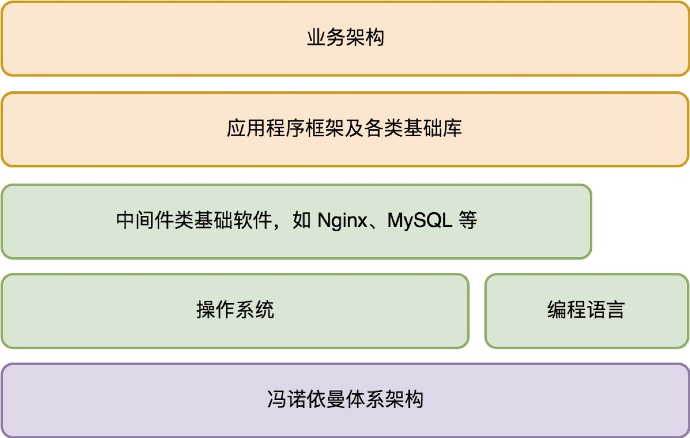
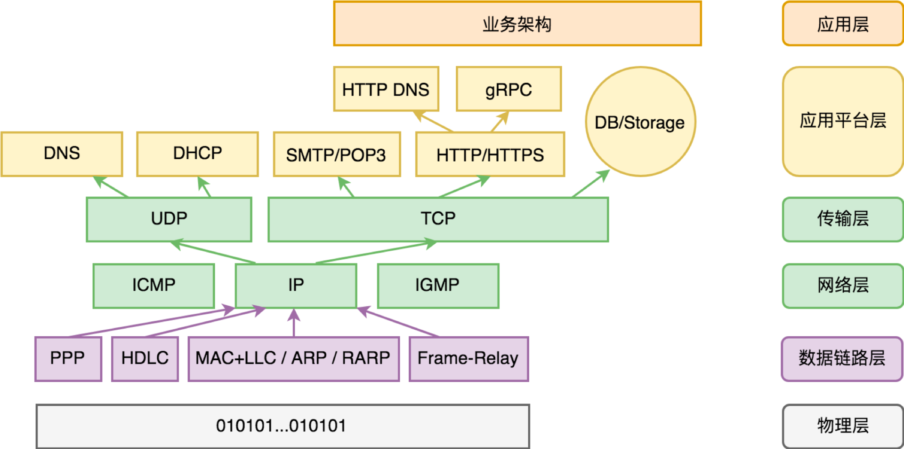
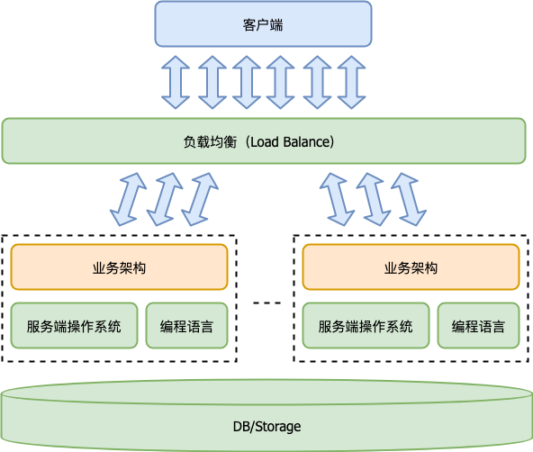
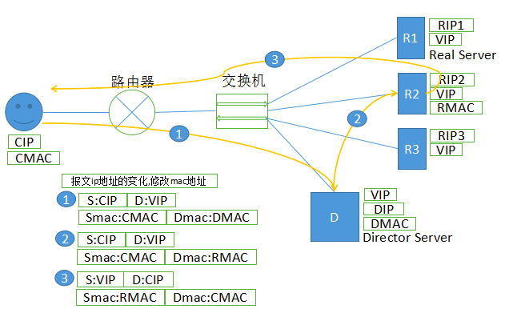

## **服务器后台架构设计**

### **服务器开发层级图**


### **网络协议层级图**


### **系统开发层级图**


#### **A. DNS 负载均衡 (Load Balance)**
> **变更延时高，流量均衡能力弱，没有重试**
- **做法：一个域名通过 DNS 解析到多个 IP，每个 IP 对应不同的服务端程序实例**
    1. 升级不便
    ```sh
    # 我们把 IP1 从 DNS 解析中去除，就算我们写明 TTL 是 15 分钟，但是过了一天可能都还稀稀拉拉有一些用户请求被发送到 IP1 这个实例。
    # 原因：DNS 解析是有层层缓冲的。
    ```

    2. 流量调度不均
    ```sh
    # DNS 服务器是有能力做一定的流量均衡的。比如第一次域名解析返回 IP1 优先
    # 第二次域名解析让 IP2 优先，以此类推，它可以根据域名解析来均衡地返回 IP 列表。但是域名解析均衡，并不代表真正的流量均衡。
    #
    # 一方面，不是每次用户请求都会对应一次 DNS 解析，客户端自己有缓存。
    # 另一方面，DNS 解析本身也有层层缓存，到 DNS 服务器的比例已经很少了。
    ```

#### **B.LVS 网络层负载均衡 (Linux Virtual Server)**
> **由于出向流量不经过lvs，所以没办法做重试的功能**
1. **VS/NAT**：通过网络地址转换（NAT）技术做调度。请求和响应都会经过调度器中转，性能最差。  
2. **VS/TUN**：把请求报文通过 IP 隧道转发至真实服务器，而真实服务器将响应直接返回给客户，所以调度器只处理请求报文。这种做法性能比。
3. **VS/DR**：通过改写请求报文的 MAC 地址，将请求发送到真实服务器，真实服务器将响应直接返回给客户。这种做法相比 VS/TUN 少了 IP 隧道的开销，性能最好。
    
    ```sh
    # 【关键技巧】
    #  1. VIP 绑定在 LVS 调度器（Director Server）上，也绑定在所有的业务服务器实例 RS（Real Server）上，所以我们把它叫做虚拟 IP（Virtual IP）。
    #  2. ARP 广播查询 VIP 对应的 MAC 地址得到什么？答案当然是 LVS 调度器（Director Server）。
    #  3. 在真实的业务服务器实例 RS（Real Server）上，我们把 VIP 绑定在 lo 接口上，并对 ARP 请求作了抑制，这样就避免了 IP 冲突。
    ```

4. **优缺点**: 
    ```sh
    # 1. LVS 这种在网络层底层来做负载均衡，相比其他负载均衡技术来说，其特点是通用性强、性能优势高。
    # 2. 只处理入向流量，减小了流量瓶颈的问题，切换升级容易，调度容易
    # 3. 某个业务服务器实例 RS 挂掉，但 LVS 调度器（Director Server）还没有感知到，在这个短周期内转发到该实例的请求都会失败。这样的失败只能依赖客户端重试来解决。
    ```

#### **C.nginx 七层负载均衡**
> **有办法避免出现这种请求失败的情况吗？可以，服务端重试**
1. HTTP 网关收到一个 HTTP 请求（Request）后，根据一定调度算法把请求转发给后端真实的业务服务器实例 RS（Real Server）
2. 收到 RS 的应答（Response）后，再把它转发给客户端。整个过程的逻辑非常简单，而且重试也非常好做。
3. 在发现某个 RS 实例挂了后，HTTP 网关可以将同一个 HTTP 请求（Request）重新发给其他 RS 实例。
    ```sh
    # 【关键细节】
    #  1. 为了能够支持重试，HTTP 请求（Request）需要被保存起来
    #  2. HTTP不请求会导致什么问题？ 
    #       a. 不保存 HTTP 请求做重试是有可能的，但是只能支持业务实例完全挂掉 HTTP 请求一个字节都没发过去的场景。
    #       b. 断电或异常崩溃等情况
    #  3. 怎么保存HTTP请求？ 。大部分 HTTP 请求不大，直接在内存中存储即可
    #  4. 文件上传型的请求，由于请求包中包含文件内容，可能就需要依赖临时文件或其他手段来保存 HTTP 请求。
    ```

#### **D. 负载升级**
> 一般DNS, LVS, 应用均衡三个都会同时用
-  **对于前端是 LVS 这种网络层负载均衡的场景，升级的核心步骤为**：
1. 升级系统通知 LVS 调度器（Director Server）下线要升级的业务服务器（Real Server）实例。
2. LVS 调度器（Director Server）将该实例从 RS 集合中去除，这样就不再调度新流量到它。
3. 升级系统通知要升级的 RS 实例退出。
4. 要升级的 RS 实例处理完所有处理中的请求，然后主动退出。
5. 升级系统更新 RS 实例到新版本，并重启。
6. 升级系统将 RS 实例重新加回 RS 集合参与调度。

- **对于前端是 HTTP 应用网关这种负载均衡的场景**:
1. 升级系统通知升级的业务服务器（Real Server）实例退出。
2. 要升级的 RS 实例进入退出状态，这时新请求进来直接拒绝（返回一个特殊的 Status Code）
3. 处理完所有处理中的请求后，RS 实例主动退出。
4. 升级系统更新 RS 实例到新版本，并重启。
5. 优点：完美解决负载均衡的问题，解决请求重试问题，同样可以做到无感知服务端升级

#### **E. 存储中间件**
> **服务端程序的伸缩能力完全取决于存储的伸缩能力**
- 从使用界面，业务特性角度，我们要考虑选择关系型数据库还是文档型数据库，以及是否需要事务特性？
    1. 关系型数据库：
    2. 文档型数据库：以 MongoDB 为代表。把数据每个条目（row）称为文档（document），每个文档用JSON或其他文档描述格式表示。
    3. KV型数据库： 

- 确定了我们要使用什么样的数据库后，接着我们从实现角度，考虑主从结构和分布式方面的特性？
    1. 主从结构：
        ```sh 
        # 主服务器挂掉之后的细节：
        # 1. 从服务器必须是单数，避免推举失败。
        # 2. 必须确保至少有一台从服务器保存了最新的数据，避免数据丢失。
        ```

    2. 分布式：数据分片存储到多台设备上的分片服务器一起构成一个单副本的数据库。
        ```sh
        # 【问题】
        #  1. 数据规模大到一定程度后，单个物理节点存放不了那么大的数据量。
        #  2. 主承受的读写压力太大，单台主节点承受不了这样高的 IOPS（吞吐能力）。
        ```
        ```sh
        # 【分布式的方式】
        #  1. 哈希分片（Hash based sharding）
        #  2. 范围分片（Range based sharding）
        #
        # 【面临的问题】
        #  无论哪个分片方式，都会面临因为扩容缩容导致的重新分片过程。重新分片意味着需要做数据的搬迁。数据迁移阶段对数据访问的持续有不低的挑战
        #  因为这时候对正在迁移的分片来说，有一部分数据在源节点，一部分数据在目标节点。
        ```
        ```sh
        # CAP 理论说的是什么？简单说，就是 C、A、P 三个目标不能兼得，我们只能取其二。
        # A. 数据一致性 (Consistency)：如果系统对一个写操作返回成功，那么之后的读请求都必须读到这个新数据,么所有读操作都不能读到这个数据
        # B. 服务可用性 (Availability)：所有读写请求在一定时间内得到响应，可终止、不会一直等待。
        # C. 分区容错性 (Partition-tolerance)：在网络分区的情况下，被分隔的节点仍能正常对外服务。
        ```


#### **F. 存储：文件系统与对象存储**
- **文件系统的问题**
1. 伸缩性问题：单机文件系统的第一个问题是单机容量有限，在存储规模超过一台机器可管理的时候，应该怎么办的问题。
2. 性能瓶颈：单机文件系统通常在文件数目达到临界点后，性能快速下降。在 10TB 的大容量磁盘越来越普及的今天，这个临界点相当容易到达。
3. 可靠性：更严谨来说是持久性（Durability）问题。单机文件系统通常只是单副本的方案。数据需要有冗余（比较经典的做法是 3 副本），以便在磁盘损坏时及早修复丢失的数据。
4. 可用性要求：单机文件系统通常只是单副本的方案，在该机器宕机后，数据就不可读取，也不可写入。

- **文件系统问题解决方案**
1. 在单机文件系统上加 RAID5 做数据冗余，来解决单机文件系统的可靠性问题。
    ```sh
    # RAID5 数据冗余 【100年出现一次失误】
    #
    # 1. 集群规模会变大。如果仍然沿用这个土方法，比如现在有 100 台这样的机器，那么它就会变成 1 年就丢失一次数据。
    # 2. 你采购的磁盘容量会变大。如果实际数据修复时间没那么理想，比如变成 3 天，那么单机的可靠性就直降至 4 年丢失一次数据。100 台这样的机器就会是 15 天就丢失一次数据。
    #
    ```

2. 什么样的数据会有最大的存储规模？
    ```sh
    # a. 非结构化数据。这类数据的组织形式通常以用户体验友好为目标，而不是机器友好为目标。
    # b. 数据本身也自然不是以机器易于理解的结构化形式来组织。图片、音视频、Office 文档等多媒体文件，就是比较典型的非结构化数据。互联网上 90% 以上传输的数据量都是非结构化数据。
    ```


- **非结构化数据存储：对象存储**
1. 非结构化数据的存储方式，最理想的绝对不是分布式文件系统。文件系统只是桌面操作系统为了方便用户手工管理数据而设计的产物。
2. 对服务端体系架构来说，文件系统其实是一个过时的东西。非结构化数据最佳的存储方式，还是键值存储（KV Storage），叫对象存储（Object Storage）。
3. 这也是为什么在数据库之后，会冒出来那么多 NoSQL 数据库。因为数据库和文件系统一样，最早都是单机的，在伸缩性、性能瓶颈（在单机数据量太大时）、可靠性、可用性上遇到了相同的麻烦。
    ```sh
    # A. NoSQL 数据库它们更多的不是去 SQL，而是去关系（我们知道数据库更完整的称呼是关系型数据库）。
    # B. 有关系意味着有多个索引，也就是有多个 Key，而这对数据库转为分布式存储系统来说非常不利。
    # C. 对象存储是一个键值存储，就意味着我们可以通过对 Key 做 Hash，或者对 Key 按 Key Range 做分区，让请求快速定位到特定某一台存储机器上，从而转化为单机问题。
    ```
4. 对象存储的存储规模最大，占据了 90% 以上存储需求。

#### **G. 存储成本**
> **通常我们用每 GB 每月花费多少钱来表示单位存储成本**
- **影响存储成本的因素**
1. 存储密度： 存储密度越高，单台机器的存储量越大，单位成本越低。存储密度取决于：单台机器能够插的硬盘数量、单块磁盘的容量。
2. 冗余度： GFS 采用的是 3 副本，也就是冗余度为 3。当前降低冗余度，通常采用的是纠删码（EC）这样的算术冗余方案。
 
- **影响存储集群的因素**
1. 冗余度降低不一定会伤害集群的持久性和可用性，它们和冗余度不是正相关，而和集群的容错能力相关。
2. 存储密度对系统的可用性和可靠性都会有一定的伤害。
