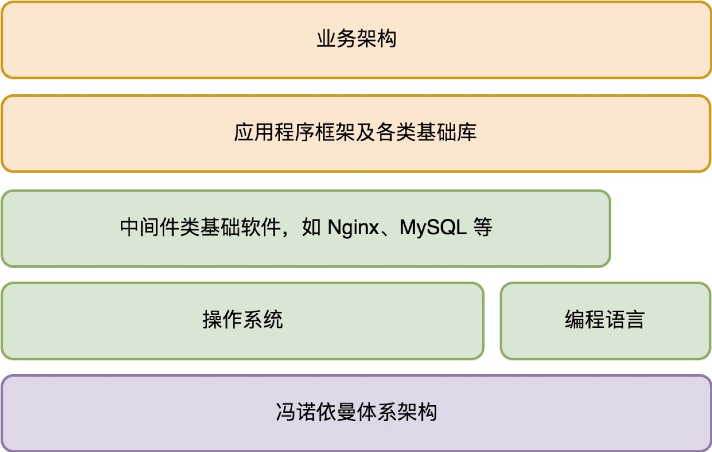
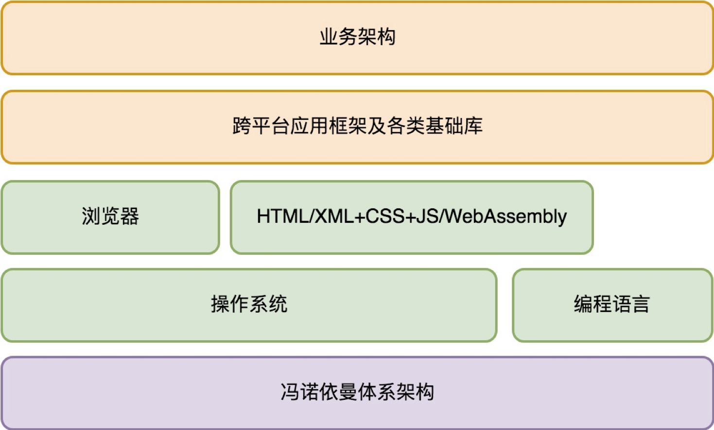

## **架构设计的宏观视角**

### 计算机发展的历程
- **简单的数据存储，输入，输出跳转指令** [冯诺依曼体系结构] 
- **编程语言，编译器的出现** [指令难读问题]
- **操作系统的出现** [解决程序之间资源抢占互相干扰问题]
- **基础软件的出现(中间件)** [基础架构解决的是与业务无关的一些通用性的问题,通常以独立的软件存在,Linux、Nginx、MySQL、PHP]

### 服务端应用程序架构
- **服务端架构**
    

- **客户端架构**
1. **面临的问题**[终端系统多样化]
    ```sh
    # PC: Windows、Mac、Linux 等数十种.
    # 手机: Android、iOS，Windows Mobile.
    # 备种类: 笔记本、平板电脑，还有手机、手表、汽车，未来只会更加多样化。
    ```

2. **前景趋势**
    ```sh
    # 第一个想消除客户端的多样性，并且跨平台提供统一编程接口的，是浏览器。
    # 浏览器: 
    #   A. 一旦某种浏览器流行起来，开发人员都在浏览器上做应用，
    #   B. 导致底层操作系统管道化，这是操作系统厂商所不愿意看到的。
    ```

3. **客户端架构**
    

### 计算机指令的类型
- 计算类，也就是支持我们大家都熟知的各类数学运算，如加减乘除、sin/cos 等等。
- I/O 类，（从存储读写数据）从输入输出设备读数据、写数据。
- 指令跳转类，在满足特定条件下跳转到新的当前程序执行位置。