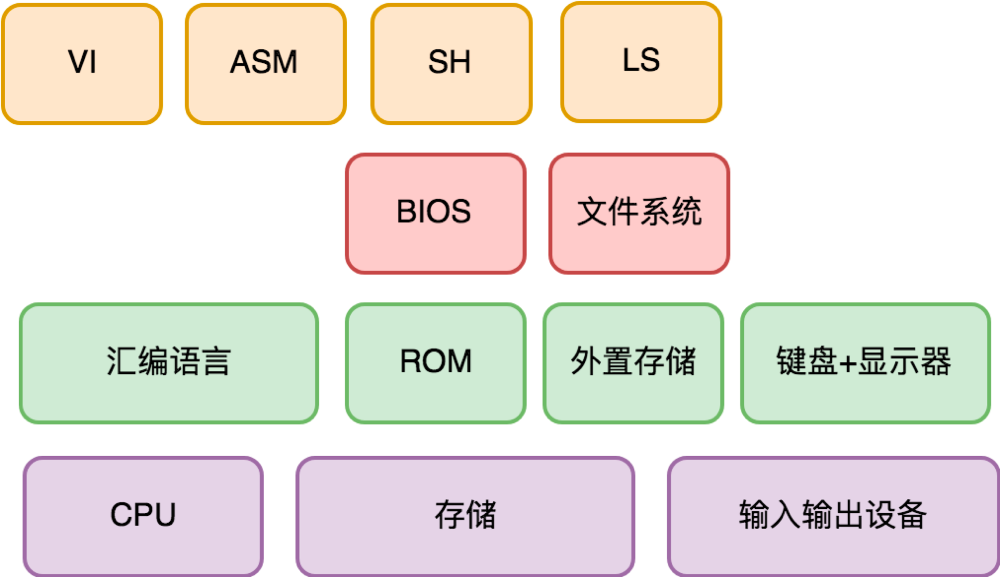

## **最简自我迭代计算机**
> **一个最小功能集，但计算能力可自我迭代的计算机应该是什么样的？**

### **计算机需求架构分析**
- **一个最小功能集、计算能力可自我迭代的计算机，它的变化点和稳定点分别是什么？**
```sh
# 需求：
# A. 需要有人负责支持外置存储的数据格式，提供统一的功能给其他程序使用
# B. 需要有人提供管理外置存储的基础能力，比如查询（List）一下外置存储里面都有些什么文件
# C. 需要有人执行外置存储上的可执行程序。它可以实现为一个独立的程序，
# D. 一个纯正的文本编辑器
# E. 汇编编译器
#
# 变化点：
# A. 外置存储的数据格式。对此，设计文件系统（或 Key-Value 存储）子系统来负责这件事情。提供 ls 程序来管理外置存储中的文件。
# B. 用户最终拿到这个计算机后，会迭代出什么能力。对此，设计了 sh 程序，让它支持在外置存储上执行任何应用程序。
# C. 编辑器的交互范式。对此，设计了 vi 程序，让它迭代编辑器的能力。
# D. 汇编语言的使用范式。对此，我们设计了 asm 程序，让它响应 CPU 指令集的迭代，以及汇编语言进化的迭代。
```

- **计算机结构需求分析简图**

