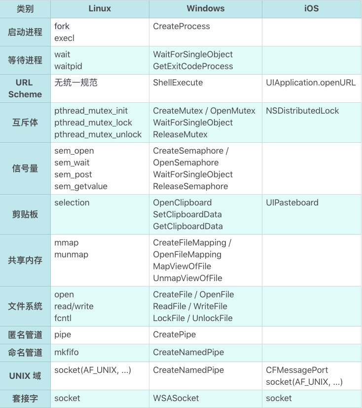

## **多任务:进程，线程，协程**

### **多任务与执行体**
> **最初始的计算机只能是运行一个任务**
- **基本需求分析**
1. 一个人做事慢，多个人做事快
2. 问题同时也就出现了：互斥，同步，资源共享

- **多任务需求的实现**
> **每个核至少可以运行一个任务**
1. 多颗CPU
2. 一颗CPU多核
3. 单颗CPU单核

- **执行体简介**
> **从单CPU单核如何实现多任务？引入执行体概念**
1. 方法：把 CPU 的时间切成一段段时间片，每个时间片只运行某一个软件。分时间片实现的多任务系统
    ```sh
    # 任务是什么，怎么抽象任务这样一个概念？
    # 任务的状态都有什么？
    # 怎么保存与恢复；什么时机会发生任务切换？
    ```

2. 执行体：可被 CPU 赋予执行权的对象，它至少包含下一个执行位置（获得执行权后会从这里开始执行）以及其他的运行状态
    ```sh
    # 进程，线程，协程
    ```

- **执行体(进程，线程)**
1. 进程fork设计上的不合理：fork 继承了父进程多余的属性。
2. 线程的需求：操作系统发现同一个软件内还是会有多任务的需求，
3. 进程fork的补充说明：进程实际上承担了一部分来自线程的需求：我需要父进程的环境。

- **执行体(协程的出现)**
1. 需求：实现高性能的网络服务器
2. 协程出现的背景
    ```sh
    # 一，操作系统提供的标准网络 IO 有以下这些成本:
    # A. 系统调用机制产生的开销
    #   - 操作系统的系统调用很慢。这句话很容易被错误地理解为系统调用机制产生的开销很大。
    #   - 从操作系统内核的主线程来说，内核是独立进程，但是从系统调用的角度来说，操作系统内核更像是一个多线程的程序，每个系统调用是来自某个线程的函数调用。[开销没有想象那么大]
    #
    # B. 数据多次拷贝的开销
    # C. 因为没有数据而阻塞，产生调度重新获得执行权，产生的时间成本
    # D. 线程的空间成本和时间成本（标准 IO 请求都是同步调用，要想 IO 请求并行只能使用更多线程）

    # 二，使用了epoll的高性能服务器解决了上述哪些问题？ 【线程数量问题】
    # A. 从系统调用次数的角度，epoll 或 IOCP 都是产生了更多次数的系统调用。从内存拷贝来说也没有减少
    # B. 所以真正最有意义的事情是：减少了线程的数量。
    # C. 异步 IO 编程真的很反人类，它让程序逻辑因为 IO 异步回调函数而碎片化。
    ```

3. 高性能服务器-epoll/线程成本
    ```sh
    # 我们为什么希望减少线程数量？因为线程的成本高？

    # 时间成本：
    # A. 执行体切换本身的开销，它主要是寄存器保存和恢复的成本，可腾挪的余地非常有限；
    # B. 执行体的调度开销，它主要是如何在大量已准备好的执行体中选出谁获得执行权；
    # C. 执行体之间的同步与互斥成本

    # 线程的空间成本:
    # A. 执行体的执行状态
    # B. TLS（线程局部存储）
    # C. 执行体的堆栈
    ```

4. 协程要解决的问题 [没有提到如何解决/要自己去找相关资料]
    ```sh
    # A. 回归到同步 IO 的编程模式
    # B. 降低执行体的空间成本和时间成本
    ```

5. 协程需要具备哪些功能？
    ```sh
    # 协程类似于用户态的操作系统
    # 协程的调度；协程的同步、互斥与通讯；协程的系统调用包装，尤其是网络 IO 请求的包装。
    ```

6. 不同操作系统之间进程通信的接口区别  
    


