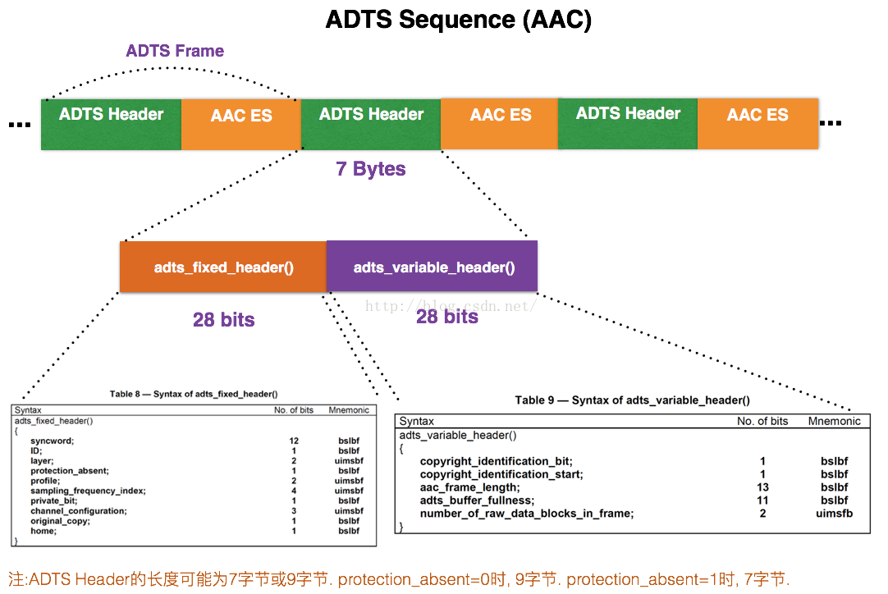
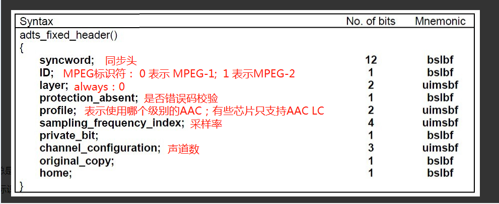
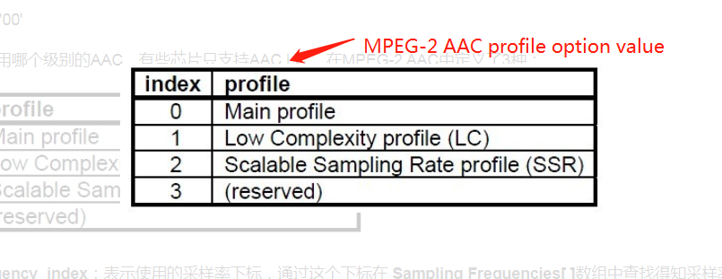
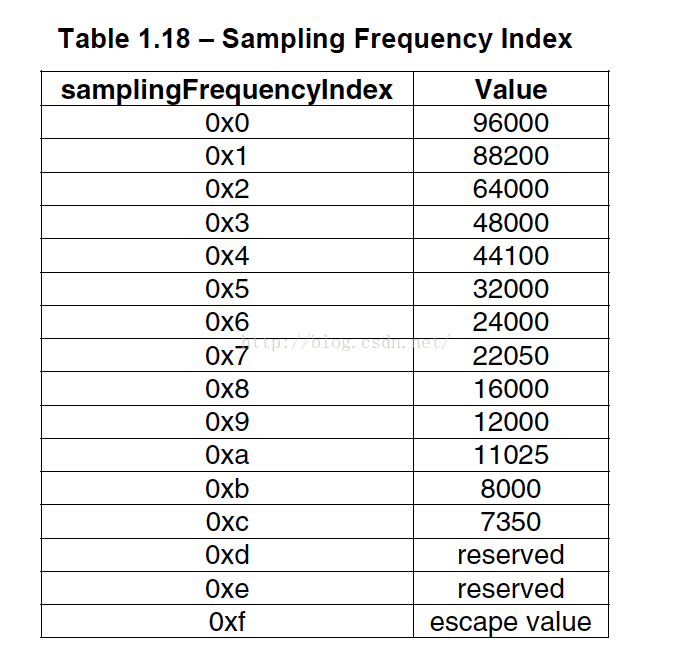
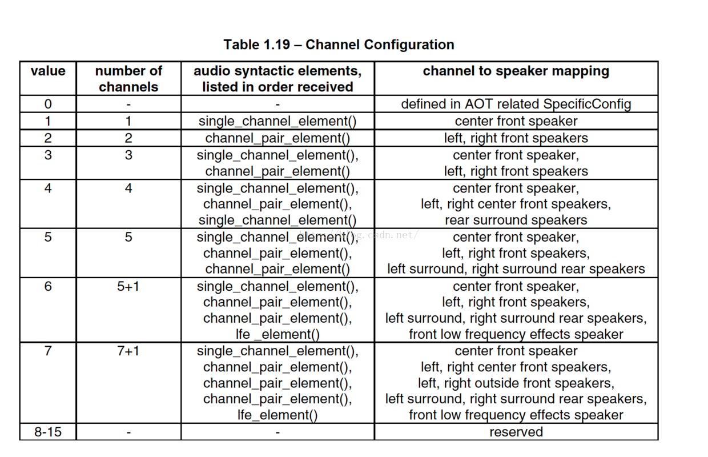
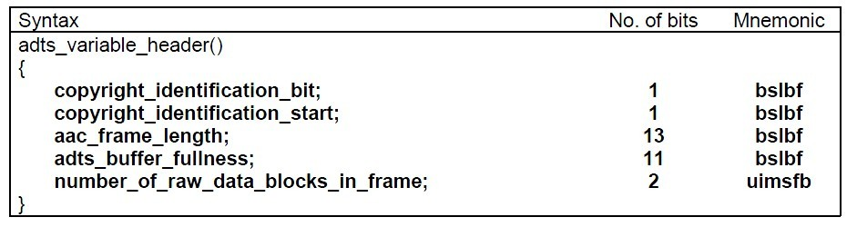

## **ACC原始码流解析**

> [相关链接](!https://www.cnblogs.com/zhangxuan/p/8809245.html) | [雷神](https://blog.csdn.net/leixiaohua1020/article/details/50535042)

### **AAC原始码流简介**
- **AAC原始码流（又称为“裸流”）是由一个一个的ADTS frame组成的**
- **每个ADTS frame之间通过syncword（同步字）进行分隔。同步字为0xFFF（二进制“111111111111”**
- **AAC码流解析的步骤就是首先从码流中搜索0x0FFF，分离出ADTS frame；然后再分析ADTS frame的首部各个字段**

### **AAC原始码流封装类型**
-  **AAC的音频文件格式有ADIF & ADTS**
    1. **ADIF：Audio Data Interchange Format 音频数据交换格式**
    ```sh
    # 这种格式的特征是可以确定的找到这个音频数据的开始，不需进行在音频数据流中间开始的解码.
    # 它的解码必须在明确定义的开始处进行。故这种格式常用在磁盘文件中。
    ```
    2. **ADTS的全称是Audio Data Transport Stream。是AAC音频的传输流格式**
    ```sh
    # AAC音频格式在MPEG-2（ISO-13318-7 2003）中有定义。AAC后来又被采用到MPEG-4标准中。 
    # 这种格式的特征是它是一个有同步字的比特流，解码可以在这个流中任何位置开始。它的特征类似于mp3数据流格式。
    # 简单说，ADTS可以在任意帧解码，也就是说它每一帧都有头信息。ADIF只有一个统一的头，所以必须得到所有的数据后解码。
    ```
    3. **两种的header的格式也是不同的，目前一般编码后的和抽取出的都是ADTS格式的音频流**
    4. **编码AAC裸流的时候，会遇到写出来的AAC文件并不能在PC和手机上播放，很大的可能就是AAC文件的每一帧里缺少了ADTS头信息文件的包装拼接**


### **AAC ADTS封装框架(Audio Data Transport Stream)**
- **框架**
   
- **ADTS 固定格式头**
   
   **1. AAC的级别类型 - 硬件支持相关**
     
   **2. 采样率对照表**
   
   **3. 声道索引**
   
- **ADTS 可变格式头**
   
    ```sh
    # aac_frame_length : 一个ADTS帧的长度包括ADTS头和AAC原始流.
    # frame length, this value must include 7 or 9 bytes of header length:
    # protection_absent=0时, header length=9bytes
    # protection_absent=1时, header length=7bytes

    # adts_buffer_fullness：0x7FF 说明是码率可变的码流。
    # number_of_raw_data_blocks_in_frame：表示ADTS帧中有number_of_raw_data_blocks_in_frame + 1个AAC原始帧。
    # number_of_raw_data_blocks_in_frame == 0 表示说ADTS帧中有一个AAC数据块。
    ```


```C
/**
 * 最简单的视音频数据处理示例
 * Simplest MediaData Test
 *
 * 雷霄骅 Lei Xiaohua
 * leixiaohua1020@126.com
 * 中国传媒大学/数字电视技术
 * Communication University of China / Digital TV Technology
 * http://blog.csdn.net/leixiaohua1020
 *
 * 本项目包含如下几种视音频测试示例：
 *  (1)像素数据处理程序。包含RGB和YUV像素格式处理的函数。
 *  (2)音频采样数据处理程序。包含PCM音频采样格式处理的函数。
 *  (3)H.264码流分析程序。可以分离并解析NALU。
 *  (4)AAC码流分析程序。可以分离并解析ADTS帧。
 *  (5)FLV封装格式分析程序。可以将FLV中的MP3音频码流分离出来。
 *  (6)UDP-RTP协议分析程序。可以将分析UDP/RTP/MPEG-TS数据包。
 *
 * This project contains following samples to handling multimedia data:
 *  (1) Video pixel data handling program. It contains several examples to handle RGB and YUV data.
 *  (2) Audio sample data handling program. It contains several examples to handle PCM data.
 *  (3) H.264 stream analysis program. It can parse H.264 bitstream and analysis NALU of stream.
 *  (4) AAC stream analysis program. It can parse AAC bitstream and analysis ADTS frame of stream.
 *  (5) FLV format analysis program. It can analysis FLV file and extract MP3 audio stream.
 *  (6) UDP-RTP protocol analysis program. It can analysis UDP/RTP/MPEG-TS Packet.
 *
 */
#include <stdio.h>
#include <stdlib.h>
#include <string.h>
 
 
int getADTSframe(unsigned char* buffer, int buf_size, unsigned char* data ,int* data_size){
	int size = 0;
 
	if(!buffer || !data || !data_size ){
		return -1;
	}
 
	while(1){
		if(buf_size  < 7 ){
			return -1;
		}
		//Sync words
        //找到同步标志，得到一个完整的ADTS包
		if((buffer[0] == 0xff) && ((buffer[1] & 0xf0) == 0xf0) ){
			size |= ((buffer[3] & 0x03) <<11);     //high 2 bit
			size |= buffer[4]<<3;                  //middle 8 bit
			size |= ((buffer[5] & 0xe0)>>5);       //low 3bit
			break;
		}
		--buf_size;
		++buffer;
	}
 
    // 空间不够
	if(buf_size < size){
		return 1;
	}
 
    // 拷贝数据
	memcpy(data, buffer, size);
	*data_size = size;
 
	return 0;
}
 
int simplest_aac_parser(char *url)
{
	int data_size = 0;
	int size = 0;
	int cnt=0;
	int offset=0;
 
	//FILE *myout=fopen("output_log.txt","wb+");
	FILE *myout=stdout;
 
	unsigned char *aacframe=(unsigned char *)malloc(1024*5);
	unsigned char *aacbuffer=(unsigned char *)malloc(1024*1024);
 
	FILE *ifile = fopen(url, "rb");
	if(!ifile){
		printf("Open file error");
		return -1;
	}
 
	printf("-----+- ADTS Frame Table -+------+\n");
	printf(" NUM | Profile | Frequency| Size |\n");
	printf("-----+---------+----------+------+\n");
 
	while(!feof(ifile)){
		data_size = fread(aacbuffer+offset, 1, 1024*1024-offset, ifile);
		unsigned char* input_data = aacbuffer;
 
		while(1)
		{
			int ret=getADTSframe(input_data, data_size, aacframe, &size);
			if(ret==-1){
                // 音频流数据格式不对.
				break;
			}else if(ret==1){
                // 空间不足时，把buffer中未处理完的数据往前挪.覆盖掉已经处理的数据.
				memcpy(aacbuffer,input_data,data_size);
				offset=data_size;
				break;
			}
 
			char profile_str[10]={0};
			char frequence_str[10]={0};
 
			unsigned char profile=aacframe[2]&0xC0;
			profile=profile>>6;
			switch(profile){
                case 0: sprintf(profile_str,"Main");break;
                case 1: sprintf(profile_str,"LC");break;
                case 2: sprintf(profile_str,"SSR");break;
                default:sprintf(profile_str,"unknown");break;
			}
 
			unsigned char sampling_frequency_index=aacframe[2]&0x3C;
			sampling_frequency_index=sampling_frequency_index>>2;
			switch(sampling_frequency_index){
                case 0: sprintf(frequence_str,"96000Hz");break;
                case 1: sprintf(frequence_str,"88200Hz");break;
                case 2: sprintf(frequence_str,"64000Hz");break;
                case 3: sprintf(frequence_str,"48000Hz");break;
                case 4: sprintf(frequence_str,"44100Hz");break;
                case 5: sprintf(frequence_str,"32000Hz");break;
                case 6: sprintf(frequence_str,"24000Hz");break;
                case 7: sprintf(frequence_str,"22050Hz");break;
                case 8: sprintf(frequence_str,"16000Hz");break;
                case 9: sprintf(frequence_str,"12000Hz");break;
                case 10: sprintf(frequence_str,"11025Hz");break;
                case 11: sprintf(frequence_str,"8000Hz");break;
                default:sprintf(frequence_str,"unknown");break;
			}
 
 
			fprintf(myout,"%5d| %8s|  %8s| %5d|\n",cnt,profile_str ,frequence_str,size);
			data_size -= size;
			input_data += size;
			cnt++;
		}   
 
	}
	fclose(ifile);
	free(aacbuffer);
	free(aacframe);
	return 0;
}
```