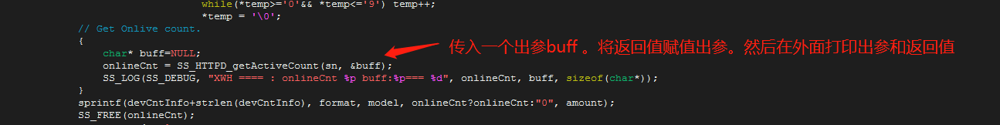
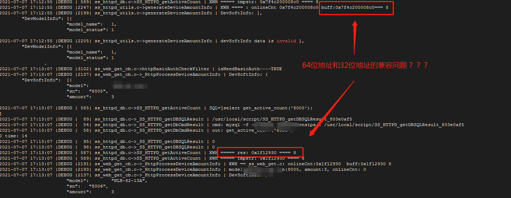
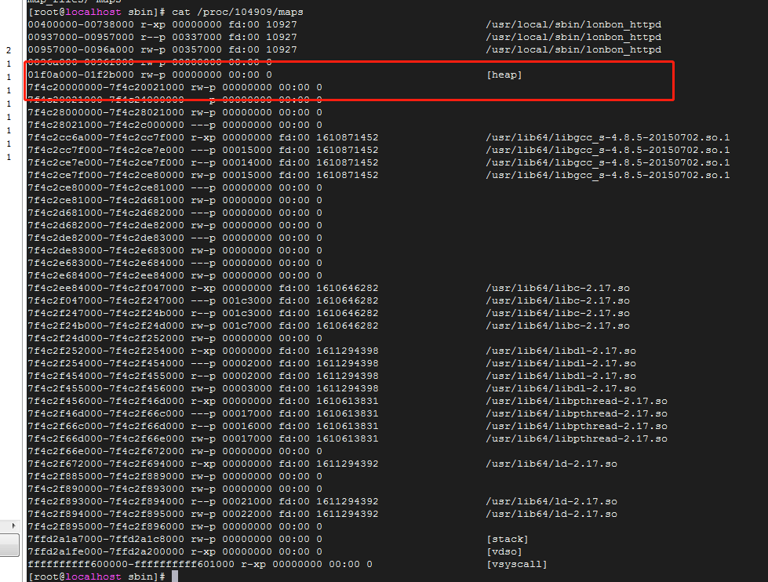
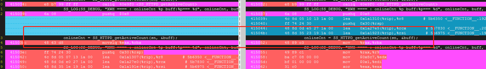

##  **C 语言头文件声明相关问题**

### **问题现象：**
- **代码：**
   

- **输出1：**


- **输出2：**


- **问题描述**
1. 将要返回的信息【char*地址】，通过出参和返回值两种方式返回。 然后在外面用%p打印。
2. 结果两者的内容不一样。【若在头文件声明该函数，则没有这问题】

- **原因解决办法**
1. **图中 SS_HTTPD_getActiveCount 函数在头文件中没有声明**

### **问题分析**
- **是否是32 64位的兼容问题？**  
    1. 图中显示HEAP的地址不一定是连续的。所以其地址可能是 32位也可能是64位


- **为什么缺少函数声明会导致返回值的不一致**  
    1. **使用加了声明版本和有问题的版本进行反汇编对比**
        
        ```sh
        # 不带函数声明时: 从汇编代码可以知道，返回值被当成了数据，gcc使用了movslq 指令进行了二次处理
        # 带函数声明是： gcc 知道返回的数据是地址， 使用汇编指令mov,  结果正确。
        #
        # 佐证：c语言是可以的,但有时会有问题,因为函数默认的返回值及参数都是int
        ```


