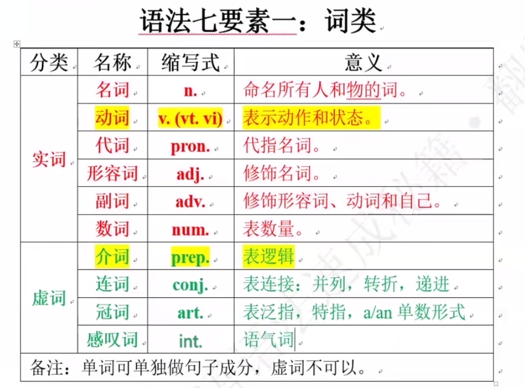
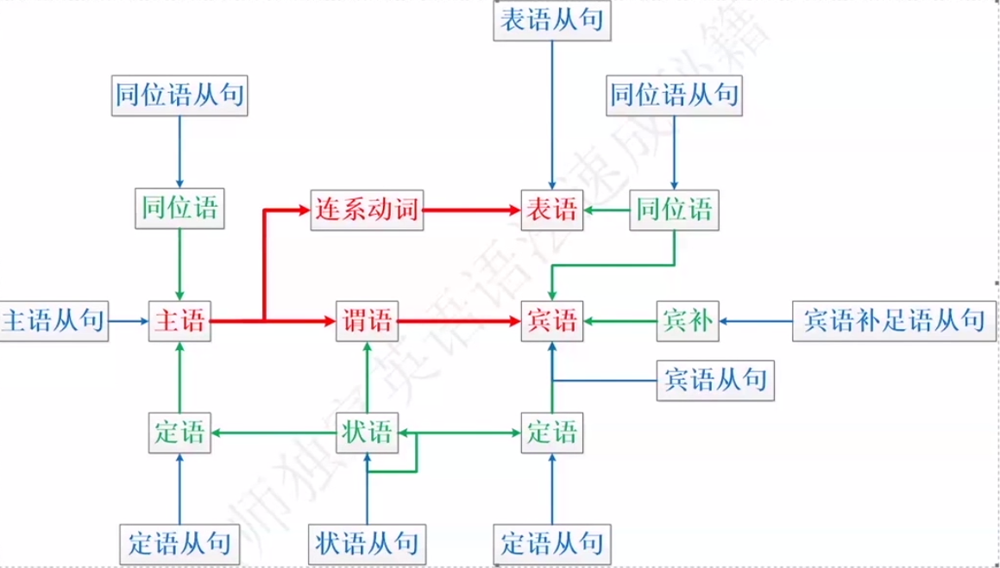
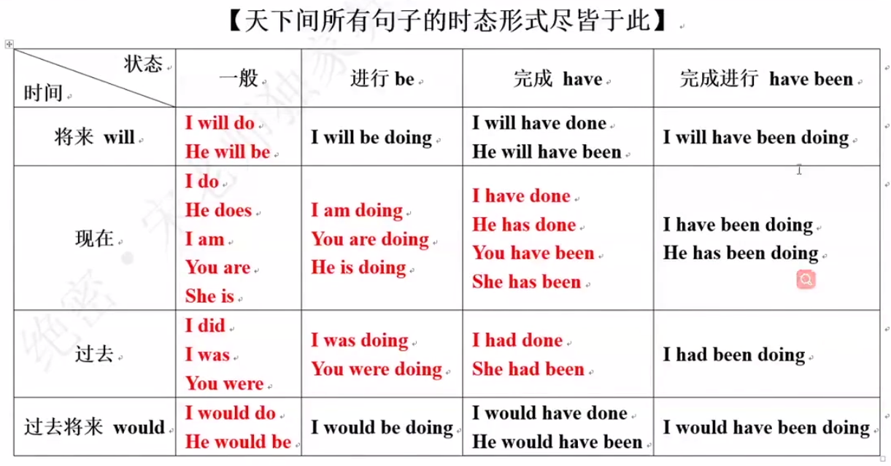

## 英语语法七要素

### **一. 单词词性**
> **介词表逻辑，最重要，最难**



### **二. 句子成分**
> **句子由核心成分，修饰成分组成； 有谓语才能称为句子，没有谓语只能为短语**
 
 |**成分**|**作用**|**组成**|
 |:--:|:--|:--|
 |主语|动作发出者|**n, num, pron**| 
 |谓语|动作|**v**|
 |宾语|动作的承受者|**n,num,pron**|
 |补语|补充用语说明的统称<br/>[表语(系动词)｜宾补(使役动词才需要宾补)｜同位语(解释抽象名词)]|**表语：n,num,pron, adj, adv<br/>宾补：n,adj<br/>同位语：n**|
 |状语|修饰谓语和定语<br/>[表：程度｜伴随｜否定｜时间｜条件｜原因｜结果｜目的｜让步｜比较｜地点｜方式]|**adv**|
 |定语|名词性短语成分；严格上不属于句子成分；修改名词|**adj**|
 ||||

```sh
# 英语绝对铁律
# A. 有谓语的才叫句子
# B. 英语学习顺序：英语语法七要素 - 句子成分解析
# C. 形式决定含义
```

 ### **三. 动词的种类**
 > **be 既可以当系动词，又可以当助动词； 区分方法：看其后接的是什么词性的单词**

- 实义动词：及物动词vt/不及物动词vi
- 系动词：不可单独做谓语
    1. 主 + 系 + 表 [adj/n]
    2. 常见系动词表格： be, become, feel, listen, sound, taste, look, get.
    3. 后接名词，形容词不接动词

- 助动词：无意义，表形式；表功能（否定｜强调｜时态｜被动｜疑问）
    1. 本身没有意义，助动词后面一定接动词
    2. 常见助动词：do, will, have, be
    3. 助动词动 do 后接动词原型 [不是是所有助动词都接动词原型]
        ```sh
        # 【否定】I don't like it. 
        # 【强调】I do have home.
        # 【时态】I'am teaching him english.
        # 【被动】you are token to Beijing.
        # 【疑问】Do you have a pencil. 
        ```
   
- 情态动词
    1. 本身有意义，后接动词原型
    2. 带有情态动词的句子可视为 ”主谓宾“ 结构， 后接省略了 to 的不定式[非谓语]当宾语 
    3. 常见的情态动词： can, could, shall, should, must, need, would, may, ought to

### **四. 句子流程图**
> **所有英文句子都逃不开两大核心框架：主+系+表； 主+谓+宾；[当表语为名词两者没差异]**

- 句式流程图

    ```sh
    # 英文中核心句子成分顺序和中文的顺序是抑制的
    # 从句：用句子替换图中的句子成分
    ```

- 五大句子框架
    1. 主 + 谓
    2. 主 + 谓 + 宾
    3. 主 + 谓 + 宾 + 宾补  【只有句子中出现使役动词，才会出现宾补。ex: make】
    4. 主 + 谓 + 间宾 + 直宾 
        ```sh
        # I get you water. // you 间宾； water 直宾
        # 解释： 我给你水。 水在我手中，我直接把水给你。这里的你是间接宾语
        #
        # 从句子解析的角度分析
        # buy sb sth === buy sth for sb === 谓(buy) + 直宾(sth) + 介宾短语(for sb)[间宾]
        # tell sb sth === tell sth to sb === 谓(tell) + 直宾(sth) + 不定式(to sb)
        ```
    5. 主 + 系 + 表

- 名词性从句：主语从句，宾语从句，表语从句，同位语从句。

### **五. 动词形式变化**




