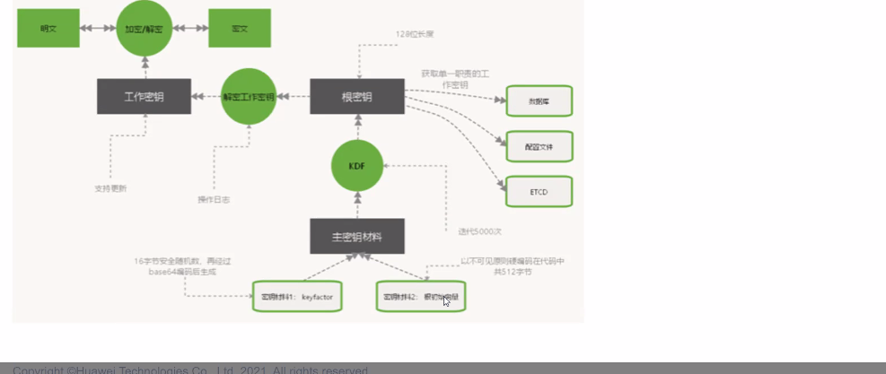

## **自签证书安全性问题**

### **自签证书的秘钥需要进行加密，不能明文存储, 如何避免俄罗斯套娃?**
- **根秘钥机制** 
1. 使用根秘钥对工作秘钥进行加密,
2. 工作秘钥密文存储在系统。
4. 使用使用时用根秘钥解密工作秘钥，再进行交换。
5. 根秘钥是在解密的时候生成的。
6. 生成根密钥的材料散落在设备的各个目录下.[可以是明文,以各种形式存储]
7. 通过固定秘钥材料+KDF等算法生成的根秘钥是固定的.
	

