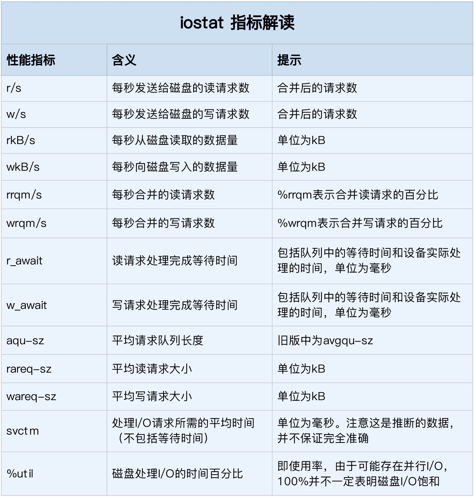

## <b>Linux Disk 配置性能参数</b> ##

### Disk 命令 ###

#### <b>系统级磁盘检测</b> ####
- df -i /dev/sda1 查看inode使用情况（inode一般4K可能被小文件浪费）
- df -h /dev/sda1 查看硬盘使用情况
- cat /proc/meminfo | grep -E "SReclaimable|Cached"  查看系统多少内存用于缓存
- cat /proc/slabinfo | grep -E '^#|dentry|inode' 所有目录项和各种文件系统索引节点的缓存情况
- filetop: 查看内核中文件的读写情况
- opensnoop: 监测open系统调用
- iostat -d -x 1 
    ``` 
    Device            r/s     w/s     rkB/s     wkB/s   rrqm/s   wrqm/s  %rrqm  %wrqm r_await w_await aqu-sz rareq-sz wareq-sz  svctm  %util 
    loop0            0.00    0.00      0.00      0.00     0.00     0.00   0.00   0.00    0.00    0.00   0.00     0.00     0.00   0.00   0.00 
    loop1            0.00    0.00      0.00      0.00     0.00     0.00   0.00   0.00    0.00    0.00   0.00     0.00     0.00   0.00   0.00 
    sda              0.00    0.00      0.00      0.00     0.00     0.00   0.00   0.00    0.00    0.00   0.00     0.00     0.00   0.00   0.00 
    sdb              0.00    0.00      0.00      0.00     0.00     0.00   0.00   0.00    0.00    0.00   0.00     0.00     0.00   0.00   0.00 


    1. 信息源：/proc/diskstats
    2. I/O使用率: %util 
    3. IOPS: r/s+w/s
    4. 吞吐量: rkB/s+wkB/s
    5. 响应时间: r_await+w_await
    ```
    

#### <b>进程级磁盘检测</b> ####
- pidstat -d 1 
    ```
    13:39:51      UID       PID   kB_rd/s   kB_wr/s kB_ccwr/s iodelay  Command 
    13:39:52      102       916      0.00      4.00      0.00       0  rsyslogd

    实时查看每个进程的 I/O 情况:
    用户 ID（UID）和进程 ID（PID）
    每秒读取的数据大小（kB_rd/s） ，单位是 KB。
    每秒发出的写请求数据大小（kB_wr/s） ，单位是 KB。
    每秒取消的写请求数据大小（kB_ccwr/s） ，单位是 KB。
    块 I/O 延迟（iodelay），包括等待同步块 I/O 和换入块 I/O 结束的时间，单位是时钟周期。
    ```
-  iotop
    ```
    Total DISK READ :       0.00 B/s | Total DISK WRITE :       7.85 K/s 
    Actual DISK READ:       0.00 B/s | Actual DISK WRITE:       0.00 B/s 
    TID  PRIO  USER     DISK READ  DISK WRITE  SWAPIN     IO>    COMMAND 
    15055 be/3 root        0.00 B/s    7.85 K/s  0.00 %  0.00 % systemd-journald 

    从这个输出，你可以看到，前两行分别表示，进程的磁盘读写大小总数和磁盘真实的读写大小总数。
    因为缓存、缓冲区、I/O 合并等因素的影响，它们可能并不相等。
    ```


