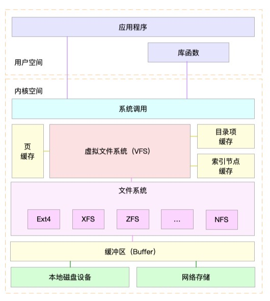

## <b>Linux存储系统基础</b> ##

### <b>一. 总框架</b> ###

- <b>L1. 标准程序库自带的缓存读写API</b>
- <b>L2. VFS虚拟文件系统层</b>
    - 虚拟文件系统和其他各种文件系统的具体实现。它为上层的应用程序，提供标准的文件访问接口。
    - VFS内部又通过目录项、索引节点、逻辑块以及超级块等数据结构，来管理文件。
        1. 目录项：【内核维护在内存的数据结构-dentry】 记录文件目录结构。也叫目录缓存。
        2. 索引节点：【持久化存储到磁盘中-inode】 记录文件的元数据 - inode 编号、文件大小、访问权限、修改日期、数据的位置等。
        3. 逻辑块: 【持久化存储到磁盘中-机械磁盘扇区512B】 由连续磁盘扇区构成的最小读写单元，用来存储文件数据。4k则由机械硬盘8个扇区组成。
        4. 超级块: 【持久化存储到磁盘中】用来记录文件系统整体的状态，如索引节点和逻辑块的使用情况等。
                    

    - Cache缓存
        1. Cache利用的是RAM提供的高读写速度。【速度匹配-时间问题-RAM】
        2. 作用对象：CPU，内存。

- <b>L3. 文件系统层</b>
    - 文件系统类型
        1. 内存文件系统
        2. NFS网络
        3. Ext4,等文件系统
    - Buffer缓冲区
        1. 减小短期内突发I/O的影响，起到流量整形，稳流的作用 【存储容量-空间问题-RAM】
        2. 作用对象：CPU，存储设备
        3. 从网络上下载东西，瞬时速率可能会有较大变化，但从长期来看却是稳定的，引入一个buffer使得OS接收数据的速率更稳定，进一步减少对磁盘的伤害。
                

- <b>L4. 通用IO请求处理层</b>
    - 提供访问块设备的标准接口给文件系统和应用程序；把各种异构的磁盘设备抽象为统一的块设备，并提供统一框架来管理这些设备的驱动程序。
    - 文件系统和应用程的I/O请求调度。
        1. NONE：完全不使用任何 I/O 调度器
        2. NOOP：一个先入先出的队列，做一些最基本的请求合并，常用于 SSD 磁盘。
        3. CFQ：为每个进程维护了一个I/O调度队列，并按照时间片来均匀分布每个进程的 I/O 请求。【完全公平调度器】
        4. DeadLine：为读、写请求创建了不同的 I/O 队列，并确保达到最终期限（deadline）的请求被优先处理。 多用在I/O压力比较重的数据库,可以提高机械磁盘的吞吐量。

- <b>L5. 存储设备层</b>
    1. 设备层，包括存储设备和相应的驱动程序，负责最终物理设备的 I/O 操作。
    2. IDE设备会分配一个 hd 前缀的设备名，SCSI 和 SATA 设备会分配一个sd前缀的设备名。
    3. 块设备会被赋予主、次设备号。主设备号用在驱动程序中，用来区分设备类型；而次设备号则是用来给多个同类设备编号。
        
