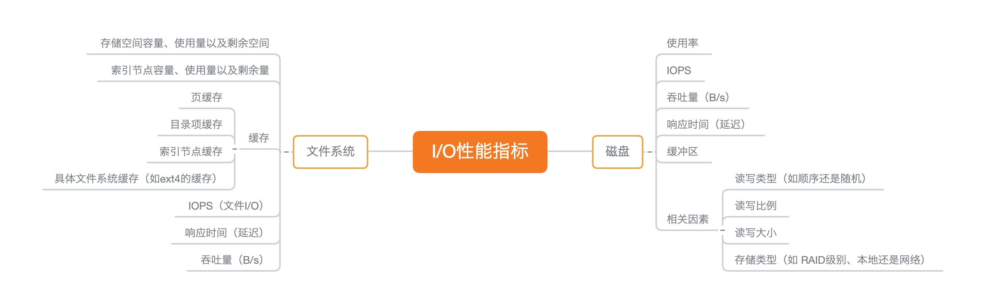
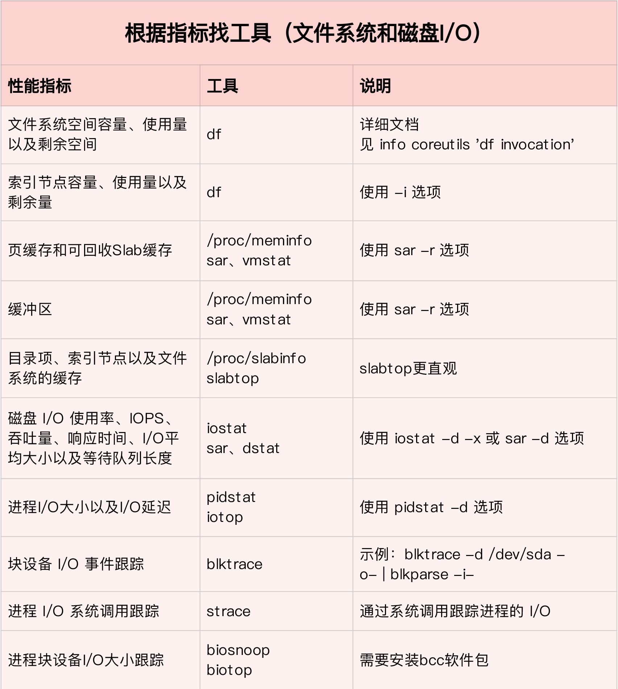
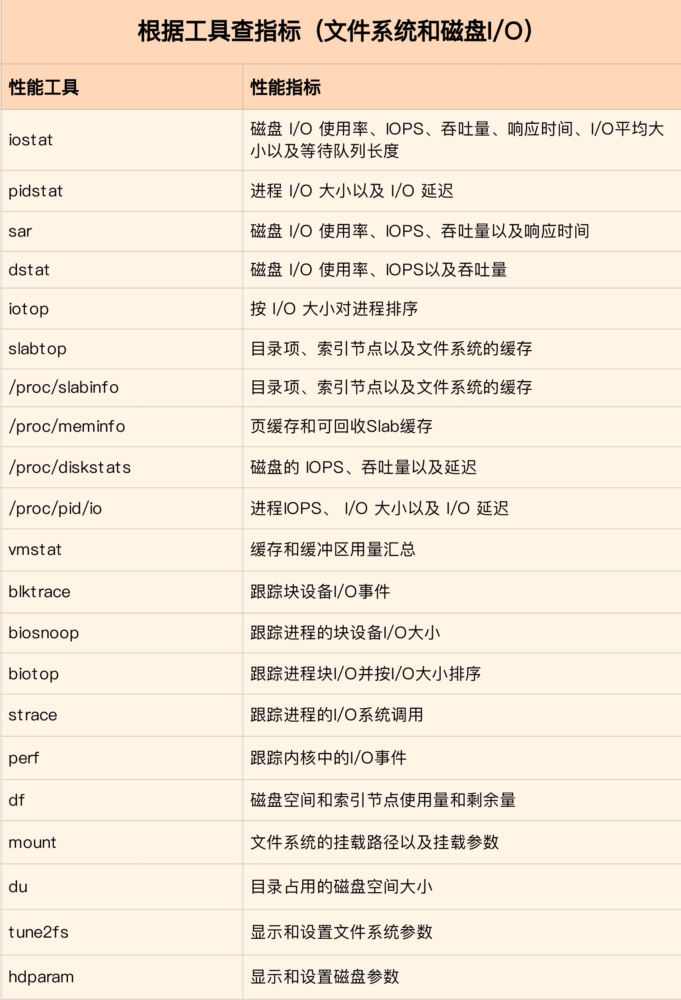
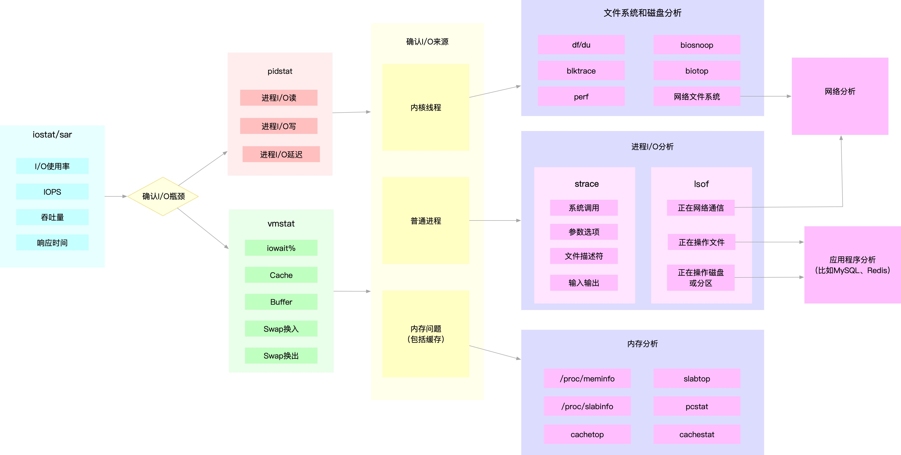

 ## <b>IO性能分析工具</b> ##

### <b>IO性能重要指标图</b> ###
1. <b>内存指标中的cache可以反映磁盘文件在内存中缓存的情况。</b>
2. <b>合理使用缓存可以带来两个数量级的性能提升。</b>
3. <b>数据库看重IOPS指标，流媒体看重吞吐量指标。</b>

    

### <b>IO性能分析工具图</b> ###
1. 常用工具
    
    

### <b>IO性能问题分析思路</b> ###
1. 确认IO瓶颈 --> 确认IO瓶颈来源【文件系统，普通进程，内存】
    

 ### <b>IO性能优化</b> ###

 - 程序I/O性能优化
    1. 用追加写代替随机写，减少寻址开销，加快 I/O 写的速度。
    2. 借助缓存 I/O ，充分利用系统缓存，降低实际 I/O 的次数。   
    3. 应用程序内部构建自己的缓存，降低其他应用程序使用缓存对自身的影响。
    4. 频繁读写同一块磁盘空间时，可以用 mmap 代替 read/write，减少内存的拷贝次数。
    5. 需要同步写的场景中，尽量将写请求合并，而不是让每个请求都同步写入磁盘，即可以用 fsync() 取代 O_SYNC。
    6. 多个应用程序共享相同磁盘时，为了保证I/O不被某个应用完全占用，使用 cgroups 的 I/O 子系统，来限制进程 / 进程组的 IOPS 以及吞吐量。
    7. 使用 CFQ 调度器时，可以用 ionice 来调整进程的 I/O 调度优先级。ionice 支持三个优先级类：Idle、Best-effort 和 Realtime。其中， Best-effort 和 Realtime 还分别支持 0-7 的级别，数值越小，则表示优先级别越高。

 - 文件系统I/O性能优化
    1. 应用程序访问普通文件时，实际是由文件系统间接负责，文件在磁盘中的读写。选择最适合的文件系统。
    2. 优化文件系统配置项。
        1. 脏页的刷新频率 - 设置 dirty_expire_centisecs 和 dirty_writeback_centisecs
        2. 脏页的限额 - 调整 dirty_background_ratio 和 dirty_ratio 等
        3. 文件系统的特性和日志模式
    3. 优化内核回收目录项缓存和索引节点缓存的倾向 - 调整 /proc/sys/vm/vfs_cache_pressure，默认值 100，数值越大，就表示越容易回收。
    4. 不需要持久化时，用内存文件系统  tmpfs，以获得更好的 I/O 性能。
    
 - 磁盘I/O性能优化
    1. 换用性能更好的磁盘，比如用 SSD 替代 HDD。
    2. 使用 RAID ，把多块磁盘组合成一个逻辑磁盘，构成冗余独立磁盘阵列。
    3. 选择最适合的 I/O 调度算法。比方说，SSD 和虚拟机中的磁盘，通常用的是 noop 调度算法。数据库应用，推荐使用 deadline 算法。
    4. 对应用程序的数据，进行磁盘级别的隔离。比如，我们可以为日志、数据库等 I/O 压力比较重的应用，配置单独的磁盘。
    5. 顺序读比较多的场景中，增大磁盘的预读数据。
        1. 调整内核选项 /sys/block/sdb/queue/read_ahead_kb，默认大小是 128 KB，单位为 KB。
        2. 使用 blockdev工具设置，比如 blockdev --setra 8192 /dev/sdb，注意这里的单位是 512B（0.5KB），所以它的数值总是 read_ahead_kb 的两倍。
    6. 优化内核块设备 I/O 的选项。调整/sys/block/sdb/queue/nr_requests，适当增大磁盘队列长度，可以提升磁盘的吞吐量（会导致 I/O 延迟增大）。
    7. 查看 dmesg 中是否有硬件 I/O 故障的日志。使用 badblocks、smartctl 等工具，检测磁盘的硬件问题。
    8. 用 e2fsck 等来检测文件系统的错误。如果发现问题，你可以使用 fsck 等工具来修复。
