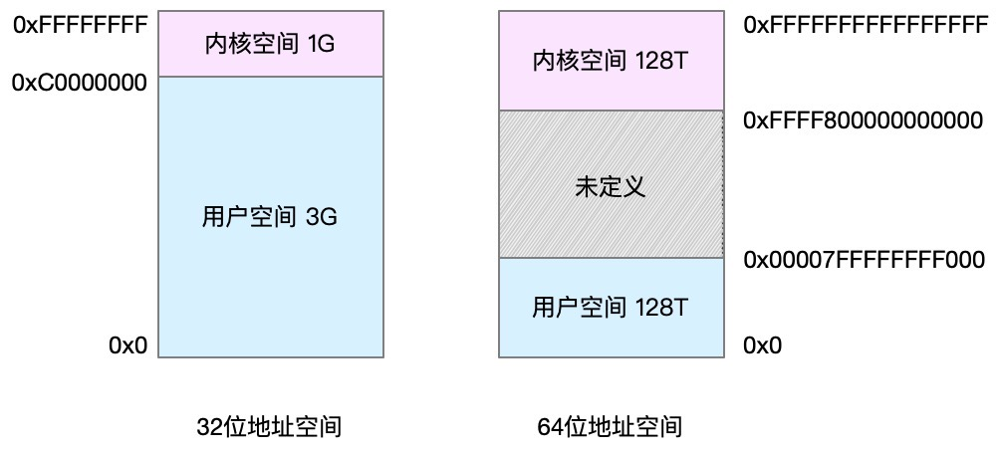
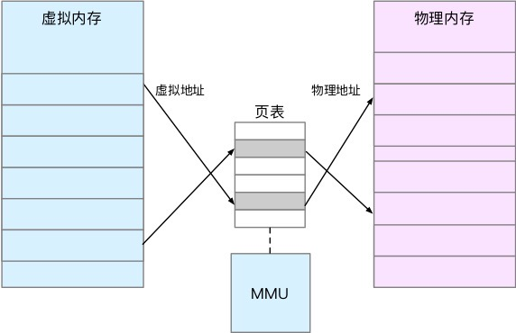
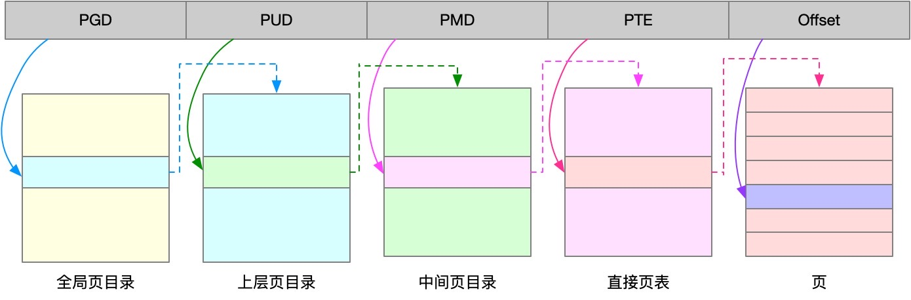
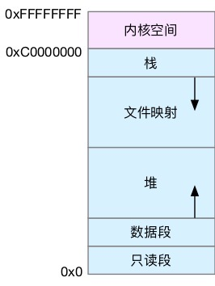

## <b>Linux内存基础知识</b> ##

### <b>1. 32/64位系统内存模型</b> ###

### <b>2. Linux虚拟内存与物理内存映射</b> ###

### <b>3. Linux内存页索引机制</b> ###

### <b>4. 进程内存模型</b> ###
1. mmap() 函数在文件映射区分配内存
2. malloc() 函数在堆上获取内存
    
    

### <b>5. 进程内存页交换Swap机制</b> ###
1. Linux 用专门的内核线程kswapd0定期扫描内存的使用情况。（内存阀值：水位）
2. 笔记本电脑的休眠和快速开机的功能基于Swap。休眠时，把系统的内存存入磁盘。
3. swap是可以配置的

    
