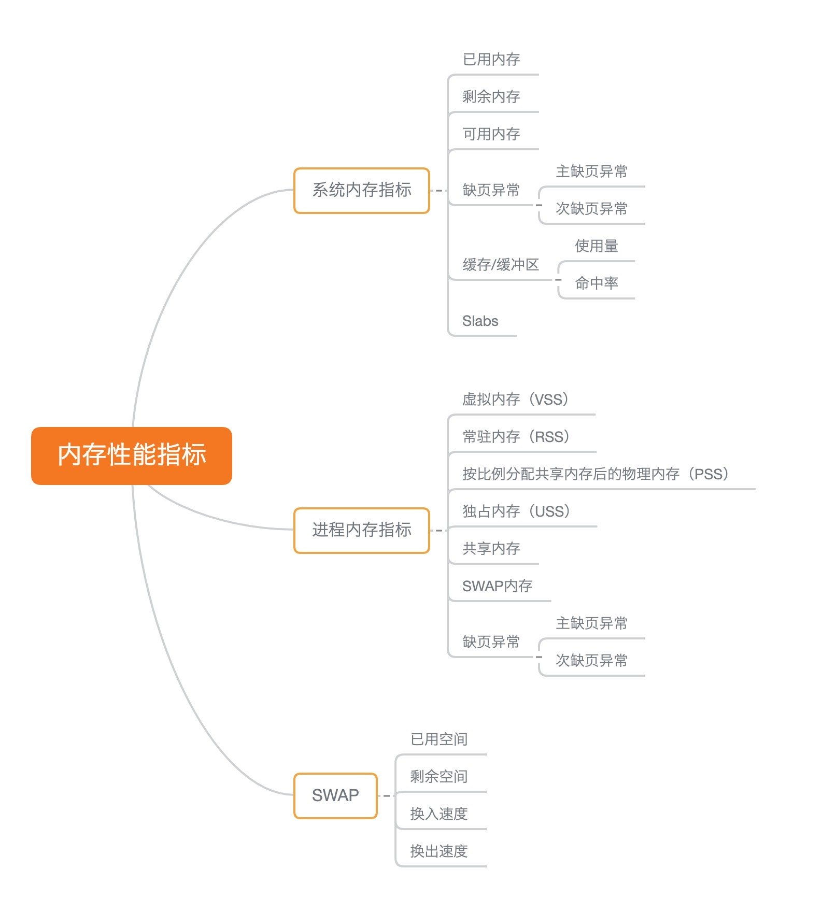
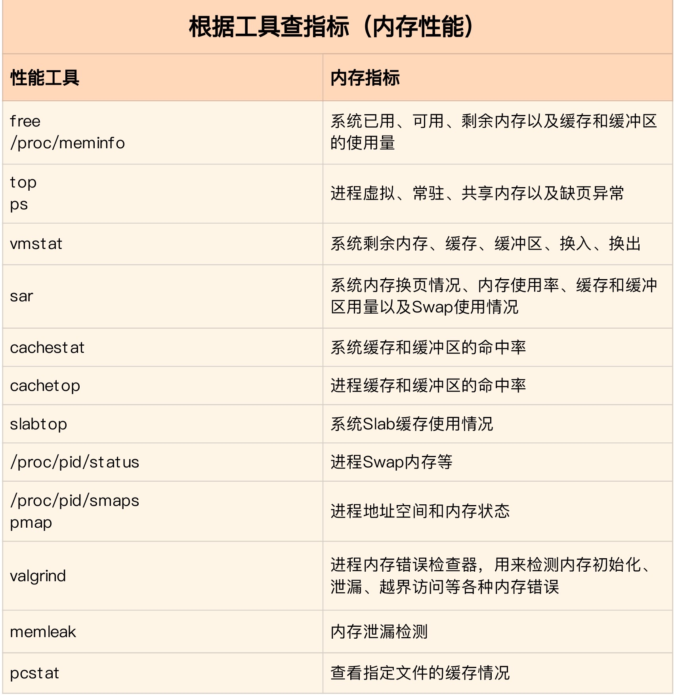
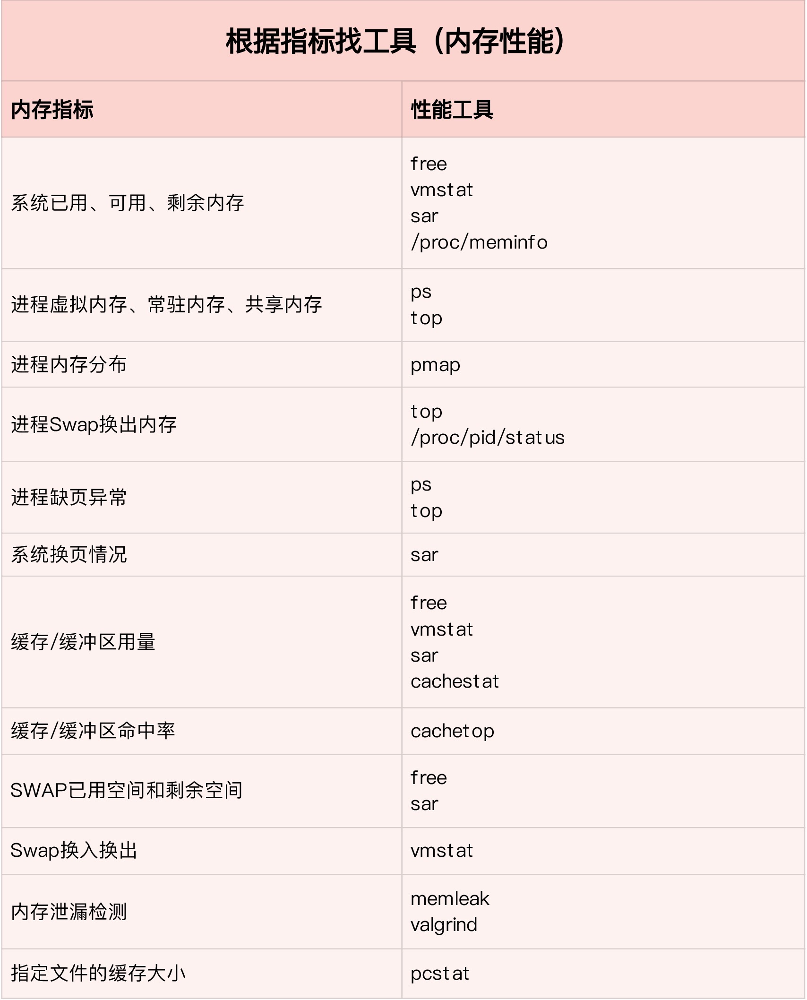
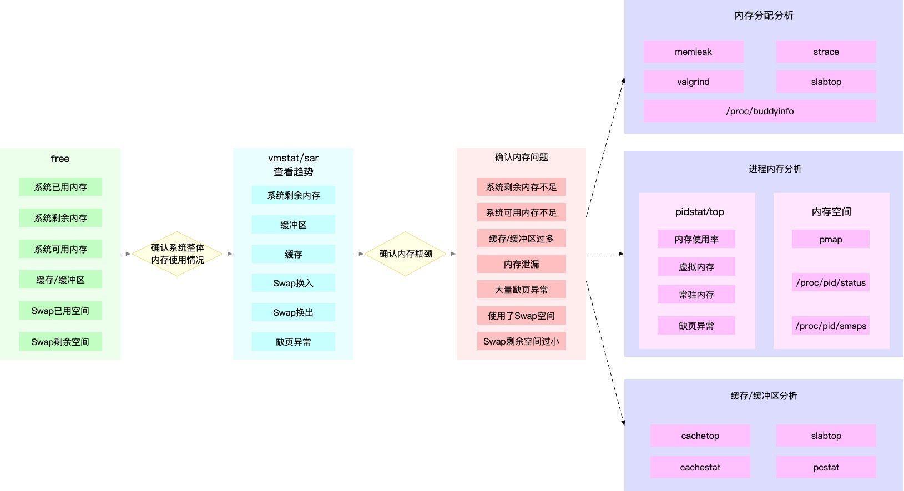

 ## <b>内存性能分析工具</b> ##

### <b>内存重要指标图</b> ###
1. PSS: 进程实际占用的物理内存，共享内存部分经过平均处理 

    

### <b>内存指标分析工具图</b> ###
1. pcstat: 文件在缓存中的占比
    
    

### <b>内存问题分析思路</b> ###
1. 分析系统内存总体使用情况 --> 定位问题进程 --> 分析问题进程的缓存，内存，swap情况
    