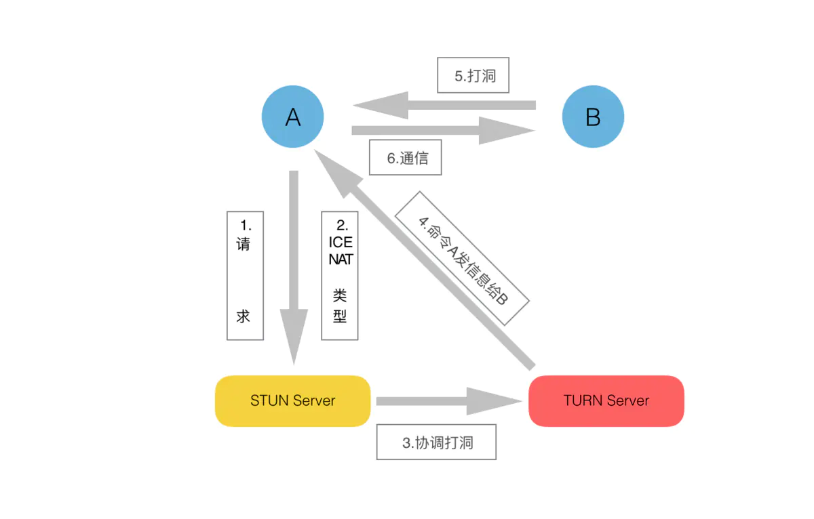

## **网络穿透：ICE协议**

### **ICE 功能简介**
- 接受客户端的请求，并且把客户端的公网IP、Port封装到ICE Candidate中。通过一个复杂的机制，得到客户端的NAT类型
- 完成了这些STUN Server就会这些基本信息发送回客户端，然后根据NAT类型，来判断是否需要TURN服务器协调进行下一步工作。

### **STUN和TURN的实现**
- **STUN是如何判断NAT的类型？**
    1. **判断客户端是否在NAT后**
        ```sh
        # C: Client     S: Server
        # C向S的IP1的pot1端口发送一个UDP包。S收到这个包后，会把它收到包的源IP和port写到UDP包中，然后把此包通过IP1和port1发还给C
        # 结果1：【没收到回复包】网络问题，被防火墙拦下，STUN服务不在，弄错端口
        # 结果2：【收到回复包】  把此UDP中的IP和自己的IP做比较
        #        A. 【一样】  客户端自身位于公网  
        #        B. 【不一样】客户端自身位于NAT后   --- 【打洞成功,称为STEP1洞】
        ```

    2. **判断是否处于Full Cone Nat下 【来者不拒】**
        ```sh
        # C向S发送一个UDP包，请求S通过另外一个IP2,向C返回一个UDP数据包 --- 【换一个IP给STEP1洞回数据】
        # 结果1： 【收到】   来者不拒，是Full Cone Nat 
        # 结果2： 【没收到】 不是Full Cone Nat 
        ```

    3. **判断是否处于对称NAT下**
        ```sh
        # C向S的IP2的port2发送一个数据包，S收到数据包后，把它收到包的源IP和port写到UDP包中，然后通过自己的IP2和port2把此包发还给C。
        # 结果：
        #   C肯定能收到这个回应UDP包。     --- 【打洞成功,称为STEP3洞】
        #   如果这个port和step1中的port一样，那么可以肯定这个NAT是个CONE NAT，否则是对称NAT。
        # 
        # 依据： 
        #   根据对称NAT的规则，当目的地址的IP和port有任何一个改变，那么NAT都会重新分配一个port使用，
        #   在step3中，和step1对应，我们改变了IP和port。 --  【对比STEP1洞和STEP3洞 - 即NAT上的端口不同】
        #   因此，如果是对称NAT,那这两个port肯定是不同的。
        ```

    4. **判断是处于Restrict Cone NAT还是Port Restrict NAT之下**
        ```sh
        # C向S的IP2的一个端口PD发送一个数据请求包，要求S用IP2和不同于PD的port返回一个数据包给C。 --- 【换一个端口给STEP3洞回数据】
        # 结果1: 【收到】   只要IP相同，即使port不同，NAT也允许UDP包通过。是Restrict Cone NAT。
        # 结果2：【没收到】  Port Restrict NAT.
        ```
    
- **STUN如何协调NAT打洞穿透 【背景：A处于NAT后】**
    1. **Full Cone Nat**
        
    2. **Restrict Cone Nat 和 Port Restrict Nat 【注：第5步方向反了】**
        
    3. **对称Nat**
        
    4. NAT打的洞也是具有时效性的，如果NAT超时了，那么还是需要重新打洞的。

- **TURN Server主要工作**
    1. NAT打洞：命令A和B互相发一条信息，这样各自的NAT就留下了对方的洞
    2. 为对称NAT提供消息转发：两方中一方是对称NAT时，那么给这一方发信息，只能通过TURN Server来转发 【错】

[1. ICE协议下NAT穿越的实现](https://www.jianshu.com/p/84e8c78ca61d?utm_campaign=hugo&utm_medium=reader_share&utm_content=note)


