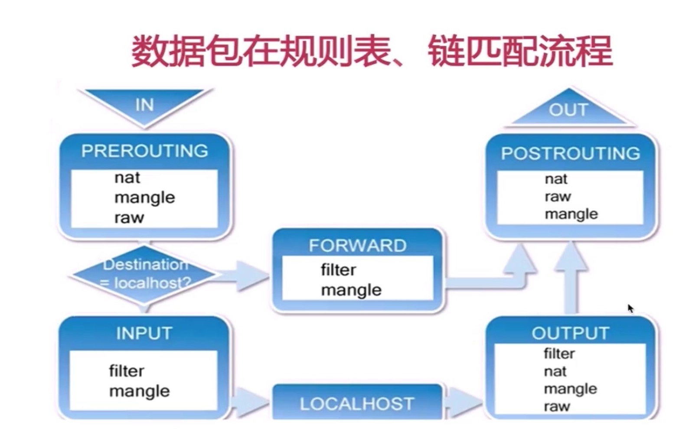

## <b>NAT 网络技术</b> ##

> NAT 技术可以重写 IP 数据包的源 IP 或者目的 IP，被普遍地用来解决公网 IP 地址短缺的问题

### <b>NAT的类型</b> ###
> 在Linux服务器中配置 NAT。 实际上就是把Linux服务器充当的是“软”路由器的角色

- 根据实现方式的不同，NAT 可以分为三类：
    1. 静态 NAT，即内网 IP 与公网 IP 是一对一的永久映射关系。
    2. 动态 NAT，即内网 IP 从公网 IP 池中，动态选择一个进行映射。
    3. 网络地址端口转换 NAPT（Network Address and Port Translation），即把内网 IP 映射到公网 IP 的不同端口上，让多个内网 IP 可以共享同一个公网 IP 地址。

- 根据转换方式的不同，可以把NAT分为三类：
    1. 源地址转换 SNAT，即目的地址不变，只替换源 IP 或源端口。主要用于，多个内网 IP 共享同一个公网 IP ，来访问外网资源的场景。
    2. 目的地址转换 DNAT，即源 IP 保持不变，只替换目的 IP 或者目的端口。主要通过公网 IP 的不同端口号，来访问内网的多种服务，隐藏后端服务器的真实IP地址。
    3. 双向地址转换，同时使用 SNAT 和 DNAT。
        - 接收到网络包时，执行 DNAT，把目的 IP 转换为内网 IP。
        - 发送网络包时，执行 SNAT，把源 IP 替换为外部 IP。
        - 外网 IP 与内网 IP 的一对一映射关系，常用在虚拟化环境中，为虚拟机分配浮动的公网 IP 地址。

- 根据权限关系不同 
    1. 全锥形： 往路由发送，直接映射成外网IP；外网只要知道路由器的外网IP就能够访问内网主机. 
    2. IP受限型锥形：在内网IP向外网主机发送过数据包的前提下，外网主机可以但只能访问内网的这个IP. 
    3. IP和端口受限型锥形：在内网IP+port向外网主机发送过数据包的前提下，外网主机可以但只能访问内网的这个IP+port. 
    4. 对称型：同一个内网主机，用相同的内网地址和端口向另一个外网的地址发送分组，则会使用不同的映射. 
    5. 安全性: 对称型 > IP和端口受限型锥形 > IP受限型锥形 > 全锥形. 
    6. NAT穿透案例 
        ```sh 
        # NAT之间主要的区别分两种情况讨论 
        # 1: client(192.168.0.3, 100)和server(1.1.1.1, 1111)在路由器上建立好映射关系后，如果client(192.168.0.3, 100)又给(2.2.2.2, 2222)发送数据，路由器该怎么处理呢? 
        #   A. 复用旧的映射关系(8.8.8.8, 800)<--->(192.168.0.3, 100)和(2.2.2.2, 2222)通信, 这就是锥型(Cone) NAT 
        #   B. 创建新的映射关系(8.8.8.8, 801)<--->(192.168.0.3, 100)和(2.2.2.2, 2222)通信, 这就是对称型NAT 
        #   C. 有的路由器有多个公网IP，不同的IP也会参与到这个映射关系中。 
         
        # 2: client(192.168.0.3, 100)和server(1.1.1.1, 1111)在路由器上建立好映射关系后， 
        #   如果这个时候路由器(8.8.8.8)在800端口上收到从另外一台server(2.2.2.2, 2222)发来的数据，是不是应该转发给(192.168.0.3, 100)呢？ 有四种情况: 
        #   A. 无条件转发给(192.168.0.3, 100)， 这就是全锥型(Full Cone)NAT。 
        #   B. 如果(192.168.0.3, 100)之前给(2.2.2.2)发送过数据，则转发， 这就是受限锥型(Restricted Cone)。 
        #   C. 如果(192.168.0.3, 100)之前给(2.2.2.2, 2222)发送过数据，则转发， 这就是端口受限锥型(Port Restricted Cone)。 
        #   D. 丢弃报文，拒绝转发, 这就是对称型NAT。 
        # 
        # 3：两个局域网不同NAT策略组合不能实现穿透的情况 
        #   A. IP和端口受限型锥形和对称型的两个局域无法进行穿透  
        #   B. 同是对称型的两个局域无法进行穿透  
        #   C. 解析： 
        #      即使有一方在设置NAT之前发过信息给的对端，如果对端使用的是对称型则会用新的ip+port映射，导致信息回不来 
        #      因为在A,B情况下，发送方可能是IP和端口受限型锥形和对称型，它们都对端口进行的限制，不接受新映射关系; 碰巧两方路由映射一致才有可能走通。 
        ``` 

- 其他应用场景
    1. 分别在不同局域网的两台设备如何通信？
        ```sh
        # 例如：局域网A主机 和 局域网B主机2
        # 1. 提供一个中转服务器，局域A的NAT网关建立到中转服务器的双向映射iAddr:port1 <=> eAddr:port2；
        # 2. 给 eAddr:port2 发送数据包，都会被转发给 iAddr:port1
        #      a. Full cone NAT： 任何主机给 eAddr:port2 发送数据包，都会被转给 iAddr:port1
        #      b. 只转发构建映射的两台主机IP数据包
        ```
    2. 现在交换机路由器的概念更新：交换机是服务于以太网的 L2/L3 网络设备，而路由器是服务于以太网和非以太网之间的网络设备。
    3. SIP音视频通话NAT环境下问题解决：
        ```sh
        # 解决方案：让SIP终端知道NAT分配给自己的端口映射
        #
        # A. 具体做法1 【STUNN协议 | SIP终端向STUN服务器发探测NAT的数据包】：
        #       SIP终端发送一个探测数据包，到公网上的服务器。
        #       公网上的服务器会发回数据包，会包含有关NAT的详细信息。有
        #       了这些信息，SIP终端就会知道它是否在 NAT后面。
        #       缺点：在对称的NAT后面，不能够工作。因为，对称的NAT，它在分配给SIP终端外部的IP:port时，每次都变化（不同的对方不一样）
        #  
        # B. 具体做法2：【中转音视频流服务器】
        #       在公网上放一个中转音视频流的服务器。这个中转语音流的服务器有时就是一个Out Bound proxy。 
        #       缺点： 这个中转语音流的服务器，可能会成为瓶颈。由于语音要经过中转语音流的服务器，所以路径增长了，音质会变差。
        #
        # C. 具体做法3：【虚拟服务器的端口转发 + STUN】
        #       如果在NAT设备上，做了“虚拟服 务器的端口转发”，则NAT会保留SIP工作需要的端口，专用于SIP终端，这样SIP终端就相当于是在一个Full Cone完全圆锥体的NAT后面，
        #       SIP用STUN工作没有问题。SIP终端需要的端口数是这样确定的，一个端口用于SIP信令，比如5060。RTP端 口的数量，取决于通话的路数。一路通话需要2个RTP端口。
        #
        # D. 总结：
        #       前面三种的NAT，可统称为非对称的NAT。非对称的NAT，都可以用STUN协议穿过NAT。
        #       将对称的NAT，通过端口转发的方式，变为完全圆锥体的NAT，是解决NAT问题的最好办法。首先应当用这种办法来解决。
        ```

### <b>NET filter网络框架</b> ###
>  NAT 网关直接影响整个数据中心的网络出入性能，所以 NAT 网关通常需要达到或接近线性转发，PPS 是最主要的性能目标。
- NAT网关实际上是通过Net filter 框架的4张表，5条链的操作实现的
    

### <b>NAT 性能问题</b> ###
1. NAT 基于 Linux 内核的连接跟踪机制来实现。
2. 分析 NAT 性能问题时，先从 conntrack 角度来分析，比如用 systemtap、perf 等，分析内核中 conntrack 的行为
    ```sh
    #perf record 和 perf report 命令
    # 记录一会（比如30s）后按Ctrl+C结束
    perf record -a -g -- sleep 30
    # 输出报告
    perf report -g graph,0
    #在 perf report 界面中，输入查找命令 / 然后，在弹出的对话框中，输入 nf_hook_slow；最后再展开调用栈,看哪个函数占用系统资源高
    ```
3. 最后，通过调整 netfilter 内核选项的参数，来进行优化。
    ```sh
        $ sysctl -a | grep conntrack
        # 表示当前连接跟踪数
        net.netfilter.nf_conntrack_count = 180
        # 表示最大连接跟踪数
        net.netfilter.nf_conntrack_max = 1000
        # 表示连接跟踪表的大小
        net.netfilter.nf_conntrack_buckets = 65536
        net.netfilter.nf_conntrack_tcp_timeout_syn_recv = 60
        net.netfilter.nf_conntrack_tcp_timeout_syn_sent = 120
        net.netfilter.nf_conntrack_tcp_timeout_time_wait = 120
    ```


