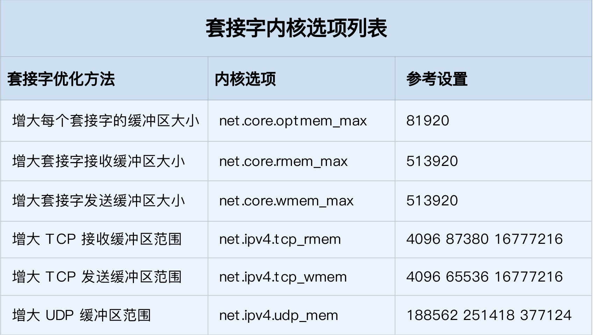
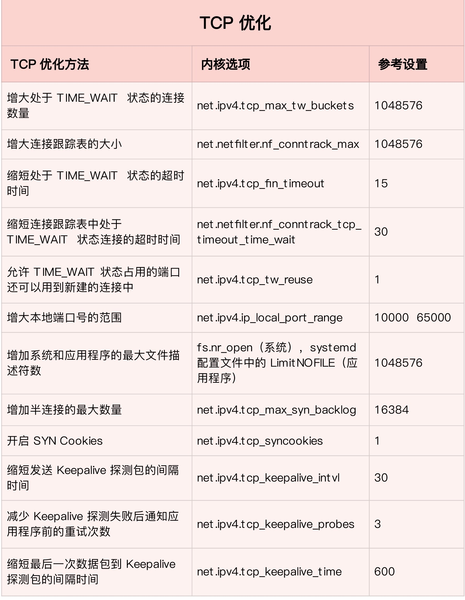

## <b>网络性能优化</b> ##

### <b>应用程序优化</b> ###
- I/O模型优化
    1. I/O 多路复用技术 epoll，主要用来取代 select 和 poll。
    2. I/O（Asynchronous I/O，AIO）。AIO 允许应用程序同时发起很多 I/O 操作。

- 工作模型
    1. 主进程 + 多个 worker 子进程。其中，主进程负责管理网络连接，而子进程负责实际的业务处理。
    2. 监听到相同端口的多进程模型。需要开启 SO_REUSEPORT 选项，由内核负责，把请求负载均衡到这些监听进程中去。

- 其他
    1. 使用长连接取代短连接
    2. 使用内存等方式，来缓存不常变化的数据
    3. 使用 Protocol Buffer 等序列化的方式，压缩网络 I/O 的数据量，可以提高应用程序的吞吐。
    4. 使用 DNS 缓存、预取、HTTPDNS 等方式，减少 DNS 解析的延迟，也可以提升网络 I/O 的整体速度。

- 套接字
    1. 增大每个套接字的缓冲区大小 net.core.optmem_max
    2. 增大套接字接收缓冲区大小 net.core.rmem_max 和发送缓冲区大小 net.core.wmem_max
    3. 增大 TCP 接收缓冲区大小 net.ipv4.tcp_rmem 和发送缓冲区大小 net.ipv4.tcp_wmem
    4. 参考数值：
        
        ```
        - TCP 连接设置 TCP_NODELAY 可以禁用 Nagle 算法；
        - SO_SNDBUF 和 SO_RCVBUF可以分别调整套接字发送缓冲区和接收缓冲区的大小。
        - 为 TCP 连接开启 TCP_CORK 可以让小包聚合成大包后再发送（注意会阻塞小包的发送）；
        - tcp_rmem/tcp_wmem 的三个数值分别是min，default，max，系统会根据这些设置，自动调整TCP接收/发送缓冲区的大小。
        - udp_mem 的三个数值分别是min，pressure，max，系统会根据这些设置，自动调整 UDP 发送缓冲区的大小。
        ```

### <b>网络传输层优化</b> ###
- 优化与 TIME_WAIT 状态相关的内核选项
    1. 增大处于 TIME_WAIT 状态的连接数量 net.ipv4.tcp_max_tw_buckets 
    2. 并增大连接跟踪表的大小 net.netfilter.nf_conntrack_max。
    3. 减小 net.ipv4.tcp_fin_timeout 和 net.netfilter.nf_conntrack_tcp_timeout_time_wait ，让系统尽快释放它们所占用的资源。
    4. 开启端口复用 net.ipv4.tcp_tw_reuse。这样，被 TIME_WAIT 状态占用的端口，还能用到新建的连接中。
    5. 增大本地端口的范围 net.ipv4.ip_local_port_range 。这样就可以支持更多连接，提高整体的并发能力。
    6. fs.nr_open 和 fs.file-max ，分别增大进程和系统的最大文件描述符数；或在应用程序的 systemd 配置文件中，配置 LimitNOFILE ，设置应用程序的最大文件描述符数。

- 缓解SYN FLOOD等，利用TCP协议特点进行攻击而引发的性能问题
    1. 增大 TCP 半连接的最大数量 net.ipv4.tcp_max_syn_backlog
    2. 开启 TCP SYN Cookies net.ipv4.tcp_syncookies ，来绕开半连接数量限制的问题（注意，不可与net.ipv4.tcp_max_syn_backlog同时使用）。
    3. 减少 SYN_RECV 状态的连接重传 SYN+ACK 包的次数 net.ipv4.tcp_synack_retries。

- 在长连接的场景中，通常使用 Keepalive 来检测 TCP 连接的状态，以便对端连接断开后，可以自动回收。
    1. 缩短最后一次数据包到 Keepalive 探测包的间隔时间 net.ipv4.tcp_keepalive_time
    2. 减少 Keepalive 探测失败后，一直到通知应用程序前的重试次数 net.ipv4.tcp_keepalive_probes

- UDP 优化，相对于 TCP 来说，要简单得多。这里我也总结了常见的几种优化方案。
    1. 增大套接字缓冲区大小以及 UDP 缓冲区范围；
    2. 增大本地端口号的范围；
    3. 根据 MTU 大小，调整 UDP 数据包的大小，减少或者避免分片的发生。

- 参考指标


### 网络层优化 ###
- 从路由和转发的角度出发
    1. NAT 网关的服务器或者使用 Docker 容器时，开启 IP 转发，即设置 net.ipv4.ip_forward = 1。
    2. 调整数据包的生存周期 TTL，比如设置 net.ipv4.ip_default_ttl = 64。注意，增大该值会降低系统性能。
    3. 开启数据包的反向地址校验，比如设置 net.ipv4.conf.eth0.rp_filter = 1。这样可以防止 IP 欺骗，并减少伪造 IP 带来的 DDoS 问题。
        - 0：关闭反向路由校验
        - 1：开启严格的反向路由校验。对每个进来的数据包，校验其反向路由是否是最佳路由。如果不是最佳路由，则丢弃。
        - 2：开启松散的反向路由校验。对每个进来的数据包，校验其源地址是否可达，如果反向路径不通，则丢弃。

- 从分片的角度出发
    1. 最主要的是调整 MTU（Maximum Transmission Unit）的大小。
    2. MTU 的大小应该根据以太网的标准来设置。
    3. 以太网标准规定，一个网络帧最大为 1518B，那么去掉以太网头部的 18B 后，剩余的 1500 就是以太网 MTU 的大小。
    4. 使用 VXLAN、GRE 等叠加网络技术时，要注意，网络叠加会使原来的网络包变大，导致 MTU 也需要调整。
        - VXLAN在原来报文的基础上，增加了 14B 的以太网头部、 8B 的 VXLAN 头部、8B 的 UDP 头部以及 20B 的 IP 头部。换句话说，每个包比原来增大了 50B。
        - 需要把交换机、路由器等的 MTU，增大到 1550， 或者把 VXLAN 封包前（比如虚拟化环境中的虚拟网卡）的 MTU 减小为 1450。
        - 如果网络设备支持巨帧，可以把 MTU 调大为 9000，以提高网络吞吐量。

- 从 ICMP 的角度出发
    1. 为了避免 ICMP 主机探测、ICMP Flood 等各种网络问题，你可以通过内核选项，来限制 ICMP 的行为。
    2. 禁止 ICMP 协议，即设置 net.ipv4.icmp_echo_ignore_all = 1。
    3. 禁止广播 ICMP，即设置 net.ipv4.icmp_echo_ignore_broadcasts = 1。

### 链路层优化 ###
> 链路层负责网络包在物理网络中的传输，比如 MAC 寻址、错误侦测以及通过网卡传输网络帧等。自然，链路层的优化，也是围绕这些基本功能进行的。

- 网卡收包后调用的中断处理程序需要消耗大量的 CPU。 将中断处理程序调度到不同的 CPU 上执行，就可以显著提高网络吞吐量。
    1. 为网卡硬中断配置 CPU 亲和性（smp_affinity）
    2. 开启 irqbalance 服务
    3. 开启 RPS（Receive Packet Steering）和 RFS（Receive Flow Steering），将应用程序和软中断的处理，调度到相同 CPU 上，增加 CPU 缓存命中率，减少网络延迟。

- 把原来在内核中通过软件处理的功能，可以卸载到网卡中，通过硬件来执行。
    1. TSO（TCP Segmentation Offload）和 UFO（UDP Fragmentation Offload）
        - 在 TCP/UDP 协议中直接发送大包；而 TCP 包的分段（按照 MSS 分段）和 UDP 的分片（按照 MTU 分片）功能，由网卡来完成 。

    2. GSO（Generic Segmentation Offload）
        - 在网卡不支持 TSO/UFO 时，将 TCP/UDP 包的分段，延迟到进入网卡前再执行。
        - 可以减少 CPU 的消耗，还可以在发生丢包时只重传分段后的包。

    3. LRO（Large Receive Offload）
        - 在接收 TCP 分段包时，由网卡将其组装合并后，再交给上层网络处理。
        - IP 转发的情况下，不能开启 LRO，因为如果多个包的头部信息不一致，LRO 合并会导致网络包的校验错误。

    4. GRO（Generic Receive Offload）：
        - GRO 修复了 LRO 的缺陷，并且更为通用，同时支持 TCP 和 UDP。

    5. RSS（Receive Side Scaling）：
        - 称为多队列接收，它基于硬件的多个接收队列，来分配网络接收进程，这样可以让多个 CPU 来处理接收到的网络包。

    6. VXLAN 卸载
        - 让网卡来完成 VXLAN 的组包功能。

- 优化网络的吞吐量。
    1. 开启网络接口的多队列功能。每个队列可以用不同的中断号，调度到不同 CPU 上执行，从而提升网络的吞吐量。
    2. 增大网络接口的缓冲区大小，以及队列长度等，提升网络传输的吞吐量（注意，这可能导致延迟增大）。
    3. 使用 Traffic Control 工具，为不同网络流量配置 QoS。

- C10M极限场景
    1. DPDK 技术，跳过内核协议栈，直接由用户态进程用轮询的方式，来处理网络请求。结合大页、CPU 绑定、内存对齐、流水线并发等多种机制，优化网络包的处理效率。
    2. XDP 技术(内核自带)，在网络包进入内核协议栈前，就对其进行处理，这样也可以实现很好的性能。

### 其他 ###
- 软中断处理，就有专门的内核线程ksoftirqd。每个 CPU 都会绑定一个 ksoftirqd 内核线程。
- 并非所有网络功能，都在软中断内核线程中处理。内核中还有很多其他机制（比如硬中断、kworker、slab 等），这些机制一起协同工作，才能保证整个网络协议栈的正常运行。
- TCP/UDP端口号只占 16 位，也就说其最大值也只有 65535。如果使用 TCP 协议，在单台机器、单个 IP 地址时，并发连接数最大也只有 65535 呢？
    1. Linux 协议栈，通过五元组来标志一个连接（即协议，源 IP、源端口、目的 IP、目的端口)。
    2. 对客户端来说，每次发起 TCP 连接请求时，都需要分配一个空闲的本地端口，去连接远端的服务器。由于这个本地端口是独占的，所以客户端最多只能发起 65535 个连接。
    3. 对服务器端来说，其通常监听在固定端口上（比如 80 端口），等待客户端的连接。
        - 根据五元组结构，我们知道，客户端的 IP 和端口都是可变的。
        - 如果不考虑 IP 地址分类以及资源限制，服务器端的理论最大连接数，可以达到 2 的 48 次方（IP 为 32 位，端口号为 16 位），远大于 65535。


