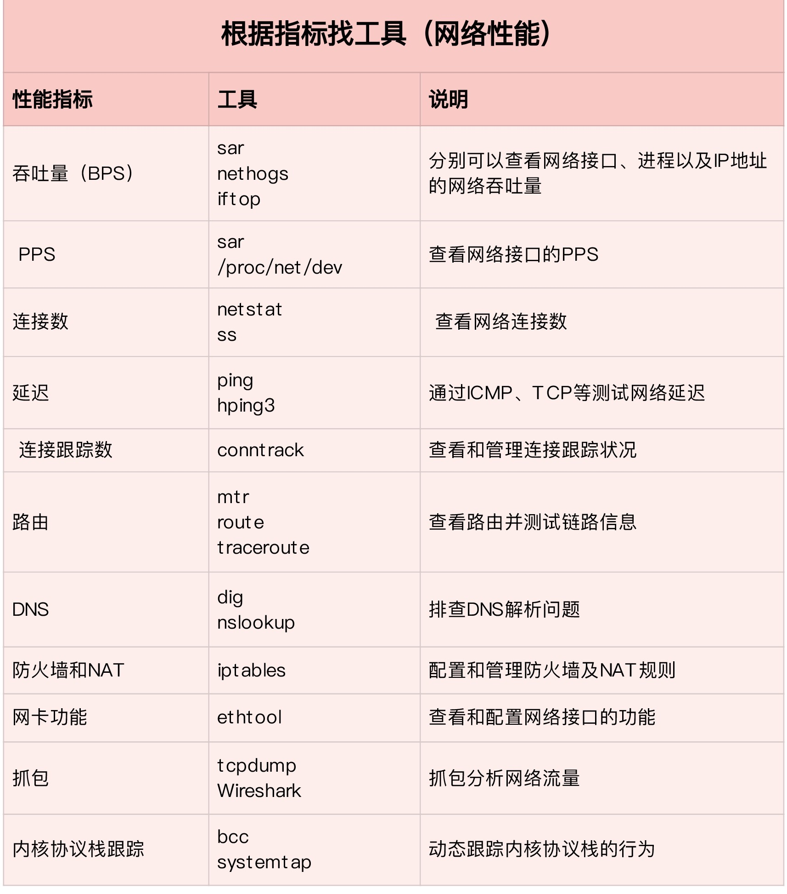
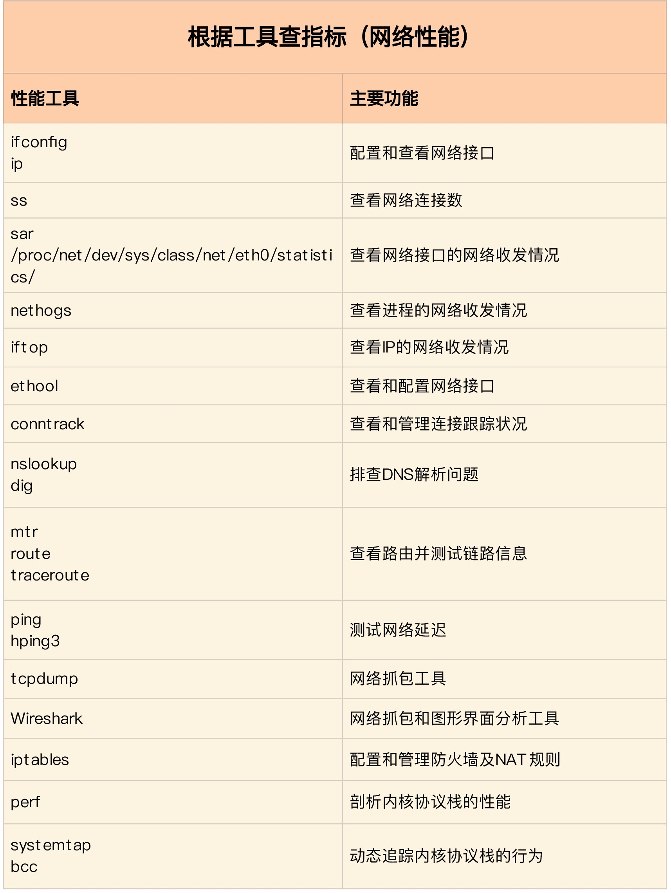

## <b>网络性能测试工具</b> ##

> 基准测试时，按照协议栈的每一层来测试。由于底层是其上方各层的基础，底层性能也就决定了高层性能。
### 网络接口层和网络层 ###
- PPS 包转发率计算
    1. 千兆交换机可以达到线速（满负载时，无差错转发），PPS 是1000Mbps/((64+20)*8bit) = 1.5 Mpps
    2. 20B为以太网帧前导和帧间距的大小。1.5Mpps=150万。

### 传输层 TCP ###
> 吞吐量（BPS）、连接数以及延迟
- 基于 TCP 测试网络吞吐量的方法：ipref
- 基于 TCP 测试网络服务延迟的方法
    ```sh
    # 法1
    # --tcp表示使用TCP协议，-p表示端口号，-n表示不对结果中的IP地址执行反向域名解析
    traceroute --tcp -p 80 -n baidu.com

    # 法2
    hping3 -c 3 -S -p 80 baidu.com
    ```
- TCP带宽利用率计算
    1. 当有效负载只有1字节时，再加上TCP头部和IP头部分别占用的20字节，整个网络包就是41字节，这样实际带宽的利用率只有2.4%（1/41）。
    2. Nagle 算法正通过合并 TCP 小包，提高网络带宽的利用率。
    3. Nagle 算法规定，一个TCP连接只能有一个未被确认的未完成分组；在收到这个分组的ACK前，其他分组会被组合起来，在收到ACK后，用同一个分组发送出去。
    4. Nagle 算法和TCP延时算法一起使用会导致明显的网络延迟。
    5. 

### 应用层 HTTP ###
> 吞吐量（BPS）、每秒请求数以及延迟等指标
- 请求延时测试方法
    ```sh
    # -c表示并发请求数为5000，-n表示总的请求数为10万
    # -r表示套接字接收错误时仍然继续执行，-s表示设置每个请求的超时时间为2s
    ab -c 5000 -n 100000 -r -s 2 http://192.168.0.30:8080/
    ```

### 常用工具 ###

