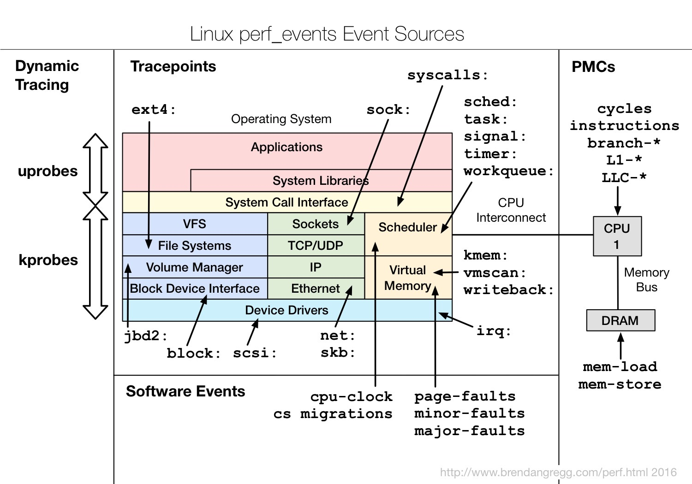
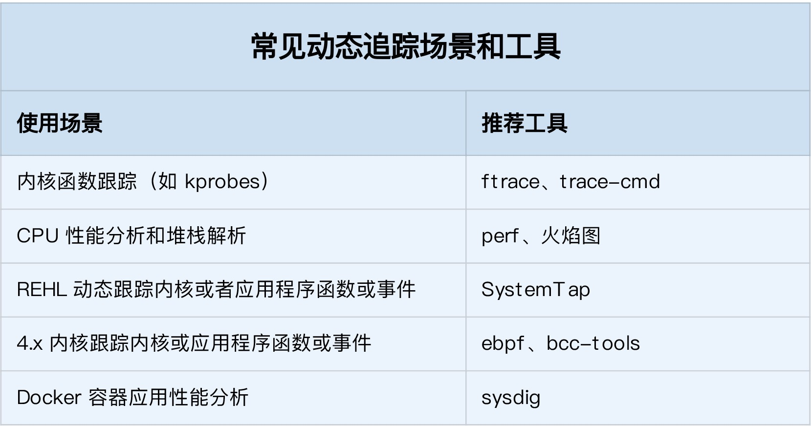

## <b>Linux 其他相关</b> ##

### <b>一. 影响容器性能的因素</b> ###
1. Linux cgroups机制会影响容器应用的运行；
2. iptables中的 NAT，会影响容器的网络性能；
3. 叠加文件系统，会影响应用的 I/O 性能等。

### <b>二. 内核线程简介</b> ###
- 系统创建的线程
    1. 0 号进程为 idle 进程，系统创建的第一个进程，它在初始化 1 号和 2 号进程后，演变为空闲任务。当CPU上没有其他任务执行时，就会运行它。
    2. 1 号进程为 init 进程，通常是 systemd 进程，在用户态运行，用来管理其他用户态进程。
    3. 2 号进程为 kthreadd 进程，在内核态运行，用来管理内核线程。
    4. 查找内核线程, 只需要使用 ps 命令，来查找 kthreadd 的子进程

- 内核线程介绍
    1. kswapd0：用于内存回收。在  Swap 变高 案例中，我曾介绍过它的工作原理。
    2. kworker：用于执行内核工作队列，分为绑定 CPU （名称格式为 kworker/CPU86330）和未绑定 CPU（名称格式为 kworker/uPOOL86330）两类。
    3. migration：在负载均衡过程中，把进程迁移到 CPU 上。每个 CPU 都有一个 migration 内核线程。
    4. pdflush：用于将内存中的脏页（被修改过，但还未写入磁盘的文件页）写入磁盘（已经在 3.10 中合并入了 kworker 中）。
    5. jbd2/sda1-8：jbd 是 Journaling Block Device 的缩写，用来为文件系统提供日志功能，以保证数据的完整性；sda1-8表示磁盘分区名称和设备号。
        - 每个使用了 ext4 文件系统的磁盘分区，都会有一个 jbd2 内核线程。

### <b>三. 动态追踪内核事件</b> ###

#### <b>内核事件源</b> ####
> 根据事件类型的不同，动态追踪所使用的事件源，可以分为静态探针、动态探针以及硬件事件等三类。

- 硬件事件
    1. 由性能监控计数器 PMC（Performance Monitoring Counter）产生。
    2. 包括了各种硬件的性能情况，比如 CPU 的缓存、指令周期、分支预测等等。
    
- 静态探针
    1. 指事先在代码中定义好，并编译到应用程序或者内核中的探针。（需要开启）
    2. 常见的静态探针包括内核中的跟踪点（tracepoints）和 USDT（Userland Statically Defined Tracing）探针。
        - 在源码中插入的一些带有控制条件的探测点，这些探测点允许事后再添加处理函数。例如：printk
        - USDT探针，全称是用户级静态定义跟踪，需要在源码中插入 DTRACE_PROBE() 代码，并编译到应用程序中。

- 动态探针
    1. 指没有事先在代码中定义，但却可以在运行时动态添加的探针，比如函数的调用和返回等。动态探针支持按需在内核或者应用程序中添加探测点，具有更高的灵活性。
    2. 内核态的 kprobes 和用于用户态的 uprobes。
        - kprobes 用来跟踪内核态的函数，包括用于函数调用的 kprobe 和用于函数返回的 kretprobe。
        - uprobes 用来跟踪用户态的函数，包括用于函数调用的 uprobe 和用于函数返回的 uretprobe。
        - kprobes 需要内核编译时开启 CONFIG_KPROBE_EVENTS；而 uprobes 则需要内核编译时开启 CONFIG_UPROBE_EVENTS。

- 简图
    

#### <b>内核事件工具</b> ####

- ftrace通过 debugfs（或者 tracefs），为用户空间提供接口
    ```sh
        # 切换到 debugfs 的挂载点
        cd /sys/kernel/debug/tracing
        # 如果 debugfs/tracefs 没挂载
        mount -t debugfs nodev /sys/kernel/debug
        # 查询所有支持的跟踪器
        cat available_tracers
        hwlat blk mmiotrace function_graph wakeup_dl wakeup_rt wakeup function nop
        # function 表示跟踪函数的执行
        # function_graph 则是跟踪函数的调用关系

        # 查询支持的内核函数和事件（内核源码中预先定义的跟踪）
        $ cat available_filter_functions
        $ cat available_events

        # 排查例子：
        # 设置跟踪的函数: do_sys_open：
        $ echo do_sys_open > set_graph_function
        # 配置跟踪选项，开启函数调用跟踪，并跟踪调用进程：
        $ echo function_graph > current_tracer
        $ echo funcgraph-proc > trace_options
        # 开启跟踪：
        $ echo 1 > tracing_on
        # 执行一个 ls 命令后，再关闭跟踪：
        $ ls
        $ echo 0 > tracing_on
        # 查看跟踪结果：
        $ cat trace
        # tracer: function_graph
        #
        # CPU  TASK/PID         DURATION                  FUNCTION CALLS
        # |     |    |           |   |                     |   |   |   |
        0)    ls-12276    |               |  do_sys_open() {
        0)    ls-12276    |               |    getname() {
        0)    ls-12276    |               |      getname_flags() {
        0)    ls-12276    |               |        kmem_cache_alloc() {
        0)    ls-12276    |               |          _cond_resched() {
        0)    ls-12276    |   0.049 us    |            rcu_all_qs();
        0)    ls-12276    |   0.791 us    |          }
        0)    ls-12276    |   0.041 us    |          should_failslab();
        0)    ls-12276    |   0.040 us    |          prefetch_freepointer();
        0)    ls-12276    |   0.039 us    |          memcg_kmem_put_cache();
        0)    ls-12276    |   2.895 us    |        }
        0)    ls-12276    |               |        __check_object_size() {
        0)    ls-12276    |   0.067 us    |          __virt_addr_valid();
        0)    ls-12276    |   0.044 us    |          __check_heap_object();
        0)    ls-12276    |   0.039 us    |          check_stack_object();
        0)    ls-12276    |   1.570 us    |        }
        0)    ls-12276    |   5.790 us    |      }
        0)    ls-12276    |   6.325 us    |    }
        ...
        在最后得到的输出中：
        第一列表示运行的 CPU；
        第二列是任务名称和进程 PID；
        第三列是函数执行延迟；
        最后一列，则是函数调用关系图。
    ```
- trace-cmd 
    ```sh
    # 将ftrace五步跟踪过程，简化为：
    $ trace-cmd record -p function_graph -g do_sys_open -O funcgraph-proc ls
    $ trace-cmd report
    ```

- ipref
    1. 查找应用程序或者内核中的热点函数。
    2. 使用 perf record/top 时，都是先对事件进行采样，然后再根据采样数，评估各个函数的调用频率。
    3. perf 可以用来分析 CPU cache、CPU 迁移、分支预测、指令周期等各种硬件事件。
    4. perf 也可以只对感兴趣的事件进行动态追踪。
        ```sh
            # 查询所有支持的事件：
            perf list 
            # perf probe 命令，添加 do_sys_open 探针
            perf probe --add do_sys_open
            # 对 10s 内的 do_sys_open 进行采样：
            perf record -e probe:do_sys_open -aR sleep 10
            # 采样成功后，就可以执行 perf script ，来查看采样结果了：
            perf script
            # 执行下面的命令，你就可以知道 do_sys_open 的所有参数
            perf probe -V do_sys_open
            
            Available variables at do_sys_open
                @<do_sys_open+0>
                    char*   filename
                    int     dfd
                    int     flags
                    struct open_flags       op
                    umode_t mode

            #如果这个命令执行失败，就说明调试符号表还没有安装。那么，你可以执行下面的命令，安装调试信息后重试：
            # Ubuntu
            apt-get install linux-image-`uname -r`-dbgsym
            # CentOS
            yum --enablerepo=base-debuginfo install -y kernel-debuginfo-$(uname -r)

            # 使用完成后不要忘记删除探针
            perf probe --del probe:do_sys_open

            # 添加带参数的探针
            perf probe --add 'do_sys_open filename:string'
        ```
    5. strace 基于系统调用 ptrace 实现，这就带来了两个问题。
        - ptrace 是系统调用，就需要在内核态和用户态切换。当事件数量比较多时，繁忙的切换必然会影响原有服务的性能；
        - ptrace 需要借助 SIGSTOP 信号挂起目标进程。这种信号控制和进程挂起，会影响目标进程的行为。
        - 在性能敏感的应用（比如数据库）中，我并不推荐你用 strace （或者其他基于 ptrace 的性能工具）去排查和调试。
    
    6. 在 strace 的启发下，结合内核中的 utrace 机制， perf 也提供了一个 trace 子命令，是取代 strace 的首选工具。
        ```sh
        # 查看 ls 的系统调用
        perf trace ls

        ? (         ): ls/14234  ... [continued]: execve()) = 0
        0.177 ( 0.013 ms): ls/14234 brk(                                                                  ) = 0x555d96be7000
        0.224 ( 0.014 ms): ls/14234 access(filename: 0xad98082                                            ) = -1 ENOENT No such file or directory
        0.248 ( 0.009 ms): ls/14234 access(filename: 0xad9add0, mode: R                                   ) = -1 ENOENT No such file or directory
        0.267 ( 0.012 ms): ls/14234 openat(dfd: CWD, filename: 0xad98428, flags: CLOEXEC                  ) = 3
        0.288 ( 0.009 ms): ls/14234 fstat(fd: 3</usr/lib/locale/C.UTF-8/LC_NAME>, statbuf: 0x7ffd2015f230 ) = 0
        0.305 ( 0.011 ms): ls/14234 mmap(len: 45560, prot: READ, flags: PRIVATE, fd: 3                    ) = 0x7efe0af92000
        0.324 Dockerfile  test.sh
        ( 0.008 ms): ls/14234 close(fd: 3</usr/lib/locale/C.UTF-8/LC_NAME>                          ) = 0

        perf trace 还可以进行系统级的系统调用跟踪（即跟踪所有进程），而 strace 只能跟踪特定的进程。
        ```
        


