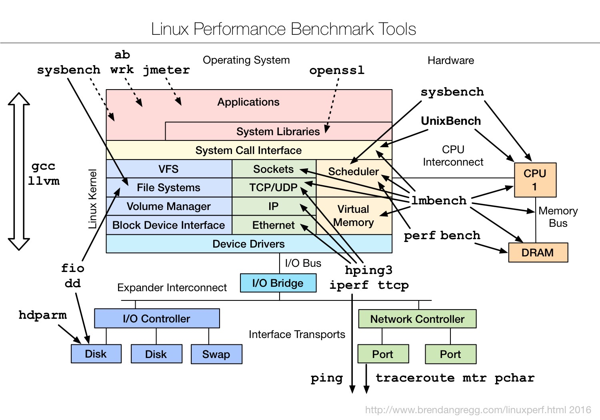

##  综合总结 ##

### <b>系统性能指标USE法</b> s###
> USE法把系统资源的性能指标，简化成了三个类别，即使用率、饱和度以及错误数。

1. 使用率，表示资源用于服务的时间或容量百分比。100% 的使用率，表示容量已经用尽或者全部时间都用于服务。
2. 饱和度，表示资源的繁忙程度，通常与等待队列的长度相关。100% 的饱和度，表示资源无法接受更多的请求。
3. 错误数表示发生错误的事件个数。错误数越多，表明系统的问题越严重。

### <b>应用程序性能指标</b> ###

1. 应用进程的资源使用情况. - 进程占用的 CPU、内存、磁盘 I/O、网络等。
2. 应用程序之间调用情况.  - 调用频率、错误数、延时, 其依赖的其他应用出现了性能问题。
3. 应用程序内部核心逻辑的运行情况. - 比如关键环节的耗时以及执行过程中的错误等。

### <b>性能优化</b> ###
- CPU 优化
    1. 把进程绑定到一个或者多个 CPU 上，充分利用 CPU 缓存的本地性，并减少进程间的相互影响。
    2. 为中断处理程序开启多 CPU 负载均衡，以便在发生大量中断时，可以充分利用多 CPU 的优势分摊负载。
    3. 使用 Cgroups 等方法，为进程设置资源限制，避免个别进程消耗过多的 CPU。同时，为核心应用程序设置更高的优先级，减少低优先级任务的影响。

- 内存优化
    1. 除非有必要，Swap 应该禁止掉。这样就可以避免 Swap 的额外 I/O ，带来内存访问变慢的问题。
    2. 使用 Cgroups 等方法，为进程设置内存限制。这样就可以避免个别进程消耗过多内存，而影响了其他进程。对于核心应用，还应该降低 oom_score，避免被 OOM 杀死。
    3. 使用大页、内存池等方法，减少内存的动态分配，从而减少缺页异常。

- 磁盘和文件系统 I/O 优化
    1. 最简单的方法，通过 SSD 替代 HDD、或者使用 RAID 等方法，提升 I/O 性能。
    2. 针对磁盘和应用程序 I/O 模式的特征，选择最适合的 I/O 调度算法。比如，SSD 和虚拟机中的磁盘，通常用的是 noop 调度算法；而数据库应用，更推荐使用 deadline 算法。
    3. 优化文件系统和磁盘的缓存、缓冲区，比如优化脏页的刷新频率、脏页限额，以及内核回收目录项缓存和索引节点缓存的倾向等等。
    4. 使用不同磁盘隔离不同应用的数据、优化文件系统的配置选项、优化磁盘预读、增大磁盘队列长度等，也都是常用的优化思路。

- 应用程序优化
    1. 系统 CPU 使用率（sys%）过高的问题 - 可能是应用程序的不合理系统调用
    2. 数据库的 CPU 使用率高、I/O 响应慢 - 可能要优化应用程序中数据库表结构的逻辑或者 SQL 语句
    3. 从 CPU 使用的角度来说，简化代码、优化算法、异步处理以及编译器优化等，都是常用的降低 CPU 使用率的方法，这样可以利用有限的 CPU 处理更多的请求。
    4. 从数据访问的角度来说，使用缓存、写时复制、增加 I/O 尺寸等，都是常用的减少磁盘 I/O 的方法，这样可以获得更快的数据处理速度。
    5. 从内存管理的角度来说，使用大页、内存池等方法，可以预先分配内存，减少内存的动态分配，从而更好地内存访问性能。
    6. 从网络的角度来说，使用 I/O 多路复用、长连接代替短连接、DNS 缓存等方法，可以优化网络 I/O 并减少网络请求数，从而减少网络延时带来的性能问题。
    7. 从进程的工作模型来说，异步处理、多线程或多进程等，可以充分利用每一个 CPU 的处理能力，从而提高应用程序的吞吐能力。
    8. 可以使用消息队列、CDN、负载均衡等各种方法，来优化应用程序的架构，将原来单机要承担的任务，调度到多台服务器中并行处理。

### 工具图 ###

