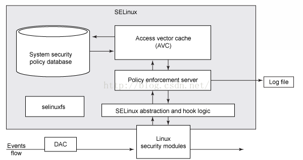
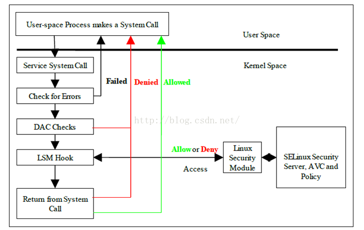

##  **MAC（Mandatory Access control）** ##
### **一，SElinux、SEAndroid基本架构与原理** ###
- 对系统中每个对象都生成一个安全上下文(Security Context)
- 每一个对象访问系统的资源都要进行安全上下文审查
- 审查的规则:
    1. 类型强制检测(type enforcement)
    2. 多层安全审查(Multi-LevelSecurity)
    3. 基于角色的访问控制(RBAC: Role Based Access Control)

### **二，SELinux的整体结构** ###
- 整体结构图：

    
    ```sh
    #1. 用于处理文件系统的V辅助模块，即SELinuxFS。
    #2. 集成Linux Security Modules的hooks sets。
    #3. Security Policy Database。
    #4. Security Label验证模块。
    #5. Access Vector Cache (AVC),访问向量缓存,以便提高验证速度。
    ```

- 基本访问流程图：
    
    ```sh
    #1 进程通过系统调用(System Call)访问某个资源，进入Kernel后，先会做基本的检测，如果异常则直接返回。
    #2 Linux Kernel DAC审查,如果异常则直接返回。【DAC和MAC并不冲突】
    #3 调用Linux Kernel Modules的相关hooks,对接到SELinux的hooks，进而进行MAC验证，如果异常则直接返回。
    #4 访问真正的系统资源。
    #5 返回用户态，将结构反馈。 
    ```
- SEAndroid
    1. SEAndroid安全机制也是分为内核空间跟用户空间两部分。
    2. SEAndroid内核空间的实现是基于LSM实现, 以SELinux文件系统接口为边界。
    3. SEAndroid用户空间及到安全上下文（Security Context）、安全策略（SEAndroid Policy）和安全服务（Security Server）等模块
        ```sh
        #1. 对象: 分为两种类型，Subject主体和Object访问对象。主体通常是以进程为单位，客体是进程访问的资源，通常是以文件为单位。
        #2. 安全上下文(Security Context): 一个标准的字符串, 所有对象都有一个安全上下文。
            #a. 文件对象的安全上下文
            #b. 查看方式：开启了SEAndroid安全机制的设备上执行ls –Z
            #c. 执行结果: drwxr-xr-x 2 root root u:object_r:sshd_data_file:s0     4096 2013-01-18 16:58 empty
            #d. 格式说明: user:role:type[:range] 
                # user: 代表创建这个文件的SELinux user, 非Linux UID。
                # roleo: Role BasedAccess Control（基于角色的访问控制，简称为RBAC）。一个u可以属于多个role，不同的role具有不同的权限。

                # type: MAC的基础管理思路不是针对上面的RBAC，而是Type Enforcement Accesc Control（简称TEAC，一般用TE表示）
                    # 对于文件来说：Tyep表示文件类型。
                    # 对进程来说，Type表示Domain。[进程属于哪个Domain,Domain规定了相关权限, 需要通过te文件的allow语句说明]

                # range: S0和SELinux为了满足军用和教育行业而设计的Multi-Level Security（MLS）机制有关。
                    # MLS将系统的进程和文件进行了分级，不同级别的资源需要对应级别的进程才能访问。

            #a. 进程对象的安全上下文
            #b. 查看方式：开启了SEAndroid安全机制的设备上执行ps –Z
            #c. 执行结果: u:r:platform_app:s0:c512,c768  u0_a8     1251  239   1572984 73316 SyS_epoll_ 7b27e42b80 S com.android.managedprovisionin
            #d. 格式说明: [同上]
                # SEAndroid只定义了一个SELinux用户u，因此我们通过ps -Z和ls -Z命令看到的所有的进程和文件的安全上下文中的SELinux用户都为u
                # SEAndroid只定义了一个SELinux角色r，因此，我们通过ps-Z命令看到的所有进程的安全上下文中的SELinux角色都为r。

        #3 安全策略: 通过主体和客体的安全上下文，定义主体是否有权限访问客体.
            #定义：SEAndroid安全机制主要是使用对象安全上下文中的类型来定义安全策略，这种安全策略就称TypeEnforcement，简称TE。
            #实现：在external/sepolicy目录中，所有以.te为后缀的文件经过编译之后，就会生成一个sepolicy文件。
            #路径：sepolicy文件会打包在ROM中，并且保存在设备上的根目录下，即它在设备上的路径为/sepolicy。
            #细节：TE的描述一般在device/mediatek/common/sepolicy/和external/sepolicy中，SEAndroid为系统定义了33个te策略文件
            #策略类型： 
                #1. 针对attribute的策略制定
                #2. 针对daemon
                #3. 对系统的其他模块进行策略制定
                    # app.te: 
                    # 在这一文件里将安装在系统上的第三方app分类为受信任的app和不受信任的app
                    # 为这两种app在访问网络，bluetooth，sdcard，数据，缓存，binder等等名感位置时设置相应权限。

                    #system.te:
                    #这一文件主要针对的是系统app和system server进程。
                    #对系统app访问binder、systemdata files、dalvikcatch、keystone等进行权限控制
                    #对system server访问网络、bluetooth、netlink、app、binder、device、data files、socket、cache files等进行权限控制。
                    
                    #init.te: 在这一文件中声明了init拥有无限权限
                    #nfc.te: 在这一文件中制定了nfc domain对nfc设备和相关数据文件的访问权限
                    #kernel.te: 在这一文件中声明了kernel拥有无限权限。
                    #radio.te: 在这一文件中制定了radio domain对init、rild和相关数据文件的访问权限。
                    #device.te: 在这一文件中定义了所有跟设备相关的type，并将这些type都归到了dev_type属性中。
            #策略示例：
                # allow netd proc:file write
                # 这条SELinux语句表示 允许（allow ）netd域（domain）中的进程  ”写（write）proc文件“ 

        #安全服务
            # 目的: 用户空间的Security Server主要是用来保护用户空间资源的，以及用来操作内核空间对象的安全上下文的：
            # 组成: 
                # 应用程序安装服务PackageManagerService、应用程序安装守护进程installd [负责创建App数据目录的安全上下文]
                # 应用程序进程孵化器Zygote进程 [创建App进程的安全上下文]
                # init进程 [控制系统属性的安全访问]
        ```

- 基于角色的访问控制
    1. 上面介绍的主要是：user:role:type[:range] 中 type(TEAC类型增强访问控制) 的组成
    2. 因为TEAC仅针对Type或Domain，没有针对user和role的，RBAC是TEAC的基础上，进一步加强了权限控制。

- init进程创建的子进程会根据安全策略文件将子进程转移到合适进程里去

相关书籍：《SELinux by Example Using Security Enhanced Linux》
相关链接：https://blog.csdn.net/Innost/article/details/19299937
相关链接：https://blog.csdn.net/bsxiaomage/article/details/51126826