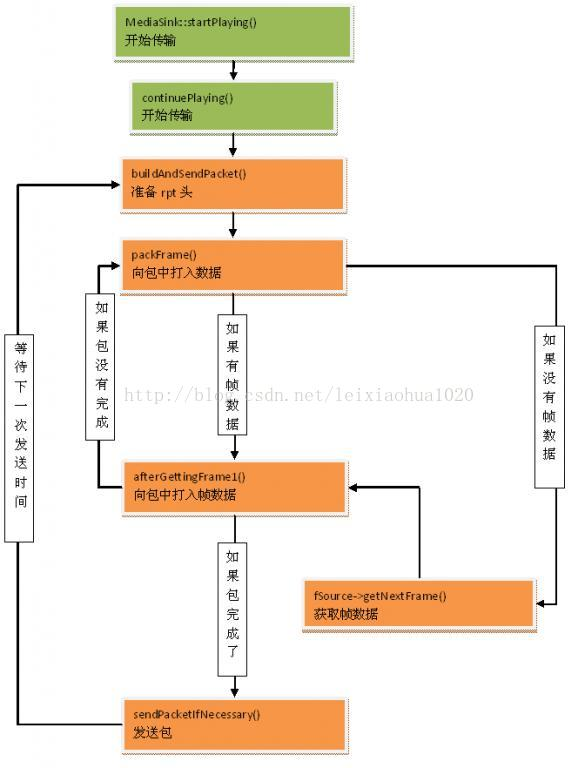

## Live555 简介
> https://blog.csdn.net/leixiaohua1020/article/details/84485295

### **liveMedia库基本概念**
- **示例： Source1 -> Source2 (a filter) -> Source3 (a filter) -> Sink**
- **Source：** 生产数据的对象。比如通过RTP 读取数据
- **Filter：** 从其它Source 接收数据的source
- **Sink：** 消费数据的对象，比如把接收到的数据存储到文件， 这个文件就是一个Sink。
    1. Sink 类实现对数据的处理是通过实现纯虚函数continuePlaying()
    2. continuePlaying() 调用fSource->getNextFrame 来为Source 设置数据缓冲区，处理数据的回调函数等
    3. 通常情况下，fSource 是MediaSink 的类型为FramedSource*的类成员。

### **liveMedia库基本控制流程**
- 应用程序是事件驱动的
    ```sh
    # Source1 -> Source2 (a filter) -> Source3 (a filter) -> Sink
    # 每个sink，在进入这个循环之前，调用someSinkObject->startPlaying()方法来启动需要做的生成任务： 
    # 一个Module 的数据输入都通过调用在它之前的Module 的FramedSource::getNextFrame() 方法。
    # FramedSource::getNextFrame() 是通过纯虚函数FramedSource::doGetNextFrame() 实现的，每一个Source module 都有相应的实现。
    while (1) {
        #通过查找读网络句柄的列表和延迟队列（delay queue）来发现需要完成的任务
        #完成这个任务
    }
    ```
    
- 流程图  
a. 从代码中还原这个张图的能力很重要 (换句话说：代码用了哪些语言特性完成了这张图)
b. 让这张简单的流程图跑起来的细节，技术问题也值得关注。（异步问题，锁问题，调度问题，可维护可拓展模块独立性问题等）   


### **关于Live555的拓展**
- 基于liveMedia的程序，可通过继承UsageEnvironment 抽象类和TaskScheduler 抽象类，定义相应的类来处理事件调度，数据读写以及错误处理。
- live 项目UsageEnvironment 抽象类和TaskScheduler 抽象类的基本实现“BasicUsageEnvironment”库。主要是针对简单的控制台应用程序。
- BasicUsageEnvironment库利用 select 实现事件获取和处理。可以在Unix或者Windows开发传统的运行与控制台的应用。
- 在图形环境（GUI toolkit）下，抽象类TaskScheduler 的自定义子类在实现doEventLoop()的时候应该与图形环境自己的事件处理框架集成。

