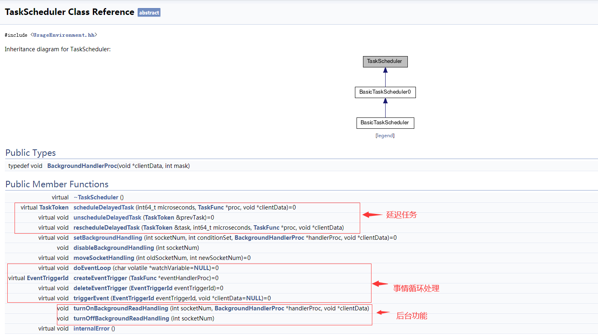
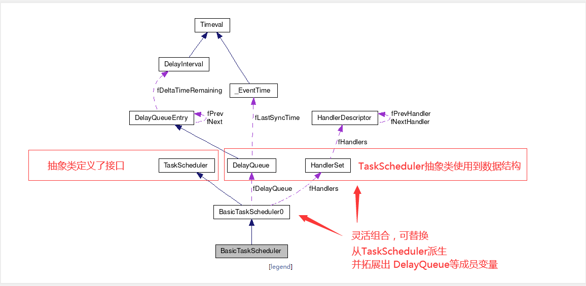
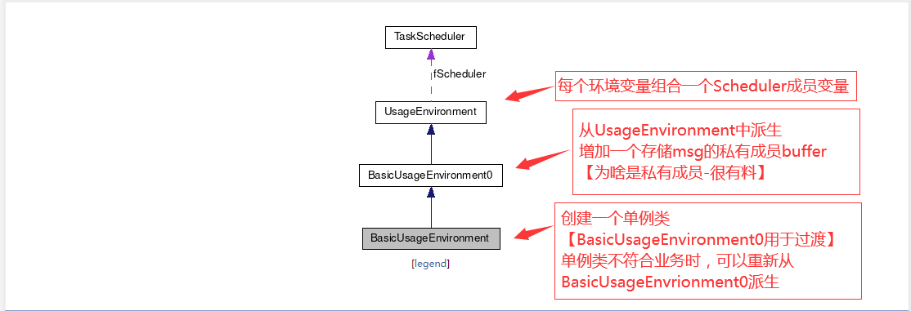
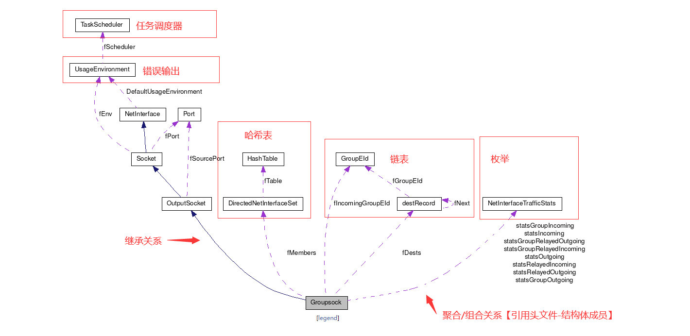
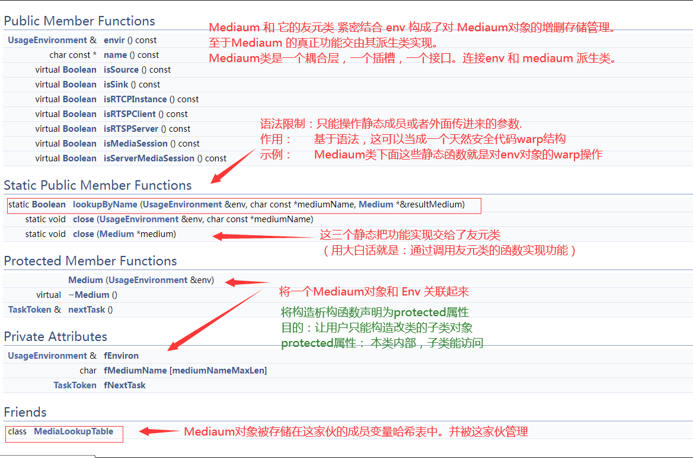

## **Live555 工程角度代码结构分析**
> 引子：如何阅读源码？

### **基类1.TasKScheduler**
> 引子：调度器一般哪些功能？  
 
      

    

### **基类2.UsageEnvironment**

 

### **基类3.GroupSocket** 

 

### **基类4.Medium**
> **把 Medium 放到不同的 envir 里;要点；C++ 静态成员函数 - 性能 - 包裹调用.**   

