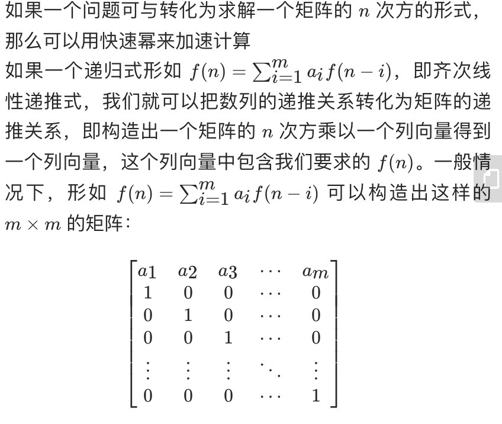

## **数列相关问题**
> **定义一个数学概念是因其符合自然与生活，切勿钻牛角尖**

### **数列的哲学**
- 【实际】通过已知的几项，推导后续的项；提供多一项或少一项，都可能影响最终答案
- 【道理】人生就像数列，我们总根据已知项期待着未来项，但生活不一定会按照我们的期待给出下一项

### **数列的解法**
- 等差数列，等比数列[无穷级数的入口]，质数关系，振荡关系，其他规律

### **正整数与质数** 
> **质数的概念对于正整数有很重要的意义，同样广泛应用于日常生活中。例如：密码学**
- 【定义】质数：除了1以外，只能被1和自身整除的正整数
- 【推理】正整数存在唯一的质因分解数。（如果1被定义为质数，则此推理不成立）
- 【问题】如何求一个正整数n的约数之和？ 
    1. 求正整数有哪些约数？ -- 质因分解数得到质因式（约数即为质因项组合的结果）
    2. 为了计算方便，质因式合并成几个质数幂相乘的形式
    3. 计算每个质数幂进行等比数列求和运算（对质数为底，幂为最大项形成的等比数列进行求和）
    4. 将每个质数幂的等比数列和累乘

### **恒等式，方程式，定义式**
> **理解式子的概念有使思考数学问题有条理性**  
- 【理解】恒等式用于变换，方程式需要求解，定义式用于化简计算
- 【重要】式子有两种形式：积/和；解方程常需要变换成积的形式

### **数列振荡，角旋转，变换矩阵（空间基向量）**
> **一维数列项的振荡联想到二维平面的旋转【升维联想很重要】**
- 数列A: 1，i，-1，-i，1，... (在一维数列-1，1之间上振荡)
- 把数列A的项当成复数平面的点以角度A进行圆周旋转 cosA+isinA （数列A这里的角度A是90度）
- 在线性代数中，旋转可以用变换矩阵表示。其原理是：使用不同空间基变量去描述空间中的点
- 旋转N次可以用变换矩阵的N次方表示，从此，可以得到线性代数中，倍角公式的证明方法
- 【思考】二维空间圆的三/四等分旋转在一维空间呈现什么现象？
     
### **数列王国与函数王国的漫游**
> **数列递推式，生成函数，有限项代数式，数列通项公式**

- 斐波那契数列的通项公式计算过程
	1. 观察数列几个项的关系得出【数列的递推式】
	2. 理解生成函数的意义-在数列项与生成函数（无穷级数）项系数之间建立的等价关系【这是一个恰如其分的假设】
	3. 在2的基础上，可以列出无穷级数形式的生成函数；根据1的数列递推式可得出由生成函数（无穷级数形式）联立的方程组
	4. 解3中的方程组可得到 生成函数的 有限项分代数式
	5. 什么是生成函数的有限项代数式？
		```sh
		# 【生成函数】
		#  有限项代数式：根据x的取值，式子展开会得到，与x取值相关有限个数的数列
		#  无穷级数式：无穷个幂次项幂递增相加的和式
		```
	6. 如何通过生成函数的有限项代数式得出数列的通项公式呢？
 		```sh
		# 【等比数列求和公式】
		#  将生成函数的有限项代数式变形成等比数列求和公式（会涉及一些变换的技巧，经验，思路）
		``` 

### **斐波那契数列递推关系与矩阵关系的转换**
- **图中累加形式的函数是更为通用的斐波那契数列通式【目前还没有能力从空间的角度去理解这种转换关系】**


### **后话**
- 提供了很多看待数列的角度
	1. 振荡，旋转，投影，高低维之间视角呈现，线性代数空间基向量变换相关概念
	2. 数列[项系数]，生成函数[等比数列求和公式，无穷级数，数列递推式，有限项代数式]
	3. 正整数，质数，约数和，累乘数学符号


