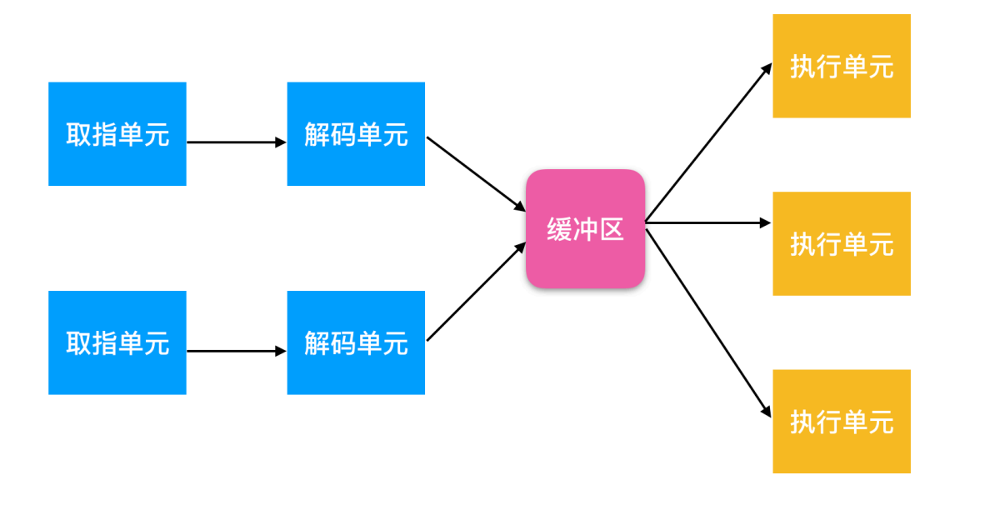

## **CPU简介**
### **总线仲裁**
> 计算级硬件是挂在总线上的。那么计算机底层如何高效的解决总线上的冲突问题呢？
- 集中式仲裁
    1. 链式查询方式
    2. 计数器定时查询方式
    3. 独立请求方式

- 分布式仲裁

### **CPU名词概念**
- **流水线**  
**一个指令一般要经过从内存中取指，CPU解码，CPU执行三个过程。流水线机制可以大大提高指令执行效率**

- **超标量**

- **PSW(Program Status Word) 程序状态寄存器**  
    A. 记录系统调用，IO，程序状态等信息

- **TRAP指令可以用于内核态与用户态之间的切换**

- **CPU的多线程/超线程特性**
    A. 允许CPU保存两个或多个线程的状态，并在ns级时间内完成切换