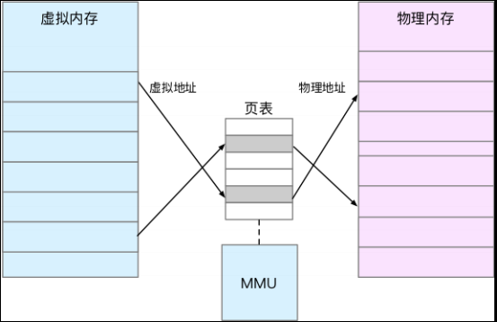
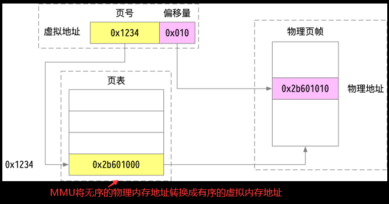
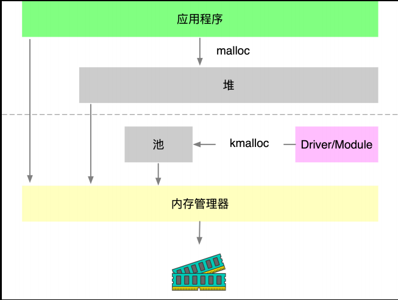

## **Linux 内存相关知识**
> **程序员应该善于发现问题，定位问题的本质**

### **相关思考引子**
> **看到不等于做到，即使方向对了，也仍需努力**
- 如果只是执着于源码的编写，写好看的代码，那么应该去研究语言或语言工具的表达艺术。
- 如果只是想使用某个库的API，那么熟悉英文，看懂术语，有些相关的开发经验那就差不多了。
- 如果只是想看懂源码的处理逻辑，那么应该去了解其背后的数学原理以及应用场景。
- 如果想无往不利，那么在阅读源码时，保持对源问题的思考。比如：Git工具的管理思想，解决了空间上或时间上那些问题，其处理方法有没有共性
    ```sh
    # “计算机科学领域的任何问题都可以通过添加一个中间层来解决” 
    # 假设上面的命题成立，则意味着我们可以通过研究添加中间层时间空间艺术去解决任何计算机问题。这样此不是很酷。
    ```

### **Linux内存管理**
> **一起探索，计算机领域的中间层在内存管理领域的意义吧**

- **内核内存中间层【MMU】：内核给用户空间模拟一个连续的内存空间**  
    |**虚拟内存**|**linux内存布局**|**内存映射**|
    |:--:|:--:|:--:|
    ||||
    ||||
    ```sh
    # 如何打印内核虚拟地址与物理地址的映射？
    ```

- **用户malloc/free内存分配管理**  
    |**内存管理总图**||
    |:--:|:--:|
    |||
    |||  
    
    ```sh
    # 程序的内存布局是由系统哪部分规划创建加载起来的？
    # 从图上看glibc参与了程序内存空间的维护，那么程序内存空间是在内核就创建好了还是在glibc中创建规划布局的？
    ```

- **Glibc的内存分配机制**


