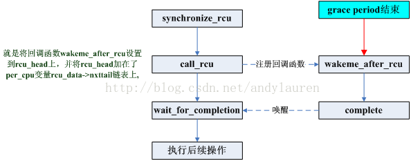

## **RCU [Read-Copy-Update] 相关**
> **[RCU用于保护共享数据，读者不需要获取锁就可以访问，写者需要拷贝一个副本，然后等待一个时机回写](https://blog.csdn.net/andylauren/article/details/70233241https://blog.csdn.net/andylauren/article/details/70233241)**

### **引子**
- **读写逻辑常见问题**
- **代码框架流程的间隙**
- **了解他人如何处理异步场景问题**

### **个人理解与问题**
- **A. 数据是保存内存或者cache中的，CPU读取被RCU保护的数据时，为什么不能发生上下文切换？**
- **B. 对的**

### **RCU简介**
- **A. RCU是一种内核数据保护机制**
- **B. RCU允许多个读者和多个写者同时访问被保护的数据【多个写者同时访问需要写者之间提供数据同步机制】**
- **C. 适用于读多写少应用场景**
- **D. 超级重要：读者在读取数据的时候不能被阻塞【即：读者所在CPU不能进行上下文切换】**
    ```sh
    # 1. CPU读取数据一般是从register, level one cache, level two cache，最后才是内存获取数据。
    # 2. C言语 volatile 关键词用于从内存获取数据。
    # 3. 不让读者所在CPU进行切换，应该是为了保护 cache 中的数据不被修改。
    ```
- **E. 写者在访问被RCU保护的共享数据时不需要和读者竞争任何锁，只有在有多于一个写者的情况下需要获得某种锁以与其他写者同步。**
    ```sh
    # 1. 写者是将被RCU保护数据拷贝一份[这是一个读操作], 然后在拷贝的数据上进行修改，不会修改到原始数据。
    # 2. 多写者之间同步实际上是：同步多个写者各自的拷贝数据。
    ```
- **F. 写者等待回写的时机称为grace period; CPU发生上下文切换称为quiescent state; grace period就是所有CPU都是经过一次quiescent state所需等待的时间**
    ```sh
    # 1. 读者会禁用上下文切换。所有CPUi经过一次上下文切换，说明读者已经全部退出。【CPU之间的上下文切换应该是不一致的，这样写者的回写速度很很慢】
    ```

### **RCU内核使用例程**  
- **RCU内核使用例程**
    ```C
    struct foo {
    int a;
        char b;
        long c;
    };

    DEFINE_SPINLOCK(foo_mutex);
    struct foo *gbl_foo;

    void foo_update_a(int new_a)
    {
        struct foo *new_fp;
        struct foo *old_fp;
        new_fp = kmalloc(sizeof(*new_fp), GFP_KERNEL);
        // 内核编程中经常要使用到自旋锁，因为不像用户态有虚拟内存空间保护。
        // 若此处发生了抢占，则内存数据很容易，被修改。
        spin_lock(&foo_mutex);
        old_fp = gbl_foo;
        *new_fp = *old_fp;
        new_fp->a = new_a;
        rcu_assign_pointer(gbl_foo, new_fp);
        spin_unlock(&foo_mutex);
        synchronize_rcu();
        kfree(old_fp);
    }
    ```

### **RCU API实现分析**
- **RCU API实现分析1 [相关知识(内存屏障)](https://blog.csdn.net/world_hello_100/article/details/50131497)**
    ```C
    #define rcu_read_lock() __rcu_read_lock() 
    #define rcu_read_unlock() __rcu_read_unlock() 
    // 保持一个读者的RCU临界区.在该临界区内不允许发生上下文切换 
    #define __rcu_read_lock() 
    do { 
        preempt_disable();  // 禁止抢占
        __acquire(RCU);     // 编译性选择函数
        rcu_read_acquire(); // 编译性选择函数
    } while (0) 
    #define __rcu_read_unlock() 
    do { 
        rcu_read_release(); // 编译性选择函数
        __release(RCU);     // 编译性选择函数
        preempt_enable();   // 开启抢占
    } while (0)

    // 保护一个指针
    #define rcu_dereference(p) ({ 
        typeof(p) _________p1 = ACCESS_ONCE(p); // 编译时 volatile
        smp_read_barrier_depends();             // 内存屏障 
        (_________p1); 
    }) 
    // 修改一个指针
    #define rcu_assign_pointer(p, v) 
    ({ 
        if (!__builtin_constant_p(v) || ((v) != NULL))  
            smp_wmb();  // 内存屏障 - 解决内存乱序访问问题，保证cache的一致性
        (p) = (v); 
    })
    // 上面两个函数同时使用了内存屏障，可以让读者和写者同时看到指针的最新值

    /*  */
    void synchronize_rcu(void) 
    { 
        struct rcu_synchronize rcu; 
        init_completion(&rcu.completion); 
        /* Will wake me after RCU finished */ 
        call_rcu(&rcu.head, wakeme_after_rcu); 
        /* Wait for it */ 
        wait_for_completion(&rcu.completion); 
    }
    ```

- **RCU API实现分析2 - 注册函数框架**  

    

    **每一个CPU都有一个rcu_data.每个调用call_rcu()/synchronize_rcu()进程的进程都会将一个rcu_head都会挂到rcu_data的nxttail链表上**
    ```c
    // 1. 写者进行写同步时将要做的工作以回调函数形式注册到CPU的rcu_data对象上面等待合适的时机。
    // 2. 将工作委托出去的代码结构可以学习，对于具体CPU上下文切换的考虑细节可以了解，完善自己认知思维上漏洞。
    void synchronize_rcu(void) 
    { 
        struct rcu_synchronize rcu; 
        init_completion(&rcu.completion); 
        /* Will wake me after RCU finished */ 
        call_rcu(&rcu.head, wakeme_after_rcu); 
        /* Wait for it */ 
        wait_for_completion(&rcu.completion); 
    }

    void call_rcu(struct rcu_head *head,  void (*func)(struct rcu_head *rcu)) 
    { 
        unsigned long flags; 
        struct rcu_data *rdp; 
    
        head->func = func; 
        head->next = NULL; 
        local_irq_save(flags); 
        rdp = &__get_cpu_var(rcu_data); 
        *rdp->nxttail = head; 
        rdp->nxttail = &head->next; 
        if (unlikely(++rdp->qlen > qhimark)) { 
            rdp->blimit = INT_MAX; 
            force_quiescent_state(rdp, &rcu_ctrlblk); 
        } 
        local_irq_restore(flags); 
    }

    static void wakeme_after_rcu(struct rcu_head *head) 
    { 
        struct rcu_synchronize *rcu; 
    
        rcu = container_of(head, struct rcu_synchronize, head); 
        complete(&rcu->completion); 
    }
    ```

- **RCU API实现分析3 - 关于等待期的考量**
    > **通过这个看见内核编程要考量的一些细节问题**    

    ```C
    struct rcu_data {  
        long quiescbatch;       
        int passed_quiesc;  
        long            batch;           
        struct rcu_head *nxtlist;  
        struct rcu_head **nxttail;  
        struct rcu_head *curlist;  
        struct rcu_head **curtail;  
        struct rcu_head *donelist;  
        struct rcu_head **donetail;  
    };

    /*  
        A. 既然要往CPU数据结构体的rcu_data添加的回调函数，就需要初始化。
        B. 初始化完之后，要用代码正确的表达切换的时机。
        C. 调用synchronize_rcu，将代表写者的rcu_head添加到了CPU[n]每cpu变量rcu_data的nxtlist。
            另一方面，在每次时钟中断中，都会调用update_process_times函数。检查时机是否到来。
    */
    void update_process_times(int user_tick)
    { 
        //......
        /*
            rcu_check_callbacks()中主要工作就是调用raise_softirq(RCU_SOFTIRQ)，触发RCU软中断。
            而RCU软中断的处理函数为rcu_process_callbacks，其中分别针对每cpu变量rcu_bh_data和rcu_data调用__rcu_process_callbacks。
        */
        if (rcu_pending(cpu)) 
            rcu_check_callbacks(cpu, user_tick); 
        //......
    }

    /*
        A. 该CPU上有等待处理的回调函数,且已经经过了一个batch(grace period).rdp->datch表示rdp在等待的batch序号;
        B. 上一个等待已经处理完了,又有了新注册的回调函数;
        C. 等待已经完成,但尚末调用该次等待的回调函数;
        D. 在等待quiescent state.
    */
    static int __rcu_pending(struct rcu_ctrlblk *rcp, struct rcu_data *rdp) 
    { 
        /* This cpu has pending rcu entries and the grace period 
        * for them has completed. 
        */ 
        if (rdp->curlist && !rcu_batch_before(rcp->completed, rdp->batch)) 
            return 1; 
    
        /* This cpu has no pending entries, but there are new entries */ 
        if (!rdp->curlist && rdp->nxtlist) 
            return 1; 
    
        /* This cpu has finished callbacks to invoke */ 
        if (rdp->donelist) 
            return 1; 
    
        /* The rcu core waits for a quiescent state from the cpu */ 
        if (rdp->quiescbatch != rcp->cur || rdp->qs_pending) 
            return 1; 
    
        /* nothing to do */ 
        return 0; 
    }

   /*
        如果系统是第一次出现写者阻塞，也即之前的写者都已经处理完毕，那么此时curlist链表一定为空（curlist专门存放已被rcu检测到的写者请求），
        于是就把nxtlist里的所有成员都移动到curlist指向，并把当前CPU需要等待的grace period id：rdp->batch设置为当前系统处理的grace period的下一个grace周期，即rcp->cur+ 1。

        donelist, curlist, nxtlist的作用
    */
    void __rcu_process_callbacks(struct rcu_ctrlblk *rcp, struct rcu_data *rdp)  
    {  
        /*
            如果系统之前已经有写者在被rcu监控着，但还没来得及经过一个grace period，这个时候curlist不为空，nxtlist也不为空，写者会被加入nxtlist中。
        */
        if (rdp->nxtlist && !rdp->curlist) {        // 由于curlist不为空，说明上个rcu周期的写者还没有处理完，于是不会将本次阻塞的写者加入curlist
            move_local_cpu_nxtlist_to_curlist();
    
            // curlist里的rcu_head被处理完（都移动到了donelist），才会将后来的写者纳入RCU考虑（移动到curlist）
            rdp->batch = rcp->cur + 1;  
    
            if (!rcp->next_pending) {  
                rcp->next_pending = 1;  
                rcp->cur++;  
                cpus_andnot(rcp->cpumask, cpu_online_map, nohz_cpu_mask);  
            }  
        }  
    }
    ```