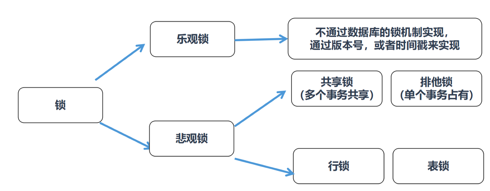
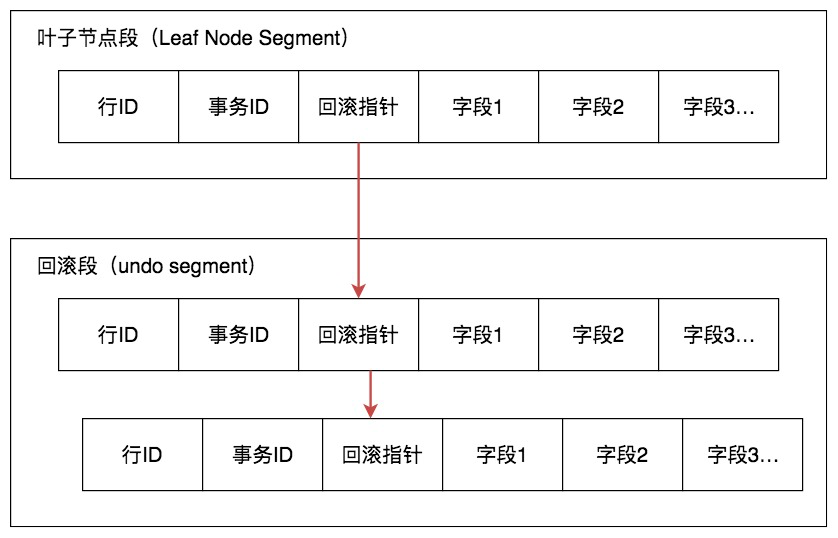

## SQL中的锁 ##

### 锁的颗粒度 ###
- 行锁、页锁和表锁是相对常见的三种锁，除此以外我们还可以在区和数据库的粒度上锁定数据，对应区锁和数据库锁。
- 不同的数据库和存储引擎支持的锁粒度不同
    1. InnoDB 和 Oracle 支持行锁和表锁
    2. MyISAM 只支持表锁
    3. MySQL 中的 BDB 存储引擎支持页锁和表锁
    4. SQL Server 可以同时支持行锁、页锁和表锁
    5. 页锁的开销介于表锁和行锁之间，会出现死锁

### 乐观锁和悲观锁 ###
- 乐观锁
    1. 适合读操作多的场景，相对来说写的操作比较少
    2. 优点在于程序实现，不存在死锁问题
    3. 它阻止不了除了程序以外的数据库操作
    4. 实现：
        - 在更新提交时，将当前数据的时间戳和更新之前取得的时间戳进行比较
        - 如果两者一致则更新成功，否则就是版本冲突。

- 悲观锁
    1. 适合写操作多的场景，因为写的操作具有排它性。
    2. 在数据库层面阻止其他事务对该数据的操作权限，防止读 - 写和写 - 写的冲突。
    3. 数据库自身锁类型
        - 共享锁：读锁或 S 锁
        - 排它锁：独占锁、写锁或 X 锁

        

- MVCC机制 ( Multiversion Concurrency Control)
    0. 解决的问题 
        - 解决读写之间阻塞的问题 - 即读不阻塞写，写不阻塞读 - 降低了死锁的概率
        - 解决一致性读的问题 - 查询数据库在某个时间点的数据时，只能看到这个时间点之前事务提交更新的结果。
    1. 核心: Undo Log+ Read View
    2. 效果：读取数据时并不需要加锁，对于写操作，也只锁定必要的行
    3. Undo Log来保存数据的历史版本，实现多版本的管理
    4. Read View 来实现管理
        - 行记录中重要的隐藏字段
            ```SQL
            -- db_row_id：隐藏的行 ID，用来生成默认聚集索引
            -- db_trx_id：操作这个数据的事务 ID，也就是最后一个对该数据进行插入或更新的事务 ID
            -- db_roll_ptr：回滚指针，也就是指向这个记录的 Undo Log 信息
            ```
                       

        - Read View 保存了当前事务开启时所有活跃（还没有提交）的事务列表，
            ```SQL
            -- Read View 保存了这个事务不应该看到的其他的事务 ID 列表
            -- Read VIew 中有几个重要的属性：
            -- 系统当前正在活跃的事务 ID 集合: trx_ids
            -- 活跃的事务中最大的事务 ID : low_limit_id
            -- 活跃的事务中最小的事务 ID : up_limit_id
            -- 创建这个 Read View 的事务 ID : creator_trx_id，
            ```
            
            ```SQL
            -- 假设当前有事务 creator_trx_id 想要读取某个行记录，这个行记录的事务 ID 为 trx_id
            -- trx_id < up_limit_id: 这行记录在这些活跃的事务创建之前就已经提交了，那么这个行记录对该事务是可见的
            -- trx_id > low_limit_id：这行记录在这些活跃的事务创建之后才创建，那么这个行记录对当前事务不可见
            -- 在(up_limit_id，low_limit_id)间，该行记录所在的事务 trx_id 在事务creator_trx_id 创建时可能处于活跃的状态
            -- 在 trx_ids 集合中进行遍历，如果 trx_id 存在于 trx_ids 集合中，事务 trx_id 处于活跃状态，不可见；否则可见

            -- 分析：两个维度交叉解决不可重复读问题，避免进行表锁，提高并发读写效率
            -- 1. 维度一：正在活跃的事务
            -- 2. 维度二：事务创建的先后顺序
            -- 3. 核心问题：在一段时间内，事务是否已经结束完成？
            ```

### 行锁的几种形式 ###
- InnoDB 三种行锁的方式 【侧重于锁的类型&范围】
    1. 记录锁：针对单个行记录添加锁。
    2. 间隙锁（Gap Locking）：锁住一个范围（索引之间的空隙），但不包括记录本身。防止幻读情况的产生。
    3. Next-Key 锁：锁住一个范围，同时锁定记录本身，相当于间隙锁 + 记录锁，可以解决幻读的问题。