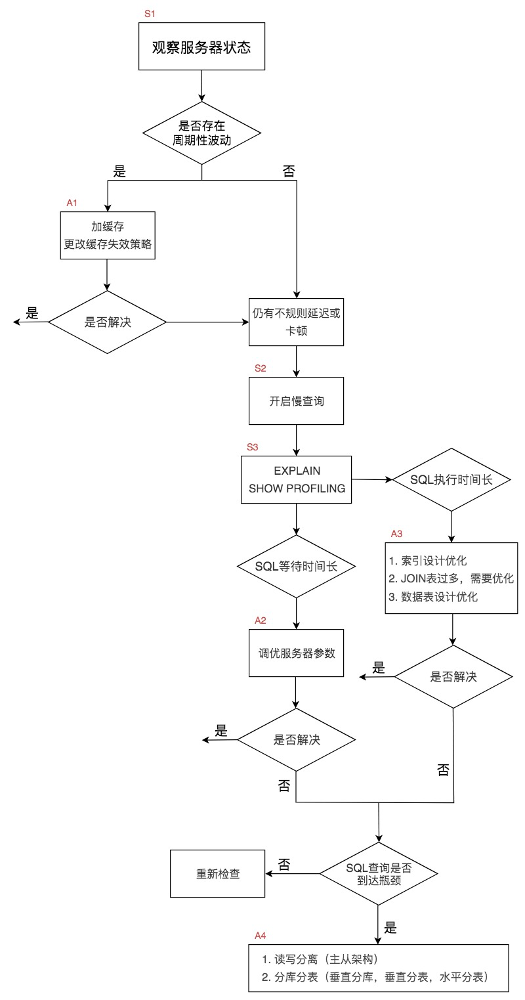

## SQL查询优化机制 ##
### SQL查询执行过程 ###
1. 一条 SQL 查询语句首先会经过分析器，进行语法分析和语义检查，最终得到一棵语法分析树，
2. 然后经过查询优化器得到查询树，最后交给执行器进行执行。

    


### SQL查询优化简介 ###
- 查询优化器中，可以分为逻辑查询优化阶段和物理查询优化阶段。
    1. 逻辑查询优化： 改变 SQL 语句的内容来使得 SQL 查询更高效，同时为物理查询优化提供更多的候选执行计划。
        - 对 SQL 语句进行等价变换，对查询进行重写
        - 查询重写的数学基础就是关系代数
        - 对条件表达式进行等价谓词重写、条件简化，对视图进行重写，对子查询进行优化
        - 对连接语义进行了外连接消除、嵌套连接消除等

    2. 物理查询优化：

        

        ```SQL
        -- 第一种是基于规则的优化器（RBO，Rule-Based Optimizer）
        -- 采用已经被证明是有效的方式。通过在优化器里面嵌入规则，来判断 SQL 查询符合哪种规则
        -- 同时采用启发式规则去掉明显不好的存取路径。

        -- 第二种是基于代价的优化器（CBO，Cost-Based Optimizer）
        -- 计算每条可能的执行计划的代价 COST，从中选择代价最小的作为执行计划。
        -- 总代价 = I/O 代价 + CPU 代价 + 内存代价 + 远程代价
        -- 缺陷，比如统计信息不准确，参数配置过高或过低，都会导致路径选择的偏差。

        -- RBO和CBO都基于规则，RBO使用静态规则，CBO使用动态规则。
        ```  
        
### SQL问题排查 ###
- 性能排查流程
    ```SQL
    -- 查看慢查询是否开启以及路径
    show variables like '%slow_query_log%';
    +---------------------+-------------------------------------------------+
    | Variable_name       | Value                                           |
    +---------------------+-------------------------------------------------+
    | slow_query_log      | OFF                                             |
    | slow_query_log_file | /var/lib/mysql/izt4n4cdll3bkkq39c21fnz-slow.log |
    +---------------------+-------------------------------------------------+
    2 rows in set (0.00 sec)

    -- 设置慢查询
    set global slow_query_log='ON';

    -- 查看慢查询时间阈值
    show variables like '%long_query_time%';
    +-----------------+-----------+
    | Variable_name   | Value     |
    +-----------------+-----------+
    | long_query_time | 10.000000 |
    +-----------------+-----------+
    1 row in set (0.04 sec)

    -- 【设置慢查询时间阈值】
    set global long_query_time = 3;
    set long_query_time = 3;
    select sleep(2);

    -- cat /var/lib/mysql/izt4n4cdll3bkkq39c21fnz-slow.log
    -- perl mysqldumpslow.pl -s t -t 2 "/var/lib/mysql/izt4n4cdll3bkkq39c21fnz-slow.log"
    -- -s：采用 order 排序的方式:
    --      c（访问次数）、t（查询时间）、l（锁定时间）、r（返回记录）、ac（平均查询次数）、al（平均锁定时间）、ar（平均返回记录数）和 at（平均查询时间）。
    -- -t：返回前 N 条数据
    -- -g：后面可以是正则表达式，对大小写不敏感。
    -- /usr/sbin/mysqld, Version: 5.6.40 (MySQL Community Server (GPL)). started with:
    -- Tcp port: 3306  Unix socket: /var/lib/mysql/mysql.sock
    -- Time                 Id Command    Argument
    -- /usr/sbin/mysqld, Version: 5.6.40 (MySQL Community Server (GPL)). started with:
    -- Tcp port: 3306  Unix socket: /var/lib/mysql/mysql.sock
    -- Time                 Id Command    Argument
    -- # Time: 200326 16:51:40
    -- # User@Host: root[root] @ localhost []  Id:     2
    -- # Query_time: 2.000261  Lock_time: 0.000000 Rows_sent: 1  Rows_examined: 0
    -- SET timestamp=1585212700;
    -- select sleep(2);

    -- 【查看语句的执行路径】
    explain select * from user;
    +----+-------------+-------+------+---------------+------+---------+------+------+-------+
    | id | select_type | table | type | possible_keys | key  | key_len | ref  | rows | Extra |
    +----+-------------+-------+------+---------------+------+---------+------+------+-------+
    |  1 | SIMPLE      | user  | ALL  | NULL          | NULL | NULL    | NULL |    7 | NULL  |
    +----+-------------+-------+------+---------------+------+---------+------+------+-------+
    1 row in set (0.00 sec)
    
    -- type: 数据表的访问类型
    --  --> ALL: 全数据表扫描
    --  --> index: 全索引扫描
    --  --> rang: 索引范围扫描
    --  --> index_merge: 合并索引
    --  --> ref 类型表示采用了非唯一索引
    --  --> eq_ref： 使用主键或唯一索引时产生的访问方式，通常使用在多表联查中。
    --  --> const：使用了主键或者唯一索引（所有的部分）与常量值进行比较
    --  --> system: 一般用于 MyISAM 或 Memory 表，const 类型的特例，当表只有一行时连接类型为 system

    -- 访问类型: all < index < range < index_merge < ref < eq_ref < const/system
    
    -- 【查看语句执行性能】
    -- 查看是否开启profiling;
    show variables like 'profiling';
    +------------------------+-------+
    | Variable_name          | Value |
    +------------------------+-------+
    | have_profiling         | YES   |
    | profiling              | OFF   |
    | profiling_history_size | 15    |
    +------------------------+-------+
    3 rows in set (0.00 sec)

    -- 设置profile
    set global profile=ON;
    set profile=ON;

    -- 查看profile
    show profiles;
    +----------+------------+-----------------------------------+
    | Query_ID | Duration   | Query                             |
    +----------+------------+-----------------------------------+
    |        1 | 0.00051075 | show variables like "%profiling%" |
    |        2 | 0.00010025 | set profiling=ON                  |
    |        3 | 0.00012850 | set profiling=ON                  |
    +----------+------------+-----------------------------------+

    show profile;
    +----------------+----------+
    | Status         | Duration |
    +----------------+----------+
    | starting       | 0.000059 |
    | Opening tables | 0.000041 |
    | query end      | 0.000005 |
    | closing tables | 0.000004 |
    | freeing items  | 0.000009 |
    | cleaning up    | 0.000012 |
    +----------------+----------+

    ```
    
