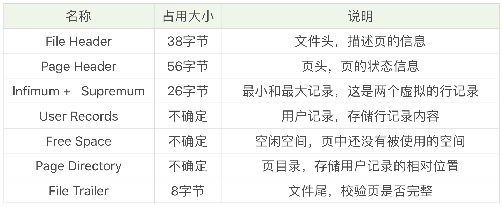
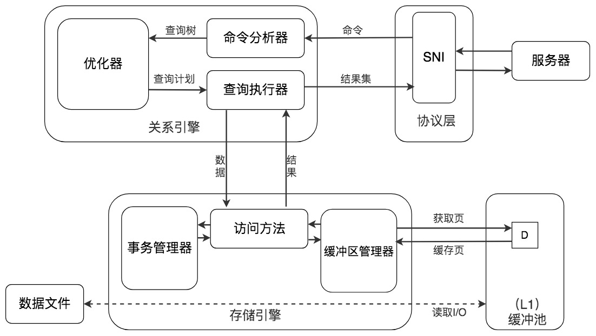

## SQL InnoDB存储相关简介 ##
> 数据库管理存储空间的基本单位是页（Page）

###  数据库中的存储结构 ###
- 行Row： 一条记录
- 页Page：
    1. 数据库一次I/O操作；
    2. 存多条记录；
    3. InnoDB 1page=16k

- 区Extent: 
    1. 连续的64个页；
    2. InnoDB 1Extent=64*16K=1M

- 段Segment: 
    0. 段是数据库中的分配单位，不同类型的数据库对象以不同的段形式存在
    1. 1个或多个区组成，区之间不要求连续
    2. 当我们创建数据表、索引的时候，就会相应创建对应的表段，索引段
    3. 一个段只能属于一个表空间

- 表空间TableSpace:
    0. 1个或多个段组成
    1. 数据库由一个或多个表空间组成
    2. 表空间从管理上可以划分为系统表空间、用户表空间、撤销表空间、临时表空间等。
    3. InnoDB 中存在两种表空间的类型：共享表空间和独立表空间
        - 共享表空间：多张表共用一个表空间。
        - 独立表空间：每张表有一个独立的表空间，也就是数据和索引信息都会保存在自己的表空间中。
        - 独立的表空间可以在不同的数据库之间进行迁移
        
    4. 查看 InnoDB 的表空间类型
        ```SQL
            -- innodb_file_per_table=ON，意味着每张表都会单独保存为一个.ibd 文件。
            show variables like 'innodb_file_per_table';
        ```

### 数据库中页内的结构 ###
- 页的类型：数据页（保存 B+ 树节点）、系统页、Undo 页和事务数据页等
- 数据页结构：
    1. 文件头&页头&文件尾
        - 文件头：有指向前一页&后一页的指针，形成双向链表
        - 文件尾：hash校验确保数据的完整性

    2. 数据记录
        - 单链表形式组织
        - 物理上是一块连续的内存
        - 实际使用过程会形成空洞

    3. 索引目录
        - 提供了二分查找的方式，用来提高数据记录的检索效率。
        - 实现类比：
        ```SQL
            a. 将所有的记录分成几个组，这些记录包括最小记录和最大记录，但不包括标记为“已删除”的记录
            b. 组长是最后一条记录的地址偏移量。【注意：数据记录是按照主键索引索引的顺序排列的】
            c. 第 1 组，也就是最小记录所在的分组只有 1 个记录
            d. 最后一组，就是最大记录所在的分组，会有 1-8 条记录
            e. 其余的组记录数量在 4-8 条之间
            f. 每个组中最后一条记录的头信息中会存储该组一共有多少条记录, n_owned 字段
            g. 对组长们进行二分查找，之后对组内成员进行遍历。
           
        ```

        

### 数据库中的索引 ###
- 数据库的索引都由B+树维护
- 在一棵 B+ 树中，每个节点都是一个页。同一层上的节点之间，通过页的结构构成一个双向的链表（页文件头中的两个指针字段）。
- 非叶子节点，包括了多个索引行，每个索引行里存储索引键和指向下一层页面的页面指针。
- 叶子节点，它存储了关键字和行记录，在节点内部（也就是页结构的内部）记录之间是一个单向的链表。
- 对叶子节点内记录进行查找，则可以通过页目录采用二分查找的方式来进行。

### InnoDb中的缓冲池机制 ###
- 将常用到的数据页缓冲在内存池中,提高读性能
- 并不是每次发生更新操作，都立刻磁盘回写。缓冲池采用checkpoint 的机制将数据回写到磁盘上
- 存储各种数据的缓存，包括了数据页，索引页，插入缓冲，锁信息，自适应Hash，数据字典信息等。
    

### 数据存取方式 ###
- 读取内存：基本上执行时间在 1ms 左右，效率还是很高的。
- 随机读取：在磁盘上对该页进行查找，整体时间预估在 10ms 左右
    1. 6ms 是磁盘的实际繁忙时间（包括了寻道和半圈旋转时间）
    2. 3ms 是对可能发生的排队时间的估计值
    3. 1ms 的传输时间，将页从磁盘服务器缓冲区传输到数据库缓冲区中

- 顺序读取：批量读取磁盘页面，因为我们请求的数据在磁盘上往往都是相邻存储的。
    1. 如果磁盘的吞吐量是 40MB/S，页大小为16KB ，一次可以读取 2560（40MB/16KB）个页。每页读取时间为 0.4ms
    2. 批量读取的方式，即使是从磁盘上进行读取，效率也比从内存中只单独读取一个页的效率要高。


