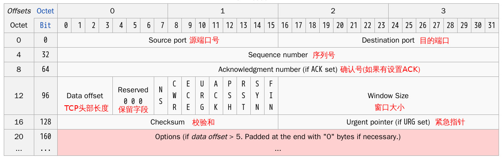

## **TCP 端口扫描**
> [端口扫描原理及实现](!https://xiaix.me/duan-kou-sao-miao-yuan-li-ji-shi-xian/)

### **TCP 头部结构**

- **标志符**
1. URG—为1表示高优先级数据包，紧急指针字段有效。  
2. ACK—为1表示确认号字段有效  
3. PSH—为1表示是带有PUSH标志的数据，指示接收方应该尽快将这个报文段交给应用层而不用等待缓冲区装满。  
4. RST—为1表示出现严重差错。可能需要重现创建TCP连接。还可以用于拒绝非法的报文段和拒绝连接请求。  
5. SYN—为1表示这是连接请求或是连接接受请求，用于创建连接和使顺序号同步。  
6. FIN—为1表示发送方没有数据要传输了，要求释放连接。 

- **选项字段**
> **最多40字节。每个选项的开始是1字节的类型字段，说明选项的类型**
1. 0：选项表结束（1字节）
2. 1：无操作（1字节）用于选项字段之间的字边界对齐。
3. 2：最大报文段长度（4字节，Maximum Segment Size，MSS）通常在创建连接而设置SYN标志的数据包中指明这个选项，指明本端所能接收的最大长度的报文段。通常将MSS设置为（MTU-40）字节，携带TCP报文段的IP数据报的长度就不会超过MTU，从而避免本机发生IP分片。只能出现在同步报文段中，否则将被忽略。
4. 3：窗口扩大因子（4字节，wscale），取值0-14。用来把TCP的窗口的值左移的位数。只能出现在同步报文段中，否则将被忽略。这是因为现在的TCP接收数据缓冲区（接收窗口）的长度通常大于65535字节。
5. 4：sackOK—发送端支持并同意使用SACK选项。
6. 5：SACK实际工作的选项。
7. 8：时间戳（10字节，TCP Timestamps Option，TSopt）发送端的时间戳（Timestamp Value field，TSval，4字节）时间戳回显应答（Timestamp Echo Reply field，TSecr，4字节）  

### **探测状态原理**
- **探测状态**
1. OPEN     ：开发，可访问，有进程监听
2. CLOSED   ：可访问，但没有程序监听，但协议栈会返回包 
3. FILTERED ：可能被防火墙了或者探测包被丢弃了
    ```sh
    # TCP-SYN 探测：
    #   a. OPEN 返回 SYN-ACK 
    #   b. CLOSED 返回 RST 
    #   c. FILTERED 啥都不反回
    ```
- **不同扫描方式**
1. TCP扫描(nmap target-host): 发送SYN，等待回应。准确性比较高但需要完成整个的三次握手流程，对于filtered的端口需要进行在timeout之前的等待，严重的拖慢了速度。
2. 半连接扫描(nmap -sS target-host): 收到了服务器发来的SYN-ACK ，则直接发送RST给服务器，中断连接，以加快扫描的速度。
3. FIN扫描(nmap -sF target-host)
    ```sh
    # 给目标端口发送一个带FIN标志位的包，开放(有服务监听的)的端口见到FIN包会将其丢弃，而CLOSED状态的端口则会照常的发送一个RST包，告知这个端口没有监听服务。
    # 缺点：FILTERED状态的端口也会直接丢弃，因此不能够区分OPEN/FILTERD两种状态的端口，只能区分这两种与CLOSED之间的区别。
    ```
4. Xmas扫描(nmap -sX target-hostXmas)
    ```sh
    # 扫描时，会将TCP中的所有标识位(ACK、FIN、RST、SYN、URG、PSH)都置为1，端口开放的时候，不会返回任何的信息，而当关闭的时候，将返回RST。
    # 缺点：这与FIN扫描十分类似，同样不能区分OPEN 和 FILTERED。
    ```
5. NULL扫描(nmap -sN target-host)： **分开Unix与windows服务器**
    ```sh
    # NULL扫描将每一个表示为都置为0
    # 缺点：Unix服务器反应与Xmas，FIN扫描一致，Windows主机的所有端口都会返回一个RST，用这一点区分开Unix与windows服务器。
    ```
6. FTP弹跳扫描(nmap -b target-host)
    ```sh
    # RFC-959支持代理FTP连接。它允许一个用户连接一个FTP服务器然后请求文件发送给第三方服务器。大多数服务器已经停止支持它了。
    # 它可以允许FTP服务器来进行其它.Idlescan机器的端口扫描。只是简单的请求FTP服务器发送一个文件给每个目标主机的感兴趣的端口一个错误报文会描述端口是否开放。
    # 这是一个好办法来绕过防火墙因为FTP服务器常常被置于可以访问比Web主机更多其它内部主机的位置
    ```
7. zmap,masscan的快速扫描方式 : 无状态扫描
    ```sh
    # zmap和masscan都号称能在xx分钟内扫描完整个IPv4，那么为什么这么快呢？
    # 传统的扫描方式是1对1的建立连接通信进行验证，而无状态的扫描就是批量的把请求撒出去，然后记录有回应的IP。 
    ```


