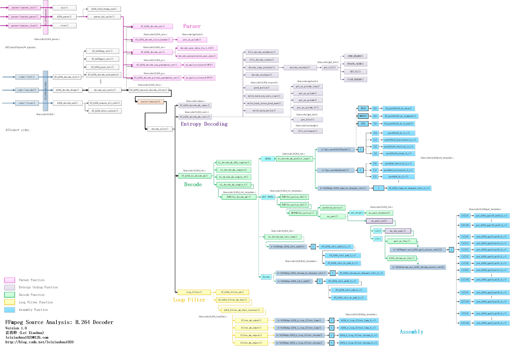

## **FFmpeg的H.264解码器源代码简单分析：概述**

```sh
# 作为接口的结构体
# FFmpeg和H.264解码器之间作为接口的结构体有2个：
# ff_h264_parser：用于解析H.264码流的AVCodecParser结构体。
# f_h264_decoder：用于解码H.264码流的AVCodec结构体。

# 函数背景色
# 函数在图中以方框的形式表现出来。不同的背景色标志了该函数不同的作用：
# 白色背景的函数：普通内部函数。
# 粉红色背景函数：解析函数（Parser）。这些函数用于解析SPS、PPS等信息。
# 紫色背景的函数：熵解码函数（Entropy Decoding）。这些函数读取码流数据并且进行CABAC或者CAVLC熵解码。
# 绿色背景的函数：解码函数（Decode）。这些函数通过帧内预测、帧间预测、DCT反变换等方法解码压缩数据。
# 黄色背景的函数：环路滤波函数（Loop Filter）。这些函数对解码后的数据进行滤波，去除方块效应。
# 蓝色背景函数：汇编函数（Assembly）。这些函数是做过汇编优化的函数。图中主要画出了这些函数的C语言版本，此外这些函数还包含MMX版本、SSE版本、NEON版本等。

# 箭头线
# 箭头线标志了函数的调用关系：
# 黑色箭头线：不加区别的调用关系。
# 粉红色的箭头线：解析函数（Parser）之间的调用关系。
# 紫色箭头线：熵解码函数（Entropy Decoding）之间的调用关系。
# 绿色箭头线：解码函数（Decode）之间的调用关系。
# 黄色箭头线：环路滤波函数（Loop Filter）之间的调用关系。
 
# 函数所在的文件
# 每个函数标识了它所在的文件路径。
```

### **A. 背景**
- H.264解码器十分重要，可以说FFmpeg项目今天可以几乎“垄断”视音频编解码技术，很大一部分贡献就来自于这个H.264解码器。
- 这个H.264解码器一方面功能强大，性能稳定；另一方面源代码也比较复杂，难以深入研究。
- 本文打算梳理一下这个H.264解码器的源代码结构，以方便以后深入学习H.264使用。

### **B. 普通内部函数**
- 普通内部函数指的是H.264解码器中还没有进行分类的函数。下面举几个例子。
1. ff_h264_decoder中ff_h264_decode_init()调用的初始化函数：
2. ff_h264dsp_init()：初始化DSP相关的函数。包含了IDCT、环路滤波函数等。
3. ff_h264qpel_init()：初始化四分之一像素运动补偿相关的函数。
4. ff_h264_pred_init()：初始化帧内预测相关的函数。
5. ff_h264_decode_extradata()：解析AVCodecContext中的extradata。
6. ff_h264_decoder中h264_decode_frame()逐层调用的和解码Slice相关的函数：decode_nal_units()，ff_h264_execute_decode_slices()，decode_slice()等。
7. ff_h264_decoder中h264_decode_end()调用的清理函数：
8. ff_h264_remove_all_refs()：移除所有参考帧。
9. ff_h264_free_context()：释放在初始化H.264解码器的时候分配的内存。
10. ff_h264_parser中h264_parse()逐层调用的和解析Slice相关的函数：
11. h264_find_frame_end()：查找NALU的结尾。
12. parse_nal_units()：解析一个NALU。

### **C. 解析函数（Parser）**
- 解析函数（Parser）用于解析H.264码流中的一些信息（例如SPS、PPS、Slice Header等）。在parse_nal_units()和decode_nal_units()中都调用这些解析函数完成了解析。下面举几个解析函数的例子。
1. ff_h264_decode_nal()：解析NALU。这个函数是后几个解析函数的前提。
2. ff_h264_decode_slice_header()：解析Slice Header。
3. ff_h264_decode_sei()：解析SEI。
4. ff_h264_decode_seq_parameter_set()：解析SPS。
5. ff_h264_decode_picture_parameter_set()：解析PPS。

### **D. 熵解码函数（Entropy Decoding 哈夫曼编码或者其他）**
- 熵解码函数（Entropy Decoding）读取码流数据并且进行CABAC或者CAVLC熵解码。
- CABAC解码函数是ff_h264_decode_mb_cabac()，CAVLC解码函数是ff_h264_decode_mb_cavlc()。
- 熵解码函数中包含了很多的读取指数哥伦布编码数据的函数，例如get_ue_golomb_long()，get_ue_golomb()，get_se_golomb()，get_ue_golomb_31()等等。
- 在获取残差数据的时候需要进行CAVLC/CABAC解码。
    ```sh
    # 例如: 解码CAVLC的时候，会调用decode_residual()函数，而decode_residual()会调用get_vlc2()函数，
    # get_vlc2()会调用OPEN_READER()，UPDATE_CACHE()，GET_VLC()，CLOSE_READER()几个函数读取CAVLC格式的数据。
    # 此外，在获取运动矢量的时候，会调用pred_motion()以及类似的几个函数获取运动矢量相关的信息。
    ```
### **E. 解码函数（Decode）**
- 解码函数（Decode）通过帧内预测、帧间预测、DCT反变换等方法解码压缩数据。
- 解码函数是ff_h264_hl_decode_mb()。其中跟宏块类型的不同，会调用几个不同的函数，最常见的就是调用hl_decode_mb_simple_8()。
    ```sh
    # hl_decode_mb_simple_8()的定义是无法在源代码中直接找到的，这是因为它实际代码的函数名称是使用宏的方式写的（以后再具体分析）。
    # hl_decode_mb_simple_8()的源代码实际上就是FUNC(hl_decode_mb)()函数的源代码。
    # FUNC(hl_decode_mb)()根据宏块类型的不同作不同的处理：
    #    如果宏块类型是INTRA，就会调用hl_decode_mb_predict_luma()进行帧内预测；
    #    如果宏块类型不是INTRA，就会调用FUNC(hl_motion_422)()或者FUNC(hl_motion_420)()进行四分之一像素运动补偿。
    #    随后FUNC(hl_decode_mb)()会调用hl_decode_mb_idct_luma()等几个函数对数据进行DCT反变换工作。
    ```

### **F. 环路滤波函数（Loop Filter）**
- 环路滤波函数（Loop Filter）对解码后的数据进行滤波，去除方块效应。环路滤波函数是loop_filter()。
    ```sh
    # A. 调用了ff_h264_filter_mb()和ff_h264_filter_mb_fast()。
    # B. ff_h264_filter_mb_fast()中又调用了h264_filter_mb_fast_internal()。
    # C. h264_filter_mb_fast_internal()中又调用了下面几个函数进行滤波：
    #       filter_mb_edgeh()：亮度水平滤波
    #       filter_mb_edgev()：亮度垂直滤波
    #       filter_mb_edgech()：色度水平滤波
    #       filter_mb_edgecv()：色度垂直滤波
    ```

### **G. 汇编函数（Assembly）**
- 汇编函数（Assembly）是做过汇编优化的函数。为了提高效率，整个H.264解码器中（主要在解码部分和环路滤波部分）包含了大量的汇编函数。
    ```sh
    # A. 实际解码的过程中，FFmpeg会根据系统的特性调用相应的汇编函数（而不是C语言函数）以提高解码的效率。
    # B. 如果系统不支持汇编优化的话，FFmpeg才会调用C语言版本的函数。
    # C. 例如在帧内预测的时候，对于16x16亮度DC模式，有以下几个版本的函数：
    #       C语言版本的pred16x16_dc_8_c()
    #       NEON版本的ff_pred16x16_dc_neon()
    #       MMXEXT版本的ff_pred16x16_dc_8_mmxext()
    #       SSE2版本的ff_pred16x16_dc_8_sse2()
    ```

### **H. 其他**
- 熵解码、宏块解码、环路滤波耗时比例分别为：23.64%、51.85%、22.22%。


