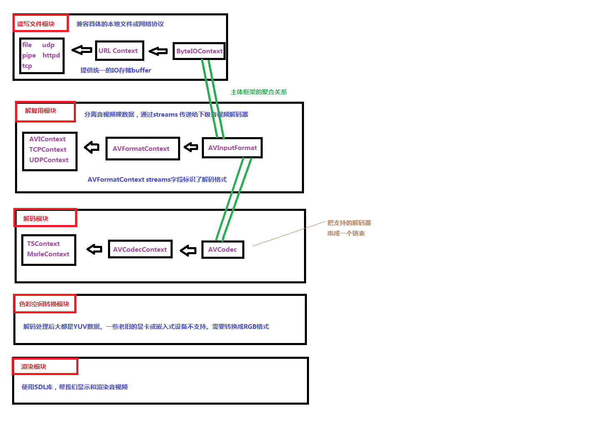

## **FFplay 代码框架简介**



### **A. FFPlay 结构体关系描述**

- **音视频编解码器: AVCodec/AVCodecContext/MsrleContext**
    1. AVCodec 是类似 COM 接口的数据结构，表示音视频编解码器，着重于功能函数，一种媒体类型对应一个AVCodec 结构，在程序运行时有多个实例。   
        next 变量用于把所有支持的编解码器连接成链表，便于遍历查找。
        ```C
        /* Leafxu: 具体编解码实现都是注入进来的 */
        typedef struct AVCodec
        {
            const char *name; // 标示 Codec 的名字, 比如，"msrle" "truespeech" 等。
            enum CodecType type; // 标示 Codec 的类型，有 Video，Audio，Data 等类型
            enum CodecID id; // 标示 Codec 的 ID，有 CODEC_ID_MSRLE，CODEC_ID_TRUESPEECH 等
            int priv_data_size; // 标示具体的 Codec 对应的 Context 的大小，在本例中是 MsrleContext
            // 或 TSContext 的大小。
            int(*init)(AVCodecContext*);// 标示 Codec 对外提供的操作
            int(*encode)(AVCodecContext *, uint8_t *buf, int buf_size, void *data);
            int(*close)(AVCodecContext*);
            int(*decode)(AVCodecContext *, void *outdata, int *outdata_size, uint8_t *buf, int buf_size);
            int capabilities; // 标示 Codec 的能力，在瘦身后的 ffplay 中没太大作用，可忽略
            struct AVCodec *next; // 用于把所有 Codec 串成一个链表，便于遍历
        } AVCodec;

        ```
    2. AVCodecContext 结构表示程序运行的当前 Codec 使用的上下文，着重于所有 Codec 共有的属性   
        (并且是在程序运行时才能确定其值)和关联其他结构的字段。
        ```C
        typedef struct AVCodecContext
        {
            int bit_rate;
            int frame_number;
            unsigned char *extradata; // Codec 的私有数据，对 Audio 是 WAVEFORMATEX 结构扩展字节。
            int extradata_size; // 对 Video 是 BITMAPINFOHEADER 后的扩展字节
            int width, height; // 此逻辑段仅针对视频
            enum PixelFormat pix_fmt;
            int sample_rate; // 此逻辑段仅针对音频
            int channels;
            int bits_per_sample;
            int block_align;
            struct AVCodec *codec; // 指向当前 AVCodec 的指针，
            void *priv_data; // 指向当前具体编解码器 Codec 的上下文 Context。
            enum CodecType codec_type; // see CODEC_TYPE_xxx
            enum CodecID codec_id; // see CODEC_ID_xxx
            int(*get_buffer)(struct AVCodecContext *c, AVFrame *pic);
            void(*release_buffer)(struct AVCodecContext *c, AVFrame *pic);
            int(*reget_buffer)(struct AVCodecContext *c, AVFrame *pic);
            int internal_buffer_count;
            void *internal_buffer;
            struct AVPaletteControl *palctrl;
        } AVCodecContext;
        ```

    3. MsrleContext 结构着重于 RLE 行程长度压缩算法独有的属性值和关联 AVCodecContext 的 avctx 字段
        ```C
        typedef struct MsrleContext
        {
            AVCodecContext *avctx;
            AVFrame frame;
            unsigned char *buf;
            int size;
        } MsrleContext;
        ```

- **文件容器格式的核心架构: AVInputFormat/AVFormatContext/AVIContext**
    1. AVInputFormat 是类似 COM 接口的数据结构，表示输入文件容器格式，着重于功能函数，一种文件容器格式对应一个 AVInputFormat 结构，在程序运行时有多个实例。  
        next 变量用于把所有支持的输入文件容器格式连接成链表
        ```C
        typedef struct AVInputFormat
        {
            const char *name;
            int priv_data_size; // 标示具体的文件容器格式对应的 Context 的大小，在本例中是 AVIContext
            int(*read_probe)(AVProbeData*);
            int(*read_header)(struct AVFormatContext *, AVFormatParameters *ap);
            int(*read_packet)(struct AVFormatContext *, AVPacket *pkt);
            int(*read_close)(struct AVFormatContext*);
            const char *extensions; // 文件扩展名
            struct AVInputFormat *next;
        } AVInputFormat;
        ```  
    2. AVFormatContext 结构表示程序运行的当前文件容器格式使用的上下文，着重于所有文件容器共有的属性  
        (并且是在程序运行时才能确定其值)和关联其他结构的字段。
        ```C
        typedef struct AVFormatContext
        {
            // formatI/O context
            struct AVInputFormat *iformat;  // 关联相应的文件容器格式
            void *priv_data;    // 指向具体的文件容器格式的上下文 Context，在本例中是 AVIContext
            ByteIOContext pb;   // 关联广义的输入文件
            int nb_streams;
            // 广泛意义的输入文件,关联音视频流 [从ByteIOContext中解析获取出数据]
            AVStream *streams[MAX_STREAMS]; 
        } AVFormatContext;
        ```

- **读取文件的核心架构: URLProtocol/URLContext(ByteIOContext)/FILE(Socket)**
    1. URLProtocol 是类似 COM 接口的数据结构，表示广义的输入文件，着重于功能函数，一种广义的输入文件对应一个 URLProtocol 结构
        ```C
        typedef struct URLProtocol
        {
            const char *name; // 便于人性化的识别理解
            int(*url_open)(URLContext *h, const char *filename, int flags);
            int(*url_read)(URLContext *h, unsigned char *buf, int size);
            int(*url_write)(URLContext *h, unsigned char *buf, int size);
            offset_t(*url_seek)(URLContext *h, offset_t pos, int whence);
            int(*url_close)(URLContext *h);
            struct URLProtocol *next;
        } URLProtocol;
        ```
    2. URLContext 结构表示程序运行的当前广义输入文件使用的上下文，着重于所有广义输入文件共有的属性  
       (并且是在程序运行时才能确定其值)和关联其他结构的字段。
        ```C
        typedef struct URLContext
        {
        struct URLProtocol *prot;  // 关联相应的广义输入文件
        int flags;
        int max_packet_size; // if non zero, the stream is packetized with this max packet size
        // 文件句柄 fd，网络通信 Scoket 等
        // specified filename
        void *priv_data;    // priv_data 字段关联各个具体广义输入文件的句柄。
        char filename[1];
        } URLContext;
        ```
    3. ByteIOContext 结构扩展 URLProtocol 结构成内部有缓冲机制的广泛意义上的文件.改善广义输入文件的 IO性能。
        ```C
        typedef struct ByteIOContext
        {
            unsigned char *buffer;
            int buffer_size;
            unsigned char *buf_ptr,*buf_end;
            void *opaque;   // 用于关联 URLContext 结构，间接关联并扩展 URLProtocol 结构。
            // 关联 URLContext
            int (*read_buf)(void *opaque, uint8_t *buf, int buf_size);
            int (*write_buf)(void *opaque, uint8_t *buf, int buf_size);
            offset_t(*seek)(void *opaque, offset_t offset, int whence);
            offset_t pos; // position in the file of the current buffer
            int must_flush;
            // true if the next seek should flush
            int eof_reached; // true if eof reached
            int write_flag;// true if open for writing
            int max_packet_size;
            int error; // contains the error code or 0 if no error happened
        } ByteIOContext;
        ```

- **读取媒体流数据: AVStream/AVIStream**
    1. AVStream 结构表示当前媒体流的上下文，着重于所有媒体流共有的属性  
        (并且是在程序运行时才能确定其值)和关联其他结构的字段。
        ```C
        typedef struct AVStream
        {
            // 解析文件容器内部使用的逻辑
            AVCodecContext *actx;   // 关联当前音视频媒体使用的编解码器
            void *priv_data;        // 关联解析各个具体媒体流与文件容器有关的独有的属性，还有一些媒体帧索引和时钟信息。
            // codec context, change fromAVCodecContext *codec;
            // AVIStream
            AVRational time_base; // 由 av_set_pts_info()函数初始化
            AVIndexEntry *index_entries; // only used if the format does not support seeking natively
            int nb_index_entries;
            int index_entries_allocated_size;
            nb_index_entries;
            index_entries_allocated_size;
            double frame_last_delay;
        } AVStream;
        ```
    2. AVIStream 结构定义了 AVI 文件中媒体流的一些属性，用于解析 AVI 文件。
        ```C
        typedef struct AVIStream
        {
            int64_t frame_offset; // currentframe(video) or byte(audio) counter(used to compute the pts)
            int remaining;
            int packet_size;
            int scale;
            int rate;
            int sample_size; // size of one sample (or packet) (in the rate/scale sense) in bytes
            int64_t cum_len; // temporary storage (used during seek)
            int prefix;      // normally 'd'<<8 + 'c' or 'w'<<8 + 'b'
            int prefix_count;
        } AVIStream;
        ```
- **音视频压缩数据流队列: AVPacket/AVPacketList/PacketQueue**
    1. 传递数据到解码器
    ```C
    // AVPacket 代表音视频数据帧，固有的属性是一些标记，时钟信息，和压缩数据首地址，大小等信息。
    typedef struct AVPacket
    {
        int64_t pts; // presentation time stamp in time_base units
        int64_t dts; // decompression time stamp in time_base units
        int64_t pos; // byte position in stream, -1 if unknown
        uint8_t *data;
        int size;
        int stream_index;
        int flags;
        void(*destruct)(struct AVPacket*);
    } AVPacket;
    ```
    2. AVPacketList 把音视频 AVPacket 组成一个小链表。
    ```C
    typedef struct AVPacketList
    {
        AVPacket pkt;
        struct AVPacketList *next;
    } AVPacketList;
    ```
    3. PacketQueue 通过小链表 AVPacketList 把音视频帧 AVPacket 组成一个顺序队列，是数据交换中转站
    ```C
    typedef struct PacketQueue
    {
        AVPacketList *first_pkt, *last_pkt;
        int size;
        int abort_request;
        SDL_mutex *mutex;   // 同步互斥控制逻辑是必不可少的。
        SDL_cond *cond;
    } PacketQueue;
    ```

- **全局整合作用: VideoState [数据结构]**
    1. VideoState数据结构把主要的数据结构整合在一起，声明成全局变量，起一个中转的作用，便于在各个子结构之间跳转，相当于一个大背景，大平台的作用。
    ```c
    typedef struct VideoState
    {
        SDL_Thread *parse_tid;
        SDL_Thread *video_tid;
        int abort_request;
        AVInputFormat *iformat;
        AVFormatContext *ic; // 关联的主要数据结构是 ByteIOContext 和 AVStream
        AVStream *audio_st;
        AVStream *video_st;
        // 关联的主要数据结构是 AVCodecContext 和 AVIStream
        int audio_stream; // 音频流索引，实际表示 AVFormatContext 结构中 AVStream *streams[]数组中的索引
        int video_stream; // 视频流索引，实际表示 AVFormatContext 结构中 AVStream *streams[]数组中的索引      
        PacketQueue audioq;    // 音频数据包队列，注意一包音频数据可能包含几个音频帧
        PacketQueue videoq;    // 视频数据包队列，注意瘦身后的 ffplay 一包视频数据是完整的一帧
        VideoPicture pictq[VIDEO_PICTURE_QUEUE_SIZE]; // 输出视频队列，瘦身后的 ffplay 只有一项
        double frame_last_delay;
        uint8_t audio_buf[(AVCODEC_MAX_AUDIO_FRAME_SIZE *3) / 2]; // 输出的音频缓存
        unsigned int audio_buf_size;
        int audio_buf_index;
        AVPacket audio_pkt;
        uint8_t *audio_pkt_data;
        int audio_pkt_size;
        // 音频包属性，只一个指针指向原始音频包数据，非直接包含音频数据包数据
        SDL_mutex *video_decoder_mutex; // 视频线程同步互斥变量
        SDL_mutex *audio_decoder_mutex; // 音频线程同步互斥变量 
        char filename[240]; // 媒体文件名
    } VideoState;
    ```
    2. 音视频数据流简单流程：
    ```sh
    # A. 由 ByteIOContext(URLContext/URLProtocol ) 表示的广义输入文件
    # B. 在 AVStream(AVIStreamt) 提供的特定文件容器流信息的指引下
    # C. 用 AVInputFormat(AVFormatContext /AVInputFormat )接口的 read_packet()函数读取完整的一帧数据，分别放到音频或视频 PacketQueue(AVPacketList/AVPacket)队列.decode_thread 线程完成。
    # D. 对于视频数据: video_thread 线程不停的从视频 PacketQueue 队列中取出视频帧，
    #       调用 AVCodec(AVCodecContext /MsrleContext)接口的 decode()函数解码视频帧，
    #       在适当延时后做颜色空间转化并调用 SDL 库显示出来。
    #
    # E. 对于音频数据: SDL 播放库播放完缓冲区的 PCM 数据后，调用sdl_audio_callback()函数解码音频数据，并把解码后的 PCM 数据填充到 SDL 音频缓存播放。
    #       当下次播放完后，再调用 sdl_audio_callback()函数解码填充，如此循环不已。
    ```
    3. decode_thread 线程的共分为三大逻辑功能
    ```sh
    # A. 首先调用 av_open_input_file()直接识别文件格式和间接识别媒体格式
    #       媒体格式是通过av_open_input_file调用 av_open_input_stream
    #       再调用 ic->iformat->read_header(ic, ap)来识别的，所以是间接识别媒体格式
    #
    # B. 调用 stream_component_open()查找打开编解码器 codec 并启动音频和视频解码线程。
    # C. 再接着解析文件，分离音视频数据包，排序进入队列。
    ```


