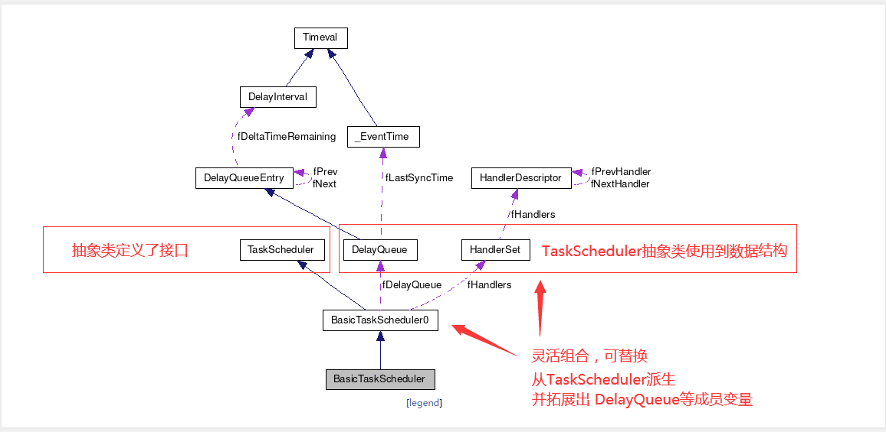

## **Live555 工程角度代码结构分析**
> 引子：如何阅读源码？

 - **UsageEnvironment 和TaskScheduler** 类用于事件的调度，实现异步读取事件的句柄的设置以及错误信息的输出
 - **Groupsock** 类是对网络接口的封装，用于收发数据包。主要是面向多播数据的收发的，它也同时支持单播数据的收发
 - **liveMedia** 库中有一系列类，基类是Medium，这些类针对不同的流媒体类型和编码

### **基类1.TasKScheduler**
> 引子：调度器一般哪些功能？   

      

    

### **基类2.UsageEnvironment**

 

### **基类3.GroupSocket** 

 

### **基类4.Medium**
> **把 Medium 放到不同的 envir 里;要点；C++ 静态成员函数 - 性能 - 包裹调用.**   

