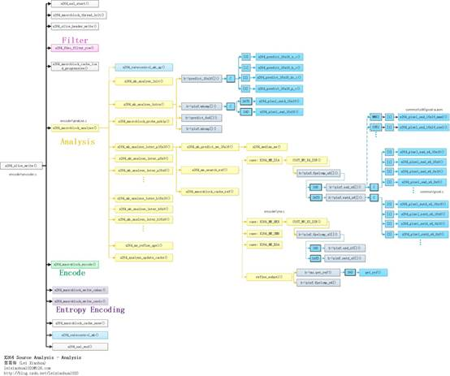

## **Libx264 宏块分析 - 帧内宏块**
> **x264_macroblock_analyse()对应着x264中的分析模块**


```sh
x264_mb_analyse_init()：Analysis模块初始化。  
x264_mb_analyse_intra()：Intra宏块帧内预测模式分析。  
x264_macroblock_probe_pskip()：分析是否是skip模式。  
x264_mb_analyse_inter_p16x16()：P16x16宏块帧间预测模式分析。  
x264_mb_analyse_inter_p8x8()：P8x8宏块帧间预测模式分析。  
x264_mb_analyse_inter_p16x8()：P16x8宏块帧间预测模式分析。  
x264_mb_analyse_inter_b16x16()：B16x16宏块帧间预测模式分析。  
x264_mb_analyse_inter_b8x8()：B8x8宏块帧间预测模式分析。  
x264_mb_analyse_inter_b16x8()：B16x8宏块帧间预测模式分析。  
```

- **宏块分析种类**
    1. 对于帧内宏块，分析帧内预测模式
    2. 对于帧间宏块，进行运动估计，分析帧间预测模式

- **x264_macroblock_analyse()**
    1. 【QP量化参数，是宏块的一个属性，于计算环路滤波的门限值alpha和beta】
    2. 【帧与宏块的关系】P帧：计算帧内模式和帧间模式（ P Slice允许有Intra宏块和P宏块；同理B帧也支持Intra宏块）
        ```c
        /****************************************************************************
         * 分析-帧内预测模式选择、帧间运动估计等
         *
         * 注释和处理：雷霄骅
         * http://blog.csdn.net/leixiaohua1020
         * leixiaohua1020@126.com
         ****************************************************************************/
        void x264_macroblock_analyse( x264_t *h )
        {
            x264_mb_analysis_t analysis;
            int i_cost = COST_MAX;
            //通过码率控制方法，获取本宏块QP
            h->mb.i_qp = x264_ratecontrol_mb_qp( h );
            /* If the QP of this MB is within 1 of the previous MB, code the same QP as the previous MB,
            * to lower the bit cost of the qp_delta.  Don't do this if QPRD is enabled. */
            if( h->param.rc.i_aq_mode && h->param.analyse.i_subpel_refine < 10 )
                h->mb.i_qp = abs(h->mb.i_qp - h->mb.i_last_qp) == 1 ? h->mb.i_last_qp : h->mb.i_qp;
        
            if( h->param.analyse.b_mb_info )
                h->fdec->effective_qp[h->mb.i_mb_xy] = h->mb.i_qp; /* Store the real analysis QP. */
            //初始化
            x264_mb_analyse_init( h, &analysis, h->mb.i_qp );
        
            /*--------------------------- Do the analysis ---------------------------*/
            //I帧：只使用帧内预测，分别计算亮度16x16（4种）和4x4（9种）所有模式的代价值，选出代价最小的模式。
        
            //P帧：计算帧内模式和帧间模式（ P Slice允许有Intra宏块和P宏块；同理B帧也支持Intra宏块）。
            //对P帧的每一种分割进行帧间预测，得到最佳的运动矢量及最佳匹配块。
            //帧间预测过程：选出最佳矢量——>找到最佳的整像素点——>找到最佳的二分之一像素点——>找到最佳的1/4像素点
            //然后取代价最小的为最佳MV和分割方式
            //最后从帧内模式和帧间模式中选择代价比较小的方式（有可能没有找到很好的匹配块，这时候就直接使用帧内预测而不是帧间预测）。
        
            if( h->sh.i_type == SLICE_TYPE_I )
            {
                //I slice
                //通过一系列帧内预测模式（16x16的4种,4x4的9种）代价的计算得出代价最小的最优模式
        intra_analysis:
                if( analysis.i_mbrd )
                    x264_mb_init_fenc_cache( h, analysis.i_mbrd >= 2 );
                //帧内预测分析
                //从16×16的SAD,4个8×8的SAD和，16个4×4SAD中选出最优方式
                x264_mb_analyse_intra( h, &analysis, COST_MAX );
                if( analysis.i_mbrd )
                    x264_intra_rd( h, &analysis, COST_MAX );
                //分析结果都存储在analysis结构体中
                //开销
                i_cost = analysis.i_satd_i16x16;
                h->mb.i_type = I_16x16;
                //如果I4x4或者I8x8开销更小的话就拷贝
                //copy if little
                COPY2_IF_LT( i_cost, analysis.i_satd_i4x4, h->mb.i_type, I_4x4 );
                COPY2_IF_LT( i_cost, analysis.i_satd_i8x8, h->mb.i_type, I_8x8 );
                //画面极其特殊的时候，才有可能用到PCM
                if( analysis.i_satd_pcm < i_cost )
                    h->mb.i_type = I_PCM;
        
                else if( analysis.i_mbrd >= 2 )
                    x264_intra_rd_refine( h, &analysis );
            }
            else if( h->sh.i_type == SLICE_TYPE_P )
            {
                //P slice
        
                int b_skip = 0;
        
                h->mc.prefetch_ref( h->mb.pic.p_fref[0][0][h->mb.i_mb_x&3], h->mb.pic.i_stride[0], 0 );
        
                analysis.b_try_skip = 0;
                if( analysis.b_force_intra )
                {
                    if( !h->param.analyse.b_psy )
                    {
                        x264_mb_analyse_init_qp( h, &analysis, X264_MAX( h->mb.i_qp - h->mb.ip_offset, h->param.rc.i_qp_min ) );
                        goto intra_analysis;
                    }
                }
                else
                {
                    /* Special fast-skip logic using information from mb_info. */
                    if( h->fdec->mb_info && (h->fdec->mb_info[h->mb.i_mb_xy]&X264_MBINFO_CONSTANT) )
                    {
                        if( !SLICE_MBAFF && (h->fdec->i_frame - h->fref[0][0]->i_frame) == 1 && !h->sh.b_weighted_pred &&
                            h->fref[0][0]->effective_qp[h->mb.i_mb_xy] <= h->mb.i_qp )
                        {
                            h->mb.i_partition = D_16x16;
                            /* Use the P-SKIP MV if we can... */
                            if( !M32(h->mb.cache.pskip_mv) )
                            {
                                b_skip = 1;
                                h->mb.i_type = P_SKIP;
                            }
                            /* Otherwise, just force a 16x16 block. */
                            else
                            {
                                h->mb.i_type = P_L0;
                                analysis.l0.me16x16.i_ref = 0;
                                M32( analysis.l0.me16x16.mv ) = 0;
                            }
                            goto skip_analysis;
                        }
                        /* Reset the information accordingly */
                        else if( h->param.analyse.b_mb_info_update )
                            h->fdec->mb_info[h->mb.i_mb_xy] &= ~X264_MBINFO_CONSTANT;
                    }
        
                    int skip_invalid = h->i_thread_frames > 1 && h->mb.cache.pskip_mv[1] > h->mb.mv_max_spel[1];
                    /* If the current macroblock is off the frame, just skip it. */
                    if( HAVE_INTERLACED && !MB_INTERLACED && h->mb.i_mb_y * 16 >= h->param.i_height && !skip_invalid )
                        b_skip = 1;
                    /* Fast P_SKIP detection */
                    else if( h->param.analyse.b_fast_pskip )
                    {
                        if( skip_invalid )
                            // FIXME don't need to check this if the reference frame is done
                            {}
                        else if( h->param.analyse.i_subpel_refine >= 3 )
                            analysis.b_try_skip = 1;
                        else if( h->mb.i_mb_type_left[0] == P_SKIP ||
                                h->mb.i_mb_type_top == P_SKIP ||
                                h->mb.i_mb_type_topleft == P_SKIP ||
                                h->mb.i_mb_type_topright == P_SKIP )
                            b_skip = x264_macroblock_probe_pskip( h );//检查是否是Skip类型
                    }
                }
        
                h->mc.prefetch_ref( h->mb.pic.p_fref[0][0][h->mb.i_mb_x&3], h->mb.pic.i_stride[0], 1 );
        
                if( b_skip )
                {
                    h->mb.i_type = P_SKIP;
                    h->mb.i_partition = D_16x16;
                    assert( h->mb.cache.pskip_mv[1] <= h->mb.mv_max_spel[1] || h->i_thread_frames == 1 );
        skip_analysis:
                    /* Set up MVs for future predictors */
                    for( int i = 0; i < h->mb.pic.i_fref[0]; i++ )
                        M32( h->mb.mvr[0][i][h->mb.i_mb_xy] ) = 0;
                }
                else
                {
                    const unsigned int flags = h->param.analyse.inter;
                    int i_type;
                    int i_partition;
                    int i_satd_inter, i_satd_intra;
        
                    x264_mb_analyse_load_costs( h, &analysis );
                    /*
                    * 16x16 帧间预测宏块分析-P
                    *
                    * +--------+--------+
                    * |                 |
                    * |                 |
                    * |                 |
                    * +        +        +
                    * |                 |
                    * |                 |
                    * |                 |
                    * +--------+--------+
                    *
                    */
                    x264_mb_analyse_inter_p16x16( h, &analysis );
        
                    if( h->mb.i_type == P_SKIP )
                    {
                        for( int i = 1; i < h->mb.pic.i_fref[0]; i++ )
                            M32( h->mb.mvr[0][i][h->mb.i_mb_xy] ) = 0;
                        return;
                    }
        
                    if( flags & X264_ANALYSE_PSUB16x16 )
                    {
                        if( h->param.analyse.b_mixed_references )
                            x264_mb_analyse_inter_p8x8_mixed_ref( h, &analysis );
                        else{
                            /*
                            * 8x8帧间预测宏块分析-P
                            * +--------+
                            * |        |
                            * |        |
                            * |        |
                            * +--------+
                            */
                            x264_mb_analyse_inter_p8x8( h, &analysis );
                        }
                    }
        
                    /* Select best inter mode */
                    i_type = P_L0;
                    i_partition = D_16x16;
                    i_cost = analysis.l0.me16x16.cost;
        
                    //如果8x8的代价值小于16x16
                    //则进行8x8子块分割的处理
        
                    //处理的数据源自于l0
                    if( ( flags & X264_ANALYSE_PSUB16x16 ) && (!analysis.b_early_terminate ||
                        analysis.l0.i_cost8x8 < analysis.l0.me16x16.cost) )
                    {
                        i_type = P_8x8;
                        i_partition = D_8x8;
                        i_cost = analysis.l0.i_cost8x8;
        
                        /* Do sub 8x8 */
                        if( flags & X264_ANALYSE_PSUB8x8 )
                        {
                            for( int i = 0; i < 4; i++ )
                            {
                                //8x8块的子块的分析
                                /*
                                * 4x4
                                * +----+----+
                                * |    |    |
                                * +----+----+
                                * |    |    |
                                * +----+----+
                                *
                                */
                                x264_mb_analyse_inter_p4x4( h, &analysis, i );
                                int i_thresh8x4 = analysis.l0.me4x4[i][1].cost_mv + analysis.l0.me4x4[i][2].cost_mv;
                                //如果4x4小于8x8
                                //则再分析8x4，4x8的代价
                                if( !analysis.b_early_terminate || analysis.l0.i_cost4x4[i] < analysis.l0.me8x8[i].cost + i_thresh8x4 )
                                {
                                    int i_cost8x8 = analysis.l0.i_cost4x4[i];
                                    h->mb.i_sub_partition[i] = D_L0_4x4;
                                    /*
                                    * 8x4
                                    * +----+----+
                                    * |         |
                                    * +----+----+
                                    * |         |
                                    * +----+----+
                                    *
                                    */
                                    //如果8x4小于8x8
                                    x264_mb_analyse_inter_p8x4( h, &analysis, i );
                                    COPY2_IF_LT( i_cost8x8, analysis.l0.i_cost8x4[i],
                                                h->mb.i_sub_partition[i], D_L0_8x4 );
                                    /*
                                    * 4x8
                                    * +----+----+
                                    * |    |    |
                                    * +    +    +
                                    * |    |    |
                                    * +----+----+
                                    *
                                    */
                                    //如果4x8小于8x8
                                    x264_mb_analyse_inter_p4x8( h, &analysis, i );
                                    COPY2_IF_LT( i_cost8x8, analysis.l0.i_cost4x8[i],
                                                h->mb.i_sub_partition[i], D_L0_4x8 );
        
                                    i_cost += i_cost8x8 - analysis.l0.me8x8[i].cost;
                                }
                                x264_mb_cache_mv_p8x8( h, &analysis, i );
                            }
                            analysis.l0.i_cost8x8 = i_cost;
                        }
                    }
        
                    /* Now do 16x8/8x16 */
                    int i_thresh16x8 = analysis.l0.me8x8[1].cost_mv + analysis.l0.me8x8[2].cost_mv;
        
                    //前提要求8x8的代价值小于16x16
                    if( ( flags & X264_ANALYSE_PSUB16x16 ) && (!analysis.b_early_terminate ||
                        analysis.l0.i_cost8x8 < analysis.l0.me16x16.cost + i_thresh16x8) )
                    {
                        int i_avg_mv_ref_cost = (analysis.l0.me8x8[2].cost_mv + analysis.l0.me8x8[2].i_ref_cost
                                            + analysis.l0.me8x8[3].cost_mv + analysis.l0.me8x8[3].i_ref_cost + 1) >> 1;
                        analysis.i_cost_est16x8[1] = analysis.i_satd8x8[0][2] + analysis.i_satd8x8[0][3] + i_avg_mv_ref_cost;
                        /*
                        * 16x8 宏块划分
                        *
                        * +--------+--------+
                        * |        |        |
                        * |        |        |
                        * |        |        |
                        * +--------+--------+
                        *
                        */
                        x264_mb_analyse_inter_p16x8( h, &analysis, i_cost );
                        COPY3_IF_LT( i_cost, analysis.l0.i_cost16x8, i_type, P_L0, i_partition, D_16x8 );
        
                        i_avg_mv_ref_cost = (analysis.l0.me8x8[1].cost_mv + analysis.l0.me8x8[1].i_ref_cost
                                        + analysis.l0.me8x8[3].cost_mv + analysis.l0.me8x8[3].i_ref_cost + 1) >> 1;
                        analysis.i_cost_est8x16[1] = analysis.i_satd8x8[0][1] + analysis.i_satd8x8[0][3] + i_avg_mv_ref_cost;
                        /*
                        * 8x16 宏块划分
                        *
                        * +--------+
                        * |        |
                        * |        |
                        * |        |
                        * +--------+
                        * |        |
                        * |        |
                        * |        |
                        * +--------+
                        *
                        */
                        x264_mb_analyse_inter_p8x16( h, &analysis, i_cost );
                        COPY3_IF_LT( i_cost, analysis.l0.i_cost8x16, i_type, P_L0, i_partition, D_8x16 );
                    }
        
                    h->mb.i_partition = i_partition;
        
                    /* refine qpel */
                    //亚像素精度搜索
                    //FIXME mb_type costs?
                    if( analysis.i_mbrd || !h->mb.i_subpel_refine )
                    {
                        /* refine later */
                    }
                    else if( i_partition == D_16x16 )
                    {
                        x264_me_refine_qpel( h, &analysis.l0.me16x16 );
                        i_cost = analysis.l0.me16x16.cost;
                    }
                    else if( i_partition == D_16x8 )
                    {
                        x264_me_refine_qpel( h, &analysis.l0.me16x8[0] );
                        x264_me_refine_qpel( h, &analysis.l0.me16x8[1] );
                        i_cost = analysis.l0.me16x8[0].cost + analysis.l0.me16x8[1].cost;
                    }
                    else if( i_partition == D_8x16 )
                    {
                        x264_me_refine_qpel( h, &analysis.l0.me8x16[0] );
                        x264_me_refine_qpel( h, &analysis.l0.me8x16[1] );
                        i_cost = analysis.l0.me8x16[0].cost + analysis.l0.me8x16[1].cost;
                    }
                    else if( i_partition == D_8x8 )
                    {
                        i_cost = 0;
                        for( int i8x8 = 0; i8x8 < 4; i8x8++ )
                        {
                            switch( h->mb.i_sub_partition[i8x8] )
                            {
                                case D_L0_8x8:
                                    x264_me_refine_qpel( h, &analysis.l0.me8x8[i8x8] );
                                    i_cost += analysis.l0.me8x8[i8x8].cost;
                                    break;
                                case D_L0_8x4:
                                    x264_me_refine_qpel( h, &analysis.l0.me8x4[i8x8][0] );
                                    x264_me_refine_qpel( h, &analysis.l0.me8x4[i8x8][1] );
                                    i_cost += analysis.l0.me8x4[i8x8][0].cost +
                                            analysis.l0.me8x4[i8x8][1].cost;
                                    break;
                                case D_L0_4x8:
                                    x264_me_refine_qpel( h, &analysis.l0.me4x8[i8x8][0] );
                                    x264_me_refine_qpel( h, &analysis.l0.me4x8[i8x8][1] );
                                    i_cost += analysis.l0.me4x8[i8x8][0].cost +
                                            analysis.l0.me4x8[i8x8][1].cost;
                                    break;
        
                                case D_L0_4x4:
                                    x264_me_refine_qpel( h, &analysis.l0.me4x4[i8x8][0] );
                                    x264_me_refine_qpel( h, &analysis.l0.me4x4[i8x8][1] );
                                    x264_me_refine_qpel( h, &analysis.l0.me4x4[i8x8][2] );
                                    x264_me_refine_qpel( h, &analysis.l0.me4x4[i8x8][3] );
                                    i_cost += analysis.l0.me4x4[i8x8][0].cost +
                                            analysis.l0.me4x4[i8x8][1].cost +
                                            analysis.l0.me4x4[i8x8][2].cost +
                                            analysis.l0.me4x4[i8x8][3].cost;
                                    break;
                                default:
                                    x264_log( h, X264_LOG_ERROR, "internal error (!8x8 && !4x4)\n" );
                                    break;
                            }
                        }
                    }
        
                    if( h->mb.b_chroma_me )
                    {
                        if( CHROMA444 )
                        {
                            x264_mb_analyse_intra( h, &analysis, i_cost );
                            x264_mb_analyse_intra_chroma( h, &analysis );
                        }
                        else
                        {
                            x264_mb_analyse_intra_chroma( h, &analysis );
                            x264_mb_analyse_intra( h, &analysis, i_cost - analysis.i_satd_chroma );
                        }
                        analysis.i_satd_i16x16 += analysis.i_satd_chroma;
                        analysis.i_satd_i8x8   += analysis.i_satd_chroma;
                        analysis.i_satd_i4x4   += analysis.i_satd_chroma;
                    }
                    else
                        x264_mb_analyse_intra( h, &analysis, i_cost );//P Slice中也允许有Intra宏块，所以也要进行分析
        
                    i_satd_inter = i_cost;
                    i_satd_intra = X264_MIN3( analysis.i_satd_i16x16,
                                            analysis.i_satd_i8x8,
                                            analysis.i_satd_i4x4 );
        
                    if( analysis.i_mbrd )
                    {
                        x264_mb_analyse_p_rd( h, &analysis, X264_MIN(i_satd_inter, i_satd_intra) );
                        i_type = P_L0;
                        i_partition = D_16x16;
                        i_cost = analysis.l0.i_rd16x16;
                        COPY2_IF_LT( i_cost, analysis.l0.i_cost16x8, i_partition, D_16x8 );
                        COPY2_IF_LT( i_cost, analysis.l0.i_cost8x16, i_partition, D_8x16 );
                        COPY3_IF_LT( i_cost, analysis.l0.i_cost8x8, i_partition, D_8x8, i_type, P_8x8 );
                        h->mb.i_type = i_type;
                        h->mb.i_partition = i_partition;
                        if( i_cost < COST_MAX )
                            x264_mb_analyse_transform_rd( h, &analysis, &i_satd_inter, &i_cost );
                        x264_intra_rd( h, &analysis, i_satd_inter * 5/4 + 1 );
                    }
                    //获取最小的代价
                    COPY2_IF_LT( i_cost, analysis.i_satd_i16x16, i_type, I_16x16 );
                    COPY2_IF_LT( i_cost, analysis.i_satd_i8x8, i_type, I_8x8 );
                    COPY2_IF_LT( i_cost, analysis.i_satd_i4x4, i_type, I_4x4 );
                    COPY2_IF_LT( i_cost, analysis.i_satd_pcm, i_type, I_PCM );
        
                    h->mb.i_type = i_type;
        
                    if( analysis.b_force_intra && !IS_INTRA(i_type) )
                    {
                        /* Intra masking: copy fdec to fenc and re-encode the block as intra in order to make it appear as if
                        * it was an inter block. */
                        x264_analyse_update_cache( h, &analysis );
                        x264_macroblock_encode( h );
                        for( int p = 0; p < (CHROMA444 ? 3 : 1); p++ )
                            h->mc.copy[PIXEL_16x16]( h->mb.pic.p_fenc[p], FENC_STRIDE, h->mb.pic.p_fdec[p], FDEC_STRIDE, 16 );
                        if( !CHROMA444 )
                        {
                            int height = 16 >> CHROMA_V_SHIFT;
                            h->mc.copy[PIXEL_8x8]  ( h->mb.pic.p_fenc[1], FENC_STRIDE, h->mb.pic.p_fdec[1], FDEC_STRIDE, height );
                            h->mc.copy[PIXEL_8x8]  ( h->mb.pic.p_fenc[2], FENC_STRIDE, h->mb.pic.p_fdec[2], FDEC_STRIDE, height );
                        }
                        x264_mb_analyse_init_qp( h, &analysis, X264_MAX( h->mb.i_qp - h->mb.ip_offset, h->param.rc.i_qp_min ) );
                        goto intra_analysis;
                    }
        
                    if( analysis.i_mbrd >= 2 && h->mb.i_type != I_PCM )
                    {
                        if( IS_INTRA( h->mb.i_type ) )
                        {
                            x264_intra_rd_refine( h, &analysis );
                        }
                        else if( i_partition == D_16x16 )
                        {
                            x264_macroblock_cache_ref( h, 0, 0, 4, 4, 0, analysis.l0.me16x16.i_ref );
                            analysis.l0.me16x16.cost = i_cost;
                            x264_me_refine_qpel_rd( h, &analysis.l0.me16x16, analysis.i_lambda2, 0, 0 );
                        }
                        else if( i_partition == D_16x8 )
                        {
                            h->mb.i_sub_partition[0] = h->mb.i_sub_partition[1] =
                            h->mb.i_sub_partition[2] = h->mb.i_sub_partition[3] = D_L0_8x8;
                            x264_macroblock_cache_ref( h, 0, 0, 4, 2, 0, analysis.l0.me16x8[0].i_ref );
                            x264_macroblock_cache_ref( h, 0, 2, 4, 2, 0, analysis.l0.me16x8[1].i_ref );
                            x264_me_refine_qpel_rd( h, &analysis.l0.me16x8[0], analysis.i_lambda2, 0, 0 );
                            x264_me_refine_qpel_rd( h, &analysis.l0.me16x8[1], analysis.i_lambda2, 8, 0 );
                        }
                        else if( i_partition == D_8x16 )
                        {
                            h->mb.i_sub_partition[0] = h->mb.i_sub_partition[1] =
                            h->mb.i_sub_partition[2] = h->mb.i_sub_partition[3] = D_L0_8x8;
                            x264_macroblock_cache_ref( h, 0, 0, 2, 4, 0, analysis.l0.me8x16[0].i_ref );
                            x264_macroblock_cache_ref( h, 2, 0, 2, 4, 0, analysis.l0.me8x16[1].i_ref );
                            x264_me_refine_qpel_rd( h, &analysis.l0.me8x16[0], analysis.i_lambda2, 0, 0 );
                            x264_me_refine_qpel_rd( h, &analysis.l0.me8x16[1], analysis.i_lambda2, 4, 0 );
                        }
                        else if( i_partition == D_8x8 )
                        {
                            x264_analyse_update_cache( h, &analysis );
                            for( int i8x8 = 0; i8x8 < 4; i8x8++ )
                            {
                                if( h->mb.i_sub_partition[i8x8] == D_L0_8x8 )
                                {
                                    x264_me_refine_qpel_rd( h, &analysis.l0.me8x8[i8x8], analysis.i_lambda2, i8x8*4, 0 );
                                }
                                else if( h->mb.i_sub_partition[i8x8] == D_L0_8x4 )
                                {
                                    x264_me_refine_qpel_rd( h, &analysis.l0.me8x4[i8x8][0], analysis.i_lambda2, i8x8*4+0, 0 );
                                    x264_me_refine_qpel_rd( h, &analysis.l0.me8x4[i8x8][1], analysis.i_lambda2, i8x8*4+2, 0 );
                                }
                                else if( h->mb.i_sub_partition[i8x8] == D_L0_4x8 )
                                {
                                    x264_me_refine_qpel_rd( h, &analysis.l0.me4x8[i8x8][0], analysis.i_lambda2, i8x8*4+0, 0 );
                                    x264_me_refine_qpel_rd( h, &analysis.l0.me4x8[i8x8][1], analysis.i_lambda2, i8x8*4+1, 0 );
                                }
                                else if( h->mb.i_sub_partition[i8x8] == D_L0_4x4 )
                                {
                                    x264_me_refine_qpel_rd( h, &analysis.l0.me4x4[i8x8][0], analysis.i_lambda2, i8x8*4+0, 0 );
                                    x264_me_refine_qpel_rd( h, &analysis.l0.me4x4[i8x8][1], analysis.i_lambda2, i8x8*4+1, 0 );
                                    x264_me_refine_qpel_rd( h, &analysis.l0.me4x4[i8x8][2], analysis.i_lambda2, i8x8*4+2, 0 );
                                    x264_me_refine_qpel_rd( h, &analysis.l0.me4x4[i8x8][3], analysis.i_lambda2, i8x8*4+3, 0 );
                                }
                            }
                        }
                    }
                }
            }
            else if( h->sh.i_type == SLICE_TYPE_B )//B Slice的时候
            {
                int i_bskip_cost = COST_MAX;
                int b_skip = 0;
        
                if( analysis.i_mbrd )
                    x264_mb_init_fenc_cache( h, analysis.i_mbrd >= 2 );
        
                h->mb.i_type = B_SKIP;
                if( h->mb.b_direct_auto_write )
                {
                    /* direct=auto heuristic: prefer whichever mode allows more Skip macroblocks */
                    for( int i = 0; i < 2; i++ )
                    {
                        int b_changed = 1;
                        h->sh.b_direct_spatial_mv_pred ^= 1;
                        analysis.b_direct_available = x264_mb_predict_mv_direct16x16( h, i && analysis.b_direct_available ? &b_changed : NULL );
                        if( analysis.b_direct_available )
                        {
                            if( b_changed )
                            {
                                x264_mb_mc( h );
                                b_skip = x264_macroblock_probe_bskip( h );
                            }
                            h->stat.frame.i_direct_score[ h->sh.b_direct_spatial_mv_pred ] += b_skip;
                        }
                        else
                            b_skip = 0;
                    }
                }
                else
                    analysis.b_direct_available = x264_mb_predict_mv_direct16x16( h, NULL );
        
                analysis.b_try_skip = 0;
                if( analysis.b_direct_available )
                {
                    if( !h->mb.b_direct_auto_write )
                        x264_mb_mc( h );
                    /* If the current macroblock is off the frame, just skip it. */
                    if( HAVE_INTERLACED && !MB_INTERLACED && h->mb.i_mb_y * 16 >= h->param.i_height )
                        b_skip = 1;
                    else if( analysis.i_mbrd )
                    {
                        i_bskip_cost = ssd_mb( h );
                        /* 6 = minimum cavlc cost of a non-skipped MB */
                        b_skip = h->mb.b_skip_mc = i_bskip_cost <= ((6 * analysis.i_lambda2 + 128) >> 8);
                    }
                    else if( !h->mb.b_direct_auto_write )
                    {
                        /* Conditioning the probe on neighboring block types
                        * doesn't seem to help speed or quality. */
                        analysis.b_try_skip = x264_macroblock_probe_bskip( h );
                        if( h->param.analyse.i_subpel_refine < 3 )
                            b_skip = analysis.b_try_skip;
                    }
                    /* Set up MVs for future predictors */
                    if( b_skip )
                    {
                        for( int i = 0; i < h->mb.pic.i_fref[0]; i++ )
                            M32( h->mb.mvr[0][i][h->mb.i_mb_xy] ) = 0;
                        for( int i = 0; i < h->mb.pic.i_fref[1]; i++ )
                            M32( h->mb.mvr[1][i][h->mb.i_mb_xy] ) = 0;
                    }
                }
        
                if( !b_skip )
                {
                    const unsigned int flags = h->param.analyse.inter;
                    int i_type;
                    int i_partition;
                    int i_satd_inter;
                    h->mb.b_skip_mc = 0;
                    h->mb.i_type = B_DIRECT;
        
                    x264_mb_analyse_load_costs( h, &analysis );
        
                    /* select best inter mode */
                    /* direct must be first */
                    if( analysis.b_direct_available )
                        x264_mb_analyse_inter_direct( h, &analysis );
                    /*
                    * 16x16 帧间预测宏块分析-B
                    *
                    * +--------+--------+
                    * |                 |
                    * |                 |
                    * |                 |
                    * +        +        +
                    * |                 |
                    * |                 |
                    * |                 |
                    * +--------+--------+
                    *
                    */
                    x264_mb_analyse_inter_b16x16( h, &analysis );
        
                    if( h->mb.i_type == B_SKIP )
                    {
                        for( int i = 1; i < h->mb.pic.i_fref[0]; i++ )
                            M32( h->mb.mvr[0][i][h->mb.i_mb_xy] ) = 0;
                        for( int i = 1; i < h->mb.pic.i_fref[1]; i++ )
                            M32( h->mb.mvr[1][i][h->mb.i_mb_xy] ) = 0;
                        return;
                    }
        
                    i_type = B_L0_L0;
                    i_partition = D_16x16;
                    i_cost = analysis.l0.me16x16.cost;
                    COPY2_IF_LT( i_cost, analysis.l1.me16x16.cost, i_type, B_L1_L1 );
                    COPY2_IF_LT( i_cost, analysis.i_cost16x16bi, i_type, B_BI_BI );
                    COPY2_IF_LT( i_cost, analysis.i_cost16x16direct, i_type, B_DIRECT );
        
                    if( analysis.i_mbrd && analysis.b_early_terminate && analysis.i_cost16x16direct <= i_cost * 33/32 )
                    {
                        x264_mb_analyse_b_rd( h, &analysis, i_cost );
                        if( i_bskip_cost < analysis.i_rd16x16direct &&
                            i_bskip_cost < analysis.i_rd16x16bi &&
                            i_bskip_cost < analysis.l0.i_rd16x16 &&
                            i_bskip_cost < analysis.l1.i_rd16x16 )
                        {
                            h->mb.i_type = B_SKIP;
                            x264_analyse_update_cache( h, &analysis );
                            return;
                        }
                    }
        
                    if( flags & X264_ANALYSE_BSUB16x16 )
                    {
        
                        /*
                        * 8x8 帧间预测宏块分析-B
                        * +--------+
                        * |        |
                        * |        |
                        * |        |
                        * +--------+
                        *
                        */
        
                        if( h->param.analyse.b_mixed_references )
                            x264_mb_analyse_inter_b8x8_mixed_ref( h, &analysis );
                        else
                            x264_mb_analyse_inter_b8x8( h, &analysis );
        
                        COPY3_IF_LT( i_cost, analysis.i_cost8x8bi, i_type, B_8x8, i_partition, D_8x8 );
        
                        /* Try to estimate the cost of b16x8/b8x16 based on the satd scores of the b8x8 modes */
                        int i_cost_est16x8bi_total = 0, i_cost_est8x16bi_total = 0;
                        int i_mb_type, i_partition16x8[2], i_partition8x16[2];
                        for( int i = 0; i < 2; i++ )
                        {
                            int avg_l0_mv_ref_cost, avg_l1_mv_ref_cost;
                            int i_l0_satd, i_l1_satd, i_bi_satd, i_best_cost;
                            // 16x8
                            i_best_cost = COST_MAX;
                            i_l0_satd = analysis.i_satd8x8[0][i*2] + analysis.i_satd8x8[0][i*2+1];
                            i_l1_satd = analysis.i_satd8x8[1][i*2] + analysis.i_satd8x8[1][i*2+1];
                            i_bi_satd = analysis.i_satd8x8[2][i*2] + analysis.i_satd8x8[2][i*2+1];
                            avg_l0_mv_ref_cost = ( analysis.l0.me8x8[i*2].cost_mv + analysis.l0.me8x8[i*2].i_ref_cost
                                                + analysis.l0.me8x8[i*2+1].cost_mv + analysis.l0.me8x8[i*2+1].i_ref_cost + 1 ) >> 1;
                            avg_l1_mv_ref_cost = ( analysis.l1.me8x8[i*2].cost_mv + analysis.l1.me8x8[i*2].i_ref_cost
                                                + analysis.l1.me8x8[i*2+1].cost_mv + analysis.l1.me8x8[i*2+1].i_ref_cost + 1 ) >> 1;
                            COPY2_IF_LT( i_best_cost, i_l0_satd + avg_l0_mv_ref_cost, i_partition16x8[i], D_L0_8x8 );
                            COPY2_IF_LT( i_best_cost, i_l1_satd + avg_l1_mv_ref_cost, i_partition16x8[i], D_L1_8x8 );
                            COPY2_IF_LT( i_best_cost, i_bi_satd + avg_l0_mv_ref_cost + avg_l1_mv_ref_cost, i_partition16x8[i], D_BI_8x8 );
                            analysis.i_cost_est16x8[i] = i_best_cost;
        
                            // 8x16
                            i_best_cost = COST_MAX;
                            i_l0_satd = analysis.i_satd8x8[0][i] + analysis.i_satd8x8[0][i+2];
                            i_l1_satd = analysis.i_satd8x8[1][i] + analysis.i_satd8x8[1][i+2];
                            i_bi_satd = analysis.i_satd8x8[2][i] + analysis.i_satd8x8[2][i+2];
                            avg_l0_mv_ref_cost = ( analysis.l0.me8x8[i].cost_mv + analysis.l0.me8x8[i].i_ref_cost
                                                + analysis.l0.me8x8[i+2].cost_mv + analysis.l0.me8x8[i+2].i_ref_cost + 1 ) >> 1;
                            avg_l1_mv_ref_cost = ( analysis.l1.me8x8[i].cost_mv + analysis.l1.me8x8[i].i_ref_cost
                                                + analysis.l1.me8x8[i+2].cost_mv + analysis.l1.me8x8[i+2].i_ref_cost + 1 ) >> 1;
                            COPY2_IF_LT( i_best_cost, i_l0_satd + avg_l0_mv_ref_cost, i_partition8x16[i], D_L0_8x8 );
                            COPY2_IF_LT( i_best_cost, i_l1_satd + avg_l1_mv_ref_cost, i_partition8x16[i], D_L1_8x8 );
                            COPY2_IF_LT( i_best_cost, i_bi_satd + avg_l0_mv_ref_cost + avg_l1_mv_ref_cost, i_partition8x16[i], D_BI_8x8 );
                            analysis.i_cost_est8x16[i] = i_best_cost;
                        }
                        i_mb_type = B_L0_L0 + (i_partition16x8[0]>>2) * 3 + (i_partition16x8[1]>>2);
                        analysis.i_cost_est16x8[1] += analysis.i_lambda * i_mb_b16x8_cost_table[i_mb_type];
                        i_cost_est16x8bi_total = analysis.i_cost_est16x8[0] + analysis.i_cost_est16x8[1];
                        i_mb_type = B_L0_L0 + (i_partition8x16[0]>>2) * 3 + (i_partition8x16[1]>>2);
                        analysis.i_cost_est8x16[1] += analysis.i_lambda * i_mb_b16x8_cost_table[i_mb_type];
                        i_cost_est8x16bi_total = analysis.i_cost_est8x16[0] + analysis.i_cost_est8x16[1];
        
                        /* We can gain a little speed by checking the mode with the lowest estimated cost first */
                        int try_16x8_first = i_cost_est16x8bi_total < i_cost_est8x16bi_total;
                        if( try_16x8_first && (!analysis.b_early_terminate || i_cost_est16x8bi_total < i_cost) )
                        {
                            x264_mb_analyse_inter_b16x8( h, &analysis, i_cost );
                            COPY3_IF_LT( i_cost, analysis.i_cost16x8bi, i_type, analysis.i_mb_type16x8, i_partition, D_16x8 );
                        }
                        if( !analysis.b_early_terminate || i_cost_est8x16bi_total < i_cost )
                        {
                            x264_mb_analyse_inter_b8x16( h, &analysis, i_cost );
                            COPY3_IF_LT( i_cost, analysis.i_cost8x16bi, i_type, analysis.i_mb_type8x16, i_partition, D_8x16 );
                        }
                        if( !try_16x8_first && (!analysis.b_early_terminate || i_cost_est16x8bi_total < i_cost) )
                        {
                            x264_mb_analyse_inter_b16x8( h, &analysis, i_cost );
                            COPY3_IF_LT( i_cost, analysis.i_cost16x8bi, i_type, analysis.i_mb_type16x8, i_partition, D_16x8 );
                        }
                    }
        
                    if( analysis.i_mbrd || !h->mb.i_subpel_refine )
                    {
                        /* refine later */
                    }
                    /* refine qpel */
                    else if( i_partition == D_16x16 )
                    {
                        analysis.l0.me16x16.cost -= analysis.i_lambda * i_mb_b_cost_table[B_L0_L0];
                        analysis.l1.me16x16.cost -= analysis.i_lambda * i_mb_b_cost_table[B_L1_L1];
                        if( i_type == B_L0_L0 )
                        {
                            x264_me_refine_qpel( h, &analysis.l0.me16x16 );
                            i_cost = analysis.l0.me16x16.cost
                                + analysis.i_lambda * i_mb_b_cost_table[B_L0_L0];
                        }
                        else if( i_type == B_L1_L1 )
                        {
                            x264_me_refine_qpel( h, &analysis.l1.me16x16 );
                            i_cost = analysis.l1.me16x16.cost
                                + analysis.i_lambda * i_mb_b_cost_table[B_L1_L1];
                        }
                        else if( i_type == B_BI_BI )
                        {
                            x264_me_refine_qpel( h, &analysis.l0.bi16x16 );
                            x264_me_refine_qpel( h, &analysis.l1.bi16x16 );
                        }
                    }
                    else if( i_partition == D_16x8 )
                    {
                        for( int i = 0; i < 2; i++ )
                        {
                            if( analysis.i_mb_partition16x8[i] != D_L1_8x8 )
                                x264_me_refine_qpel( h, &analysis.l0.me16x8[i] );
                            if( analysis.i_mb_partition16x8[i] != D_L0_8x8 )
                                x264_me_refine_qpel( h, &analysis.l1.me16x8[i] );
                        }
                    }
                    else if( i_partition == D_8x16 )
                    {
                        for( int i = 0; i < 2; i++ )
                        {
                            if( analysis.i_mb_partition8x16[i] != D_L1_8x8 )
                                x264_me_refine_qpel( h, &analysis.l0.me8x16[i] );
                            if( analysis.i_mb_partition8x16[i] != D_L0_8x8 )
                                x264_me_refine_qpel( h, &analysis.l1.me8x16[i] );
                        }
                    }
                    else if( i_partition == D_8x8 )
                    {
                        for( int i = 0; i < 4; i++ )
                        {
                            x264_me_t *m;
                            int i_part_cost_old;
                            int i_type_cost;
                            int i_part_type = h->mb.i_sub_partition[i];
                            int b_bidir = (i_part_type == D_BI_8x8);
        
                            if( i_part_type == D_DIRECT_8x8 )
                                continue;
                            if( x264_mb_partition_listX_table[0][i_part_type] )
                            {
                                m = &analysis.l0.me8x8[i];
                                i_part_cost_old = m->cost;
                                i_type_cost = analysis.i_lambda * i_sub_mb_b_cost_table[D_L0_8x8];
                                m->cost -= i_type_cost;
                                x264_me_refine_qpel( h, m );
                                if( !b_bidir )
                                    analysis.i_cost8x8bi += m->cost + i_type_cost - i_part_cost_old;
                            }
                            if( x264_mb_partition_listX_table[1][i_part_type] )
                            {
                                m = &analysis.l1.me8x8[i];
                                i_part_cost_old = m->cost;
                                i_type_cost = analysis.i_lambda * i_sub_mb_b_cost_table[D_L1_8x8];
                                m->cost -= i_type_cost;
                                x264_me_refine_qpel( h, m );
                                if( !b_bidir )
                                    analysis.i_cost8x8bi += m->cost + i_type_cost - i_part_cost_old;
                            }
                            /* TODO: update mvp? */
                        }
                    }
        
                    i_satd_inter = i_cost;
        
                    if( analysis.i_mbrd )
                    {
                        x264_mb_analyse_b_rd( h, &analysis, i_satd_inter );
                        i_type = B_SKIP;
                        i_cost = i_bskip_cost;
                        i_partition = D_16x16;
                        COPY2_IF_LT( i_cost, analysis.l0.i_rd16x16, i_type, B_L0_L0 );
                        COPY2_IF_LT( i_cost, analysis.l1.i_rd16x16, i_type, B_L1_L1 );
                        COPY2_IF_LT( i_cost, analysis.i_rd16x16bi, i_type, B_BI_BI );
                        COPY2_IF_LT( i_cost, analysis.i_rd16x16direct, i_type, B_DIRECT );
                        COPY3_IF_LT( i_cost, analysis.i_rd16x8bi, i_type, analysis.i_mb_type16x8, i_partition, D_16x8 );
                        COPY3_IF_LT( i_cost, analysis.i_rd8x16bi, i_type, analysis.i_mb_type8x16, i_partition, D_8x16 );
                        COPY3_IF_LT( i_cost, analysis.i_rd8x8bi, i_type, B_8x8, i_partition, D_8x8 );
        
                        h->mb.i_type = i_type;
                        h->mb.i_partition = i_partition;
                    }
        
                    if( h->mb.b_chroma_me )
                    {
                        if( CHROMA444 )
                        {
                            x264_mb_analyse_intra( h, &analysis, i_satd_inter );
                            x264_mb_analyse_intra_chroma( h, &analysis );
                        }
                        else
                        {
                            x264_mb_analyse_intra_chroma( h, &analysis );
                            x264_mb_analyse_intra( h, &analysis, i_satd_inter - analysis.i_satd_chroma );
                        }
                        analysis.i_satd_i16x16 += analysis.i_satd_chroma;
                        analysis.i_satd_i8x8   += analysis.i_satd_chroma;
                        analysis.i_satd_i4x4   += analysis.i_satd_chroma;
                    }
                    else
                        x264_mb_analyse_intra( h, &analysis, i_satd_inter );
        
                    if( analysis.i_mbrd )
                    {
                        x264_mb_analyse_transform_rd( h, &analysis, &i_satd_inter, &i_cost );
                        x264_intra_rd( h, &analysis, i_satd_inter * 17/16 + 1 );
                    }
        
                    COPY2_IF_LT( i_cost, analysis.i_satd_i16x16, i_type, I_16x16 );
                    COPY2_IF_LT( i_cost, analysis.i_satd_i8x8, i_type, I_8x8 );
                    COPY2_IF_LT( i_cost, analysis.i_satd_i4x4, i_type, I_4x4 );
                    COPY2_IF_LT( i_cost, analysis.i_satd_pcm, i_type, I_PCM );
        
                    h->mb.i_type = i_type;
                    h->mb.i_partition = i_partition;
        
                    if( analysis.i_mbrd >= 2 && IS_INTRA( i_type ) && i_type != I_PCM )
                        x264_intra_rd_refine( h, &analysis );
                    if( h->mb.i_subpel_refine >= 5 )
                        x264_refine_bidir( h, &analysis );
        
                    if( analysis.i_mbrd >= 2 && i_type > B_DIRECT && i_type < B_SKIP )
                    {
                        int i_biweight;
                        x264_analyse_update_cache( h, &analysis );
        
                        if( i_partition == D_16x16 )
                        {
                            if( i_type == B_L0_L0 )
                            {
                                analysis.l0.me16x16.cost = i_cost;
                                x264_me_refine_qpel_rd( h, &analysis.l0.me16x16, analysis.i_lambda2, 0, 0 );
                            }
                            else if( i_type == B_L1_L1 )
                            {
                                analysis.l1.me16x16.cost = i_cost;
                                x264_me_refine_qpel_rd( h, &analysis.l1.me16x16, analysis.i_lambda2, 0, 1 );
                            }
                            else if( i_type == B_BI_BI )
                            {
                                i_biweight = h->mb.bipred_weight[analysis.l0.bi16x16.i_ref][analysis.l1.bi16x16.i_ref];
                                x264_me_refine_bidir_rd( h, &analysis.l0.bi16x16, &analysis.l1.bi16x16, i_biweight, 0, analysis.i_lambda2 );
                            }
                        }
                        else if( i_partition == D_16x8 )
                        {
                            for( int i = 0; i < 2; i++ )
                            {
                                h->mb.i_sub_partition[i*2] = h->mb.i_sub_partition[i*2+1] = analysis.i_mb_partition16x8[i];
                                if( analysis.i_mb_partition16x8[i] == D_L0_8x8 )
                                    x264_me_refine_qpel_rd( h, &analysis.l0.me16x8[i], analysis.i_lambda2, i*8, 0 );
                                else if( analysis.i_mb_partition16x8[i] == D_L1_8x8 )
                                    x264_me_refine_qpel_rd( h, &analysis.l1.me16x8[i], analysis.i_lambda2, i*8, 1 );
                                else if( analysis.i_mb_partition16x8[i] == D_BI_8x8 )
                                {
                                    i_biweight = h->mb.bipred_weight[analysis.l0.me16x8[i].i_ref][analysis.l1.me16x8[i].i_ref];
                                    x264_me_refine_bidir_rd( h, &analysis.l0.me16x8[i], &analysis.l1.me16x8[i], i_biweight, i*2, analysis.i_lambda2 );
                                }
                            }
                        }
                        else if( i_partition == D_8x16 )
                        {
                            for( int i = 0; i < 2; i++ )
                            {
                                h->mb.i_sub_partition[i] = h->mb.i_sub_partition[i+2] = analysis.i_mb_partition8x16[i];
                                if( analysis.i_mb_partition8x16[i] == D_L0_8x8 )
                                    x264_me_refine_qpel_rd( h, &analysis.l0.me8x16[i], analysis.i_lambda2, i*4, 0 );
                                else if( analysis.i_mb_partition8x16[i] == D_L1_8x8 )
                                    x264_me_refine_qpel_rd( h, &analysis.l1.me8x16[i], analysis.i_lambda2, i*4, 1 );
                                else if( analysis.i_mb_partition8x16[i] == D_BI_8x8 )
                                {
                                    i_biweight = h->mb.bipred_weight[analysis.l0.me8x16[i].i_ref][analysis.l1.me8x16[i].i_ref];
                                    x264_me_refine_bidir_rd( h, &analysis.l0.me8x16[i], &analysis.l1.me8x16[i], i_biweight, i, analysis.i_lambda2 );
                                }
                            }
                        }
                        else if( i_partition == D_8x8 )
                        {
                            for( int i = 0; i < 4; i++ )
                            {
                                if( h->mb.i_sub_partition[i] == D_L0_8x8 )
                                    x264_me_refine_qpel_rd( h, &analysis.l0.me8x8[i], analysis.i_lambda2, i*4, 0 );
                                else if( h->mb.i_sub_partition[i] == D_L1_8x8 )
                                    x264_me_refine_qpel_rd( h, &analysis.l1.me8x8[i], analysis.i_lambda2, i*4, 1 );
                                else if( h->mb.i_sub_partition[i] == D_BI_8x8 )
                                {
                                    i_biweight = h->mb.bipred_weight[analysis.l0.me8x8[i].i_ref][analysis.l1.me8x8[i].i_ref];
                                    x264_me_refine_bidir_rd( h, &analysis.l0.me8x8[i], &analysis.l1.me8x8[i], i_biweight, i, analysis.i_lambda2 );
                                }
                            }
                        }
                    }
                }
            }
        
            x264_analyse_update_cache( h, &analysis );
        
            /* In rare cases we can end up qpel-RDing our way back to a larger partition size
            * without realizing it.  Check for this and account for it if necessary. */
            if( analysis.i_mbrd >= 2 )
            {
                /* Don't bother with bipred or 8x8-and-below, the odds are incredibly low. */
                static const uint8_t check_mv_lists[X264_MBTYPE_MAX] = {[P_L0]=1, [B_L0_L0]=1, [B_L1_L1]=2};
                int list = check_mv_lists[h->mb.i_type] - 1;
                if( list >= 0 && h->mb.i_partition != D_16x16 &&
                    M32( &h->mb.cache.mv[list][x264_scan8[0]] ) == M32( &h->mb.cache.mv[list][x264_scan8[12]] ) &&
                    h->mb.cache.ref[list][x264_scan8[0]] == h->mb.cache.ref[list][x264_scan8[12]] )
                        h->mb.i_partition = D_16x16;
            }
        
            if( !analysis.i_mbrd )
                x264_mb_analyse_transform( h );
        
            if( analysis.i_mbrd == 3 && !IS_SKIP(h->mb.i_type) )
                x264_mb_analyse_qp_rd( h, &analysis );
        
            h->mb.b_trellis = h->param.analyse.i_trellis;
            h->mb.b_noise_reduction = h->mb.b_noise_reduction || (!!h->param.analyse.i_noise_reduction && !IS_INTRA( h->mb.i_type ));
        
            if( !IS_SKIP(h->mb.i_type) && h->mb.i_psy_trellis && h->param.analyse.i_trellis == 1 )
                x264_psy_trellis_init( h, 0 );
            if( h->mb.b_trellis == 1 || h->mb.b_noise_reduction )
                h->mb.i_skip_intra = 0;
        }
        /*
        （1） 如果当前是I Slice，调用x264_mb_analyse_intra()进行Intra宏块的帧内预测模式分析。
        （2） 如果当前是P Slice，则进行下面流程的分析：
            a) 调用x264_macroblock_probe_pskip()分析是否为Skip宏块，如果是的话则不再进行下面分析。
            b) 调用x264_mb_analyse_inter_p16x16()分析P16x16帧间预测的代价。
            c) 调用x264_mb_analyse_inter_p8x8()分析P8x8帧间预测的代价。
            d) 如果P8x8代价值小于P16x16，则依次对4个8x8的子宏块分割进行判断：
                i. 调用x264_mb_analyse_inter_p4x4()分析P4x4帧间预测的代价。
                ii. 如果P4x4代价值小于P8x8，则调用 x264_mb_analyse_inter_p8x4()和x264_mb_analyse_inter_p4x8()分析P8x4和P4x8帧间预测的代价。
            e) 如果P8x8代价值小于P16x16，调用x264_mb_analyse_inter_p16x8()和x264_mb_analyse_inter_p8x16()分析P16x8和P8x16帧间预测的代价。
            f) 此外还要调用x264_mb_analyse_intra()，检查当前宏块作为Intra宏块编码的代价是否小于作为P宏块编码的代价（P Slice中也允许有Intra宏块）。
        （3） 如果当前是B Slice，则进行和P Slice类似的处理。
        */
        ```

- **x264_mb_analyse_intra()**  
    1.  帧内预测代价计算的过程中涉及到SAD和SATD像素计算，简单记录几个相关的概念。有关SAD、SATD、SSD的定义如下：
        ```sh
        # SAD（Sum of Absolute Difference）也可以称为SAE（Sum of Absolute Error），即绝对误差和。它的计算方法就是求出两个像素块对应像素点的差值，将这些差值分别求绝对值之后再进行累加。
        # SATD（Sum of Absolute Transformed Difference）即Hadamard变换后再绝对值求和。它和SAD的区别在于多了一个“变换”。
        # SSD（Sum of Squared Difference）也可以称为SSE（Sum of Squared Error），即差值的平方和。它和SAD的区别在于多了一个“平方”。

        # H.264中使用SAD和SATD进行宏块预测模式的判断。早期的编码器使用SAD进行计算，近期的编码器多使用SATD进行计算。为什么使用SATD而不使用SAD呢？
        # A. 关键原因在于编码之后码流的大小是和图像块DCT变换后频域信息紧密相关的，而和变换前的时域信息关联性小一些。
        # B. SAD只能反应时域信息；SATD却可以反映频域信息，而且计算复杂度也低于DCT变换，因此是比较合适的模式选择的依据。
        #
        ```
        ```c
        //帧内预测分析-从16x16的SAD,4个8x8的SAD和，16个4x4SAD中选出最优方式
        static void x264_mb_analyse_intra( x264_t *h, x264_mb_analysis_t *a, int i_satd_inter )
        {
            const unsigned int flags = h->sh.i_type == SLICE_TYPE_I ? h->param.analyse.intra : h->param.analyse.inter;
            //计算
            //p_fenc是编码帧
            pixel *p_src = h->mb.pic.p_fenc[0];
            //p_fdec是重建帧
            pixel *p_dst = h->mb.pic.p_fdec[0];
        
            static const int8_t intra_analysis_shortcut[2][2][2][5] =
            {
                {{{I_PRED_4x4_HU, -1, -1, -1, -1},
                {I_PRED_4x4_DDL, I_PRED_4x4_VL, -1, -1, -1}},
                {{I_PRED_4x4_DDR, I_PRED_4x4_HD, I_PRED_4x4_HU, -1, -1},
                {I_PRED_4x4_DDL, I_PRED_4x4_DDR, I_PRED_4x4_VR, I_PRED_4x4_VL, -1}}},
                {{{I_PRED_4x4_HU, -1, -1, -1, -1},
                {-1, -1, -1, -1, -1}},
                {{I_PRED_4x4_DDR, I_PRED_4x4_HD, I_PRED_4x4_HU, -1, -1},
                {I_PRED_4x4_DDR, I_PRED_4x4_VR, -1, -1, -1}}},
            };
        
            int idx;
            int lambda = a->i_lambda;
        
            /*---------------- Try all mode and calculate their score ---------------*/
            /* Disabled i16x16 for AVC-Intra compat */
            //帧内16x16
            if( !h->param.i_avcintra_class )
            {
                //获得可用的帧内预测模式-针对帧内16x16
                /*
                * 16x16块
                *
                * +--------+--------+
                * |                 |
                * |                 |
                * |                 |
                * +        +        +
                * |                 |
                * |                 |
                * |                 |
                * +--------+--------+
                *
                */
                //左侧是否有可用数据？上方是否有可用数据？
                const int8_t *predict_mode = predict_16x16_mode_available( h->mb.i_neighbour_intra );
        
                /* Not heavily tuned */
                static const uint8_t i16x16_thresh_lut[11] = { 2, 2, 2, 3, 3, 4, 4, 4, 4, 4, 4 };
                int i16x16_thresh = a->b_fast_intra ? (i16x16_thresh_lut[h->mb.i_subpel_refine]*i_satd_inter)>>1 : COST_MAX;
        
                if( !h->mb.b_lossless && predict_mode[3] >= 0 )
                {
                    h->pixf.intra_mbcmp_x3_16x16( p_src, p_dst, a->i_satd_i16x16_dir );
                    a->i_satd_i16x16_dir[0] += lambda * bs_size_ue(0);
                    a->i_satd_i16x16_dir[1] += lambda * bs_size_ue(1);
                    a->i_satd_i16x16_dir[2] += lambda * bs_size_ue(2);
                    COPY2_IF_LT( a->i_satd_i16x16, a->i_satd_i16x16_dir[0], a->i_predict16x16, 0 );
                    COPY2_IF_LT( a->i_satd_i16x16, a->i_satd_i16x16_dir[1], a->i_predict16x16, 1 );
                    COPY2_IF_LT( a->i_satd_i16x16, a->i_satd_i16x16_dir[2], a->i_predict16x16, 2 );
        
                    /* Plane is expensive, so don't check it unless one of the previous modes was useful. */
                    if( a->i_satd_i16x16 <= i16x16_thresh )
                    {
                        h->predict_16x16[I_PRED_16x16_P]( p_dst );
                        a->i_satd_i16x16_dir[I_PRED_16x16_P] = h->pixf.mbcmp[PIXEL_16x16]( p_dst, FDEC_STRIDE, p_src, FENC_STRIDE );
                        a->i_satd_i16x16_dir[I_PRED_16x16_P] += lambda * bs_size_ue(3);
                        COPY2_IF_LT( a->i_satd_i16x16, a->i_satd_i16x16_dir[I_PRED_16x16_P], a->i_predict16x16, 3 );
                    }
                }
                else
                {
                    //遍历所有的可用的Intra16x16帧内预测模式
                    //最多4种
                    for( ; *predict_mode >= 0; predict_mode++ )
                    {
                        int i_satd;
                        int i_mode = *predict_mode;
        
                        //帧内预测汇编函数：根据左边和上边的像素计算出预测值
                        /*
                        * 帧内预测举例
                        * Vertical预测方式
                        *    |X1 X2 ... X16
                        *  --+---------------
                        *    |X1 X2 ... X16
                        *    |X1 X2 ... X16
                        *    |.. .. ... X16
                        *    |X1 X2 ... X16
                        *
                        * Horizontal预测方式
                        *    |
                        *  --+---------------
                        *  X1| X1  X1 ...  X1
                        *  X2| X2  X2 ...  X2
                        *  ..| ..  .. ...  ..
                        * X16|X16 X16 ... X16
                        *
                        * DC预测方式
                        *    |X1 X2 ... X16
                        *  --+---------------
                        * X17|
                        * X18|     Y
                        *  ..|
                        * X32|
                        *
                        * Y=(X1+X2+X3+X4+...+X31+X32)/32
                        *
                        */
                        if( h->mb.b_lossless )
                            x264_predict_lossless_16x16( h, 0, i_mode );
                        else
                            h->predict_16x16[i_mode]( p_dst );//计算结果存储在p_dst重建帧中
        
                        //计算SAD或者是SATD（SATD(transformed)是经过Hadamard变换之后的SAD）
                        //即编码代价
                        //数据位于p_dst和p_src
                        i_satd = h->pixf.mbcmp[PIXEL_16x16]( p_dst, FDEC_STRIDE, p_src, FENC_STRIDE ) +
                                lambda * bs_size_ue( x264_mb_pred_mode16x16_fix[i_mode] );
        
                        //COPY2_IF_LT()函数的意思是“copy if little”。即如果值更小（代价更小），就拷贝。
                        //宏定义展开后如下所示
                        //if((i_satd)<(a->i_satd_i16x16))
                        //{
                        //    (a->i_satd_i16x16)=(i_satd);
                        //    (a->i_predict16x16)=(i_mode);
                        //}
                        COPY2_IF_LT( a->i_satd_i16x16, i_satd, a->i_predict16x16, i_mode );
                        //每种模式的代价都会存储
                        a->i_satd_i16x16_dir[i_mode] = i_satd;
                    }
                }
        
                if( h->sh.i_type == SLICE_TYPE_B )
                    /* cavlc mb type prefix */
                    a->i_satd_i16x16 += lambda * i_mb_b_cost_table[I_16x16];
        
                if( a->i_satd_i16x16 > i16x16_thresh )
                    return;
            }
        
            uint16_t *cost_i4x4_mode = (uint16_t*)ALIGN((intptr_t)x264_cost_i4x4_mode,64) + a->i_qp*32 + 8;
            /* 8x8 prediction selection */
            //帧内8x8（没研究过）
            if( flags & X264_ANALYSE_I8x8 )
            {
                ALIGNED_ARRAY_32( pixel, edge,[36] );
                x264_pixel_cmp_t sa8d = (h->pixf.mbcmp[0] == h->pixf.satd[0]) ? h->pixf.sa8d[PIXEL_8x8] : h->pixf.mbcmp[PIXEL_8x8];
                int i_satd_thresh = a->i_mbrd ? COST_MAX : X264_MIN( i_satd_inter, a->i_satd_i16x16 );
        
                // FIXME some bias like in i4x4?
                int i_cost = lambda * 4; /* base predmode costs */
                h->mb.i_cbp_luma = 0;
        
                if( h->sh.i_type == SLICE_TYPE_B )
                    i_cost += lambda * i_mb_b_cost_table[I_8x8];
        
                for( idx = 0;; idx++ )
                {
                    int x = idx&1;
                    int y = idx>>1;
                    pixel *p_src_by = p_src + 8*x + 8*y*FENC_STRIDE;
                    pixel *p_dst_by = p_dst + 8*x + 8*y*FDEC_STRIDE;
                    int i_best = COST_MAX;
                    int i_pred_mode = x264_mb_predict_intra4x4_mode( h, 4*idx );
        
                    const int8_t *predict_mode = predict_8x8_mode_available( a->b_avoid_topright, h->mb.i_neighbour8[idx], idx );
                    h->predict_8x8_filter( p_dst_by, edge, h->mb.i_neighbour8[idx], ALL_NEIGHBORS );
        
                    if( h->pixf.intra_mbcmp_x9_8x8 && predict_mode[8] >= 0 )
                    {
                        /* No shortcuts here. The SSSE3 implementation of intra_mbcmp_x9 is fast enough. */
                        i_best = h->pixf.intra_mbcmp_x9_8x8( p_src_by, p_dst_by, edge, cost_i4x4_mode-i_pred_mode, a->i_satd_i8x8_dir[idx] );
                        i_cost += i_best & 0xffff;
                        i_best >>= 16;
                        a->i_predict8x8[idx] = i_best;
                        if( idx == 3 || i_cost > i_satd_thresh )
                            break;
                        x264_macroblock_cache_intra8x8_pred( h, 2*x, 2*y, i_best );
                    }
                    else
                    {
                        if( !h->mb.b_lossless && predict_mode[5] >= 0 )
                        {
                            ALIGNED_ARRAY_16( int32_t, satd,[9] );
                            h->pixf.intra_mbcmp_x3_8x8( p_src_by, edge, satd );
                            int favor_vertical = satd[I_PRED_4x4_H] > satd[I_PRED_4x4_V];
                            satd[i_pred_mode] -= 3 * lambda;
                            for( int i = 2; i >= 0; i-- )
                            {
                                int cost = satd[i];
                                a->i_satd_i8x8_dir[idx][i] = cost + 4 * lambda;
                                COPY2_IF_LT( i_best, cost, a->i_predict8x8[idx], i );
                            }
        
                            /* Take analysis shortcuts: don't analyse modes that are too
                            * far away direction-wise from the favored mode. */
                            if( a->i_mbrd < 1 + a->b_fast_intra )
                                predict_mode = intra_analysis_shortcut[a->b_avoid_topright][predict_mode[8] >= 0][favor_vertical];
                            else
                                predict_mode += 3;
                        }
        
                        for( ; *predict_mode >= 0 && (i_best >= 0 || a->i_mbrd >= 2); predict_mode++ )
                        {
                            int i_satd;
                            int i_mode = *predict_mode;
        
                            if( h->mb.b_lossless )
                                x264_predict_lossless_8x8( h, p_dst_by, 0, idx, i_mode, edge );
                            else
                                h->predict_8x8[i_mode]( p_dst_by, edge );
        
                            i_satd = sa8d( p_dst_by, FDEC_STRIDE, p_src_by, FENC_STRIDE );
                            if( i_pred_mode == x264_mb_pred_mode4x4_fix(i_mode) )
                                i_satd -= 3 * lambda;
        
                            COPY2_IF_LT( i_best, i_satd, a->i_predict8x8[idx], i_mode );
                            a->i_satd_i8x8_dir[idx][i_mode] = i_satd + 4 * lambda;
                        }
                        i_cost += i_best + 3*lambda;
        
                        if( idx == 3 || i_cost > i_satd_thresh )
                            break;
                        if( h->mb.b_lossless )
                            x264_predict_lossless_8x8( h, p_dst_by, 0, idx, a->i_predict8x8[idx], edge );
                        else
                            h->predict_8x8[a->i_predict8x8[idx]]( p_dst_by, edge );
                        x264_macroblock_cache_intra8x8_pred( h, 2*x, 2*y, a->i_predict8x8[idx] );
                    }
                    /* we need to encode this block now (for next ones) */
                    x264_mb_encode_i8x8( h, 0, idx, a->i_qp, a->i_predict8x8[idx], edge, 0 );
                }
        
                if( idx == 3 )
                {
                    a->i_satd_i8x8 = i_cost;
                    if( h->mb.i_skip_intra )
                    {
                        h->mc.copy[PIXEL_16x16]( h->mb.pic.i8x8_fdec_buf, 16, p_dst, FDEC_STRIDE, 16 );
                        h->mb.pic.i8x8_nnz_buf[0] = M32( &h->mb.cache.non_zero_count[x264_scan8[ 0]] );
                        h->mb.pic.i8x8_nnz_buf[1] = M32( &h->mb.cache.non_zero_count[x264_scan8[ 2]] );
                        h->mb.pic.i8x8_nnz_buf[2] = M32( &h->mb.cache.non_zero_count[x264_scan8[ 8]] );
                        h->mb.pic.i8x8_nnz_buf[3] = M32( &h->mb.cache.non_zero_count[x264_scan8[10]] );
                        h->mb.pic.i8x8_cbp = h->mb.i_cbp_luma;
                        if( h->mb.i_skip_intra == 2 )
                            h->mc.memcpy_aligned( h->mb.pic.i8x8_dct_buf, h->dct.luma8x8, sizeof(h->mb.pic.i8x8_dct_buf) );
                    }
                }
                else
                {
                    static const uint16_t cost_div_fix8[3] = {1024,512,341};
                    a->i_satd_i8x8 = COST_MAX;
                    i_cost = (i_cost * cost_div_fix8[idx]) >> 8;
                }
                /* Not heavily tuned */
                static const uint8_t i8x8_thresh[11] = { 4, 4, 4, 5, 5, 5, 6, 6, 6, 6, 6 };
                if( a->b_early_terminate && X264_MIN(i_cost, a->i_satd_i16x16) > (i_satd_inter*i8x8_thresh[h->mb.i_subpel_refine])>>2 )
                    return;
            }
        
            /* 4x4 prediction selection */
            //帧内4x4
            if( flags & X264_ANALYSE_I4x4 )
            {
                /*
                * 16x16 宏块被划分为16个4x4子块
                *
                * +----+----+----+----+
                * |    |    |    |    |
                * +----+----+----+----+
                * |    |    |    |    |
                * +----+----+----+----+
                * |    |    |    |    |
                * +----+----+----+----+
                * |    |    |    |    |
                * +----+----+----+----+
                *
                */
                int i_cost = lambda * (24+16); /* 24from JVT (SATD0), 16 from base predmode costs */
                int i_satd_thresh = a->b_early_terminate ? X264_MIN3( i_satd_inter, a->i_satd_i16x16, a->i_satd_i8x8 ) : COST_MAX;
                h->mb.i_cbp_luma = 0;
        
                if( a->b_early_terminate && a->i_mbrd )
                    i_satd_thresh = i_satd_thresh * (10-a->b_fast_intra)/8;
        
                if( h->sh.i_type == SLICE_TYPE_B )
                    i_cost += lambda * i_mb_b_cost_table[I_4x4];
                //循环所有的4x4块
                for( idx = 0;; idx++ )
                {
                    //编码帧中的像素
                    //block_idx_xy_fenc[]记录了4x4小块在p_fenc中的偏移地址
                    pixel *p_src_by = p_src + block_idx_xy_fenc[idx];
                    //重建帧中的像素
                    //block_idx_xy_fdec[]记录了4x4小块在p_fdec中的偏移地址
                    pixel *p_dst_by = p_dst + block_idx_xy_fdec[idx];
        
                    int i_best = COST_MAX;
                    int i_pred_mode = x264_mb_predict_intra4x4_mode( h, idx );
                    //获得可用的帧内预测模式-针对帧内4x4
                    //左侧是否有可用数据？上方是否有可用数据？
                    const int8_t *predict_mode = predict_4x4_mode_available( a->b_avoid_topright, h->mb.i_neighbour4[idx], idx );
        
                    if( (h->mb.i_neighbour4[idx] & (MB_TOPRIGHT|MB_TOP)) == MB_TOP )
                        /* emulate missing topright samples */
                        MPIXEL_X4( &p_dst_by[4 - FDEC_STRIDE] ) = PIXEL_SPLAT_X4( p_dst_by[3 - FDEC_STRIDE] );
        
                    if( h->pixf.intra_mbcmp_x9_4x4 && predict_mode[8] >= 0 )
                    {
                        /* No shortcuts here. The SSSE3 implementation of intra_mbcmp_x9 is fast enough. */
                        i_best = h->pixf.intra_mbcmp_x9_4x4( p_src_by, p_dst_by, cost_i4x4_mode-i_pred_mode );
                        i_cost += i_best & 0xffff;
                        i_best >>= 16;
                        a->i_predict4x4[idx] = i_best;
                        if( i_cost > i_satd_thresh || idx == 15 )
                            break;
                        h->mb.cache.intra4x4_pred_mode[x264_scan8[idx]] = i_best;
                    }
                    else
                    {
                        if( !h->mb.b_lossless && predict_mode[5] >= 0 )
                        {
                            ALIGNED_ARRAY_16( int32_t, satd,[9] );
        
                            h->pixf.intra_mbcmp_x3_4x4( p_src_by, p_dst_by, satd );
                            int favor_vertical = satd[I_PRED_4x4_H] > satd[I_PRED_4x4_V];
                            satd[i_pred_mode] -= 3 * lambda;
                            i_best = satd[I_PRED_4x4_DC]; a->i_predict4x4[idx] = I_PRED_4x4_DC;
                            COPY2_IF_LT( i_best, satd[I_PRED_4x4_H], a->i_predict4x4[idx], I_PRED_4x4_H );
                            COPY2_IF_LT( i_best, satd[I_PRED_4x4_V], a->i_predict4x4[idx], I_PRED_4x4_V );
        
                            /* Take analysis shortcuts: don't analyse modes that are too
                            * far away direction-wise from the favored mode. */
                            if( a->i_mbrd < 1 + a->b_fast_intra )
                                predict_mode = intra_analysis_shortcut[a->b_avoid_topright][predict_mode[8] >= 0][favor_vertical];
                            else
                                predict_mode += 3;
                        }
        
                        if( i_best > 0 )
                        {
                            //遍历所有Intra4x4帧内模式，最多9种
                            for( ; *predict_mode >= 0; predict_mode++ )
                            {
                                int i_satd;
                                int i_mode = *predict_mode;
                                /*
                                * 4x4帧内预测举例
                                *
                                * Vertical预测方式
                                *   |X1 X2 X3 X4
                                * --+-----------
                                *   |X1 X2 X3 X4
                                *   |X1 X2 X3 X4
                                *   |X1 X2 X3 X4
                                *   |X1 X2 X3 X4
                                *
                                * Horizontal预测方式
                                *   |
                                * --+-----------
                                * X5|X5 X5 X5 X5
                                * X6|X6 X6 X6 X6
                                * X7|X7 X7 X7 X7
                                * X8|X8 X8 X8 X8
                                *
                                * DC预测方式
                                *   |X1 X2 X3 X4
                                * --+-----------
                                * X5|
                                * X6|     Y
                                * X7|
                                * X8|
                                *
                                * Y=(X1+X2+X3+X4+X5+X6+X7+X8)/8
                                *
                                */
                                if( h->mb.b_lossless )
                                    x264_predict_lossless_4x4( h, p_dst_by, 0, idx, i_mode );
                                else
                                    h->predict_4x4[i_mode]( p_dst_by );//帧内预测汇编函数-存储在重建帧中
        
                                //计算SAD或者是SATD（SATD（Transformed）是经过Hadamard变换之后的SAD）
                                //即编码代价
                                //p_src_by编码帧，p_dst_by重建帧
                                i_satd = h->pixf.mbcmp[PIXEL_4x4]( p_dst_by, FDEC_STRIDE, p_src_by, FENC_STRIDE );
                                if( i_pred_mode == x264_mb_pred_mode4x4_fix(i_mode) )
                                {
                                    i_satd -= lambda * 3;
                                    if( i_satd <= 0 )
                                    {
                                        i_best = i_satd;
                                        a->i_predict4x4[idx] = i_mode;
                                        break;
                                    }
                                }
                                //COPY2_IF_LT()函数的意思是“copy if little”。即如果值更小（代价更小），就拷贝。
                                //宏定义展开后如下所示
                                //if((i_satd)<(i_best))
                                //{
                                //    (i_best)=(i_satd);
                                //    (a->i_predict4x4[idx])=(i_mode);
                                //}
        
                                //看看代价是否更小
                                //i_best中存储了最小的代价值
                                //i_predict4x4[idx]中存储了代价最小的预测模式（idx为4x4小块的序号）
                                COPY2_IF_LT( i_best, i_satd, a->i_predict4x4[idx], i_mode );
                            }
                        }
                        //累加各个4x4块的代价（累加每个块的最小代价）
                        i_cost += i_best + 3 * lambda;
                        if( i_cost > i_satd_thresh || idx == 15 )
                            break;
                        if( h->mb.b_lossless )
                            x264_predict_lossless_4x4( h, p_dst_by, 0, idx, a->i_predict4x4[idx] );
                        else
                            h->predict_4x4[a->i_predict4x4[idx]]( p_dst_by );
        
                        /*
                        * 将mode填充至intra4x4_pred_mode_cache
                        *
                        * 用简单图形表示intra4x4_pred_mode_cache如下。数字代表填充顺序（一共填充16次）
                        *   |
                        * --+-------------------
                        *   | 0 0 0 0  0  0  0  0
                        *   | 0 0 0 0  1  2  5  6
                        *   | 0 0 0 0  3  4  7  8
                        *   | 0 0 0 0  9 10 13 14
                        *   | 0 0 0 0 11 12 15 16
                        *
                        */
                        h->mb.cache.intra4x4_pred_mode[x264_scan8[idx]] = a->i_predict4x4[idx];
                    }
                    /* we need to encode this block now (for next ones) */
                    x264_mb_encode_i4x4( h, 0, idx, a->i_qp, a->i_predict4x4[idx], 0 );
                }
                if( idx == 15 )//处理最后一个4x4小块（一共16个块）
                {
                    //开销（累加完的）
                    a->i_satd_i4x4 = i_cost;
                    if( h->mb.i_skip_intra )
                    {
                        h->mc.copy[PIXEL_16x16]( h->mb.pic.i4x4_fdec_buf, 16, p_dst, FDEC_STRIDE, 16 );
                        h->mb.pic.i4x4_nnz_buf[0] = M32( &h->mb.cache.non_zero_count[x264_scan8[ 0]] );
                        h->mb.pic.i4x4_nnz_buf[1] = M32( &h->mb.cache.non_zero_count[x264_scan8[ 2]] );
                        h->mb.pic.i4x4_nnz_buf[2] = M32( &h->mb.cache.non_zero_count[x264_scan8[ 8]] );
                        h->mb.pic.i4x4_nnz_buf[3] = M32( &h->mb.cache.non_zero_count[x264_scan8[10]] );
                        h->mb.pic.i4x4_cbp = h->mb.i_cbp_luma;
                        if( h->mb.i_skip_intra == 2 )
                            h->mc.memcpy_aligned( h->mb.pic.i4x4_dct_buf, h->dct.luma4x4, sizeof(h->mb.pic.i4x4_dct_buf) );
                    }
                }
                else
                    a->i_satd_i4x4 = COST_MAX;
            }
        }
        /* 
        （1）进行Intra16X16模式的预测
            a)调用predict_16x16_mode_available()根据周围宏块的情况判断其可用的预测模式（主要检查左边和上边的块是否可用）。
            b)循环计算4种Intra16x16帧内预测模式：
                i.调用predict_16x16[]()汇编函数进行Intra16x16帧内预测
                ii.调用x264_pixel_function_t中的mbcmp[]()计算编码代价（mbcmp[]()指向SAD或者SATD汇编函数）。
            c)获取最小代价的Intra16x16模式。

        （2）进行Intra8x8模式的预测（未研究，流程应该类似）
        （3）进行Intra4X4块模式的预测
            a)循环处理16个4x4的块：
                i.调用x264_mb_predict_intra4x4_mode()根据周围宏块情况判断该块可用的预测模式。
                ii.循环计算9种Intra4x4的帧内预测模式：
                    1)调用predict_4x4 []()汇编函数进行Intra4x4帧内预测
                    2)调用x264_pixel_function_t中的mbcmp[]()计算编码代价（mbcmp[]()指向SAD或者SATD汇编函数）。
                 iii.获取最小代价的Intra4x4模式。
            b)将16个4X4块的最小代价相加，得到总代价。

        （4）将上述3中模式的代价进行对比，取最小者为当前宏块的帧内预测模式。
        */
        ```

- **Intra16x16帧内预测源代码**
    1. x264_predict_16x16_init()用于初始化Intra16x16帧内预测汇编函数。
        ```C
        //Intra16x16帧内预测汇编函数初始化
        void x264_predict_16x16_init( int cpu, x264_predict_t pf[7] )
        {
            //C语言版本
            //================================================
            //垂直 Vertical
            pf[I_PRED_16x16_V ]     = x264_predict_16x16_v_c;
            //水平 Horizontal
            pf[I_PRED_16x16_H ]     = x264_predict_16x16_h_c;
            //DC
            pf[I_PRED_16x16_DC]     = x264_predict_16x16_dc_c;
            //Plane
            pf[I_PRED_16x16_P ]     = x264_predict_16x16_p_c;
            //这几种是啥？
            pf[I_PRED_16x16_DC_LEFT]= x264_predict_16x16_dc_left_c;
            pf[I_PRED_16x16_DC_TOP ]= x264_predict_16x16_dc_top_c;
            pf[I_PRED_16x16_DC_128 ]= x264_predict_16x16_dc_128_c;
            //================================================
            //MMX版本
        #if HAVE_MMX
            x264_predict_16x16_init_mmx( cpu, pf );
        #endif
            //ALTIVEC版本
        #if HAVE_ALTIVEC
            if( cpu&X264_CPU_ALTIVEC )
                x264_predict_16x16_init_altivec( pf );
        #endif
            //ARMV6版本
        #if HAVE_ARMV6
            x264_predict_16x16_init_arm( cpu, pf );
        #endif
            //AARCH64版本
        #if ARCH_AARCH64
            x264_predict_16x16_init_aarch64( cpu, pf );
        #endif
        }
        ```

    2. x264_predict_16x16_v_c()是Intra16x16帧内预测Vertical模式的C语言版本函数。
        ```C
        //16x16帧内预测
        //垂直预测（Vertical）
        void x264_predict_16x16_v_c( pixel *src )
        {
            /*
            * Vertical预测方式
            *   |X1 X2 X3 X4
            * --+-----------
            *   |X1 X2 X3 X4
            *   |X1 X2 X3 X4
            *   |X1 X2 X3 X4
            *   |X1 X2 X3 X4
            *
            */
            /*
            * 【展开宏定义】
            * uint32_t v0 = ((x264_union32_t*)(&src[ 0-FDEC_STRIDE]))->i;
            * uint32_t v1 = ((x264_union32_t*)(&src[ 4-FDEC_STRIDE]))->i;
            * uint32_t v2 = ((x264_union32_t*)(&src[ 8-FDEC_STRIDE]))->i;
            * uint32_t v3 = ((x264_union32_t*)(&src[12-FDEC_STRIDE]))->i;
            * 在这里，上述代码实际上相当于：
            * uint32_t v0 = *((uint32_t*)(&src[ 0-FDEC_STRIDE]));
            * uint32_t v1 = *((uint32_t*)(&src[ 4-FDEC_STRIDE]));
            * uint32_t v2 = *((uint32_t*)(&src[ 8-FDEC_STRIDE]));
            * uint32_t v3 = *((uint32_t*)(&src[12-FDEC_STRIDE]));
            * 即分成4次，每次取出4个像素（一共16个像素），分别赋值给v0，v1，v2，v3
            * 取出的值源自于16x16块上面的一行像素
            *    0|          4          8          12         16
            *    ||    v0    |    v1    |    v2    |    v3    |
            * ---++==========+==========+==========+==========+
            *    ||
            *    ||
            *    ||
            *    ||
            *    ||
            *    ||
            *
            */
            //pixel4实际上是uint32_t（占用32bit），存储4个像素的值（每个像素占用8bit）
        
            pixel4 v0 = MPIXEL_X4( &src[ 0-FDEC_STRIDE] );
            pixel4 v1 = MPIXEL_X4( &src[ 4-FDEC_STRIDE] );
            pixel4 v2 = MPIXEL_X4( &src[ 8-FDEC_STRIDE] );
            pixel4 v3 = MPIXEL_X4( &src[12-FDEC_STRIDE] );
        
            //循环赋值16行
            for( int i = 0; i < 16; i++ )
            {
                //【展开宏定义】
                //(((x264_union32_t*)(src+ 0))->i) = v0;
                //(((x264_union32_t*)(src+ 4))->i) = v1;
                //(((x264_union32_t*)(src+ 8))->i) = v2;
                //(((x264_union32_t*)(src+12))->i) = v3;
                //即分成4次，每次赋值4个像素
                //
                MPIXEL_X4( src+ 0 ) = v0;
                MPIXEL_X4( src+ 4 ) = v1;
                MPIXEL_X4( src+ 8 ) = v2;
                MPIXEL_X4( src+12 ) = v3;
                //下一行
                //FDEC_STRIDE=32,是重建宏块缓存fdec_buf一行的数据量
                src += FDEC_STRIDE;
            }
        }
        ```

- **像素计算源代码**
    1. x264_pixel_init()初始化像素值计算相关的汇编函数（包括SAD、SATD、SSD等）。
        ```C
        /****************************************************************************
         * x264_pixel_init:
        ****************************************************************************/
        //SAD等和像素计算有关的函数
        void x264_pixel_init( int cpu, x264_pixel_function_t *pixf )
        {
            memset( pixf, 0, sizeof(*pixf) );
        
            //初始化2个函数-16x16,16x8
        #define INIT2_NAME( name1, name2, cpu ) \
            pixf->name1[PIXEL_16x16] = x264_pixel_##name2##_16x16##cpu;\
            pixf->name1[PIXEL_16x8]  = x264_pixel_##name2##_16x8##cpu;
            //初始化4个函数-(16x16,16x8),8x16,8x8
        #define INIT4_NAME( name1, name2, cpu ) \
            INIT2_NAME( name1, name2, cpu ) \
            pixf->name1[PIXEL_8x16]  = x264_pixel_##name2##_8x16##cpu;\
            pixf->name1[PIXEL_8x8]   = x264_pixel_##name2##_8x8##cpu;
            //初始化5个函数-(16x16,16x8,8x16,8x8),8x4
        #define INIT5_NAME( name1, name2, cpu ) \
            INIT4_NAME( name1, name2, cpu ) \
            pixf->name1[PIXEL_8x4]   = x264_pixel_##name2##_8x4##cpu;
            //初始化6个函数-(16x16,16x8,8x16,8x8,8x4),4x8
        #define INIT6_NAME( name1, name2, cpu ) \
            INIT5_NAME( name1, name2, cpu ) \
            pixf->name1[PIXEL_4x8]   = x264_pixel_##name2##_4x8##cpu;
            //初始化7个函数-(16x16,16x8,8x16,8x8,8x4,4x8),4x4
        #define INIT7_NAME( name1, name2, cpu ) \
            INIT6_NAME( name1, name2, cpu ) \
            pixf->name1[PIXEL_4x4]   = x264_pixel_##name2##_4x4##cpu;
        #define INIT8_NAME( name1, name2, cpu ) \
            INIT7_NAME( name1, name2, cpu ) \
            pixf->name1[PIXEL_4x16]  = x264_pixel_##name2##_4x16##cpu;
        
            //重新起个名字
        #define INIT2( name, cpu ) INIT2_NAME( name, name, cpu )
        #define INIT4( name, cpu ) INIT4_NAME( name, name, cpu )
        #define INIT5( name, cpu ) INIT5_NAME( name, name, cpu )
        #define INIT6( name, cpu ) INIT6_NAME( name, name, cpu )
        #define INIT7( name, cpu ) INIT7_NAME( name, name, cpu )
        #define INIT8( name, cpu ) INIT8_NAME( name, name, cpu )
        
        #define INIT_ADS( cpu ) \
            pixf->ads[PIXEL_16x16] = x264_pixel_ads4##cpu;\
            pixf->ads[PIXEL_16x8] = x264_pixel_ads2##cpu;\
            pixf->ads[PIXEL_8x8] = x264_pixel_ads1##cpu;
            //8个sad函数
            INIT8( sad, );
            INIT8_NAME( sad_aligned, sad, );
            //7个sad函数-一次性计算3次
            INIT7( sad_x3, );
            //7个sad函数-一次性计算4次
            INIT7( sad_x4, );
            //8个ssd函数
            //ssd可以用来计算PSNR
            INIT8( ssd, );
            //8个satd函数
            //satd计算的是经过Hadamard变换后的值
            INIT8( satd, );
            //8个satd函数-一次性计算3次
            INIT7( satd_x3, );
            //8个satd函数-一次性计算4次
            INIT7( satd_x4, );
            INIT4( hadamard_ac, );
            INIT_ADS( );
        
            pixf->sa8d[PIXEL_16x16] = x264_pixel_sa8d_16x16;
            pixf->sa8d[PIXEL_8x8]   = x264_pixel_sa8d_8x8;
            pixf->var[PIXEL_16x16] = x264_pixel_var_16x16;
            pixf->var[PIXEL_8x16]  = x264_pixel_var_8x16;
            pixf->var[PIXEL_8x8]   = x264_pixel_var_8x8;
            pixf->var2[PIXEL_8x16]  = x264_pixel_var2_8x16;
            pixf->var2[PIXEL_8x8]   = x264_pixel_var2_8x8;
            //计算UV的
            pixf->ssd_nv12_core = pixel_ssd_nv12_core;
            //计算SSIM
            pixf->ssim_4x4x2_core = ssim_4x4x2_core;
            pixf->ssim_end4 = ssim_end4;
            pixf->vsad = pixel_vsad;
            pixf->asd8 = pixel_asd8;
        
            pixf->intra_sad_x3_4x4    = x264_intra_sad_x3_4x4;
            pixf->intra_satd_x3_4x4   = x264_intra_satd_x3_4x4;
            pixf->intra_sad_x3_8x8    = x264_intra_sad_x3_8x8;
            pixf->intra_sa8d_x3_8x8   = x264_intra_sa8d_x3_8x8;
            pixf->intra_sad_x3_8x8c   = x264_intra_sad_x3_8x8c;
            pixf->intra_satd_x3_8x8c  = x264_intra_satd_x3_8x8c;
            pixf->intra_sad_x3_8x16c  = x264_intra_sad_x3_8x16c;
            pixf->intra_satd_x3_8x16c = x264_intra_satd_x3_8x16c;
            pixf->intra_sad_x3_16x16  = x264_intra_sad_x3_16x16;
            pixf->intra_satd_x3_16x16 = x264_intra_satd_x3_16x16;
        
            //后面的初始化基本上都是汇编优化过的函数
        
        #if HIGH_BIT_DEPTH
        #if HAVE_MMX
            if( cpu&X264_CPU_MMX2 )
            {
                INIT7( sad, _mmx2 );
                INIT7_NAME( sad_aligned, sad, _mmx2 );
                INIT7( sad_x3, _mmx2 );
                INIT7( sad_x4, _mmx2 );
                INIT8( satd, _mmx2 );
                INIT7( satd_x3, _mmx2 );
                INIT7( satd_x4, _mmx2 );
                INIT4( hadamard_ac, _mmx2 );
                INIT8( ssd, _mmx2 );
                INIT_ADS( _mmx2 );
        
                pixf->ssd_nv12_core = x264_pixel_ssd_nv12_core_mmx2;
                pixf->var[PIXEL_16x16] = x264_pixel_var_16x16_mmx2;
                pixf->var[PIXEL_8x8]   = x264_pixel_var_8x8_mmx2;
        #if ARCH_X86
                pixf->var2[PIXEL_8x8]  = x264_pixel_var2_8x8_mmx2;
                pixf->var2[PIXEL_8x16] = x264_pixel_var2_8x16_mmx2;
        #endif
        
                pixf->intra_sad_x3_4x4    = x264_intra_sad_x3_4x4_mmx2;
                pixf->intra_satd_x3_4x4   = x264_intra_satd_x3_4x4_mmx2;
                pixf->intra_sad_x3_8x8    = x264_intra_sad_x3_8x8_mmx2;
                pixf->intra_sad_x3_8x8c   = x264_intra_sad_x3_8x8c_mmx2;
                pixf->intra_satd_x3_8x8c  = x264_intra_satd_x3_8x8c_mmx2;
                pixf->intra_sad_x3_8x16c  = x264_intra_sad_x3_8x16c_mmx2;
                pixf->intra_satd_x3_8x16c = x264_intra_satd_x3_8x16c_mmx2;
                pixf->intra_sad_x3_16x16  = x264_intra_sad_x3_16x16_mmx2;
                pixf->intra_satd_x3_16x16 = x264_intra_satd_x3_16x16_mmx2;
            }
            if( cpu&X264_CPU_SSE2 )
            {
                INIT4_NAME( sad_aligned, sad, _sse2_aligned );
                INIT5( ssd, _sse2 );
                INIT6( satd, _sse2 );
                pixf->satd[PIXEL_4x16] = x264_pixel_satd_4x16_sse2;
        
                pixf->sa8d[PIXEL_16x16] = x264_pixel_sa8d_16x16_sse2;
                pixf->sa8d[PIXEL_8x8]   = x264_pixel_sa8d_8x8_sse2;
        #if ARCH_X86_64
                pixf->intra_sa8d_x3_8x8 = x264_intra_sa8d_x3_8x8_sse2;
                pixf->sa8d_satd[PIXEL_16x16] = x264_pixel_sa8d_satd_16x16_sse2;
        #endif
                pixf->intra_sad_x3_4x4  = x264_intra_sad_x3_4x4_sse2;
                pixf->ssd_nv12_core = x264_pixel_ssd_nv12_core_sse2;
                pixf->ssim_4x4x2_core  = x264_pixel_ssim_4x4x2_core_sse2;
                pixf->ssim_end4        = x264_pixel_ssim_end4_sse2;
                pixf->var[PIXEL_16x16] = x264_pixel_var_16x16_sse2;
                pixf->var[PIXEL_8x8]   = x264_pixel_var_8x8_sse2;
                pixf->var2[PIXEL_8x8]  = x264_pixel_var2_8x8_sse2;
                pixf->var2[PIXEL_8x16] = x264_pixel_var2_8x16_sse2;
                pixf->intra_sad_x3_8x8 = x264_intra_sad_x3_8x8_sse2;
        }
        //此处省略大量的X86、ARM等平台的汇编函数初始化代码
        }
        ```
    2. x264_pixel_init()包含了大量和像素计算有关的函数，包括SAD、SATD、SSD、SSIM等等。它的输入参数x264_pixel_function_t是一个结构体
        ```C
        typedef struct
        {
            x264_pixel_cmp_t  sad[8];
            x264_pixel_cmp_t  ssd[8];
            x264_pixel_cmp_t satd[8];
            x264_pixel_cmp_t ssim[7];
            x264_pixel_cmp_t sa8d[4];
            x264_pixel_cmp_t mbcmp[8]; /* either satd or sad for subpel refine and mode decision */
            x264_pixel_cmp_t mbcmp_unaligned[8]; /* unaligned mbcmp for subpel */
            x264_pixel_cmp_t fpelcmp[8]; /* either satd or sad for fullpel motion search */
            x264_pixel_cmp_x3_t fpelcmp_x3[7];
            x264_pixel_cmp_x4_t fpelcmp_x4[7];
            x264_pixel_cmp_t sad_aligned[8]; /* Aligned SAD for mbcmp */
            int (*vsad)( pixel *, intptr_t, int );
            int (*asd8)( pixel *pix1, intptr_t stride1, pixel *pix2, intptr_t stride2, int height );
            uint64_t (*sa8d_satd[1])( pixel *pix1, intptr_t stride1, pixel *pix2, intptr_t stride2 );
        
            uint64_t (*var[4])( pixel *pix, intptr_t stride );
            int (*var2[4])( pixel *pix1, intptr_t stride1,
                            pixel *pix2, intptr_t stride2, int *ssd );
            uint64_t (*hadamard_ac[4])( pixel *pix, intptr_t stride );
        
            void (*ssd_nv12_core)( pixel *pixuv1, intptr_t stride1,
                                pixel *pixuv2, intptr_t stride2, int width, int height,
                                uint64_t *ssd_u, uint64_t *ssd_v );
            void (*ssim_4x4x2_core)( const pixel *pix1, intptr_t stride1,
                                    const pixel *pix2, intptr_t stride2, int sums[2][4] );
            float (*ssim_end4)( int sum0[5][4], int sum1[5][4], int width );
        
            /* multiple parallel calls to cmp. */
            x264_pixel_cmp_x3_t sad_x3[7];
            x264_pixel_cmp_x4_t sad_x4[7];
            x264_pixel_cmp_x3_t satd_x3[7];
            x264_pixel_cmp_x4_t satd_x4[7];
        
            /* abs-diff-sum for successive elimination.
            * may round width up to a multiple of 16. */
            int (*ads[7])( int enc_dc[4], uint16_t *sums, int delta,
                        uint16_t *cost_mvx, int16_t *mvs, int width, int thresh );
        
            /* calculate satd or sad of V, H, and DC modes. */
            void (*intra_mbcmp_x3_16x16)( pixel *fenc, pixel *fdec, int res[3] );
            void (*intra_satd_x3_16x16) ( pixel *fenc, pixel *fdec, int res[3] );
            void (*intra_sad_x3_16x16)  ( pixel *fenc, pixel *fdec, int res[3] );
            void (*intra_mbcmp_x3_4x4)  ( pixel *fenc, pixel *fdec, int res[3] );
            void (*intra_satd_x3_4x4)   ( pixel *fenc, pixel *fdec, int res[3] );
            void (*intra_sad_x3_4x4)    ( pixel *fenc, pixel *fdec, int res[3] );
            void (*intra_mbcmp_x3_chroma)( pixel *fenc, pixel *fdec, int res[3] );
            void (*intra_satd_x3_chroma) ( pixel *fenc, pixel *fdec, int res[3] );
            void (*intra_sad_x3_chroma)  ( pixel *fenc, pixel *fdec, int res[3] );
            void (*intra_mbcmp_x3_8x16c) ( pixel *fenc, pixel *fdec, int res[3] );
            void (*intra_satd_x3_8x16c)  ( pixel *fenc, pixel *fdec, int res[3] );
            void (*intra_sad_x3_8x16c)   ( pixel *fenc, pixel *fdec, int res[3] );
            void (*intra_mbcmp_x3_8x8c)  ( pixel *fenc, pixel *fdec, int res[3] );
            void (*intra_satd_x3_8x8c)   ( pixel *fenc, pixel *fdec, int res[3] );
            void (*intra_sad_x3_8x8c)    ( pixel *fenc, pixel *fdec, int res[3] );
            void (*intra_mbcmp_x3_8x8)  ( pixel *fenc, pixel edge[36], int res[3] );
            void (*intra_sa8d_x3_8x8)   ( pixel *fenc, pixel edge[36], int res[3] );
            void (*intra_sad_x3_8x8)    ( pixel *fenc, pixel edge[36], int res[3] );
            /* find minimum satd or sad of all modes, and set fdec.
            * may be NULL, in which case just use pred+satd instead. */
            int (*intra_mbcmp_x9_4x4)( pixel *fenc, pixel *fdec, uint16_t *bitcosts );
            int (*intra_satd_x9_4x4) ( pixel *fenc, pixel *fdec, uint16_t *bitcosts );
            int (*intra_sad_x9_4x4)  ( pixel *fenc, pixel *fdec, uint16_t *bitcosts );
            int (*intra_mbcmp_x9_8x8)( pixel *fenc, pixel *fdec, pixel edge[36], uint16_t *bitcosts, uint16_t *satds );
            int (*intra_sa8d_x9_8x8) ( pixel *fenc, pixel *fdec, pixel edge[36], uint16_t *bitcosts, uint16_t *satds );
            int (*intra_sad_x9_8x8)  ( pixel *fenc, pixel *fdec, pixel edge[36], uint16_t *bitcosts, uint16_t *satds );
        } x264_pixel_function_t;
        ```
    3. x264_pixel_sad_4x4(); x264_pixel_ssd_4x4(); x264_pixel_satd_4x4()
        ```C
        static int x264_pixel_sad_4x4( pixel *pix1, intptr_t i_stride_pix1, pixel *pix2, intptr_t i_stride_pix2 )
        {
            int i_sum = 0;
            for( int y = 0; y < 4; y++ ) //4个像素
            {
                for( int x = 0; x < 4; x++ ) //4个像素
                {
                    i_sum += abs( pix1[x] - pix2[x] );//相减之后求绝对值，然后累加
                }
                pix1 += i_stride_pix1;
                pix2 += i_stride_pix2;
            }
            return i_sum;
        }

        static int x264_pixel_ssd_4x4( pixel *pix1, intptr_t i_stride_pix1, pixel *pix2, intptr_t i_stride_pix2 )
        {
            int i_sum = 0;
            for( int y = 0; y < 4; y++ ) //4个像素
            {
                for( int x = 0; x < 4; x++ ) //4个像素
                {
                    int d = pix1[x] - pix2[x]; //相减
                    i_sum += d*d;              //平方之后，累加
                }
                pix1 += i_stride_pix1;
                pix2 += i_stride_pix2;
            }
            return i_sum;
        }

        //SAD（Sum of Absolute Difference）=SAE（Sum of Absolute Error)即绝对误差和
        //SATD（Sum of Absolute Transformed Difference）即hadamard变换后再绝对值求和
        //
        //为什么帧内模式选择要用SATD？
        //SAD即绝对误差和，仅反映残差时域差异，影响PSNR值，不能有效反映码流的大小。
        //SATD即将残差经哈德曼变换的4x4块的预测残差绝对值总和，可以将其看作简单的时频变换，其值在一定程度上可以反映生成码流的大小。
        //4x4的SATD
        static NOINLINE int x264_pixel_satd_4x4( pixel *pix1, intptr_t i_pix1, pixel *pix2, intptr_t i_pix2 )
        {
            sum2_t tmp[4][2];
            sum2_t a0, a1, a2, a3, b0, b1;
            sum2_t sum = 0;
        
            for( int i = 0; i < 4; i++, pix1 += i_pix1, pix2 += i_pix2 )
            {
                a0 = pix1[0] - pix2[0];
                a1 = pix1[1] - pix2[1];
                b0 = (a0+a1) + ((a0-a1)<<BITS_PER_SUM);
                a2 = pix1[2] - pix2[2];
                a3 = pix1[3] - pix2[3];
                b1 = (a2+a3) + ((a2-a3)<<BITS_PER_SUM);
                tmp[i][0] = b0 + b1;
                tmp[i][1] = b0 - b1;
            }
            for( int i = 0; i < 2; i++ )
            {
                HADAMARD4( a0, a1, a2, a3, tmp[0][i], tmp[1][i], tmp[2][i], tmp[3][i] );
                a0 = abs2(a0) + abs2(a1) + abs2(a2) + abs2(a3);
                sum += ((sum_t)a0) + (a0>>BITS_PER_SUM);
            }
            return sum >> 1;
        }
        ```
        4. mbcmp_init()  
        Intra宏块帧内预测模式的分析函数x264_mb_analyse_intra()中并没有直接调用x264_pixel_function_t 中sad[]/satd[]的函数  
        而是调用了x264_pixel_function_t的mbcmp[]中的函数。mbcmp[]中实际上就是存储的sad[]/satd[]中的函数。
        ```C
        //决定了像素比较的时候用SAD还是SATD
        static void mbcmp_init( x264_t *h )
        {
            //b_lossless一般为0
            //主要看i_subpel_refine，大于1的话就使用SATD
            int satd = !h->mb.b_lossless && h->param.analyse.i_subpel_refine > 1;
        
            //sad或者satd赋值给mbcmp
            memcpy( h->pixf.mbcmp, satd ? h->pixf.satd : h->pixf.sad_aligned, sizeof(h->pixf.mbcmp) );
            memcpy( h->pixf.mbcmp_unaligned, satd ? h->pixf.satd : h->pixf.sad, sizeof(h->pixf.mbcmp_unaligned) );
            h->pixf.intra_mbcmp_x3_16x16 = satd ? h->pixf.intra_satd_x3_16x16 : h->pixf.intra_sad_x3_16x16;
            h->pixf.intra_mbcmp_x3_8x16c = satd ? h->pixf.intra_satd_x3_8x16c : h->pixf.intra_sad_x3_8x16c;
            h->pixf.intra_mbcmp_x3_8x8c  = satd ? h->pixf.intra_satd_x3_8x8c  : h->pixf.intra_sad_x3_8x8c;
            h->pixf.intra_mbcmp_x3_8x8 = satd ? h->pixf.intra_sa8d_x3_8x8 : h->pixf.intra_sad_x3_8x8;
            h->pixf.intra_mbcmp_x3_4x4 = satd ? h->pixf.intra_satd_x3_4x4 : h->pixf.intra_sad_x3_4x4;
            h->pixf.intra_mbcmp_x9_4x4 = h->param.b_cpu_independent || h->mb.b_lossless ? NULL
                                    : satd ? h->pixf.intra_satd_x9_4x4 : h->pixf.intra_sad_x9_4x4;
            h->pixf.intra_mbcmp_x9_8x8 = h->param.b_cpu_independent || h->mb.b_lossless ? NULL
                                    : satd ? h->pixf.intra_sa8d_x9_8x8 : h->pixf.intra_sad_x9_8x8;
            satd &= h->param.analyse.i_me_method == X264_ME_TESA;
            memcpy( h->pixf.fpelcmp, satd ? h->pixf.satd : h->pixf.sad, sizeof(h->pixf.fpelcmp) );
            memcpy( h->pixf.fpelcmp_x3, satd ? h->pixf.satd_x3 : h->pixf.sad_x3, sizeof(h->pixf.fpelcmp_x3) );
            memcpy( h->pixf.fpelcmp_x4, satd ? h->pixf.satd_x4 : h->pixf.sad_x4, sizeof(h->pixf.fpelcmp_x4) );
        }
        ```


