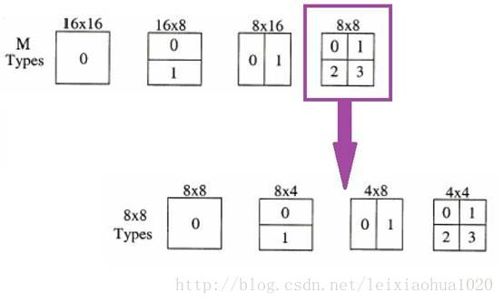
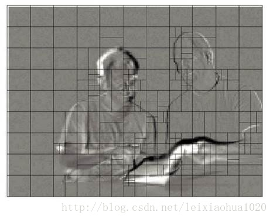
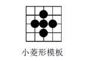
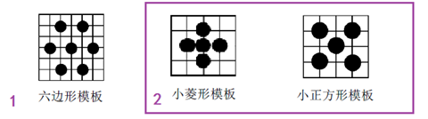
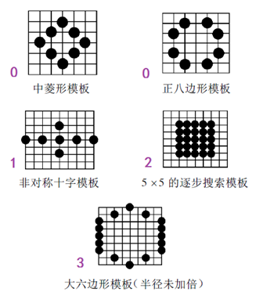
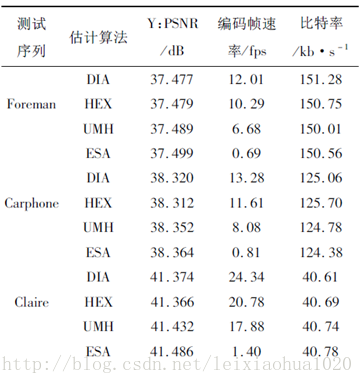

## **Libx264 宏块分析 - 帧间宏块**
> **与帧内宏块同样的代码入口不再赘述**

- **宏块划分知识**
    1. x264_macroblock_analyse()的流程中出现了多种帧间宏块的划分方式，在这里汇总一下。
    2. 《H.264标准》中规定，每个16x16的宏块可以划分为16x16，16x8，8x16，8x8四种类型。
    3. 而如果宏块划分为8x8类型的时候，每个8x8宏块又可以划分为8x8，8x4，4x8，4x4四种小块。它们之间的关系下图所示。  
      
    4. 上图中这些子宏块都包含了自己的运动矢量和参考帧序号，并且根据这两个信息获得最终的预测数据。  
    5. 总体说来，大的子宏块适合平坦区域，而小的子宏块适合多细节区域。  
    6. 例如下面这张图是一张没有进行运动补偿的残差帧的宏块分割方式图，可以看出平坦区域使用了较大的16x16分割方式，而细节区域使用了相对较小的宏块分割方式。  
      
    7. Inter宏块的划分模式比较多，每种划分模式都对应这一个函数，因此难以一一分析每种划分模式的帧间预测代码。

- **x264_mb_analyse_inter_p16x16()**
    ```C
    /*
    * 16x16 帧间预测宏块分析
    *
    * +--------+--------+
    * |                 |
    * |                 |
    * |                 |
    * +        +        +
    * |                 |
    * |                 |
    * |                 |
    * +--------+--------+
    *
    */
    static void x264_mb_analyse_inter_p16x16( x264_t *h, x264_mb_analysis_t *a )
    {
        //运动估计相关的信息
        //后面的初始化工作主要是对该结构体赋值
        x264_me_t m;
        int i_mvc;
        ALIGNED_4( int16_t mvc[8][2] );
        int i_halfpel_thresh = INT_MAX;
        int *p_halfpel_thresh = (a->b_early_terminate && h->mb.pic.i_fref[0]>1) ? &i_halfpel_thresh : NULL;
    
        /* 16x16 Search on all ref frame */
        //设定像素分块大小
        m.i_pixel = PIXEL_16x16;
        LOAD_FENC( &m, h->mb.pic.p_fenc, 0, 0 );
    
        a->l0.me16x16.cost = INT_MAX;
    
        //循环搜索所有的参考帧
        //i_ref
        //mb.pic.i_fref[0]存储了参考帧的个数
        for( int i_ref = 0; i_ref < h->mb.pic.i_fref[0]; i_ref++ )
        {
            m.i_ref_cost = REF_COST( 0, i_ref );
            i_halfpel_thresh -= m.i_ref_cost;
    
            /* search with ref */
            //加载半像素点的列表
            //参考列表的4个分量列表，包括yN(整点像素),yH(1/2水平内插),yV(1/2垂直内插), yHV(1/2斜对角内插)
            LOAD_HPELS( &m, h->mb.pic.p_fref[0][i_ref], 0, i_ref, 0, 0 );
            LOAD_WPELS( &m, h->mb.pic.p_fref_w[i_ref], 0, i_ref, 0, 0 );
    
            //获得预测的运动矢量MV（通过取中值）
            x264_mb_predict_mv_16x16( h, 0, i_ref, m.mvp );
    
            if( h->mb.ref_blind_dupe == i_ref )
            {
                CP32( m.mv, a->l0.mvc[0][0] );
                x264_me_refine_qpel_refdupe( h, &m, p_halfpel_thresh );
            }
            else
            {
                x264_mb_predict_mv_ref16x16( h, 0, i_ref, mvc, &i_mvc );
                //关键：运动估计（搜索参考帧）
                x264_me_search_ref( h, &m, mvc, i_mvc, p_halfpel_thresh );
            }
    
            /* save mv for predicting neighbors */
            CP32( h->mb.mvr[0][i_ref][h->mb.i_mb_xy], m.mv );
            CP32( a->l0.mvc[i_ref][0], m.mv );
    
            /* early termination
            * SSD threshold would probably be better than SATD */
            if( i_ref == 0
                && a->b_try_skip
                && m.cost-m.cost_mv < 300*a->i_lambda
                &&  abs(m.mv[0]-h->mb.cache.pskip_mv[0])
                + abs(m.mv[1]-h->mb.cache.pskip_mv[1]) <= 1
                && x264_macroblock_probe_pskip( h ) )
            {
                h->mb.i_type = P_SKIP;
                x264_analyse_update_cache( h, a );
                assert( h->mb.cache.pskip_mv[1] <= h->mb.mv_max_spel[1] || h->i_thread_frames == 1 );
                return;
            }
    
            m.cost += m.i_ref_cost;
            i_halfpel_thresh += m.i_ref_cost;
    
            if( m.cost < a->l0.me16x16.cost )
                h->mc.memcpy_aligned( &a->l0.me16x16, &m, sizeof(x264_me_t) );
        }
    
        x264_macroblock_cache_ref( h, 0, 0, 4, 4, 0, a->l0.me16x16.i_ref );
        assert( a->l0.me16x16.mv[1] <= h->mb.mv_max_spel[1] || h->i_thread_frames == 1 );
    
        h->mb.i_type = P_L0;
        if( a->i_mbrd )
        {
            x264_mb_init_fenc_cache( h, a->i_mbrd >= 2 || h->param.analyse.inter & X264_ANALYSE_PSUB8x8 );
            if( a->l0.me16x16.i_ref == 0 && M32( a->l0.me16x16.mv ) == M32( h->mb.cache.pskip_mv ) && !a->b_force_intra )
            {
                h->mb.i_partition = D_16x16;
                x264_macroblock_cache_mv_ptr( h, 0, 0, 4, 4, 0, a->l0.me16x16.mv );
                a->l0.i_rd16x16 = x264_rd_cost_mb( h, a->i_lambda2 );
                if( !(h->mb.i_cbp_luma|h->mb.i_cbp_chroma) )
                    h->mb.i_type = P_SKIP;
            }
        }
    }
    ```

- **运动搜索（运动估计）知识 【找出变动误差最小的点】**
    1. 运动搜索可以分成两种基本类型：
    ```sh
    # 全局搜索算法。该方法是把搜索区域内所有的像素块逐个与当前宏块进行比较，查找具有最小匹配误差的一个像素块为匹配块。
    #   这一方法的好处是可以找到最佳的匹配块，坏处是速度太慢。目前全局搜索算法极少使用。
    #
    # 快速搜索算法。该方法按照一定的数学规则进行匹配块的搜索。这一方法的好处是速度快，坏处是可能只能得到次最佳的匹配块。
    ```
    2. 在X264中包含以下几种运动搜索方法
    ```sh
    # A. 菱形搜索算法（DIA）
    #     以搜索起点为中心，采用下图所示的小菱形模板（模板半径为1）搜索。
    #     计算各点的匹配误差，得到MBD（最小误差）点。如果MBD点在模板中心，则搜索结束，此时的MBD 点就是最优匹配点，
    #     对应的像素块就是最佳匹配块；如果MBD点不在模板中心位置，
    #     则以现在MBD点为中心点，继续进行小菱形搜索，直至MBD点落在中心点为止。
    ```
    
    ```sh
    # B. 六边形搜索算法（HEX）
    #    该方法采用1个大模板（六边形模板）和2个小模板（小菱形模板和小正方形模板）。具体的搜索步骤如下：
    #    步骤1：
    #       以搜索起点为中心，采用图中左边的六边形模板进行搜索。
    #       计算区域中心及周围6个点处的匹配误差并比较，如最小MBD 点位于模板中心点，则转至步骤2；
    #       否则以上一次的MBD 点作为中心点，以六边形模板为模板进行反复搜索。
    #
    #    步骤2：
    #       以上一次的MBD 点为中心点，采用小菱形模板搜索，计算各点的匹配误差，找到MBD 点。
    #       然后以MBD点为中心点，采用小正方形模板搜索，得到的MBD点就是最优匹配点。
    ```
    
    ```sh
    # C. 非对称十字型多层次六边形格点搜索算法（UMH）
    #    该方法用到了下图所示的多个搜索模板，相对比较复杂，目前还没有仔细研究。记录一下步骤：
    #    步骤0：
    #       进行一次小菱形搜索，根据匹配误差值和两个门限值（对于一种尺寸的宏块来说是固定大小的threshold1和threshold2）之间的关系作相应的处理，
    #       可能用到中菱形模板或者正八边形模板，也有可能直接跳到步骤1。
    ```
    
    ```sh
    #    步骤1：使用非对称十字模板搜索。“非对称”的原因是一般水平方向运动要比垂直方向运动剧烈，所以将水平方向搜索范围定为W，垂直方向搜索范围定为W/2。 
    #    步骤2：使用5x5逐步搜索模板搜索。
    #    步骤3：使用大六边形模板搜索。
    #    步骤4：使用六边形搜索算法找到最优匹配点。
    #
    # D. 连续消除法（ESA、TESA）
    #    该方法是一种全搜索算法，它对搜索区域内的点进行光栅式搜索，逐一计算并比较。
    ```
   
   ```sh
    # 从上图可以看出，码率不变的前提下，“Dia”、“HEX”、“UMH”、“ESA”编码获得的质量依次提高，速度依次降低。
    # 其中快速算法（“Dia”、“HEX”、“UMH”）的编码质量比全搜索算法（“ESA”）低不了太多，但是速度却高了很多倍。
   ```

- **运动搜索（运动估计）代码：x264_me_search_ref()**
    ```sh
    # x264_me_search_ref()的整像素搜索是在一个很长的switch()语句里面完成的，该switch()语句根据配置的的参数进行相应的运动搜索
    switch( h->mb.i_me_method )
    {
        case X264_ME_DIA:
        {
        //...
            break;
        }
        case X264_ME_HEX:
        {
        //...
            break;
        }
        case X264_ME_UMH:
        {
        //...
            break;
        }
        case X264_ME_ESA:
        case X264_ME_TESA:
        {
        //...
            break;
        }
    }
    #
    # 在具体的搜索算法中，包含了一些宏例如“COST_MV_X4_DIR()”，“COST_MV_X3_DIR()”用于完成像素比较。
    # 上述宏可以一次性完成多个位置的像素块的比较，其中“X3”代表可以1次完成3个位置的像素块的比较；
    # 而“X4” 代表可以1次完成4个位置的像素块的比较。在钻石模板搜索的过程中调用1次COST_MV_X4_DIR()完成了比较，
    # 而在六边形搜索的过程中调用2次COST_MV_X3_DIR()完成了比较。
    #
    ```
    ```C
    #define BITS_MVD( mx, my )\
    (p_cost_mvx[(mx)<<2] + p_cost_mvy[(my)<<2])
 
    #define COST_MV( mx, my )\
    do\
    {\
        int cost = h->pixf.fpelcmp[i_pixel]( p_fenc, FENC_STRIDE,\
                    &p_fref_w[(my)*stride+(mx)], stride )\
                + BITS_MVD(mx,my);\
        COPY3_IF_LT( bcost, cost, bmx, mx, bmy, my );\
    } while(0)
    
    #define COST_MV_HPEL( mx, my, cost )\
    do\
    {\
        intptr_t stride2 = 16;\
        pixel *src = h->mc.get_ref( pix, &stride2, m->p_fref, stride, mx, my, bw, bh, &m->weight[0] );\
        cost = h->pixf.fpelcmp[i_pixel]( p_fenc, FENC_STRIDE, src, stride2 )\
            + p_cost_mvx[ mx ] + p_cost_mvy[ my ];\
    } while(0)
    
    #define COST_MV_X3_DIR( m0x, m0y, m1x, m1y, m2x, m2y, costs )\
    {\
        pixel *pix_base = p_fref_w + bmx + bmy*stride;\
        h->pixf.fpelcmp_x3[i_pixel]( p_fenc,\
            pix_base + (m0x) + (m0y)*stride,\
            pix_base + (m1x) + (m1y)*stride,\
            pix_base + (m2x) + (m2y)*stride,\
            stride, costs );\
        (costs)[0] += BITS_MVD( bmx+(m0x), bmy+(m0y) );\
        (costs)[1] += BITS_MVD( bmx+(m1x), bmy+(m1y) );\
        (costs)[2] += BITS_MVD( bmx+(m2x), bmy+(m2y) );\
    }
    
    #define COST_MV_X4_DIR( m0x, m0y, m1x, m1y, m2x, m2y, m3x, m3y, costs )\
    {\
        pixel *pix_base = p_fref_w + bmx + bmy*stride;\
        h->pixf.fpelcmp_x4[i_pixel]( p_fenc,\
            pix_base + (m0x) + (m0y)*stride,\
            pix_base + (m1x) + (m1y)*stride,\
            pix_base + (m2x) + (m2y)*stride,\
            pix_base + (m3x) + (m3y)*stride,\
            stride, costs );\
        (costs)[0] += BITS_MVD( bmx+(m0x), bmy+(m0y) );\
        (costs)[1] += BITS_MVD( bmx+(m1x), bmy+(m1y) );\
        (costs)[2] += BITS_MVD( bmx+(m2x), bmy+(m2y) );\
        (costs)[3] += BITS_MVD( bmx+(m3x), bmy+(m3y) );\
    }
    
    #define COST_MV_X4( m0x, m0y, m1x, m1y, m2x, m2y, m3x, m3y )\
    {\
        pixel *pix_base = p_fref_w + omx + omy*stride;\
        h->pixf.fpelcmp_x4[i_pixel]( p_fenc,\
            pix_base + (m0x) + (m0y)*stride,\
            pix_base + (m1x) + (m1y)*stride,\
            pix_base + (m2x) + (m2y)*stride,\
            pix_base + (m3x) + (m3y)*stride,\
            stride, costs );\
        costs[0] += BITS_MVD( omx+(m0x), omy+(m0y) );\
        costs[1] += BITS_MVD( omx+(m1x), omy+(m1y) );\
        costs[2] += BITS_MVD( omx+(m2x), omy+(m2y) );\
        costs[3] += BITS_MVD( omx+(m3x), omy+(m3y) );\
        COPY3_IF_LT( bcost, costs[0], bmx, omx+(m0x), bmy, omy+(m0y) );\
        COPY3_IF_LT( bcost, costs[1], bmx, omx+(m1x), bmy, omy+(m1y) );\
        COPY3_IF_LT( bcost, costs[2], bmx, omx+(m2x), bmy, omy+(m2y) );\
        COPY3_IF_LT( bcost, costs[3], bmx, omx+(m3x), bmy, omy+(m3y) );\
    }
    
    #define COST_MV_X3_ABS( m0x, m0y, m1x, m1y, m2x, m2y )\
    {\
        h->pixf.fpelcmp_x3[i_pixel]( p_fenc,\
            p_fref_w + (m0x) + (m0y)*stride,\
            p_fref_w + (m1x) + (m1y)*stride,\
            p_fref_w + (m2x) + (m2y)*stride,\
            stride, costs );\
        costs[0] += p_cost_mvx[(m0x)<<2]; /* no cost_mvy */\
        costs[1] += p_cost_mvx[(m1x)<<2];\
        costs[2] += p_cost_mvx[(m2x)<<2];\
        COPY3_IF_LT( bcost, costs[0], bmx, m0x, bmy, m0y );\
        COPY3_IF_LT( bcost, costs[1], bmx, m1x, bmy, m1y );\
        COPY3_IF_LT( bcost, costs[2], bmx, m2x, bmy, m2y );\
    }
    
    /*  1  */
    /* 101 */
    /*  1  */
    #define DIA1_ITER( mx, my )\
    {\
        omx = mx; omy = my;\
        COST_MV_X4( 0,-1, 0,1, -1,0, 1,0 );\
    }
    
    #define CROSS( start, x_max, y_max )\
    {\
        int i = start;\
        if( (x_max) <= X264_MIN(mv_x_max-omx, omx-mv_x_min) )\
            for( ; i < (x_max)-2; i+=4 )\
                COST_MV_X4( i,0, -i,0, i+2,0, -i-2,0 );\
        for( ; i < (x_max); i+=2 )\
        {\
            if( omx+i <= mv_x_max )\
                COST_MV( omx+i, omy );\
            if( omx-i >= mv_x_min )\
                COST_MV( omx-i, omy );\
        }\
        i = start;\
        if( (y_max) <= X264_MIN(mv_y_max-omy, omy-mv_y_min) )\
            for( ; i < (y_max)-2; i+=4 )\
                COST_MV_X4( 0,i, 0,-i, 0,i+2, 0,-i-2 );\
        for( ; i < (y_max); i+=2 )\
        {\
            if( omy+i <= mv_y_max )\
                COST_MV( omx, omy+i );\
            if( omy-i >= mv_y_min )\
                COST_MV( omx, omy-i );\
        }\
    }
    
    #define FPEL(mv) (((mv)+2)>>2) /* Convert subpel MV to fullpel with rounding... */
    #define SPEL(mv) ((mv)<<2)     /* ... and the reverse. */
    #define SPELx2(mv) (SPEL(mv)&0xFFFCFFFC) /* for two packed MVs */
    
    //关键：运动估计（搜索参考帧）
    void x264_me_search_ref( x264_t *h, x264_me_t *m, int16_t (*mvc)[2], int i_mvc, int *p_halfpel_thresh )
    {
        const int bw = x264_pixel_size[m->i_pixel].w;
        const int bh = x264_pixel_size[m->i_pixel].h;
        const int i_pixel = m->i_pixel;
        const int stride = m->i_stride[0];
        int i_me_range = h->param.analyse.i_me_range;
        int bmx, bmy, bcost = COST_MAX;
        int bpred_cost = COST_MAX;
        int omx, omy, pmx, pmy;
        pixel *p_fenc = m->p_fenc[0];
        pixel *p_fref_w = m->p_fref_w;
        ALIGNED_ARRAY_N( pixel, pix,[16*16] );
        ALIGNED_ARRAY_8( int16_t, mvc_temp,[16],[2] );
    
        ALIGNED_ARRAY_16( int, costs,[16] );
    
        int mv_x_min = h->mb.mv_limit_fpel[0][0];
        int mv_y_min = h->mb.mv_limit_fpel[0][1];
        int mv_x_max = h->mb.mv_limit_fpel[1][0];
        int mv_y_max = h->mb.mv_limit_fpel[1][1];
    /* Special version of pack to allow shortcuts in CHECK_MVRANGE */
    #define pack16to32_mask2(mx,my) ((mx<<16)|(my&0x7FFF))
        uint32_t mv_min = pack16to32_mask2( -mv_x_min, -mv_y_min );
        uint32_t mv_max = pack16to32_mask2( mv_x_max, mv_y_max )|0x8000;
        uint32_t pmv, bpred_mv = 0;
    
    #define CHECK_MVRANGE(mx,my) (!(((pack16to32_mask2(mx,my) + mv_min) | (mv_max - pack16to32_mask2(mx,my))) & 0x80004000))
    
        const uint16_t *p_cost_mvx = m->p_cost_mv - m->mvp[0];
        const uint16_t *p_cost_mvy = m->p_cost_mv - m->mvp[1];
    
        /* Try extra predictors if provided.  If subme >= 3, check subpel predictors,
        * otherwise round them to fullpel. */
        if( h->mb.i_subpel_refine >= 3 )//如果精度为1/4
        {
            /* Calculate and check the MVP first */
            int bpred_mx = x264_clip3( m->mvp[0], SPEL(mv_x_min), SPEL(mv_x_max) );
            int bpred_my = x264_clip3( m->mvp[1], SPEL(mv_y_min), SPEL(mv_y_max) );
            pmv = pack16to32_mask( bpred_mx, bpred_my );
            pmx = FPEL( bpred_mx );
            pmy = FPEL( bpred_my );
    
            COST_MV_HPEL( bpred_mx, bpred_my, bpred_cost );
            int pmv_cost = bpred_cost;
    
            if( i_mvc > 0 )
            {
                /* Clip MV candidates and eliminate those equal to zero and pmv. */
                int valid_mvcs = x264_predictor_clip( mvc_temp+2, mvc, i_mvc, h->mb.mv_limit_fpel, pmv );
                if( valid_mvcs > 0 )
                {
                    int i = 1, cost;
                    /* We stuff pmv here to branchlessly pick between pmv and the various
                    * MV candidates. [0] gets skipped in order to maintain alignment for
                    * x264_predictor_clip. */
                    M32( mvc_temp[1] ) = pmv;
                    bpred_cost <<= 4;
                    do
                    {
                        int mx = mvc_temp[i+1][0];
                        int my = mvc_temp[i+1][1];
                        COST_MV_HPEL( mx, my, cost );
                        COPY1_IF_LT( bpred_cost, (cost << 4) + i );
                    } while( ++i <= valid_mvcs );
                    bpred_mx = mvc_temp[(bpred_cost&15)+1][0];
                    bpred_my = mvc_temp[(bpred_cost&15)+1][1];
                    bpred_cost >>= 4;
                }
            }
    
            /* Round the best predictor back to fullpel and get the cost, since this is where
            * we'll be starting the fullpel motion search. */
            //FPEL()宏定义如下
            //#define FPEL(mv) (((mv)+2)>>2)
            //即把以1/4像素为基本单位的运动矢量转换为以整像素为基本单位（加2是为了四舍五入）
            bmx = FPEL( bpred_mx );
            bmy = FPEL( bpred_my );
            bpred_mv = pack16to32_mask(bpred_mx, bpred_my);
            if( bpred_mv&0x00030003 ) /* Only test if the tested predictor is actually subpel... */
                COST_MV( bmx, bmy );
            else                          /* Otherwise just copy the cost (we already know it) */
                bcost = bpred_cost;
    
            /* Test the zero vector if it hasn't been tested yet. */
            if( pmv )
            {
                if( bmx|bmy ) COST_MV( 0, 0 );
            }
            /* If a subpel mv candidate was better than the zero vector, the previous
            * fullpel check won't have gotten it even if the pmv was zero. So handle
            * that possibility here. */
            else
            {
                COPY3_IF_LT( bcost, pmv_cost, bmx, 0, bmy, 0 );
            }
        }
        else
        {
            /* Calculate and check the fullpel MVP first */
            //像素点的坐标（bmx，bmy）
            //FPEL()从四分之一像素MV转换为整像素MV
            bmx = pmx = x264_clip3( FPEL(m->mvp[0]), mv_x_min, mv_x_max );
            bmy = pmy = x264_clip3( FPEL(m->mvp[1]), mv_y_min, mv_y_max );
            pmv = pack16to32_mask( bmx, bmy );
    
            /* Because we are rounding the predicted motion vector to fullpel, there will be
            * an extra MV cost in 15 out of 16 cases.  However, when the predicted MV is
            * chosen as the best predictor, it is often the case that the subpel search will
            * result in a vector at or next to the predicted motion vector.  Therefore, we omit
            * the cost of the MV from the rounded MVP to avoid unfairly biasing against use of
            * the predicted motion vector.
            *
            * Disclaimer: this is a post-hoc rationalization for why this hack works. */
            bcost = h->pixf.fpelcmp[i_pixel]( p_fenc, FENC_STRIDE, &p_fref_w[bmy*stride+bmx], stride );
    
            if( i_mvc > 0 )
            {
                /* Like in subme>=3, except we also round the candidates to fullpel. */
                int valid_mvcs = x264_predictor_roundclip( mvc_temp+2, mvc, i_mvc, h->mb.mv_limit_fpel, pmv );
                if( valid_mvcs > 0 )
                {
                    int i = 1, cost;
                    M32( mvc_temp[1] ) = pmv;
                    bcost <<= 4;
                    do
                    {
                        int mx = mvc_temp[i+1][0];
                        int my = mvc_temp[i+1][1];
                        cost = h->pixf.fpelcmp[i_pixel]( p_fenc, FENC_STRIDE, &p_fref_w[my*stride+mx], stride ) + BITS_MVD( mx, my );
                        COPY1_IF_LT( bcost, (cost << 4) + i );
                    } while( ++i <= valid_mvcs );
                    bmx = mvc_temp[(bcost&15)+1][0];
                    bmy = mvc_temp[(bcost&15)+1][1];
                    bcost >>= 4;
                }
            }
    
            /* Same as above, except the condition is simpler. */
            if( pmv )
                COST_MV( 0, 0 );
        }
        //不同的运动估计算法作不同的处理
        switch( h->mb.i_me_method )
        {
            //钻石（Diamond）搜索
            //注意这里是“小钻石”，实际上还有“大钻石”
            /*
            *   x
            * x x x
            *   x
            */
            case X264_ME_DIA:
            {
                /* diamond search, radius 1 */
                bcost <<= 4;
                //i每次循环减1，
                //运动搜索的半径
                int i = i_me_range;
                //循环
                do
                {
                    //COST_MV_X4_DIR()计算4个点的MV开销
                    //在这里以bmx,bmy为基点在周围进行其四点的cost计算
                    //周围4个点为(0,-1),(0,1),(-1,0),(1,0)
                    //每个点的结果存储于costs[]数组
                    //
                    //在这里像素比较函数可能是SAD或者SATD，参考mbcmp_init()函数
                    //
                    //COST_MV_X4_DIR( 0,-1, 0,1, -1,0, 1,0, costs )宏展开后代码如下所示
                    /*
                    *	{
                            pixel *pix_base = p_fref_w + bmx + bmy*stride;
                            //调用像素比较函数
                            h->pixf.fpelcmp_x4[i_pixel]( p_fenc,
                                pix_base + (0) + (-1)*stride,   //上
                                pix_base + (0) + (1)*stride,    //下
                                pix_base + (-1) + (0)*stride,   //左
                                pix_base + (1) + (0)*stride,    //右
                                stride, costs );
                            //得到4个点的开销，存储到costs[]数组
                            (costs)[0] += (p_cost_mvx[(bmx+(0))<<2] + p_cost_mvy[(bmy+(-1))<<2]);
                            (costs)[1] += (p_cost_mvx[(bmx+(0))<<2] + p_cost_mvy[(bmy+(1))<<2]);
                            (costs)[2] += (p_cost_mvx[(bmx+(-1))<<2] + p_cost_mvy[(bmy+(0))<<2]);
                            (costs)[3] += (p_cost_mvx[(bmx+(1))<<2] + p_cost_mvy[(bmy+(0))<<2]);
                        }
                    */
    
                    /*
                    * 顺序
                    *   1
                    * 3 x 4
                    *   2
                    */
                    COST_MV_X4_DIR( 0,-1, 0,1, -1,0, 1,0, costs );
                    //如果小的话，就拷贝至bcost
                    //COPY1_IF_LT()宏定义如下
                    //#define COPY1_IF_LT(x,y)\
                    //if((y)<(x))\
                    //		(x)=(y);
                    //
                    //这里左移了4位，加上1个数，可以理解为用于记录哪一个点开销小
                    COPY1_IF_LT( bcost, (costs[0]<<4)+1 ); // 1二进制为0001，单看1-2位，“ 1”，对应“上”像素
                    COPY1_IF_LT( bcost, (costs[1]<<4)+3 ); // 3二进制为0011，单看1-2位，“-1”，对应“下”像素
                    COPY1_IF_LT( bcost, (costs[2]<<4)+4 ); // 4二进制为0100，单看3-4位，“ 1”，对应“左”像素
                    COPY1_IF_LT( bcost, (costs[3]<<4)+12 );//12二进制为1100，单看3-4位，“-1”，对应“右”像素
                    if( !(bcost&15) )//后4位进行检测，如果后4位是0，就是证明所进行比较的4点开销比原点要大，所以不需要继续搜索了
                        break;       //提前结束
                    //注意右移的时候是区分符号位的
                    //改变bmx，bmy的值-决定了x和y是加1还是减1
                    bmx -= (bcost<<28)>>30;//注意不等同于除以4。左移28位后，只剩最后4位。右移30位，只剩3-4位
                    bmy -= (bcost<<30)>>30;//思路同上，只剩1-2位
                    bcost &= ~15;
                    //检查运动搜索范围：mv_min和mv_max
                    //以及i
                } while( --i && CHECK_MVRANGE(bmx, bmy) ); //检查是否越界
                //这里右移了4位（之前左移4位）
                bcost >>= 4;
                break;
            }
            //六边形（Hexagon）搜索
            /*
            *    x   x
            *
            *  x   x   x
            *
            *    x   x
            */
            case X264_ME_HEX:
            {
        me_hex2:
                /* hexagon search, radius 2 */
        #if 0
                for( int i = 0; i < i_me_range/2; i++ )
                {
                    omx = bmx; omy = bmy;
                    COST_MV( omx-2, omy   );
                    COST_MV( omx-1, omy+2 );
                    COST_MV( omx+1, omy+2 );
                    COST_MV( omx+2, omy   );
                    COST_MV( omx+1, omy-2 );
                    COST_MV( omx-1, omy-2 );
                    if( bmx == omx && bmy == omy )
                        break;
                    if( !CHECK_MVRANGE(bmx, bmy) )
                        break;
                }
        #else
                /* equivalent to the above, but eliminates duplicate candidates */
    
                /* hexagon */
                //一共计算呈六边形分布的6个点
                //COST_MV_X3_DIR()计算3个点的MV开销
                //3个点为(-2,0),(-1,2),(1,2)
                //开销存入costs[]
                COST_MV_X3_DIR( -2,0, -1, 2,  1, 2, costs   );
                //再计算3个点为(2,0),(1,-2),(-1,-2)
                COST_MV_X3_DIR(  2,0,  1,-2, -1,-2, costs+4 ); /* +4 for 16-byte alignment */
    
                /*
                * 顺序
                *    2   3
                *
                *  1   x   4
                *
                *    6   5
                */
                //这里左移了3位，加上1个数，可以理解为用于记录哪一个点开销小
                bcost <<= 3;
                COPY1_IF_LT( bcost, (costs[0]<<3)+2 );
                COPY1_IF_LT( bcost, (costs[1]<<3)+3 );
                COPY1_IF_LT( bcost, (costs[2]<<3)+4 );
                COPY1_IF_LT( bcost, (costs[4]<<3)+5 );
                COPY1_IF_LT( bcost, (costs[5]<<3)+6 );
                COPY1_IF_LT( bcost, (costs[6]<<3)+7 );
    
                if( bcost&7 )  //后3位进行检测，如果后3位是0，就是证明所进行比较的6点开销比原点要大，就跳过这一步
                {
                    //int8_t hex2[8][2] = {{-1,-2}, {-2,0}, {-1,2}, {1,2}, {2,0}, {1,-2}, {-1,-2}, {-2,0}};
    
                    int dir = (bcost&7)-2;
                    bmx += hex2[dir+1][0];
                    bmy += hex2[dir+1][1];
    
                    /* half hexagon, not overlapping the previous iteration */
                    for( int i = (i_me_range>>1) - 1; i > 0 && CHECK_MVRANGE(bmx, bmy); i-- )
                    {
                        COST_MV_X3_DIR( hex2[dir+0][0], hex2[dir+0][1],
                                        hex2[dir+1][0], hex2[dir+1][1],
                                        hex2[dir+2][0], hex2[dir+2][1],
                                        costs );
                        bcost &= ~7;
                        COPY1_IF_LT( bcost, (costs[0]<<3)+1 );
                        COPY1_IF_LT( bcost, (costs[1]<<3)+2 );
                        COPY1_IF_LT( bcost, (costs[2]<<3)+3 );
                        if( !(bcost&7) )
                            break;
                        dir += (bcost&7)-2;
                        dir = mod6m1[dir+1];
                        bmx += hex2[dir+1][0];
                        bmy += hex2[dir+1][1];
                    }
                }
                bcost >>= 3;
        #endif
                /* square refine */
                //正方形细化
                //六边形搜索之后，再进行正方形细化
                bcost <<= 4;
                /*
                * 分两步，标号如下所示：
                * 2 1 2
                * 1 x 1
                * 2 1 2
                */
                COST_MV_X4_DIR(  0,-1,  0,1, -1,0, 1,0, costs );
                COPY1_IF_LT( bcost, (costs[0]<<4)+1 );
                COPY1_IF_LT( bcost, (costs[1]<<4)+2 );
                COPY1_IF_LT( bcost, (costs[2]<<4)+3 );
                COPY1_IF_LT( bcost, (costs[3]<<4)+4 );
                COST_MV_X4_DIR( -1,-1, -1,1, 1,-1, 1,1, costs );
                COPY1_IF_LT( bcost, (costs[0]<<4)+5 );
                COPY1_IF_LT( bcost, (costs[1]<<4)+6 );
                COPY1_IF_LT( bcost, (costs[2]<<4)+7 );
                COPY1_IF_LT( bcost, (costs[3]<<4)+8 );
                bmx += square1[bcost&15][0];
                bmy += square1[bcost&15][1];
                bcost >>= 4;
                break;
            }
            //非对称十字多六边形网格（Uneven Multi-Hex）搜索
            case X264_ME_UMH:
            {
                /*
                * 主要包含3个步骤
                * 第1步：进行混合搜索,包括如下：
                * A，非对称十字搜索。
                * B，5×5 全搜索。
                * C，扩展的多层次六边形(六角形)格点搜索。
                * 第2步：以当前最优点为中心，用六边形(六角形)进行搜索，直至最优点在六边型的中点为止。
                * 第3步：以当前最优点为中心，用小菱形进行搜索，直至最优点在小菱形的中点为止。
                */
                /* Uneven-cross Multi-Hexagon-grid Search
                * as in JM, except with different early termination */
    
                static const uint8_t x264_pixel_size_shift[7] = { 0, 1, 1, 2, 3, 3, 4 };
    
                int ucost1, ucost2;
                int cross_start = 1;
    
                /* refine predictors */
                ucost1 = bcost;
                DIA1_ITER( pmx, pmy );
                if( pmx | pmy )
                    DIA1_ITER( 0, 0 );
    
                if( i_pixel == PIXEL_4x4 )
                    goto me_hex2;
    
                ucost2 = bcost;
                if( (bmx | bmy) && ((bmx-pmx) | (bmy-pmy)) )
                    DIA1_ITER( bmx, bmy );
                if( bcost == ucost2 )
                    cross_start = 3;
                omx = bmx; omy = bmy;
    
                /* early termination */
    #define SAD_THRESH(v) ( bcost < ( v >> x264_pixel_size_shift[i_pixel] ) )
                if( bcost == ucost2 && SAD_THRESH(2000) )
                {
                    COST_MV_X4( 0,-2, -1,-1, 1,-1, -2,0 );
                    COST_MV_X4( 2, 0, -1, 1, 1, 1,  0,2 );
                    if( bcost == ucost1 && SAD_THRESH(500) )
                        break;
                    if( bcost == ucost2 )
                    {
                        int range = (i_me_range>>1) | 1;
                        CROSS( 3, range, range );
                        COST_MV_X4( -1,-2, 1,-2, -2,-1, 2,-1 );
                        COST_MV_X4( -2, 1, 2, 1, -1, 2, 1, 2 );
                        if( bcost == ucost2 )
                            break;
                        cross_start = range + 2;
                    }
                }
    
                /* adaptive search range */
                if( i_mvc )
                {
                    /* range multipliers based on casual inspection of some statistics of
                    * average distance between current predictor and final mv found by ESA.
                    * these have not been tuned much by actual encoding. */
                    static const uint8_t range_mul[4][4] =
                    {
                        { 3, 3, 4, 4 },
                        { 3, 4, 4, 4 },
                        { 4, 4, 4, 5 },
                        { 4, 4, 5, 6 },
                    };
                    int mvd;
                    int sad_ctx, mvd_ctx;
                    int denom = 1;
    
                    if( i_mvc == 1 )
                    {
                        if( i_pixel == PIXEL_16x16 )
                            /* mvc is probably the same as mvp, so the difference isn't meaningful.
                            * but prediction usually isn't too bad, so just use medium range */
                            mvd = 25;
                        else
                            mvd = abs( m->mvp[0] - mvc[0][0] )
                                + abs( m->mvp[1] - mvc[0][1] );
                    }
                    else
                    {
                        /* calculate the degree of agreement between predictors. */
                        /* in 16x16, mvc includes all the neighbors used to make mvp,
                        * so don't count mvp separately. */
                        denom = i_mvc - 1;
                        mvd = 0;
                        if( i_pixel != PIXEL_16x16 )
                        {
                            mvd = abs( m->mvp[0] - mvc[0][0] )
                                + abs( m->mvp[1] - mvc[0][1] );
                            denom++;
                        }
                        mvd += x264_predictor_difference( mvc, i_mvc );
                    }
    
                    sad_ctx = SAD_THRESH(1000) ? 0
                            : SAD_THRESH(2000) ? 1
                            : SAD_THRESH(4000) ? 2 : 3;
                    mvd_ctx = mvd < 10*denom ? 0
                            : mvd < 20*denom ? 1
                            : mvd < 40*denom ? 2 : 3;
    
                    i_me_range = i_me_range * range_mul[mvd_ctx][sad_ctx] >> 2;
                }
    
                /* FIXME if the above DIA2/OCT2/CROSS found a new mv, it has not updated omx/omy.
                * we are still centered on the same place as the DIA2. is this desirable? */
                CROSS( cross_start, i_me_range, i_me_range>>1 );
    
                COST_MV_X4( -2,-2, -2,2, 2,-2, 2,2 );
    
                /* hexagon grid */
                omx = bmx; omy = bmy;
                const uint16_t *p_cost_omvx = p_cost_mvx + omx*4;
                const uint16_t *p_cost_omvy = p_cost_mvy + omy*4;
                int i = 1;
                do
                {
                    static const int8_t hex4[16][2] = {
                        { 0,-4}, { 0, 4}, {-2,-3}, { 2,-3},
                        {-4,-2}, { 4,-2}, {-4,-1}, { 4,-1},
                        {-4, 0}, { 4, 0}, {-4, 1}, { 4, 1},
                        {-4, 2}, { 4, 2}, {-2, 3}, { 2, 3},
                    };
    
                    if( 4*i > X264_MIN4( mv_x_max-omx, omx-mv_x_min,
                                        mv_y_max-omy, omy-mv_y_min ) )
                    {
                        for( int j = 0; j < 16; j++ )
                        {
                            int mx = omx + hex4[j][0]*i;
                            int my = omy + hex4[j][1]*i;
                            if( CHECK_MVRANGE(mx, my) )
                                COST_MV( mx, my );
                        }
                    }
                    else
                    {
                        int dir = 0;
                        pixel *pix_base = p_fref_w + omx + (omy-4*i)*stride;
                        int dy = i*stride;
    #define SADS(k,x0,y0,x1,y1,x2,y2,x3,y3)\
                        h->pixf.fpelcmp_x4[i_pixel]( p_fenc,\
                                pix_base x0*i+(y0-2*k+4)*dy,\
                                pix_base x1*i+(y1-2*k+4)*dy,\
                                pix_base x2*i+(y2-2*k+4)*dy,\
                                pix_base x3*i+(y3-2*k+4)*dy,\
                                stride, costs+4*k );\
                        pix_base += 2*dy;
    #define ADD_MVCOST(k,x,y) costs[k] += p_cost_omvx[x*4*i] + p_cost_omvy[y*4*i]
    #define MIN_MV(k,x,y)     COPY2_IF_LT( bcost, costs[k], dir, x*16+(y&15) )
                        SADS( 0, +0,-4, +0,+4, -2,-3, +2,-3 );
                        SADS( 1, -4,-2, +4,-2, -4,-1, +4,-1 );
                        SADS( 2, -4,+0, +4,+0, -4,+1, +4,+1 );
                        SADS( 3, -4,+2, +4,+2, -2,+3, +2,+3 );
                        ADD_MVCOST(  0, 0,-4 );
                        ADD_MVCOST(  1, 0, 4 );
                        ADD_MVCOST(  2,-2,-3 );
                        ADD_MVCOST(  3, 2,-3 );
                        ADD_MVCOST(  4,-4,-2 );
                        ADD_MVCOST(  5, 4,-2 );
                        ADD_MVCOST(  6,-4,-1 );
                        ADD_MVCOST(  7, 4,-1 );
                        ADD_MVCOST(  8,-4, 0 );
                        ADD_MVCOST(  9, 4, 0 );
                        ADD_MVCOST( 10,-4, 1 );
                        ADD_MVCOST( 11, 4, 1 );
                        ADD_MVCOST( 12,-4, 2 );
                        ADD_MVCOST( 13, 4, 2 );
                        ADD_MVCOST( 14,-2, 3 );
                        ADD_MVCOST( 15, 2, 3 );
                        MIN_MV(  0, 0,-4 );
                        MIN_MV(  1, 0, 4 );
                        MIN_MV(  2,-2,-3 );
                        MIN_MV(  3, 2,-3 );
                        MIN_MV(  4,-4,-2 );
                        MIN_MV(  5, 4,-2 );
                        MIN_MV(  6,-4,-1 );
                        MIN_MV(  7, 4,-1 );
                        MIN_MV(  8,-4, 0 );
                        MIN_MV(  9, 4, 0 );
                        MIN_MV( 10,-4, 1 );
                        MIN_MV( 11, 4, 1 );
                        MIN_MV( 12,-4, 2 );
                        MIN_MV( 13, 4, 2 );
                        MIN_MV( 14,-2, 3 );
                        MIN_MV( 15, 2, 3 );
    #undef SADS
    #undef ADD_MVCOST
    #undef MIN_MV
                        if(dir)
                        {
                            bmx = omx + i*(dir>>4);
                            bmy = omy + i*((dir<<28)>>28);
                        }
                    }
                } while( ++i <= i_me_range>>2 );
                if( bmy <= mv_y_max && bmy >= mv_y_min && bmx <= mv_x_max && bmx >= mv_x_min )
                    goto me_hex2;
                break;
            }
            //穷尽搜索法（Exhaustive）,x264已经取消了这种古老的全搜索法，而是采用下面改进的搜索法
            case X264_ME_ESA:
            //hadamard全搜索法（Transformed Exhaustive）,这个算法和ESA相比主要是在搜索范围上的变化
            case X264_ME_TESA:
            {
                //范围：最小值和最大值
                const int min_x = X264_MAX( bmx - i_me_range, mv_x_min );
                const int min_y = X264_MAX( bmy - i_me_range, mv_y_min );
                const int max_x = X264_MIN( bmx + i_me_range, mv_x_max );
                const int max_y = X264_MIN( bmy + i_me_range, mv_y_max );
                /* SEA is fastest in multiples of 4 */
                const int width = (max_x - min_x + 3) & ~3;
    #if 0
                /* plain old exhaustive search */
                for( int my = min_y; my <= max_y; my++ )
                    for( int mx = min_x; mx < min_x + width; mx++ )
                        COST_MV( mx, my );
    #else
                /* successive elimination by comparing DC before a full SAD,
                * because sum(abs(diff)) >= abs(diff(sum)). */
                uint16_t *sums_base = m->integral;
                ALIGNED_16( static pixel zero[8*FENC_STRIDE] ) = {0};
                ALIGNED_ARRAY_16( int, enc_dc,[4] );
                int sad_size = i_pixel <= PIXEL_8x8 ? PIXEL_8x8 : PIXEL_4x4;
                int delta = x264_pixel_size[sad_size].w;
                int16_t *xs = h->scratch_buffer;
                int xn;
                uint16_t *cost_fpel_mvx = h->cost_mv_fpel[h->mb.i_qp][-m->mvp[0]&3] + (-m->mvp[0]>>2);
    
                h->pixf.sad_x4[sad_size]( zero, p_fenc, p_fenc+delta,
                    p_fenc+delta*FENC_STRIDE, p_fenc+delta+delta*FENC_STRIDE,
                    FENC_STRIDE, enc_dc );
                if( delta == 4 )
                    sums_base += stride * (h->fenc->i_lines[0] + PADV*2);
                if( i_pixel == PIXEL_16x16 || i_pixel == PIXEL_8x16 || i_pixel == PIXEL_4x8 )
                    delta *= stride;
                if( i_pixel == PIXEL_8x16 || i_pixel == PIXEL_4x8 )
                    enc_dc[1] = enc_dc[2];
    
                if( h->mb.i_me_method == X264_ME_TESA )
                {
                    // ADS threshold, then SAD threshold, then keep the best few SADs, then SATD
                    mvsad_t *mvsads = (mvsad_t *)(xs + ((width+31)&~31) + 4);
                    int nmvsad = 0, limit;
                    int sad_thresh = i_me_range <= 16 ? 10 : i_me_range <= 24 ? 11 : 12;
                    int bsad = h->pixf.sad[i_pixel]( p_fenc, FENC_STRIDE, p_fref_w+bmy*stride+bmx, stride )
                            + BITS_MVD( bmx, bmy );
                    for( int my = min_y; my <= max_y; my++ )
                    {
                        int i;
                        int ycost = p_cost_mvy[my<<2];
                        if( bsad <= ycost )
                            continue;
                        bsad -= ycost;
                        xn = h->pixf.ads[i_pixel]( enc_dc, sums_base + min_x + my * stride, delta,
                                                cost_fpel_mvx+min_x, xs, width, bsad * 17 >> 4 );
                        for( i = 0; i < xn-2; i += 3 )
                        {
                            pixel *ref = p_fref_w+min_x+my*stride;
                            ALIGNED_ARRAY_16( int, sads,[4] ); /* padded to [4] for asm */
                            h->pixf.sad_x3[i_pixel]( p_fenc, ref+xs[i], ref+xs[i+1], ref+xs[i+2], stride, sads );
                            for( int j = 0; j < 3; j++ )
                            {
                                int sad = sads[j] + cost_fpel_mvx[xs[i+j]];
                                if( sad < bsad*sad_thresh>>3 )
                                {
                                    COPY1_IF_LT( bsad, sad );
                                    mvsads[nmvsad].sad = sad + ycost;
                                    mvsads[nmvsad].mv[0] = min_x+xs[i+j];
                                    mvsads[nmvsad].mv[1] = my;
                                    nmvsad++;
                                }
                            }
                        }
                        for( ; i < xn; i++ )
                        {
                            int mx = min_x+xs[i];
                            int sad = h->pixf.sad[i_pixel]( p_fenc, FENC_STRIDE, p_fref_w+mx+my*stride, stride )
                                    + cost_fpel_mvx[xs[i]];
                            if( sad < bsad*sad_thresh>>3 )
                            {
                                COPY1_IF_LT( bsad, sad );
                                mvsads[nmvsad].sad = sad + ycost;
                                mvsads[nmvsad].mv[0] = mx;
                                mvsads[nmvsad].mv[1] = my;
                                nmvsad++;
                            }
                        }
                        bsad += ycost;
                    }
    
                    limit = i_me_range >> 1;
                    sad_thresh = bsad*sad_thresh>>3;
                    while( nmvsad > limit*2 && sad_thresh > bsad )
                    {
                        int i;
                        // halve the range if the domain is too large... eh, close enough
                        sad_thresh = (sad_thresh + bsad) >> 1;
                        for( i = 0; i < nmvsad && mvsads[i].sad <= sad_thresh; i++ );
                        for( int j = i; j < nmvsad; j++ )
                        {
                            uint32_t sad;
                            if( WORD_SIZE == 8 && sizeof(mvsad_t) == 8 )
                            {
                                uint64_t mvsad = M64( &mvsads[i] ) = M64( &mvsads[j] );
    #if WORDS_BIGENDIAN
                                mvsad >>= 32;
    #endif
                                sad = mvsad;
                            }
                            else
                            {
                                sad = mvsads[j].sad;
                                CP32( mvsads[i].mv, mvsads[j].mv );
                                mvsads[i].sad = sad;
                            }
                            i += (sad - (sad_thresh+1)) >> 31;
                        }
                        nmvsad = i;
                    }
                    while( nmvsad > limit )
                    {
                        int bi = 0;
                        for( int i = 1; i < nmvsad; i++ )
                            if( mvsads[i].sad > mvsads[bi].sad )
                                bi = i;
                        nmvsad--;
                        if( sizeof( mvsad_t ) == sizeof( uint64_t ) )
                            CP64( &mvsads[bi], &mvsads[nmvsad] );
                        else
                            mvsads[bi] = mvsads[nmvsad];
                    }
                    for( int i = 0; i < nmvsad; i++ )
                        COST_MV( mvsads[i].mv[0], mvsads[i].mv[1] );
                }
                else
                {
                    // just ADS and SAD
                    for( int my = min_y; my <= max_y; my++ )
                    {
                        int i;
                        int ycost = p_cost_mvy[my<<2];
                        if( bcost <= ycost )
                            continue;
                        bcost -= ycost;
                        xn = h->pixf.ads[i_pixel]( enc_dc, sums_base + min_x + my * stride, delta,
                                                cost_fpel_mvx+min_x, xs, width, bcost );
                        for( i = 0; i < xn-2; i += 3 )
                            COST_MV_X3_ABS( min_x+xs[i],my, min_x+xs[i+1],my, min_x+xs[i+2],my );
                        bcost += ycost;
                        for( ; i < xn; i++ )
                            COST_MV( min_x+xs[i], my );
                    }
                }
    #endif
            }
            break;
        }
        //
        //后面的代码与子像素精度的运动搜索有关
        //
        /* -> qpel mv */
        uint32_t bmv = pack16to32_mask(bmx,bmy);
        //用于获得子像素精度的运动矢量的值
        uint32_t bmv_spel = SPELx2(bmv);
        if( h->mb.i_subpel_refine < 3 )
        {
            m->cost_mv = p_cost_mvx[bmx<<2] + p_cost_mvy[bmy<<2];
            m->cost = bcost;
            /* compute the real cost */
            if( bmv == pmv ) m->cost += m->cost_mv;
            M32( m->mv ) = bmv_spel;
        }
        else
        {
            M32(m->mv) = bpred_cost < bcost ? bpred_mv : bmv_spel;
            m->cost = X264_MIN( bpred_cost, bcost );
        }
    
        /* subpel refine */
        //子像素精度（1/2，1/4）搜索
        if( h->mb.i_subpel_refine >= 2 )
        {
            int hpel = subpel_iterations[h->mb.i_subpel_refine][2];
            int qpel = subpel_iterations[h->mb.i_subpel_refine][3];
            refine_subpel( h, m, hpel, qpel, p_halfpel_thresh, 0 );
        }
    }
    #undef COST_MV
    ```
    ```sh
    # 在进行完整像素搜索之后，x264_me_search_ref()会继续调用refine_subpel()完成亚像素精度（半像素，1/4像素）的搜索。
    # 再看源代码之前，简单记录一下有关亚像素的知识。
    ```


