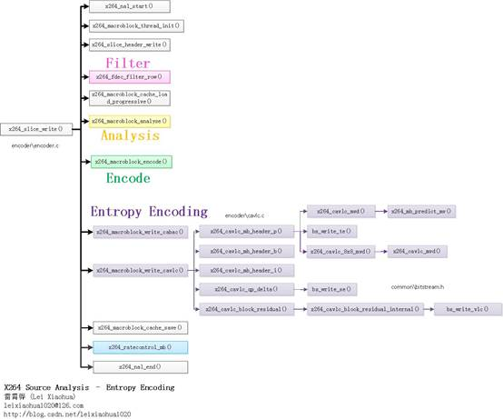

## **x264源代码简单分析：熵编码（Entropy Encoding）部分**

```sh
# 从图中可以看出，熵编码模块包含两个函数x264_macroblock_write_cabac()和x264_macroblock_write_cavlc()。
# 如果输出设置为CABAC编码，则会调用x264_macroblock_write_cabac()；
# 如果输出设置为CAVLC编码，则会调用x264_macroblock_write_cavlc()。
# 本文选择CAVLC编码输出函数x264_macroblock_write_cavlc()进行分析。

# x264_cavlc_mb_header_i()：写入I宏块MB Header数据。包含帧内预测模式等。
# x264_cavlc_mb_header_p()：写入P宏块MB Header数据。包含MVD、参考帧序号等。
# x264_cavlc_mb_header_b()：写入B宏块MB Header数据。包含MVD、参考帧序号等。
# x264_cavlc_qp_delta()：写入QP。
# x264_cavlc_block_residual()：写入残差数据。
```


- **x264_macroblock_write_cavlc():用于以CAVLC编码的方式输出H.264码流。**
    ```C
    /*****************************************************************************
     * x264_macroblock_write:
     *
     * 注释和处理：雷霄骅
     * http://blog.csdn.net/leixiaohua1020
     * leixiaohua1020@126.com
     *****************************************************************************/
    void x264_macroblock_write_cavlc( x264_t *h )
    {
        bs_t *s = &h->out.bs;
        const int i_mb_type = h->mb.i_type;
        int plane_count = CHROMA444 ? 3 : 1;
        int chroma = !CHROMA444;
    
    #if RDO_SKIP_BS
        s->i_bits_encoded = 0;
    #else
        const int i_mb_pos_start = bs_pos( s );
        int       i_mb_pos_tex;
    #endif
    
        if( SLICE_MBAFF
            && (!(h->mb.i_mb_y & 1) || IS_SKIP(h->mb.type[h->mb.i_mb_xy - h->mb.i_mb_stride])) )
        {
            bs_write1( s, MB_INTERLACED );
    #if !RDO_SKIP_BS
            h->mb.field_decoding_flag = MB_INTERLACED;
    #endif
        }
    
    #if !RDO_SKIP_BS
        if( i_mb_type == I_PCM )
        {
            static const uint8_t i_offsets[3] = {5,23,0};
            uint8_t *p_start = s->p_start;
            bs_write_ue( s, i_offsets[h->sh.i_type] + 25 );
            i_mb_pos_tex = bs_pos( s );
            h->stat.frame.i_mv_bits += i_mb_pos_tex - i_mb_pos_start;
    
            bs_align_0( s );
    
            for( int p = 0; p < plane_count; p++ )
                for( int i = 0; i < 256; i++ )
                    bs_write( s, BIT_DEPTH, h->mb.pic.p_fenc[p][i] );
            if( chroma )
                for( int ch = 1; ch < 3; ch++ )
                    for( int i = 0; i < 16>>CHROMA_V_SHIFT; i++ )
                        for( int j = 0; j < 8; j++ )
                            bs_write( s, BIT_DEPTH, h->mb.pic.p_fenc[ch][i*FENC_STRIDE+j] );
    
            bs_init( s, s->p, s->p_end - s->p );
            s->p_start = p_start;
    
            h->stat.frame.i_tex_bits += bs_pos(s) - i_mb_pos_tex;
            return;
        }
    #endif
    
    
        if( h->sh.i_type == SLICE_TYPE_P )
            x264_cavlc_mb_header_p( h, i_mb_type, chroma );//写入P宏块MB Header数据-CAVLC
        else if( h->sh.i_type == SLICE_TYPE_B )
            x264_cavlc_mb_header_b( h, i_mb_type, chroma );//写入B宏块MB Header数据-CAVLC
        else //if( h->sh.i_type == SLICE_TYPE_I )
            x264_cavlc_mb_header_i( h, i_mb_type, 0, chroma );//写入I宏块MB Header数据-CAVLC
    
    #if !RDO_SKIP_BS
        i_mb_pos_tex = bs_pos( s );
        h->stat.frame.i_mv_bits += i_mb_pos_tex - i_mb_pos_start;
    #endif
    
        /* Coded block pattern */
        if( i_mb_type != I_16x16 )
            bs_write_ue( s, cbp_to_golomb[chroma][IS_INTRA(i_mb_type)][(h->mb.i_cbp_chroma << 4)|h->mb.i_cbp_luma] );
    
        /* transform size 8x8 flag */
        if( x264_mb_transform_8x8_allowed( h ) && h->mb.i_cbp_luma )
            bs_write1( s, h->mb.b_transform_8x8 );
    
        if( i_mb_type == I_16x16 )
        {
            x264_cavlc_qp_delta( h );
    
            /* DC Luma */
            for( int p = 0; p < plane_count; p++ )
            {
                x264_cavlc_block_residual( h, DCT_LUMA_DC, LUMA_DC+p, h->dct.luma16x16_dc[p] );
    
                /* AC Luma */
                if( h->mb.i_cbp_luma )
                    for( int i = p*16; i < p*16+16; i++ )
                        x264_cavlc_block_residual( h, DCT_LUMA_AC, i, h->dct.luma4x4[i]+1 );
            }
        }
        else if( h->mb.i_cbp_luma | h->mb.i_cbp_chroma )
        {
            x264_cavlc_qp_delta( h );
            //残差数据
            x264_cavlc_macroblock_luma_residual( h, plane_count );
        }
        if( h->mb.i_cbp_chroma )
        {
            /* Chroma DC residual present */
            x264_cavlc_block_residual( h, DCT_CHROMA_DC, CHROMA_DC+0, h->dct.chroma_dc[0] );
            x264_cavlc_block_residual( h, DCT_CHROMA_DC, CHROMA_DC+1, h->dct.chroma_dc[1] );
            if( h->mb.i_cbp_chroma == 2 ) /* Chroma AC residual present */
            {
                int step = 8 << CHROMA_V_SHIFT;
                for( int i = 16; i < 3*16; i += step )
                    for( int j = i; j < i+4; j++ )
                        x264_cavlc_block_residual( h, DCT_CHROMA_AC, j, h->dct.luma4x4[j]+1 );
            }
        }
    
    #if !RDO_SKIP_BS
        h->stat.frame.i_tex_bits += bs_pos(s) - i_mb_pos_tex;
    #endif
    }
    /*
        从源代码可以看出，x264_cavlc_mb_header_i()在宏块为Intra16x16和Intra4x4的时候做了不同的处理。
        【  
            在Intra4x4帧内编码的宏块中，每个4x4的子块都有自己的帧内预测方式。
            H.264码流中并不是直接保存了每个子块的帧内预测方式（不利于压缩）。
            而是优先通过有周围块的信息推测当前块的帧内预测模式。
        】
        具体的方法就是获取到左边块和上边块的预测模式，然后取它们的最小值作为当前块的预测模式。
        X264中有关这一部分的实现位于x264_mb_predict_intra4x4_mode()函数中。
    */
    //获得Intra4x4帧内模式的预测值
    static ALWAYS_INLINE int x264_mb_predict_intra4x4_mode( x264_t *h, int idx )
    {
        //左边4x4块的帧内预测模式
        const int ma = h->mb.cache.intra4x4_pred_mode[x264_scan8[idx] - 1];
        //上边4x4块的帧内预测模式
        const int mb = h->mb.cache.intra4x4_pred_mode[x264_scan8[idx] - 8];
        //取左边和上边的最小值，作为预测值
        const int m  = X264_MIN( x264_mb_pred_mode4x4_fix(ma),
                                x264_mb_pred_mode4x4_fix(mb) );
    
        if( m < 0 )
            return I_PRED_4x4_DC;
    
        return m;
    }
    ```

- **x264_cavlc_mb_header_p(): 用于输出P Slice中宏块的宏块头（MB Header）。**
    ```C
    // 写入P宏块Header数据-CAVLC
    static ALWAYS_INLINE void x264_cavlc_mb_header_p( x264_t *h, int i_mb_type, int chroma )
    {
        bs_t *s = &h->out.bs;
        if( i_mb_type == P_L0 )
        {
            if( h->mb.i_partition == D_16x16 )
            {
                bs_write1( s, 1 );
                //写入参考帧序号
                if( h->mb.pic.i_fref[0] > 1 )
                    bs_write_te( s, h->mb.pic.i_fref[0] - 1, h->mb.cache.ref[0][x264_scan8[0]] );
    
                /*
                * 向码流中写入MVD
                *
                * 运动矢量缓存mv[]
                * 第3个参数是mv数据的起始点（scan8[]序号），在这里是mv[scan8[0]]
                *
                * 写入了Y
                *   |
                * --+--------------
                *   | 0 0 0 0 0 0 0 0
                *   | 0 0 0 0 Y 1 1 1
                *   | 0 0 0 0 1 1 1 1
                *   | 0 0 0 0 1 1 1 1
                *   | 0 0 0 0 1 1 1 1
                */
                x264_cavlc_mvd( h, 0, 0, 4 );
    
            }
            else if( h->mb.i_partition == D_16x8 )
            {
                bs_write_ue( s, 1 );
                /*
                * 向码流中写入参考帧序号、MVD
                * 写入了Y
                *   |
                * --+--------------
                *   | 0 0 0 0 0 0 0 0
                *   | 0 0 0 0 Y 1 1 1
                *   | 0 0 0 0 1 1 1 1
                *   | 0 0 0 0 Y 2 2 2
                *   | 0 0 0 0 2 2 2 2
                */
                if( h->mb.pic.i_fref[0] > 1 )
                {
                    bs_write_te( s, h->mb.pic.i_fref[0] - 1, h->mb.cache.ref[0][x264_scan8[0]] );
                    bs_write_te( s, h->mb.pic.i_fref[0] - 1, h->mb.cache.ref[0][x264_scan8[8]] );
                }
    
                x264_cavlc_mvd( h, 0, 0, 4 );
                x264_cavlc_mvd( h, 0, 8, 4 );
            }
            else if( h->mb.i_partition == D_8x16 )
            {
                bs_write_ue( s, 2 );
                /*
                * 向码流中写入参考帧序号、MVD
                * 写入了Y
                *   |
                * --+--------------
                *   | 0 0 0 0 0 0 0 0
                *   | 0 0 0 0 Y 1 Y 2
                *   | 0 0 0 0 1 1 2 2
                *   | 0 0 0 0 1 1 2 2
                *   | 0 0 0 0 1 1 2 2
                */
    
                if( h->mb.pic.i_fref[0] > 1 )
                {
                    bs_write_te( s, h->mb.pic.i_fref[0] - 1, h->mb.cache.ref[0][x264_scan8[0]] );
                    bs_write_te( s, h->mb.pic.i_fref[0] - 1, h->mb.cache.ref[0][x264_scan8[4]] );
                }
    
                x264_cavlc_mvd( h, 0, 0, 2 );
                x264_cavlc_mvd( h, 0, 4, 2 );
            }
        }
        else if( i_mb_type == P_8x8 )
        {
            int b_sub_ref;
            if( (h->mb.cache.ref[0][x264_scan8[0]] | h->mb.cache.ref[0][x264_scan8[ 4]] |
                h->mb.cache.ref[0][x264_scan8[8]] | h->mb.cache.ref[0][x264_scan8[12]]) == 0 )
            {
                bs_write_ue( s, 4 );
                b_sub_ref = 0;
            }
            else
            {
                bs_write_ue( s, 3 );
                b_sub_ref = 1;
            }
    
            /* sub mb type */
            if( h->param.analyse.inter & X264_ANALYSE_PSUB8x8 )
                for( int i = 0; i < 4; i++ )
                    bs_write_ue( s, subpartition_p_to_golomb[ h->mb.i_sub_partition[i] ] );
            else
                bs_write( s, 4, 0xf );
    
            /* ref0 */
            //参考帧序号
            if( b_sub_ref )
            {
                bs_write_te( s, h->mb.pic.i_fref[0] - 1, h->mb.cache.ref[0][x264_scan8[0]] );
                bs_write_te( s, h->mb.pic.i_fref[0] - 1, h->mb.cache.ref[0][x264_scan8[4]] );
                bs_write_te( s, h->mb.pic.i_fref[0] - 1, h->mb.cache.ref[0][x264_scan8[8]] );
                bs_write_te( s, h->mb.pic.i_fref[0] - 1, h->mb.cache.ref[0][x264_scan8[12]] );
            }
    
            //写入8x8块的子块的MVD
            for( int i = 0; i < 4; i++ )
                x264_cavlc_8x8_mvd( h, i );
        }
        else //if( IS_INTRA( i_mb_type ) )
            x264_cavlc_mb_header_i( h, i_mb_type, 5, chroma );
    }
    /*
        从源代码可以看出，x264_cavlc_mb_header_p()主要完成了输出P宏块参考帧序号和运动矢量的功能。
        对于P16x16、P16x8、P8x16、P8x8这几种方式采用了类似的输出方式。
        需要注意运动矢量信息在H.264中是以MVD（运动矢量差值）的方式存储的（而不是直接存储）。
        一个宏块真正的运动矢量应该使用下式计算：
            MV=预测MV+MVD
        其中“预测MV”是由当前宏块的左边，上边，以及右上方宏块的MV预测而来。
        预测的方式就是取这3个块的中值（注意不是平均值）。X264中输出MVD的函数是x264_cavlc_mvd()。
    */

    //写入MVD
    static void x264_cavlc_mvd( x264_t *h, int i_list, int idx, int width )
    {
        bs_t *s = &h->out.bs;
        ALIGNED_4( int16_t mvp[2] );
        //获得预测MV
        x264_mb_predict_mv( h, i_list, idx, width, mvp );
        //实际存储MVD
        //MVD=MV-预测MV
        bs_write_se( s, h->mb.cache.mv[i_list][x264_scan8[idx]][0] - mvp[0] );
        bs_write_se( s, h->mb.cache.mv[i_list][x264_scan8[idx]][1] - mvp[1] );
    }
    /*
        从源代码可以看出，x264_cavlc_mvd()首先调用x264_mb_predict_mv()通过左边，上边和右上宏块的运动矢量推算出预测运动矢量，
        然后将当前实际运动矢量与预测运动矢量相减后输出。
    */
    ```

- **x264_mb_predict_mv(): 用于获得预测的运动矢量**
    ```C
    //获得预测的运动矢量MV（通过取中值）
    void x264_mb_predict_mv( x264_t *h, int i_list, int idx, int i_width, int16_t mvp[2] )
    {
        const int i8 = x264_scan8[idx];
        const int i_ref= h->mb.cache.ref[i_list][i8];
        int     i_refa = h->mb.cache.ref[i_list][i8 - 1];
        int16_t *mv_a  = h->mb.cache.mv[i_list][i8 - 1];
        int     i_refb = h->mb.cache.ref[i_list][i8 - 8];
        int16_t *mv_b  = h->mb.cache.mv[i_list][i8 - 8];
        int     i_refc = h->mb.cache.ref[i_list][i8 - 8 + i_width];
        int16_t *mv_c  = h->mb.cache.mv[i_list][i8 - 8 + i_width];
    
        // Partitions not yet reached in scan order are unavailable.
        if( (idx&3) >= 2 + (i_width&1) || i_refc == -2 )
        {
            i_refc = h->mb.cache.ref[i_list][i8 - 8 - 1];
            mv_c   = h->mb.cache.mv[i_list][i8 - 8 - 1];
    
            if( SLICE_MBAFF
                && h->mb.cache.ref[i_list][x264_scan8[0]-1] != -2
                && MB_INTERLACED != h->mb.field[h->mb.i_mb_left_xy[0]] )
            {
                if( idx == 2 )
                {
                    mv_c = h->mb.cache.topright_mv[i_list][0];
                    i_refc = h->mb.cache.topright_ref[i_list][0];
                }
                else if( idx == 8 )
                {
                    mv_c = h->mb.cache.topright_mv[i_list][1];
                    i_refc = h->mb.cache.topright_ref[i_list][1];
                }
                else if( idx == 10 )
                {
                    mv_c = h->mb.cache.topright_mv[i_list][2];
                    i_refc = h->mb.cache.topright_ref[i_list][2];
                }
            }
        }
        if( h->mb.i_partition == D_16x8 )
        {
            if( idx == 0 )
            {
                if( i_refb == i_ref )
                {
                    CP32( mvp, mv_b );
                    return;
                }
            }
            else
            {
                if( i_refa == i_ref )
                {
                    CP32( mvp, mv_a );
                    return;
                }
            }
        }
        else if( h->mb.i_partition == D_8x16 )
        {
            if( idx == 0 )
            {
                if( i_refa == i_ref )
                {
                    CP32( mvp, mv_a );
                    return;
                }
            }
            else
            {
                if( i_refc == i_ref )
                {
                    CP32( mvp, mv_c );
                    return;
                }
            }
        }
    
        int i_count = (i_refa == i_ref) + (i_refb == i_ref) + (i_refc == i_ref);
        //如果可参考运动矢量的个数大于1个
        if( i_count > 1 )
        {
    median:
            //取中值
            //x264_median_mv()内部调用了2次x264_median()，分别求了运动矢量的x分量和y分量的中值
            x264_median_mv( mvp, mv_a, mv_b, mv_c );
        }
        else if( i_count == 1 ) //如果可参考运动矢量的个数只有1个
        {
            //直接赋值
            if( i_refa == i_ref )
                CP32( mvp, mv_a );
            else if( i_refb == i_ref )
                CP32( mvp, mv_b );
            else
                CP32( mvp, mv_c );
        }
        else if( i_refb == -2 && i_refc == -2 && i_refa != -2 )
            CP32( mvp, mv_a );
        else
            goto median;
    }
    ```

- **x264_cavlc_qp_delta(): x264_cavlc_qp_delta()用于输出宏块的QP信息**
    ```C
    //QP
    static void x264_cavlc_qp_delta( x264_t *h )
    {
        bs_t *s = &h->out.bs;
        //相减
        int i_dqp = h->mb.i_qp - h->mb.i_last_qp;
    
        /* Avoid writing a delta quant if we have an empty i16x16 block, e.g. in a completely
        * flat background area. Don't do this if it would raise the quantizer, since that could
        * cause unexpected deblocking artifacts. */
        if( h->mb.i_type == I_16x16 && !(h->mb.i_cbp_luma | h->mb.i_cbp_chroma)
            && !h->mb.cache.non_zero_count[x264_scan8[LUMA_DC]]
            && !h->mb.cache.non_zero_count[x264_scan8[CHROMA_DC+0]]
            && !h->mb.cache.non_zero_count[x264_scan8[CHROMA_DC+1]]
            && h->mb.i_qp > h->mb.i_last_qp )
        {
    #if !RDO_SKIP_BS
            h->mb.i_qp = h->mb.i_last_qp;
    #endif
            i_dqp = 0;
        }
    
        if( i_dqp )
        {
            if( i_dqp < -(QP_MAX_SPEC+1)/2 )
                i_dqp += QP_MAX_SPEC+1;
            else if( i_dqp > QP_MAX_SPEC/2 )
                i_dqp -= QP_MAX_SPEC+1;
        }
        bs_write_se( s, i_dqp );
    }
    /*
        在这里需要注意，QP信息在H.264码流中是以“QP偏移值”的形式存储的。
        “QP偏移值”指的是当前宏块和上一个宏块之间的差值。
        因此x264_cavlc_qp_delta()中使用当前宏块的QP减去上一个宏块的QP之后再进行输出。
    */
    ```

- **x264_cavlc_macroblock_luma_residual(): 用于将残差数据以CAVLC编码的方式输出出来**
    ```C
    static ALWAYS_INLINE void x264_cavlc_macroblock_luma_residual( x264_t *h, int plane_count )
    {
        if( h->mb.b_transform_8x8 )
        {
            /* shuffle 8x8 dct coeffs into 4x4 lists */
            for( int p = 0; p < plane_count; p++ )
                for( int i8 = 0; i8 < 4; i8++ )
                    if( h->mb.cache.non_zero_count[x264_scan8[p*16+i8*4]] )
                        h->zigzagf.interleave_8x8_cavlc( h->dct.luma4x4[p*16+i8*4], h->dct.luma8x8[p*4+i8],
                                                        &h->mb.cache.non_zero_count[x264_scan8[p*16+i8*4]] );
        }
    
        for( int p = 0; p < plane_count; p++ )
            FOREACH_BIT( i8, 0, h->mb.i_cbp_luma )
                for( int i4 = 0; i4 < 4; i4++ )
                    x264_cavlc_block_residual( h, DCT_LUMA_4x4, i4+i8*4+p*16, h->dct.luma4x4[i4+i8*4+p*16] );
    }
    ```


