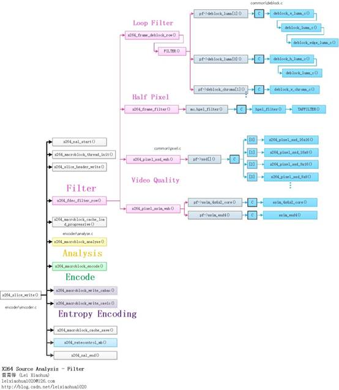
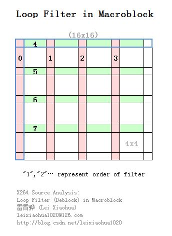
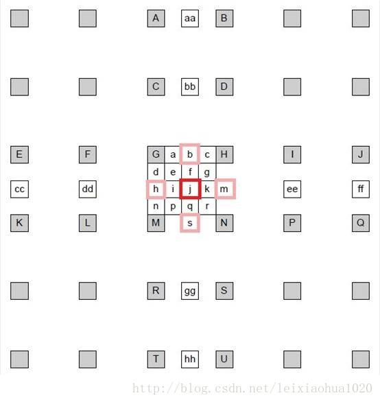
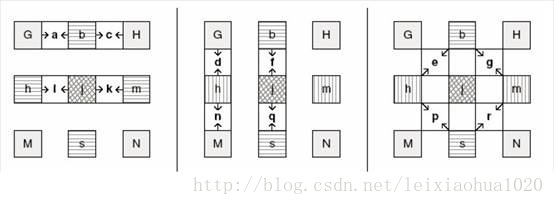
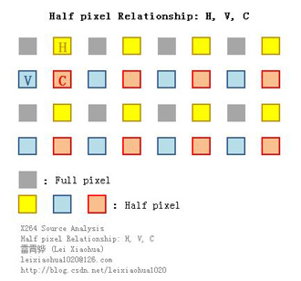

## **libx264: 滤波（Filter）部分**


- **x264_frame_deblock_row()：去块效应滤波器**  
1. **264的重建帧（通过解码得到）一般情况下会出现方块效应。产生这种效应的原因主要有两个：**
    ```sh
    # A. DCT变换后的量化造成误差（主要原因）
    # B. 运动补偿
    #
    # 由于这种块效应的存在，需要添加环路滤波器调整相邻的“块”边缘上的像素值以减轻这种视觉上的不连续感。
    ```

    2. **滤波主干代码：**
        ```C
        //去块效应滤波: 用于对一行宏块进行滤波
        void x264_frame_deblock_row( x264_t *h, int mb_y )
        {
            int b_interlaced = SLICE_MBAFF;
            int a = h->sh.i_alpha_c0_offset - QP_BD_OFFSET;
            int b = h->sh.i_beta_offset - QP_BD_OFFSET;
            int qp_thresh = 15 - X264_MIN( a, b ) - X264_MAX( 0, h->pps->i_chroma_qp_index_offset );
            int stridey   = h->fdec->i_stride[0];
            int strideuv  = h->fdec->i_stride[1];
            int chroma444 = CHROMA444;
            int chroma_height = 16 >> CHROMA_V_SHIFT;
            intptr_t uvdiff = chroma444 ? h->fdec->plane[2] - h->fdec->plane[1] : 1;
        
            for( int mb_x = 0; mb_x < h->mb.i_mb_width; mb_x += (~b_interlaced | mb_y)&1, mb_y ^= b_interlaced )
            {
                x264_prefetch_fenc( h, h->fdec, mb_x, mb_y );
                x264_macroblock_cache_load_neighbours_deblock( h, mb_x, mb_y );
        
                int mb_xy = h->mb.i_mb_xy;
                int transform_8x8 = h->mb.mb_transform_size[mb_xy];
                int intra_cur = IS_INTRA( h->mb.type[mb_xy] );
                uint8_t (*bs)[8][4] = h->deblock_strength[mb_y&1][h->param.b_sliced_threads?mb_xy:mb_x];
                //找到像素数据（宏块的大小是16x16）
                pixel *pixy = h->fdec->plane[0] + 16*mb_y*stridey  + 16*mb_x;
                pixel *pixuv = h->fdec->plane[1] + chroma_height*mb_y*strideuv + 16*mb_x;
        
                if( mb_y & MB_INTERLACED )
                {
                    pixy -= 15*stridey;
                    pixuv -= (chroma_height-1)*strideuv;
                }
        
                int stride2y  = stridey << MB_INTERLACED;
                int stride2uv = strideuv << MB_INTERLACED;
                //QP，用于计算环路滤波的门限值alpha和beta
                int qp = h->mb.qp[mb_xy];
                int qpc = h->chroma_qp_table[qp];
                int first_edge_only = (h->mb.partition[mb_xy] == D_16x16 && !h->mb.cbp[mb_xy] && !intra_cur) || qp <= qp_thresh;
        
                /*
                * 滤波顺序如下所示（大方框代表16x16块）
                *
                * +--4-+--4-+--4-+--4-+
                * 0    1    2    3    |
                * +--5-+--5-+--5-+--5-+
                * 0    1    2    3    |
                * +--6-+--6-+--6-+--6-+
                * 0    1    2    3    |
                * +--7-+--7-+--7-+--7-+
                * 0    1    2    3    |
                * +----+----+----+----+
                *
                */
        
                //一个比较长的宏，用于进行环路滤波
                //根据不同的情况传递不同的参数
                //几个参数的含义：
                //intra：
                //为“_intra”的时候：
                //其中的“deblock_edge##intra()”展开为函数deblock_edge_intra()
                //其中的“h->loopf.deblock_luma##intra[dir]”展开为强滤波汇编函数h->loopf.deblock_luma_intra[dir]()
                //为“”（空），其中的“deblock_edge##intra()”展开为函数deblock_edge()
                //其中的“h->loopf.deblock_luma##intra[dir]”展开为普通滤波汇编函数h->loopf.deblock_luma[dir]()
                //dir：
                //决定了滤波的方向：0为水平滤波器（垂直边界），1为垂直滤波器（水平边界）
                #define FILTER( intra, dir, edge, qp, chroma_qp )\
                do\
                {\
                    if( !(edge & 1) || !transform_8x8 )\
                    {\
                        deblock_edge##intra( h, pixy + 4*edge*(dir?stride2y:1),\
                                            stride2y, bs[dir][edge], qp, a, b, 0,\
                                            h->loopf.deblock_luma##intra[dir] );\
                        if( CHROMA_FORMAT == CHROMA_444 )\
                        {\
                            deblock_edge##intra( h, pixuv          + 4*edge*(dir?stride2uv:1),\
                                                stride2uv, bs[dir][edge], chroma_qp, a, b, 0,\
                                                h->loopf.deblock_luma##intra[dir] );\
                            deblock_edge##intra( h, pixuv + uvdiff + 4*edge*(dir?stride2uv:1),\
                                                stride2uv, bs[dir][edge], chroma_qp, a, b, 0,\
                                                h->loopf.deblock_luma##intra[dir] );\
                        }\
                        else if( CHROMA_FORMAT == CHROMA_420 && !(edge & 1) )\
                        {\
                            deblock_edge##intra( h, pixuv + edge*(dir?2*stride2uv:4),\
                                                stride2uv, bs[dir][edge], chroma_qp, a, b, 1,\
                                                h->loopf.deblock_chroma##intra[dir] );\
                        }\
                    }\
                    if( CHROMA_FORMAT == CHROMA_422 && (dir || !(edge & 1)) )\
                    {\
                        deblock_edge##intra( h, pixuv + edge*(dir?4*stride2uv:4),\
                                            stride2uv, bs[dir][edge], chroma_qp, a, b, 1,\
                                            h->loopf.deblock_chroma##intra[dir] );\
                    }\
                } while(0)
        
                if( h->mb.i_neighbour & MB_LEFT )
                {
                    if( b_interlaced && h->mb.field[h->mb.i_mb_left_xy[0]] != MB_INTERLACED )
                    {
                        //隔行的
                        int luma_qp[2];
                        int chroma_qp[2];
                        int left_qp[2];
                        x264_deblock_inter_t luma_deblock = h->loopf.deblock_luma_mbaff;
                        x264_deblock_inter_t chroma_deblock = h->loopf.deblock_chroma_mbaff;
                        x264_deblock_intra_t luma_intra_deblock = h->loopf.deblock_luma_intra_mbaff;
                        x264_deblock_intra_t chroma_intra_deblock = h->loopf.deblock_chroma_intra_mbaff;
                        int c = chroma444 ? 0 : 1;
        
                        left_qp[0] = h->mb.qp[h->mb.i_mb_left_xy[0]];
                        luma_qp[0] = (qp + left_qp[0] + 1) >> 1;
                        chroma_qp[0] = (qpc + h->chroma_qp_table[left_qp[0]] + 1) >> 1;
                        if( intra_cur || IS_INTRA( h->mb.type[h->mb.i_mb_left_xy[0]] ) )
                        {
                            deblock_edge_intra( h, pixy,           2*stridey,  bs[0][0], luma_qp[0],   a, b, 0, luma_intra_deblock );
                            deblock_edge_intra( h, pixuv,          2*strideuv, bs[0][0], chroma_qp[0], a, b, c, chroma_intra_deblock );
                            if( chroma444 )
                                deblock_edge_intra( h, pixuv + uvdiff, 2*strideuv, bs[0][0], chroma_qp[0], a, b, c, chroma_intra_deblock );
                        }
                        else
                        {
                            deblock_edge( h, pixy,           2*stridey,  bs[0][0], luma_qp[0],   a, b, 0, luma_deblock );
                            deblock_edge( h, pixuv,          2*strideuv, bs[0][0], chroma_qp[0], a, b, c, chroma_deblock );
                            if( chroma444 )
                                deblock_edge( h, pixuv + uvdiff, 2*strideuv, bs[0][0], chroma_qp[0], a, b, c, chroma_deblock );
                        }
        
                        int offy = MB_INTERLACED ? 4 : 0;
                        int offuv = MB_INTERLACED ? 4-CHROMA_V_SHIFT : 0;
                        left_qp[1] = h->mb.qp[h->mb.i_mb_left_xy[1]];
                        luma_qp[1] = (qp + left_qp[1] + 1) >> 1;
                        chroma_qp[1] = (qpc + h->chroma_qp_table[left_qp[1]] + 1) >> 1;
                        if( intra_cur || IS_INTRA( h->mb.type[h->mb.i_mb_left_xy[1]] ) )
                        {
                            deblock_edge_intra( h, pixy           + (stridey<<offy),   2*stridey,  bs[0][4], luma_qp[1],   a, b, 0, luma_intra_deblock );
                            deblock_edge_intra( h, pixuv          + (strideuv<<offuv), 2*strideuv, bs[0][4], chroma_qp[1], a, b, c, chroma_intra_deblock );
                            if( chroma444 )
                                deblock_edge_intra( h, pixuv + uvdiff + (strideuv<<offuv), 2*strideuv, bs[0][4], chroma_qp[1], a, b, c, chroma_intra_deblock );
                        }
                        else
                        {
                            deblock_edge( h, pixy           + (stridey<<offy),   2*stridey,  bs[0][4], luma_qp[1],   a, b, 0, luma_deblock );
                            deblock_edge( h, pixuv          + (strideuv<<offuv), 2*strideuv, bs[0][4], chroma_qp[1], a, b, c, chroma_deblock );
                            if( chroma444 )
                                deblock_edge( h, pixuv + uvdiff + (strideuv<<offuv), 2*strideuv, bs[0][4], chroma_qp[1], a, b, c, chroma_deblock );
                        }
                    }
                    else
                    {
                        //逐行的
        
                        //左边宏块的qp
                        int qpl = h->mb.qp[h->mb.i_mb_xy-1];
                        int qp_left = (qp + qpl + 1) >> 1;
                        int qpc_left = (qpc + h->chroma_qp_table[qpl] + 1) >> 1;
                        //Intra宏块左边宏块的qp
                        int intra_left = IS_INTRA( h->mb.type[h->mb.i_mb_xy-1] );
                        int intra_deblock = intra_cur || intra_left;
        
                        /* Any MB that was coded, or that analysis decided to skip, has quality commensurate with its QP.
                        * But if deblocking affects neighboring MBs that were force-skipped, blur might accumulate there.
                        * So reset their effective QP to max, to indicate that lack of guarantee. */
                        if( h->fdec->mb_info && M32( bs[0][0] ) )
                        {
        #define RESET_EFFECTIVE_QP(xy) h->fdec->effective_qp[xy] |= 0xff * !!(h->fdec->mb_info[xy] & X264_MBINFO_CONSTANT);
                            RESET_EFFECTIVE_QP(mb_xy);
                            RESET_EFFECTIVE_QP(h->mb.i_mb_left_xy[0]);
                        }
        
                        if( intra_deblock )
                            FILTER( _intra, 0, 0, qp_left, qpc_left );//【0】强滤波，水平滤波器（垂直边界）
                        else
                            FILTER(       , 0, 0, qp_left, qpc_left );//【0】普通滤波，水平滤波器（垂直边界）
                    }
                }
                if( !first_edge_only )
                {
                    //普通滤波，水平滤波器（垂直边界）
                    FILTER( , 0, 1, qp, qpc );//【1】
                    FILTER( , 0, 2, qp, qpc );//【2】
                    FILTER( , 0, 3, qp, qpc );//【3】
                }
        
                if( h->mb.i_neighbour & MB_TOP )
                {
                    if( b_interlaced && !(mb_y&1) && !MB_INTERLACED && h->mb.field[h->mb.i_mb_top_xy] )
                    {
                        int mbn_xy = mb_xy - 2 * h->mb.i_mb_stride;
        
                        for( int j = 0; j < 2; j++, mbn_xy += h->mb.i_mb_stride )
                        {
                            int qpt = h->mb.qp[mbn_xy];
                            int qp_top = (qp + qpt + 1) >> 1;
                            int qpc_top = (qpc + h->chroma_qp_table[qpt] + 1) >> 1;
                            int intra_top = IS_INTRA( h->mb.type[mbn_xy] );
                            if( intra_cur || intra_top )
                                M32( bs[1][4*j] ) = 0x03030303;
        
                            // deblock the first horizontal edge of the even rows, then the first horizontal edge of the odd rows
                            deblock_edge( h, pixy      + j*stridey,  2* stridey, bs[1][4*j], qp_top, a, b, 0, h->loopf.deblock_luma[1] );
                            if( chroma444 )
                            {
                                deblock_edge( h, pixuv          + j*strideuv, 2*strideuv, bs[1][4*j], qpc_top, a, b, 0, h->loopf.deblock_luma[1] );
                                deblock_edge( h, pixuv + uvdiff + j*strideuv, 2*strideuv, bs[1][4*j], qpc_top, a, b, 0, h->loopf.deblock_luma[1] );
                            }
                            else
                                deblock_edge( h, pixuv          + j*strideuv, 2*strideuv, bs[1][4*j], qpc_top, a, b, 1, h->loopf.deblock_chroma[1] );
                        }
                    }
                    else
                    {
                        int qpt = h->mb.qp[h->mb.i_mb_top_xy];
                        int qp_top = (qp + qpt + 1) >> 1;
                        int qpc_top = (qpc + h->chroma_qp_table[qpt] + 1) >> 1;
                        int intra_top = IS_INTRA( h->mb.type[h->mb.i_mb_top_xy] );
                        int intra_deblock = intra_cur || intra_top;
        
                        /* This edge has been modified, reset effective qp to max. */
                        if( h->fdec->mb_info && M32( bs[1][0] ) )
                        {
                            RESET_EFFECTIVE_QP(mb_xy);
                            RESET_EFFECTIVE_QP(h->mb.i_mb_top_xy);
                        }
        
                        if( (!b_interlaced || (!MB_INTERLACED && !h->mb.field[h->mb.i_mb_top_xy])) && intra_deblock )
                        {
                            FILTER( _intra, 1, 0, qp_top, qpc_top );//【4】普通滤波，垂直滤波器（水平边界）
                        }
                        else
                        {
                            if( intra_deblock )
                                M32( bs[1][0] ) = 0x03030303;
                            FILTER(       , 1, 0, qp_top, qpc_top );//【4】普通滤波，垂直滤波器（水平边界）
                        }
                    }
                }
        
                if( !first_edge_only )
                {
                    //普通滤波，垂直滤波器（水平边界）
                    FILTER( , 1, 1, qp, qpc );//【5】
                    FILTER( , 1, 2, qp, qpc );//【6】
                    FILTER( , 1, 3, qp, qpc );//【7】
                }
        
                #undef FILTER
            }
        }

        // “intra”指定了是普通滤波（Bs=1，2，3）还是强滤波（Bs=4）；
        // “dir”指定了滤波器的方向。0为水平滤波器（垂直边界），1为垂直滤波器（水平边界）；
        // “edge”指定了边界的位置。“0”，“1”，“2”，“3”分别代表了水平（或者垂直）的4条边界；

        /*
        滤波的主干代码如下所示。
        FILTER( _intra, 0, 0, qp_left, qpc_left );//【0】强滤波，水平滤波器（垂直边界）
        //普通滤波，水平滤波器（垂直边界）
        FILTER( , 0, 1, qp, qpc );//【1】
        FILTER( , 0, 2, qp, qpc );//【2】
        FILTER( , 0, 3, qp, qpc );//【3】
        FILTER( _intra, 1, 0, qp_top, qpc_top );//【4】普通滤波，垂直滤波器（水平边界）
        //普通滤波，垂直滤波器（水平边界）
        FILTER( , 1, 1, qp, qpc );//【5】
        FILTER( , 1, 2, qp, qpc );//【6】
        上述代码滤波的顺序如下图所示。图中蓝色边缘的边界是强滤波，其他边界是普通滤波.
        */
        ```
          

    3. **滤波知识：**
        ```sh
        # 环路滤波分类
        # 环路滤波器根据滤波的强度可以分为两种：
        # A. 普通滤波器。针对边界的Bs（边界强度）为1、2、3的滤波器。
        #    此时环路滤波涉及到方块边界周围的6个点（边界两边各3个点）：p2，p1，p0，q0，q1，q2。需要处理4个点（边界两边各2个点，只以p点为例）：
        #    p0’ = p0 + (((q0 - p0 ) << 2) + (p1 - q1) + 4) >> 3
        #    p1’ = ( p2 + ( ( p0 + q0 + 1 ) >> 1) – 2p1 ) >> 1
        #
        # B. 强滤波器。针对边界的Bs（边界强度）为4的滤波器。
        #   此时环路滤波涉及到方块边界周围的8个点（边界两边各4个点）：p3，p2，p1，p0，q0，q1，q2，q3。需要处理6个点（边界两边各3个点，只以p点为例）：
        #   p0’ = ( p2 + 2*p1 + 2*p0 + 2*q0 + q1 + 4 ) >> 3
        #   p1’ = ( p2 + p1 + p0 + q0 + 2 ) >> 2
        #   p2’ = ( 2*p3 + 3*p2 + p1 + p0 + q0 + 4 ) >> 3
        ```
    4. **滤波强度bs的判断模型【即：代码要实现的效果】**
        |条件（针对两边的图像块）|Bs|
        |:--|:--|
        |有一个块为帧内预测 + 边界为宏块边界|4|
        |有一个块为帧内预测|3|
        |有一个块对残差编码|2|
        |运动矢量差不小于1像素|1|
        |运动补偿参考帧不同|1|
        |其它|0|
        |||

    5. **环路滤波的门限**
        ```sh
        # 并不是所有的块的边界处都需要环路滤波。例如画面中物体的边界正好和块的边界重合的话，就不能进行滤波，否则会使画面中物体的边界变模糊。因此需要区别开物体边界和块效应边界。
        # 一般情况下，物体边界两边的像素值差别很大，而块效应边界两边像素值差别比较小。《H.264标准》以这个特点定义了2个变量alpha和beta来判决边界是否需要进行环路滤波。
        #   只有满足下面三个条件的时候才能进行环路滤波：
        #
        #   | p0 - q0 | < alpha
        #   | p1 – p0 | < beta
        #   | q1 - q0 | < beta
        #   
        #   简而言之，就是边界两边的两个点的像素值不能太大，即不能超过alpha；边界一边的前两个点之间的像素值也不能太大，即不能超过beta。
        #   其中alpha和beta是根据量化参数QP推算出来（具体方法不再记录）。总体说来QP越大，alpha和beta的值也越大，也就越容易触发环路滤波。
        #   由于QP越大表明压缩的程度越大，所以也可以得知高压缩比的情况下更需要进行环路滤波
        ```

- **x264_frame_filter()：半像素插值【运动补偿】**
    1. **1/4像素内插: 把原先的1个像素点拓展成4x4一共16个点**
        ```sh
        # 《H.264标准》中规定，运动估计为1/4像素精度。
        # 因此在H.264编码和解码的过程中，需要将画面中的像素进行插值——简单地说就是把原先的1个像素点拓展成4x4一共16个点。
        # 下图显示了H.264编码和解码过程中像素插值情况。可以看出原先的G点的右下方通过插值的方式产生了a、b、c、d等一共16个点。
        ```  
        
        ```sh
        # 如图所示，1/4像素内插一般分成两步：
        # A. 半像素内插: 这一步通过6抽头滤波器获得5个半像素点。
        #       图中半像素内插点为b、m、h、s、j五个点。
        #       半像素内插方法是对整像素点进行6 抽头滤波得出，滤波器的权重为(1/32, -5/32, 5/8, 5/8, -5/32, 1/32)。
        #
        #    例如b的计算公式为：b=round( (E - 5F + 20G + 20H - 5I + J ) / 32)
        #       剩下几个半像素点的计算关系如下：
        #       m：由B、D、H、N、S、U计算
        #       h：由A、C、G、M、R、T计算
        #       s：由K、L、M、N、P、Q计算
        #       j：由cc、dd、h、m、ee、ff计算。
        #
        #   需要注意j点的运算量比较大，因为cc、dd、ee、ff都需要通过半像素内插方法进行计算。
        #
        # B. 线性内插: 这一步通过简单的线性内插获得剩余的1/4像素点。
        #       在获得半像素点之后，就可以通过简单的线性内插获得1/4像素内插点了。
        #       1/4像素内插的方式如下图所示。例如图中a点的计算公式如下：    A=round( (G+b)/2 )
        #          
        #   在这里有一点需要注意：位于4个角的e、g、p、r四个点并不是通过j点计算计算的，而是通过b、h、s、m四个半像素点计算的。
        #
        ```
        1/4像素内插点是通过是通过半像素点之间（或者和整像素点）线性内插获得  
        

    2. **x264_mc_init()**
        x264_mc_init()用于初始化运动补偿相关的汇编函数。该函数的定义位于common\mc.c，如下所示: 
        ```c
        // 运动补偿
        void x264_mc_init( int cpu, x264_mc_functions_t *pf, int cpu_independent )
        {
            //亮度运动补偿
            pf->mc_luma   = mc_luma;
            //获得匹配块
            pf->get_ref   = get_ref;
        
            pf->mc_chroma = mc_chroma;
            //求平均
            pf->avg[PIXEL_16x16]= pixel_avg_16x16;
            pf->avg[PIXEL_16x8] = pixel_avg_16x8;
            pf->avg[PIXEL_8x16] = pixel_avg_8x16;
            pf->avg[PIXEL_8x8]  = pixel_avg_8x8;
            pf->avg[PIXEL_8x4]  = pixel_avg_8x4;
            pf->avg[PIXEL_4x16] = pixel_avg_4x16;
            pf->avg[PIXEL_4x8]  = pixel_avg_4x8;
            pf->avg[PIXEL_4x4]  = pixel_avg_4x4;
            pf->avg[PIXEL_4x2]  = pixel_avg_4x2;
            pf->avg[PIXEL_2x8]  = pixel_avg_2x8;
            pf->avg[PIXEL_2x4]  = pixel_avg_2x4;
            pf->avg[PIXEL_2x2]  = pixel_avg_2x2;
            //加权相关
            pf->weight    = x264_mc_weight_wtab;
            pf->offsetadd = x264_mc_weight_wtab;
            pf->offsetsub = x264_mc_weight_wtab;
            pf->weight_cache = x264_weight_cache;
            //赋值-只包含了方形的
            pf->copy_16x16_unaligned = mc_copy_w16;
            pf->copy[PIXEL_16x16] = mc_copy_w16;
            pf->copy[PIXEL_8x8]   = mc_copy_w8;
            pf->copy[PIXEL_4x4]   = mc_copy_w4;
        
            pf->store_interleave_chroma       = store_interleave_chroma;
            pf->load_deinterleave_chroma_fenc = load_deinterleave_chroma_fenc;
            pf->load_deinterleave_chroma_fdec = load_deinterleave_chroma_fdec;
            //拷贝像素-不论像素块大小
            pf->plane_copy = x264_plane_copy_c;
            pf->plane_copy_interleave = x264_plane_copy_interleave_c;
            pf->plane_copy_deinterleave = x264_plane_copy_deinterleave_c;
            pf->plane_copy_deinterleave_rgb = x264_plane_copy_deinterleave_rgb_c;
            pf->plane_copy_deinterleave_v210 = x264_plane_copy_deinterleave_v210_c;
            //关键：半像素内插
            pf->hpel_filter = hpel_filter;
            //几个空函数
            pf->prefetch_fenc_420 = prefetch_fenc_null;
            pf->prefetch_fenc_422 = prefetch_fenc_null;
            pf->prefetch_ref  = prefetch_ref_null;
            pf->memcpy_aligned = memcpy;
            pf->memzero_aligned = memzero_aligned;
            //降低分辨率-线性内插（不是半像素内插）
            pf->frame_init_lowres_core = frame_init_lowres_core;
        
            pf->integral_init4h = integral_init4h;
            pf->integral_init8h = integral_init8h;
            pf->integral_init4v = integral_init4v;
            pf->integral_init8v = integral_init8v;
        
            pf->mbtree_propagate_cost = mbtree_propagate_cost;
            pf->mbtree_propagate_list = mbtree_propagate_list;
            //各种汇编版本
        #if HAVE_MMX
            x264_mc_init_mmx( cpu, pf );
        #endif
        #if HAVE_ALTIVEC
            if( cpu&X264_CPU_ALTIVEC )
                x264_mc_altivec_init( pf );
        #endif
        #if HAVE_ARMV6
            x264_mc_init_arm( cpu, pf );
        #endif
        #if ARCH_AARCH64
            x264_mc_init_aarch64( cpu, pf );
        #endif
        
            if( cpu_independent )
            {
                pf->mbtree_propagate_cost = mbtree_propagate_cost;
                pf->mbtree_propagate_list = mbtree_propagate_list;
            }
        }
        // 从源代码可以看出，x264_mc_init()中包含了大量的像素内插、拷贝、求平均的函数。这些函数都是用于在H.264编码过程中进行运动估计和运动补偿的。其中半像素内插函数是hpel_filter()。
        ```
        hpel_filter()用于进行半像素插值。该函数的定义位于common\mc.c，如下所示:
        ```c
        //半像素插值公式
        //b= (E - 5F + 20G + 20H - 5I + J)/32
        //              x
        //d取1，水平滤波器；d取stride，垂直滤波器（这里没有除以32）
        #define TAPFILTER(pix, d) ((pix)[x-2*d] + (pix)[x+3*d] - 5*((pix)[x-d] + (pix)[x+2*d]) + 20*((pix)[x] + (pix)[x+d]))
        
        /*
        * 半像素插值
        * dsth：水平滤波得到的半像素点(aa,bb,b,s,gg,hh)
        * dstv：垂直滤波的到的半像素点(cc,dd,h,m,ee,ff)
        * dstc：“水平+垂直”滤波得到的位于4个像素中间的半像素点（j）
        *
        * 半像素插值示意图如下：
        *
        *         A aa B
        *
        *         C bb D
        *
        * E   F   G  b H   I   J
        *
        * cc  dd  h  j m  ee  ff
        *
        * K   L   M  s N   P   Q
        *
        *         R gg S
        *
        *         T hh U
        *
        * 计算公式如下：
        * b=round( (E - 5F + 20G + 20H - 5I + J ) / 32)
        *
        * 剩下几个半像素点的计算关系如下：
        * m：由B、D、H、N、S、U计算
        * h：由A、C、G、M、R、T计算
        * s：由K、L、M、N、P、Q计算
        * j：由cc、dd、h、m、ee、ff计算。需要注意j点的运算量比较大，因为cc、dd、ee、ff都需要通过半像素内插方法进行计算。
        *
        */
        static void hpel_filter( pixel *dsth, pixel *dstv, pixel *dstc, pixel *src,
                                intptr_t stride, int width, int height, int16_t *buf )
        {
            const int pad = (BIT_DEPTH > 9) ? (-10 * PIXEL_MAX) : 0;
            /*
            * 几种半像素点之间的位置关系
            *
            * X： 像素点
            * H：水平滤波半像素点
            * V：垂直滤波半像素点
            * C： 中间位置半像素点
            *
            * X   H   X       X       X
            *
            * V   C
            *
            * X       X       X       X
            *
            *
            *
            * X       X       X       X
            *
            */
            //一行一行处理
            for( int y = 0; y < height; y++ )
            {
                //一个一个点处理
                //每个整像素点都对应h，v，c三个半像素点
                //v
                for( int x = -2; x < width+3; x++ )//(aa,bb,b,s,gg,hh),结果存入buf
                {
                    //垂直滤波半像素点
                    int v = TAPFILTER(src,stride);
                    dstv[x] = x264_clip_pixel( (v + 16) >> 5 );
                    /* transform v for storage in a 16-bit integer */
                    //这应该是给dstc计算使用的？
                    buf[x+2] = v + pad;
                }
                //c
                for( int x = 0; x < width; x++ )
                    dstc[x] = x264_clip_pixel( (TAPFILTER(buf+2,1) - 32*pad + 512) >> 10 );//四个相邻像素中间的半像素点
                //h
                for( int x = 0; x < width; x++ )
                    dsth[x] = x264_clip_pixel( (TAPFILTER(src,1) + 16) >> 5 );//水平滤波半像素点
                dsth += stride;
                dstv += stride;
                dstc += stride;
                src += stride;
            }
        }
        // 从源代码可以看出，hpel_filter()中包含了一个宏TAPFILTER()用来完成半像素点像素值的计算。
        // 在完成半像素插值工作后，dsth中存储的是经过水平插值后的半像素点，dstv中存储的是经过垂直插值后的半像素点，dstc中存储的是位于4个相邻像素点中间位置的半像素点。
        // 这三块内存中的点的位置关系如下图所示（灰色的点是整像素点）。
        ```
        

- **x264_pixel_ssd_wxh()：PSNR计算**  
- **x264_pixel_ssim_wxh()：SSIM计算** 


