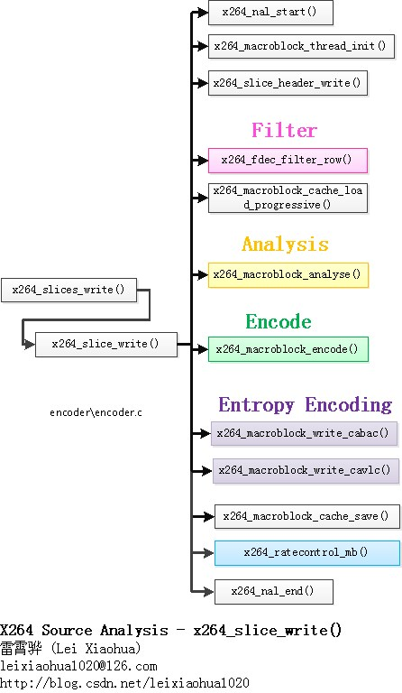
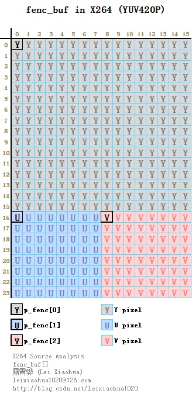
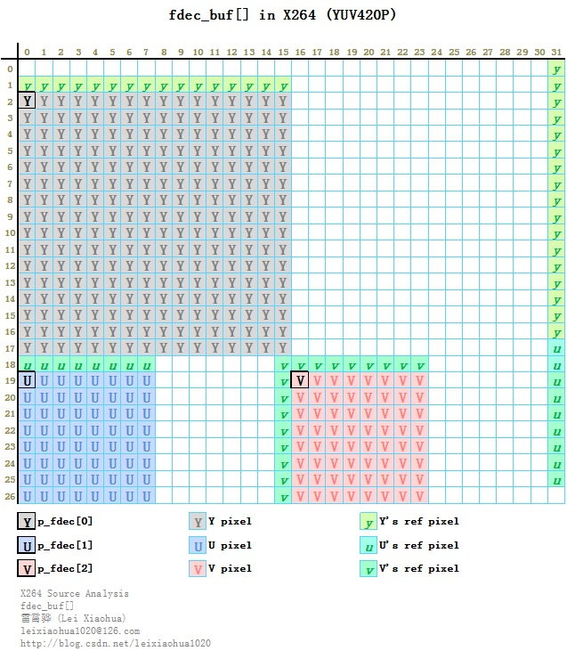
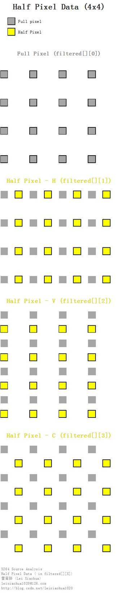

## **libx264_slice_write() 函数简介**

### **A. libx264_slice_write() 函数框架图**
```markdown
1. x264_nal_start()：开始写一个NALU。
2. x264_macroblock_thread_init()：初始化宏块重建数据缓存fdec_buf[]和编码数据缓存fenc_buf[]。
3. x264_slice_header_write()：输出 Slice Header。
4. x264_fdec_filter_row()：滤波模块。该模块包含了环路滤波，半像素插值，SSIM/PSNR的计算。
5. x264_macroblock_cache_load()：将要编码的宏块的周围的宏块的信息读进来。
6. x264_macroblock_analyse()：分析模块。该模块包含了帧内预测模式分析以及帧间运动估计等。
7. x264_macroblock_encode()：宏块编码模块。该模块通过对残差的DCT变换、量化等方式对宏块进行编码。
8. x264_macroblock_write_cabac()：CABAC熵编码模块。
9. x264_macroblock_write_cavlc()：CAVLC熵编码模块。
10. x264_macroblock_cache_save()：保存当前宏块的信息。
11. x264_ratecontrol_mb()：码率控制。
12. x264_nal_end()：结束写一个NALU。
```  


### **B. libx264_slice_write()代码**
```c
/****************************************************************************
 * 真正的编码——编码1个Slice
 * 注释和处理：雷霄骅
 * http://blog.csdn.net/leixiaohua1020
 * leixiaohua1020@126.com
 ****************************************************************************/
static intptr_t x264_slice_write( x264_t *h )
{
    int i_skip;
    //宏块的序号，以及序号对应的x，y坐标
    int mb_xy, i_mb_x, i_mb_y;
    /* NALUs other than the first use a 3-byte startcode.
     * Add one extra byte for the rbsp, and one more for the final CABAC putbyte.
     * Then add an extra 5 bytes just in case, to account for random NAL escapes and
     * other inaccuracies. */
    /*
     * 第一个以外的nalu使用3字节的开始代码。
     * 为rbsp添加一个额外的字节，并为最终的CABAC putbyte添加一个额外的字节。
     * 然后添加一个额外的5字节只是以防万一，以考虑随机NAL转义和其他错误
    */
    int overhead_guess = (NALU_OVERHEAD - (h->param.b_annexb && h->out.i_nal)) + 1 + h->param.b_cabac + 5;
    int slice_max_size = h->param.i_slice_max_size > 0 ? (h->param.i_slice_max_size-overhead_guess)*8 : 0;
    int back_up_bitstream_cavlc = !h->param.b_cabac && h->sps->i_profile_idc < PROFILE_HIGH;
    int back_up_bitstream = slice_max_size || back_up_bitstream_cavlc;
    int starting_bits = bs_pos(&h->out.bs);
    int b_deblock = h->sh.i_disable_deblocking_filter_idc != 1;
    int b_hpel = h->fdec->b_kept_as_ref;
    int orig_last_mb = h->sh.i_last_mb;
    int thread_last_mb = h->i_threadslice_end * h->mb.i_mb_width - 1;
    uint8_t *last_emu_check;
#define BS_BAK_SLICE_MAX_SIZE 0
#define BS_BAK_CAVLC_OVERFLOW 1
#define BS_BAK_SLICE_MIN_MBS  2
#define BS_BAK_ROW_VBV        3
    x264_bs_bak_t bs_bak[4];
    b_deblock &= b_hpel || h->param.b_full_recon || h->param.psz_dump_yuv;
    bs_realign( &h->out.bs );
 
    /* Slice */
    //开始输出一个NAL
    //后面对应着x264_nal_end()
    x264_nal_start( h, h->i_nal_type, h->i_nal_ref_idc );
    h->out.nal[h->out.i_nal].i_first_mb = h->sh.i_first_mb;
 
    /* Slice header */
 
    //存储宏块像素的缓存fdec_buf和fenc_buf的初始化
    //宏块编码缓存p_fenc[0]，p_fenc[1]，p_fenc[2]
    //宏块重建缓存p_fdec[0]，p_fdec[1]，p_fdec[2]
    //[0]存Y，[1]存U，[2]存V
    x264_macroblock_thread_init( h );
 
    /* Set the QP equal to the first QP in the slice for more accurate CABAC initialization. */
    h->mb.i_mb_xy = h->sh.i_first_mb;
    h->sh.i_qp = x264_ratecontrol_mb_qp( h );
    h->sh.i_qp = SPEC_QP( h->sh.i_qp );
    h->sh.i_qp_delta = h->sh.i_qp - h->pps->i_pic_init_qp;
    //输出 slice header
    x264_slice_header_write( &h->out.bs, &h->sh, h->i_nal_ref_idc );
    //如果使用CABAC，需要初始化
    if( h->param.b_cabac )
    {
        /* alignment needed */
        bs_align_1( &h->out.bs );
 
        /* init cabac */
        x264_cabac_context_init( h, &h->cabac, h->sh.i_type, x264_clip3( h->sh.i_qp-QP_BD_OFFSET, 0, 51 ), h->sh.i_cabac_init_idc );
        x264_cabac_encode_init ( &h->cabac, h->out.bs.p, h->out.bs.p_end );
        last_emu_check = h->cabac.p;
    }
    else
        last_emu_check = h->out.bs.p;
    h->mb.i_last_qp = h->sh.i_qp;
    h->mb.i_last_dqp = 0;
    h->mb.field_decoding_flag = 0;
    //宏块位置-纵坐标（初始值）
    i_mb_y = h->sh.i_first_mb / h->mb.i_mb_width;
    //宏块位置-横坐标（初始值）
    i_mb_x = h->sh.i_first_mb % h->mb.i_mb_width;
    i_skip = 0;
 
    //一个大循环
    //对一个slice中每个宏块进行编码
    while( 1 )
    {
    	//宏块序号。由i_mb_x和i_mb_y计算而来。
        mb_xy = i_mb_x + i_mb_y * h->mb.i_mb_width;
        int mb_spos = bs_pos(&h->out.bs) + x264_cabac_pos(&h->cabac);
        //一行的开始
        if( i_mb_x == 0 )
        {
            if( x264_bitstream_check_buffer( h ) )
                return -1;
            if( !(i_mb_y & SLICE_MBAFF) && h->param.rc.i_vbv_buffer_size )
                x264_bitstream_backup( h, &bs_bak[BS_BAK_ROW_VBV], i_skip, 1 );
            //去块效应滤波、半像素插值、SSIM/PSNR计算等
            //一次处理一行宏块
            if( !h->mb.b_reencode_mb )
                x264_fdec_filter_row( h, i_mb_y, 0 );
        }
 
        if( back_up_bitstream )
        {
            if( back_up_bitstream_cavlc )
                x264_bitstream_backup( h, &bs_bak[BS_BAK_CAVLC_OVERFLOW], i_skip, 0 );
            if( slice_max_size && !(i_mb_y & SLICE_MBAFF) )
            {
                x264_bitstream_backup( h, &bs_bak[BS_BAK_SLICE_MAX_SIZE], i_skip, 0 );
                if( (thread_last_mb+1-mb_xy) == h->param.i_slice_min_mbs )
                    x264_bitstream_backup( h, &bs_bak[BS_BAK_SLICE_MIN_MBS], i_skip, 0 );
            }
        }
 
        if( PARAM_INTERLACED )
        {
            if( h->mb.b_adaptive_mbaff )
            {
                if( !(i_mb_y&1) )
                {
                    /* FIXME: VSAD is fast but fairly poor at choosing the best interlace type. */
                    h->mb.b_interlaced = x264_field_vsad( h, i_mb_x, i_mb_y );
                    memcpy( &h->zigzagf, MB_INTERLACED ? &h->zigzagf_interlaced : &h->zigzagf_progressive, sizeof(h->zigzagf) );
                    if( !MB_INTERLACED && (i_mb_y+2) == h->mb.i_mb_height )
                        x264_expand_border_mbpair( h, i_mb_x, i_mb_y );
                }
            }
            h->mb.field[mb_xy] = MB_INTERLACED;
        }
 
        /* load cache */
        //将要编码的宏块的周围的宏块的值读进来
        //主要是上面、左边块的值
        if( SLICE_MBAFF )
            x264_macroblock_cache_load_interlaced( h, i_mb_x, i_mb_y );
        else
            x264_macroblock_cache_load_progressive( h, i_mb_x, i_mb_y );
        //分析-帧内预测模式选择、帧间运动估计等
        x264_macroblock_analyse( h );
 
        /* encode this macroblock -> be careful it can change the mb type to P_SKIP if needed */
reencode:
		//编码-残差DCT变换、量化
        x264_macroblock_encode( h );
        //输出CABAC
        if( h->param.b_cabac )
        {
            if( mb_xy > h->sh.i_first_mb && !(SLICE_MBAFF && (i_mb_y&1)) )
                x264_cabac_encode_terminal( &h->cabac );
 
            if( IS_SKIP( h->mb.i_type ) )
                x264_cabac_mb_skip( h, 1 );
            else
            {
                if( h->sh.i_type != SLICE_TYPE_I )
                    x264_cabac_mb_skip( h, 0 );
                //输出
                x264_macroblock_write_cabac( h, &h->cabac );
            }
        }
        else
        {
        	//输出CAVLC
            if( IS_SKIP( h->mb.i_type ) )
                i_skip++;
            else
            {
                if( h->sh.i_type != SLICE_TYPE_I )
                {
                    bs_write_ue( &h->out.bs, i_skip );  /* skip run */
                    i_skip = 0;
                }
                //输出
                x264_macroblock_write_cavlc( h );
                /* If there was a CAVLC level code overflow, try again at a higher QP. */
                if( h->mb.b_overflow )
                {
                    h->mb.i_chroma_qp = h->chroma_qp_table[++h->mb.i_qp];
                    h->mb.i_skip_intra = 0;
                    h->mb.b_skip_mc = 0;
                    h->mb.b_overflow = 0;
                    x264_bitstream_restore( h, &bs_bak[BS_BAK_CAVLC_OVERFLOW], &i_skip, 0 );
                    goto reencode;
                }
            }
        }
 
        int total_bits = bs_pos(&h->out.bs) + x264_cabac_pos(&h->cabac);
        int mb_size = total_bits - mb_spos;
 
        if( slice_max_size && (!SLICE_MBAFF || (i_mb_y&1)) )
        {
            /* Count the skip run, just in case. */
            if( !h->param.b_cabac )
                total_bits += bs_size_ue_big( i_skip );
            /* Check for escape bytes. */
            uint8_t *end = h->param.b_cabac ? h->cabac.p : h->out.bs.p;
            for( ; last_emu_check < end - 2; last_emu_check++ )
                if( last_emu_check[0] == 0 && last_emu_check[1] == 0 && last_emu_check[2] <= 3 )
                {
                    slice_max_size -= 8;
                    last_emu_check++;
                }
            /* We'll just re-encode this last macroblock if we go over the max slice size. */
            if( total_bits - starting_bits > slice_max_size && !h->mb.b_reencode_mb )
            {
                if( !x264_frame_new_slice( h, h->fdec ) )
                {
                    /* Handle the most obnoxious slice-min-mbs edge case: we need to end the slice
                     * because it's gone over the maximum size, but doing so would violate slice-min-mbs.
                     * If possible, roll back to the last checkpoint and try again.
                     * We could try raising QP, but that would break in the case where a slice spans multiple
                     * rows, which the re-encoding infrastructure can't currently handle. 
                     */
                    // 处理最讨厌的slice-min-mbs边缘情况:我们需要结束切片,因为它超过了最大大小，但是这样做会违反slice-min-mbs。
                    // 如果可能，回滚到最后一个检查点，再试一次。我们可以尝试提高QP，但在片跨多个的情况下会打破行，这是重新编码的基础结构目前不能处理的。
                    if( mb_xy <= thread_last_mb && (thread_last_mb+1-mb_xy) < h->param.i_slice_min_mbs )
                    {
                        if( thread_last_mb-h->param.i_slice_min_mbs < h->sh.i_first_mb+h->param.i_slice_min_mbs )
                        {
                            x264_log( h, X264_LOG_WARNING, "slice-max-size violated (frame %d, cause: slice-min-mbs)\n", h->i_frame );
                            slice_max_size = 0;
                            goto cont;
                        }
                        x264_bitstream_restore( h, &bs_bak[BS_BAK_SLICE_MIN_MBS], &i_skip, 0 );
                        h->mb.b_reencode_mb = 1;
                        h->sh.i_last_mb = thread_last_mb-h->param.i_slice_min_mbs;
                        break;
                    }
                    if( mb_xy-SLICE_MBAFF*h->mb.i_mb_stride != h->sh.i_first_mb )
                    {
                        x264_bitstream_restore( h, &bs_bak[BS_BAK_SLICE_MAX_SIZE], &i_skip, 0 );
                        h->mb.b_reencode_mb = 1;
                        if( SLICE_MBAFF )
                        {
                            // set to bottom of previous mbpair
                            if( i_mb_x )
                                h->sh.i_last_mb = mb_xy-1+h->mb.i_mb_stride*(!(i_mb_y&1));
                            else
                                h->sh.i_last_mb = (i_mb_y-2+!(i_mb_y&1))*h->mb.i_mb_stride + h->mb.i_mb_width - 1;
                        }
                        else
                            h->sh.i_last_mb = mb_xy-1;
                        break;
                    }
                    else
                        h->sh.i_last_mb = mb_xy;
                }
                else
                    slice_max_size = 0;
            }
        }
cont:
        h->mb.b_reencode_mb = 0;
 
        /* save cache */
        //保存当前宏块的的值，用于以后的宏块的编码
        //包括Intra4x4宏块帧内预测模式，DCT非零系数，运动矢量，参考帧序号等等
        x264_macroblock_cache_save( h );
        //码率控制
        if( x264_ratecontrol_mb( h, mb_size ) < 0 )
        {
            x264_bitstream_restore( h, &bs_bak[BS_BAK_ROW_VBV], &i_skip, 1 );
            h->mb.b_reencode_mb = 1;
            i_mb_x = 0;
            i_mb_y = i_mb_y - SLICE_MBAFF;
            h->mb.i_mb_prev_xy = i_mb_y * h->mb.i_mb_stride - 1;
            h->sh.i_last_mb = orig_last_mb;
            continue;
        }
 
        /* accumulate mb stats */
        //后面很大一段代码都是对stat结构体中的统计信息进行赋值================================
        h->stat.frame.i_mb_count[h->mb.i_type]++;
 
        int b_intra = IS_INTRA( h->mb.i_type );
        int b_skip = IS_SKIP( h->mb.i_type );
        if( h->param.i_log_level >= X264_LOG_INFO || h->param.rc.b_stat_write )
        {
            if( !b_intra && !b_skip && !IS_DIRECT( h->mb.i_type ) )
            {
                if( h->mb.i_partition != D_8x8 )
                        h->stat.frame.i_mb_partition[h->mb.i_partition] += 4;
                    else
                        for( int i = 0; i < 4; i++ )
                            h->stat.frame.i_mb_partition[h->mb.i_sub_partition[i]] ++;
                if( h->param.i_frame_reference > 1 )
                    for( int i_list = 0; i_list <= (h->sh.i_type == SLICE_TYPE_B); i_list++ )
                        for( int i = 0; i < 4; i++ )
                        {
                            int i_ref = h->mb.cache.ref[i_list][ x264_scan8[4*i] ];
                            if( i_ref >= 0 )
                                h->stat.frame.i_mb_count_ref[i_list][i_ref] ++;
                        }
            }
        }
 
        if( h->param.i_log_level >= X264_LOG_INFO )
        {
            if( h->mb.i_cbp_luma | h->mb.i_cbp_chroma )
            {
                if( CHROMA444 )
                {
                    for( int i = 0; i < 4; i++ )
                        if( h->mb.i_cbp_luma & (1 << i) )
                            for( int p = 0; p < 3; p++ )
                            {
                                int s8 = i*4+p*16;
                                int nnz8x8 = M16( &h->mb.cache.non_zero_count[x264_scan8[s8]+0] )
                                           | M16( &h->mb.cache.non_zero_count[x264_scan8[s8]+8] );
                                h->stat.frame.i_mb_cbp[!b_intra + p*2] += !!nnz8x8;
                            }
                }
                else
                {
                    int cbpsum = (h->mb.i_cbp_luma&1) + ((h->mb.i_cbp_luma>>1)&1)
                               + ((h->mb.i_cbp_luma>>2)&1) + (h->mb.i_cbp_luma>>3);
                    h->stat.frame.i_mb_cbp[!b_intra + 0] += cbpsum;
                    h->stat.frame.i_mb_cbp[!b_intra + 2] += !!h->mb.i_cbp_chroma;
                    h->stat.frame.i_mb_cbp[!b_intra + 4] += h->mb.i_cbp_chroma >> 1;
                }
            }
            if( h->mb.i_cbp_luma && !b_intra )
            {
                h->stat.frame.i_mb_count_8x8dct[0] ++;
                h->stat.frame.i_mb_count_8x8dct[1] += h->mb.b_transform_8x8;
            }
            if( b_intra && h->mb.i_type != I_PCM )
            {
                if( h->mb.i_type == I_16x16 )
                    h->stat.frame.i_mb_pred_mode[0][h->mb.i_intra16x16_pred_mode]++;
                else if( h->mb.i_type == I_8x8 )
                    for( int i = 0; i < 16; i += 4 )
                        h->stat.frame.i_mb_pred_mode[1][h->mb.cache.intra4x4_pred_mode[x264_scan8[i]]]++;
                else //if( h->mb.i_type == I_4x4 )
                    for( int i = 0; i < 16; i++ )
                        h->stat.frame.i_mb_pred_mode[2][h->mb.cache.intra4x4_pred_mode[x264_scan8[i]]]++;
                h->stat.frame.i_mb_pred_mode[3][x264_mb_chroma_pred_mode_fix[h->mb.i_chroma_pred_mode]]++;
            }
            h->stat.frame.i_mb_field[b_intra?0:b_skip?2:1] += MB_INTERLACED;
        }
        //===========================================================
 
        /* calculate deblock strength values (actual deblocking is done per-row along with hpel) */
        //计算去块效应滤波器强度Bs
        //这里没有滤波
        if( b_deblock )
            x264_macroblock_deblock_strength( h );
 
        //如果处理完最后一个宏块，就跳出大循环
        if( mb_xy == h->sh.i_last_mb )
            break;
 
        if( SLICE_MBAFF )
        {
            i_mb_x += i_mb_y & 1;
            i_mb_y ^= i_mb_x < h->mb.i_mb_width;
        }
        else
            i_mb_x++;//宏块序号x加1
        //处理完一行宏块
        if( i_mb_x == h->mb.i_mb_width )
        {
        	//该处理下一行了
            i_mb_y++;//宏块序号y加1
            i_mb_x = 0;//宏块序号x设置为0
        }
    }
    if( h->sh.i_last_mb < h->sh.i_first_mb )
        return 0;
 
    h->out.nal[h->out.i_nal].i_last_mb = h->sh.i_last_mb;
 
    //熵编码的收尾工作
    if( h->param.b_cabac )
    {
        x264_cabac_encode_flush( h, &h->cabac );
        h->out.bs.p = h->cabac.p;
    }
    else
    {
        if( i_skip > 0 )
            bs_write_ue( &h->out.bs, i_skip );  /* last skip run */
        /* rbsp_slice_trailing_bits */
        bs_rbsp_trailing( &h->out.bs );
        bs_flush( &h->out.bs );
    }
    //结束输出一个NAL
    //前面对应着x264_nal_start()
    if( x264_nal_end( h ) )
        return -1;
    //多线程并行处理？
    if( h->sh.i_last_mb == (h->i_threadslice_end * h->mb.i_mb_width - 1) )
    {
        h->stat.frame.i_misc_bits = bs_pos( &h->out.bs )
                                  + (h->out.i_nal*NALU_OVERHEAD * 8)
                                  - h->stat.frame.i_tex_bits
                                  - h->stat.frame.i_mv_bits;
        x264_fdec_filter_row( h, h->i_threadslice_end, 0 );
 
        if( h->param.b_sliced_threads )
        {
            /* Tell the main thread we're done. */
            x264_threadslice_cond_broadcast( h, 1 );
            /* Do hpel now */
            for( int mb_y = h->i_threadslice_start; mb_y <= h->i_threadslice_end; mb_y++ )
                x264_fdec_filter_row( h, mb_y, 1 );
            x264_threadslice_cond_broadcast( h, 2 );
            /* Do the first row of hpel, now that the previous slice is done */
            if( h->i_thread_idx > 0 )
            {
                x264_threadslice_cond_wait( h->thread[h->i_thread_idx-1], 2 );
                x264_fdec_filter_row( h, h->i_threadslice_start + (1 << SLICE_MBAFF), 2 );
            }
        }
 
        /* Free mb info after the last thread's done using it */
        if( h->fdec->mb_info_free && (!h->param.b_sliced_threads || h->i_thread_idx == (h->param.i_threads-1)) )
        {
            h->fdec->mb_info_free( h->fdec->mb_info );
            h->fdec->mb_info = NULL;
            h->fdec->mb_info_free = NULL;
        }
    }
 
    return 0;
}
```

### **C. 重要的数据结构**
- 【总纲】X264在宏块编码方面涉及到下面几个比较重要的结构体：
    1. 宏块像素存储缓存fenc_buf[]和fdec_buf[]——位于x264_t.mb.pic中，用于存储宏块的亮度和色度像素。
    2. 宏块各种信息的缓存Cache——位于x264_t.mb.pic中，用于存储宏块的信息例如4x4帧内预测模式、DCT的非0系数个数、运动矢量、参考帧序号等。
    3. 图像半像素点存储空间filtered[]——位于x264_frame_t中，用于存储半像素插值后的点。

- 【宏块】宏块像素存储缓存fenc_buf[]和fdec_buf[]
    1. fenc_buf[] 和 fdec_buf[] 为x264_t.mb.cache中的结构体，用于存储一个宏块的像素数据。
    2. fenc_buf[] 用于存储宏块编码像素数据
    3. fdec_buf[] 用于存储宏块重建像素数据。他们的定义如下所示。
        ```c
        /* space for p_fenc and p_fdec */
        #define FENC_STRIDE 16
        #define FDEC_STRIDE 32
        //存储编码宏块fenc和重建宏块fdec的内存
        uint8_t fenc_buf[48*FENC_STRIDE]
        uint8_t fdec_buf[52*FDEC_STRIDE]
        // 从定义可以看出，fenc_buf[]每行16个数据；而fdec_buf[]每行32个数据。
        // 在x264_t.mb.cache中和fenc_buf[]和fdec_buf[]相关的指针数组还有p_fenc[3]和p_fdec[3]，它们中的3个元素[0]、[1]、[2]分别指向分别指向对应缓存buf的Y、U、V分量。
        ```
    4. 宏块编码像素格式为YUV420P的时候fenc_buf[]的存储示意图    
    

        ```sh
        # 图中灰色区域存储Y，蓝色区域存储U，粉红区域存储V。
        # p_fenc[0]指向Y的存储区域，p_fenc[1]指向U的存储区域，p_fenc[2]指向V的存储区域，在图中以方框的形式标注了出来。
        ```

    5. 宏块重建像素格式为YUV420P的时候fdec_buf[]的存储示意图  
      
        ```sh
        # 图中灰色区域存储Y，蓝色区域存储U，粉红区域存储V。
        # p_fenc[0]指向Y的存储区域，p_fenc[1]指向U的存储区域，p_fenc[2]指向V的存储区域。
        # fdec_buf[]和fenc_buf[]主要的区别在于fdec_buf[]像素块的左边和上边包含了左上方相邻块用于预测的像素。
        ```
- 【宏块缓存】宏块各种信息的缓存Cache
    1. 在x264中x264_t.mb.cache结构体中包含了存储宏块信息的各种各样的缓存Cache。
        ```sh
        # intra4x4_pred_mode：Intra4x4帧内预测模式的缓存
        # non_zero_count：DCT的非0系数个数的缓存
        # mv：运动矢量缓存
        # ref：运动矢量参考帧的缓存
        ```
    2. 几个Cache的定义
        ```C
        /* 宏块信息缓存cache */
        struct
        {
            /* real intra4x4_pred_mode if I_4X4 or I_8X8, I_PRED_4x4_DC if mb available, -1 if not */
        	/*
			 * mb.cache.intra4x4_pred_mode[]格式如下
			 *   |
			 * --+--------------
			 *   | 0 0 0 y y y y y
			 *   | 0 0 0 y Y Y Y Y
			 *   | 0 0 0 y Y Y Y Y
			 *   | 0 0 0 y Y Y Y Y
			 *   | 0 0 0 y Y Y Y Y
			 */
            ALIGNED_8( int8_t intra4x4_pred_mode[X264_SCAN8_LUMA_SIZE] );
 
            /* i_non_zero_count if available else 0x80 */
            /*
             * mb.cache.non_zero_count[]格式如下
             *   |
             * --+--------------
             *   | 0 0 0 y y y y y
             *   | 0 0 0 y Y Y Y Y
             *   | 0 0 0 y Y Y Y Y
             *   | 0 0 0 y Y Y Y Y
             *   | 0 0 0 y Y Y Y Y
             *   | 0 0 0 u u u u u
             *   | 0 0 0 u U U U U
             *   | 0 0 0 u U U U U
             *   | 0 0 0 u U U U U
             *   | 0 0 0 u U U U U
             *   | 0 0 0 v v v v v
             *   | 0 0 0 v V V V V
             *   | 0 0 0 v V V V V
             *   | 0 0 0 v V V V V
             *   | 0 0 0 v V V V V
             */
            ALIGNED_16( uint8_t non_zero_count[X264_SCAN8_SIZE] );
 
            /* -1 if unused, -2 if unavailable */
            /*
             * mb.cache.ref[0][]格式如下
             *   |
             * --+--------------
             *   | 0 0 0 y y y y y
             *   | 0 0 0 y Y Y Y Y
             *   | 0 0 0 y Y Y Y Y
             *   | 0 0 0 y Y Y Y Y
             *   | 0 0 0 y Y Y Y Y
             */
            ALIGNED_4( int8_t ref[2][X264_SCAN8_LUMA_SIZE] );
 
            /* 0 if not available */
            /*
             * mb.cache.mv[0][]格式如下
             *   |
             * --+--------------
             *   | 0 0 0 y y y y y
             *   | 0 0 0 y Y Y Y Y
             *   | 0 0 0 y Y Y Y Y
             *   | 0 0 0 y Y Y Y Y
             *   | 0 0 0 y Y Y Y Y
             */
            ALIGNED_16( int16_t mv[2][X264_SCAN8_LUMA_SIZE][2] );
            ALIGNED_8( uint8_t mvd[2][X264_SCAN8_LUMA_SIZE][2] );
 
            /* 1 if SKIP or DIRECT. set only for B-frames + CABAC */
            ALIGNED_4( int8_t skip[X264_SCAN8_LUMA_SIZE] );
 
            ALIGNED_4( int16_t direct_mv[2][4][2] );
            ALIGNED_4( int8_t  direct_ref[2][4] );
            int     direct_partition;
            ALIGNED_4( int16_t pskip_mv[2] );
 
            /* number of neighbors (top and left) that used 8x8 dct */
            int     i_neighbour_transform_size;
            int     i_neighbour_skip;
 
            /* neighbor CBPs */
            int     i_cbp_top;
            int     i_cbp_left;
 
            /* extra data required for mbaff in mv prediction */
            int16_t topright_mv[2][3][2];
            int8_t  topright_ref[2][3];
 
            /* current mb deblock strength */
            uint8_t (*deblock_strength)[8][4];
        } cache;

        /* 
            观察上面的定义，会发现Cache都是一个包含x*8个元素的一维数组（x取15或者5）。Cache使用一维数组比较形象的存储了二维图像的信息。
            从上面的代码可以看出Cache中存储有效数据的地方是一个位于右下角的“方形区域”，这一部分实际上对应一维数组中第12-15，20-23，28-31，36-39的元素。
            这个“方形区域”代表了一个宏块的亮度相关的信息，其中一共包含16个元素。
            由于1个宏块的亮度数据是1个16x16的块，所以这个“方形区域”里面1个元素实际上代表了一个4x4的块的信息（“4x4”的亮度块应该也是H.264压缩编码中最小的处理单元）。
            如果我们使用12-15，20-23，28-31，36-39这些范围内的下标引用Cache中的元素，实在是不太方便。由此也引出了x264中另一个关键的变量——scan8[]数组。
        */
        ```
    3. scan8[]存储的是缓存的序号值，它一般情况下是与前面提到的Cache配合使用的
        ```C
        // scan8[]的定义位于libavcodec\h264.h，如下所示:
        /* Scan8 organization:
        *    0 1 2 3 4 5 6 7
        * 0  DY    y y y y y
        * 1        y Y Y Y Y
        * 2        y Y Y Y Y
        * 3        y Y Y Y Y
        * 4        y Y Y Y Y
        * 5  DU    u u u u u
        * 6        u U U U U
        * 7        u U U U U
        * 8        u U U U U
        * 9        u U U U U
        * 10 DV    v v v v v
        * 11       v V V V V
        * 12       v V V V V
        * 13       v V V V V
        * 14       v V V V V
        * DY/DU/DV are for luma/chroma DC.
        */
        /*
        * 扫描方式：
        * o-o o-o
        *  / / /
        * o-o o-o
        *  ,---'
        * o-o o-o
        *  / / /
        * o-o o-o
        */
        /*
        * 关于多次出现的scan8
        *
        * cache是一个表格。表格中存储了一整个宏块的信息，每一个元素代表了一个“4x4块”（H.264中最小的处理单位）。
        * scan8[]则存储了宏块信息在cache中的索引值
        *
        * scan8[]中的“8”，意思应该是按照8x8为单元来扫描？
        * 因此可以理解为“按照8x8为单元来扫描4x4的块”？
        *
        * scan8中按照顺序分别存储了Y，U，V的索引值。具体的存储还是在相应的cache中。
        *
        * cache中首先存储Y，然后存储U和V。cache中的存储方式如下所示。
        * 其中数字代表了scan8[]中元素的索引值
        *
        * +---+---+---+---+---+---+---+---+---+
        * |   | 0 | 1 | 2 | 3 | 4 | 5 | 6 | 7 |
        * +---+---+---+---+---+---+---+---+---+
        * | 0 | 48|   |   |   |  y|  y|  y|  y|
        * | 1 |   |   |   |  y|  0|  1|  4|  5|
        * | 2 |   |   |   |  y|  2|  3|  6|  7|
        * | 3 |   |   |   |  y|  8|  9| 12| 13|
        * | 4 |   |   |   |  y| 10| 11| 14| 15|
        * | 5 | 49|   |   |   |  u|  u|  u|  u|
        * | 6 |   |   |   |  u| 16| 17| 20| 21|
        * | 7 |   |   |   |  u| 18| 19| 22| 23|
        * | 8 |   |   |   |  u| 24| 25| 28| 29|
        * | 9 |   |   |   |  u| 26| 27| 30| 31|
        * |10 | 50|   |   |   |  v|  v|  v|  v|
        * |11 |   |   |   |  v| 32| 33| 36| 37|
        * |12 |   |   |   |  v| 34| 35| 38| 39|
        * |13 |   |   |   |  v| 40| 41| 44| 45|
        * |14 |   |   |   |  v| 42| 43| 46| 47|
        * |---+---+---+---+---+---+---+---+---+
        * |   |
        *
        */
        
        #define LUMA_DC   48
        #define CHROMA_DC 49
        
        static const uint8_t x264_scan8[16*3 + 3] =
        {
            4+ 1*8, 5+ 1*8, 4+ 2*8, 5+ 2*8,
            6+ 1*8, 7+ 1*8, 6+ 2*8, 7+ 2*8,
            4+ 3*8, 5+ 3*8, 4+ 4*8, 5+ 4*8,
            6+ 3*8, 7+ 3*8, 6+ 4*8, 7+ 4*8,
            4+ 6*8, 5+ 6*8, 4+ 7*8, 5+ 7*8,
            6+ 6*8, 7+ 6*8, 6+ 7*8, 7+ 7*8,
            4+ 8*8, 5+ 8*8, 4+ 9*8, 5+ 9*8,
            6+ 8*8, 7+ 8*8, 6+ 9*8, 7+ 9*8,
            4+11*8, 5+11*8, 4+12*8, 5+12*8,
            6+11*8, 7+11*8, 6+12*8, 7+12*8,
            4+13*8, 5+13*8, 4+14*8, 5+14*8,
            6+13*8, 7+13*8, 6+14*8, 7+14*8,
            0+ 0*8, 0+ 5*8, 0+10*8
        };

        /*
        可以看出scan8[]数组中元素的值都是以“a+b*8”的形式写的，我们不妨计算一下前面16个元素的值：
        scan8[0]=12
        scan8[1]= 13
        scan8[2]= 20
        scan8[3]= 21
        scan8[4]= 14
        scan8[5]= 15
        scan8[6]= 22
        scan8[7]= 23
        scan8[8]= 28
        scan8[9]= 29
        scan8[10]= 36
        scan8[11]= 37
        scan8[12]= 30
        scan8[13]= 31
        scan8[14]= 38
        scan8[15]= 39
        */
        ```  
        把scan8[]数组这些元素的值，作为Cache（例如mv[]，ref[]等）的序号，会发现他们的在Cache中代表的元素的位置如下图所示。   
          
        上图中灰色背景的元素即为Cache中有效的元素（不使用左边的空白区域的元素可能是由于历史原因）。
        直接使用Cache元素序号可能感觉比较抽象，下图使用scan8[]数组元素序号表示Cache中存储的数据，则结果如下图所示。  
          
        旧版的cache存储分布：  
          

- 图像半像素点存储缓存filtered[]
    1. X264中在图像运动搜索的过程中，需要使用1/4像素精度的运动补偿。
    2. 其中半像素点的内插工作是提前完成的。每一帧的半像素点存储在x264_frame_t的filtered[3][4]变量中。其
    3. 中前面的“[3]”代表Y，U，V三个分量，后面的“[4]”分别存储了整像素, H半像素, V半像素, C（对角线）半像素的数据。
    4. 下面的图以4x4图像块为例演示了filtered[][4]中几种半像素点与整像素点之间的位置关系。图中灰色的点为整像素点，黄色的点为半像素点。   
        


