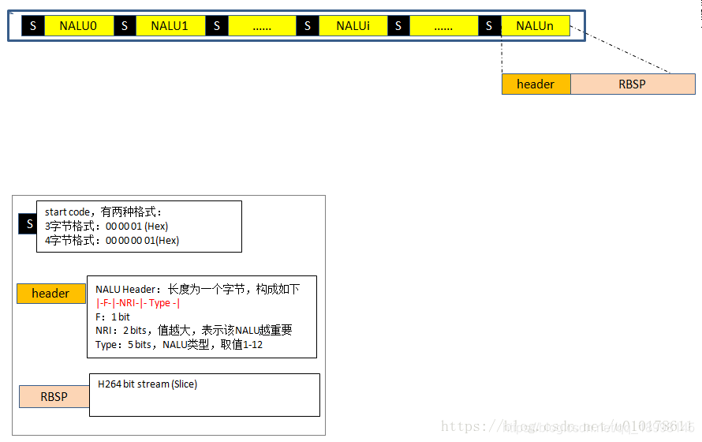
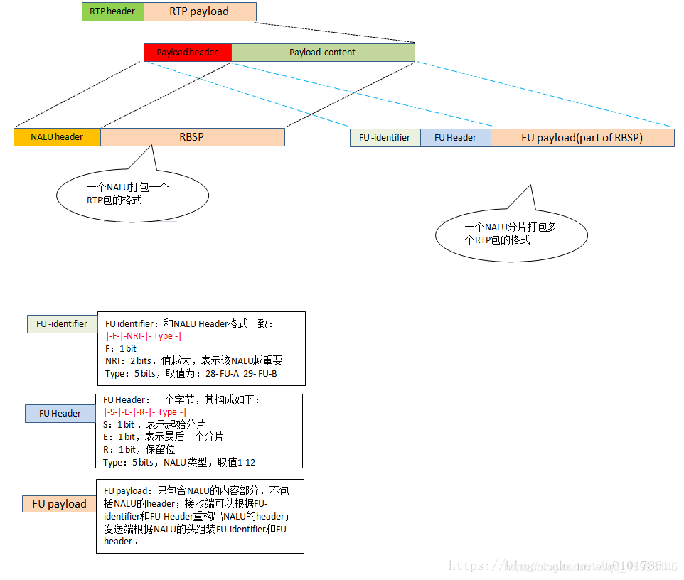
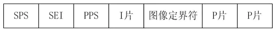
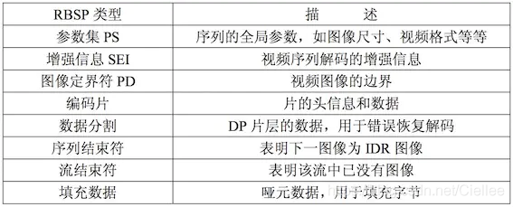
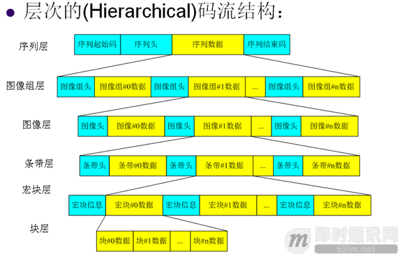
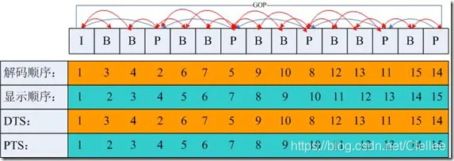

## **H264 NAL数据包格式**

### **A. H264协议数据包简介**
- H.264标准协议定义了两种不同的类型。
- **VCL**: Video Coding Layer. 编码器吐出来的原始编码数据，没有考虑传输和存储问题。
- **NAL**: Network Abstraction Layer. 对VCL输出的slice片数据进行了封装为NALUs(NAL  Units)便于网络传输。
    1. 平时的每帧数据就是一个NAL单元（SPS与PPS除外）
    2. 在实际的H264数据帧中，往往帧前面带有00 00 00 01 或 00 00 01分隔符
    3. 一般来说编码器编出的首帧数据为PPS与SPS，接着为I帧……
    
### **B. NALU数据包格式**
> **NALU 数据包通常通过RTP进行传输**


> **NALU包F，NRI字段**

- F: 坏帧，则置1，其余H.264固定为0。
- NRI: 值越大，表示当前NALU越重要。大于0时取何值，没有具体规定。实际我们不太关心这个字段。

> **NALU类型 (数据报中的Type 5bit)**  

|**Type**|**内容**|**备注**|   
|:--|:--|:--|
|0|未指定||
|1|非IDR图像的slice|普通I,P,B帧<br>**slice_layer_without_partitioning_rbsp()**|
|2|	编码slice数据划分A|只传递片中最重要的信息，如片头，片中宏块的预测模式等；一般不会用到</br>**slice_data_partition_a_layer_rbsp()**|
|3|	编码slice数据划分B|	3类型是只传输残差；一般不会用到</br>**slice_data_partition_b_layer_rbsp()**|
|4|	编码slice数据划分C|	4时则只可以传输残差中的AC系数；一般不会用到<br>**slice_data_partition_c_layer_rbsp()**|
|5|	IDR图像中的编码slice|IDR帧，IDR一定是I帧</br>**slice_layer_without_partitioning_rbsp()**|
|6|	SEI补充增强信息单元|可以存一些私有数据等；</br>**sei_rbsp()**|
|7|SPS 序列参数集|编码的参数配置</br>**seq_parameter_set_rbsp()**|
|8|PPS 图像参数集|编码的参数配置</br>**pic_parameter_set_rbsp(pps帧)**|
|9|接入单元界定符|**access_unit_delimiter_rbsp()**|
|10|序列结束|**end_of_seq_rbsp()**|
|11|码流结束|**end_of_stream_rbsp()**|
|12|填充数据|**filler_data_rbsp()**|
|13|序列参数集扩展|**seq_parameter_set_extension_rbsp( )**|
|19|未分割的辅助编码图像的编码条带|**slice_layer_without_partitioning_rbsp()**|
|24|STAP-A</br>Single-time aggregation packet|单一时间聚合包模式，意味着一个RTP包可以传输多个NALU</br>这些NALU的编码时间要一样才能聚合到一个RTP|
|25|STAP-B</br>Single-time aggregation packet||
|26|MTAP16|多个时间聚合包模式：意味着一个RTP包可以传输多个NALU</br>这些NALU的编码时间有可能不一样。|
|27|MTAP 24</br>Muti-time aggregation packet||
|28|FU-A</br>Fragmentation unit|切包模式：当一个RTP容纳不下一个NALU时，就需要FUs这种格式。|
|29|FU-B</br>Fragmention unit||
|30|未指定，保留||
|31|未指定，保留||
||||

### **C. H264视频流用RTP传输 (AnnexB 格式)**  
  

#### RBSP是紧接NALU头之后的内容。其第一个字节是slice头


#### slice头结构图


#### slice头的相关
1. **nalu头能区分关键帧，但不能区分I，P，B帧。这时候需要借助slice head（小标题是其对应的编码值）**
   1.  I -slice: slice的全部MB（宏块）都采用intra-prediction（帧内预测）的方式来编码；
   2.  P-slice:slice中的MB（宏块）使用intra-prediction（帧内预测 I宏块）和inter-prediction（帧间预测P宏块）的方式来编码，每一个inter-prediction block只能使用一个移动向量；
   3.  B-slice:指Bi-predictive（双向预测）具有I宏块， B宏块，和 P宏块
   4.  SP-slice: 即所谓的Switching P slice，为P-slice的一种特殊类型，用来串接两个不同bitrate的bitstream；用于切换过渡视频流。
   5.  SI-slice: 即所谓的Switching I slice，为I-slice的一种特殊类型，除了用来串接两个不同content的bitstream外，也可用来执行随机存取(random access)来达到网络VCR的功能  
   <br>

2. **如何识别多个slice是否属于同一张图片**
   1. 法1:一般一帧的多个slice是同时发送的，slice头部 与上 0x80 等于 1 则表示当前帧的第一个slice, 每一新帧进行 0x80 后都是 1。
   2. 法2:h264x 则通过对两个slice head进行比较确定是否为同一张图片。

3. **RBSP与EBSP的关系**
   1. 起因：因为原始码流中，可能出现 0 0 0 1 或者 0 0 1 的，会导致读取程序将一个 NALU 误分割成多个 NALU。
   2. 为了防止这种情况发生，AnnexB 引入了防竞争字节（Emulation Prevention Bytes）的概念。
   3. 查找码流里面的存在的 0 0 0，0 0 1，0 0 2，0 0 3 的字节，则插入字节0x3，即0 0 3 0，0 0 3 1，0 0 3 2，0 03 3 
   4. 之后，解码前需要去掉 0x3

### **D. AVCC**
    1.  在 AnnexB 中，SPS 和 PPS 被当做了普通的 NALU 进行处理；
    2.  在 avcC 中，SPS 和 PPS 信息被当做了特殊的信息进行了处理。
    3.  在一路采用 avcC 打包的 H.264 流之中，我们首先看到的将是一段被称之为 extradata 的数据
        1.  这段数据定义了这个 H.264 流的基本属性数据，当然，也包含了 SPS 和 PPS 数据。
        2.  extradata 数据格式
   
```sh
    bits      
    8   version ( always 0x01 )  
    8   avc profile ( sps[0][1] )  
    8   avc compatibility ( sps[0][2] )  
    8   avc level ( sps[0][3] )  
    6   reserved ( all bits on )  
    2   NALULengthSizeMinusOne    // 这个值是（前缀长度-1）
    3   reserved ( all bits on )  
    5   number of SPS NALUs (usually 1)  
            repeated once per SPS:  
    16  SPS size  
            variable SPS NALU data  
    8   number of PPS NALUs (usually 1)  
            repeated once per PPS  
    16  PPS size  
            variable PPS NALU data
```


**纠正：FU-Header type(5 bit)的取值范围：1-23**  


**解码和显示的帧顺序**


[参考链接](https://www.huaweicloud.com/articles79999bf7e4235d59927366e0dd1ca267.html)
