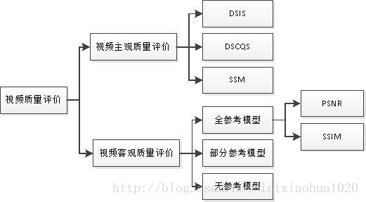
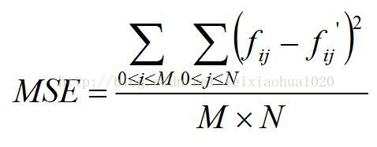
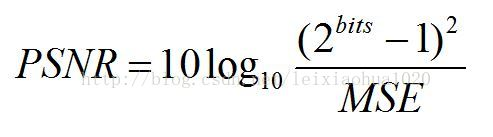
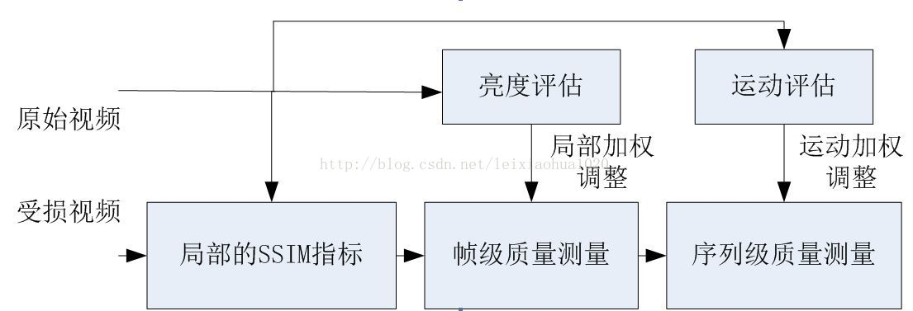
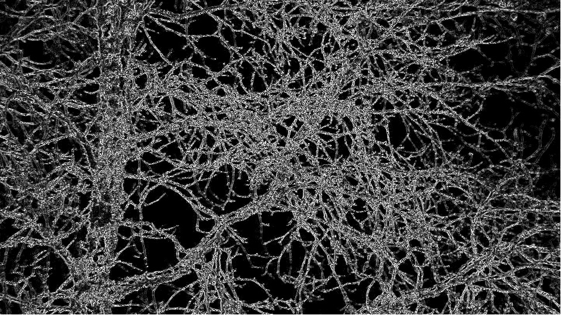
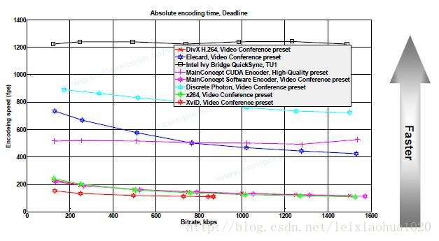
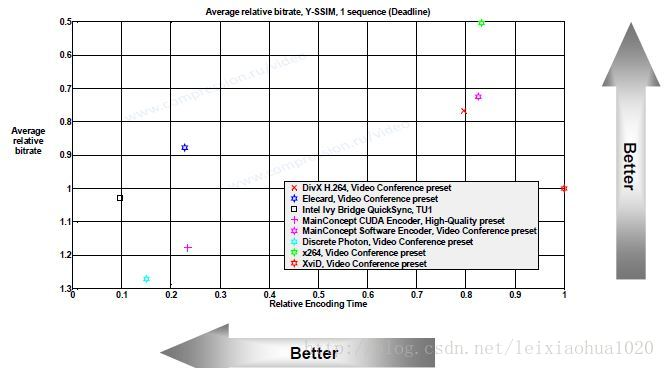

## **音视频质量评价方法**

### **A. 音视频质量评价背景**
- 视频编码器【编码标准】性能评测
- 视频质量检测
    ```sh
    # 主要用于实时监测分析视频流。例如监测CMMB，数字电视，IPTV，互联网视频等这些信号的质量。
    # 当这些信号出现异常的时候，可以反馈给服务提供商，使之及时采取相应的措施，修复视频传输过程中出现的问题。
    ```

### **B. 音视频质量评级分类**
> **PSNR取值20-40，值越大，视频质量越好。SSIM取值0-1，值越大，视频质量越好。**
- 主观音视频质量评价 (Subjective Quality Assessment，SQA)
- 客观音视频质量评价 (Objective Quality Assessment，OQA)
    ```sh
    # 全参考(FullReference，FR)
        # A. 均方差 MSE      【原始视频和参考视频的保真度】
        # B. 峰值信噪比 PSNR 【均方差的对数表示形式】
        # C. SSIM           【模拟人体视觉器官，对视频质量的损失进行评估】
    # 部分参考(ReducedReference，RR)
    # 无参考(No Reference，NR)
    ```
      
    
    
    

### **C. 质量评价涉及到的其它知识**
- 1. 视频数据处理
    A. 编码
    ```sh
    # FFmpeg调用x264编码YUV420P视频序列（码率800kbps）：
    #   ffmpeg -s 640x360 -i src01_640x360.yuv -b:v 800k -vcodec libx264 src01_640x360_800k.h264
    #
    # FFmpeg调用xvid编码YUV420P视频序列（码率800kbps，封装为AVI）：
    #   ffmpeg -s 640x360 -i src01_640x360.yuv -b:v 800k -vcodec libxvid src01_640x360_800k.avi
    #
    # 专用于学术研究的软件模型如JM，HM这些一般是不被FFmpeg支持的
    #   tappencoder -c encoder_lowdelay_P_main.cfg -i src01_640x360.yuv -wdt 640 -hgt 360 -b src01_640x360_800k.hm10
    ```

    B. 解码
    ```sh
    # FFmpeg解码H.264码流为YUV420P：
    #   ffmpeg -i src01_640x360_800k.h264 src01_640x360_800k.yuv
    #
    # FFmpeg解码MPEG-4码流（AVI封装）为YUV420P：
    #   ffmpeg -i src01_640x360_800k.avi src01_640x360_800k.yuv
    #
    # 专用于学术研究的软件模型如JM，HM这些一般是不被FFmpeg支持的
    #   tappdecoder -b src01_640x360.hm10 -o src01_640x360.yuv
    ```

    C. 像素转换
    ```sh
    # ffmpeg -i src01.avi -pix_fmt yuv422p src01_422.yuv
    # 注：查看FFmpeg支持的所有的格式，可以使用命令：ffmpeg -pix_fmts
    #
    # YUV格式之间互相转换，例如YUV422P转换为YUV420P，同时将图像分辨率从1920x1080下变换为1280x720。
    # 【YUV是纯像素数据，并不包含画面的宽高，取样格式等信息，因此转换的时候需要自己指定】
    # ffmpeg -s 1920x1080 -pix_fmt yuv422p -i src01_1920x1080_422.yuv -s 1280x720 -pix_fmt yuv420p src01_1280x720.yuv
    #
    # YUV422P转换为封装过的像素数据（BMP）。同理，YUV需要指定宽高，取样格式。
    # ffmpeg -s 1920x1080 -pix_fmt yuv422p -i src01_1920x1080.yuv src01_1920x1080.bmp
    #
    # YUV420P转换为YUV422P并且进行封装（AVI）：
    # ffmpeg -s 1920x1080 -i src01_1920x1080.yuv -vcodec rawvideo -pix_fmt yuv422p src01_1920x1080.avi
    ```

- 2. 实验结果处理
    A. 除了使用Excel之外，使用最多的就是Matlab中的拟合工具了，包含曲线拟合工具cftool以及曲面拟合工具sftool。

- 3. 视频序列复杂度
    A. 视频编码和序列的复杂度是息息相关的。序列的复杂度分为时间复杂度和空间复杂度。  
    ```sh
    # 1. 视频画面细节越多，空间复杂度越大；
    # 2. 视频内容运动越剧烈，时间复杂度越大。
    # 3. 视频复杂度越大，在同等画质的前提下，编码需要越多的数据量。
    ```
    B. TI和SI的概念
    ```sh
    # SI表征一帧图像的空间细节量。空间上越复杂的场景，SI值越高。
    # TI表征视频序列的时间变化量。运动程度较高的序列通常会有更高的TI值。
    # SI计算方法：对第n帧视频进行Sobel滤波，然后对滤波后图像计算标准差。选这些帧中的最大值为SI。
    # TI计算方法：求n与n-1帧图像的帧差，然后对帧差图像计算标准差。选这些帧中的最大值为TI。
    ```
    原图  
    
    Sobel滤波 SI处理  
    
    TI处理  
    

### **D. 质量评价做的比较好的机构**
- 1. VQEG 视频质量专家组
- 2. MSU Video Group MSU视频组

### **E. 视频质量评价资源**
> **目的: 筛选合适的测试序列**

- 1. 视频测试序列库
- 2. 图像测试序列库

### **F. 质量评价的已有研究**
- 1. 编码器(编码标准)性能测评
    ```sh
    # A. 如何保证视频质量一致？ 保持一致的量化步长.
    # B. 哪个标准更省码率[压缩的更小]： HEVC > H264 > VP9
    # C. 哪个标准编码更耗时： VP9 > HEVC > H264 
    #
    # 音视频编码标准在不同方面的应用比较
    # A. 流媒体领域
    # B. 视频会议领域
    # C. 娱乐其他应用
    #
    # 视频编码国家标准AVS与H.264的比较：官方报告略差
    #
    # 视频质量衡量的标准
    # A. RD曲线（失真曲线RD Curves）：横坐标是码率，纵坐标是视频客观算法的结果【PSNR-SSIM】
    # B. 编码速度（Encoding Speed）：横坐标是编码视频的码率，纵坐标是编码速度。【随着编码的码率增长，所有编码器的编码速度下降】
    # C. 速度/质量权衡（Speed/Quality Trade-Off）：相同图片质量要求下, 横坐标代表相对的编码时间，取值越小越好；纵坐标代表编器使用的码率 【这个表格数据呈现方式很很多技巧。在一张图中巧妙结合了很多信息理念，很考验人的读图能力】
    # D. 码率控制（Bitrate Handling）：码率控制性能好的编码器，编码后输出的视频码率和编码前设定的码率相同。【对网络传输有影响】
    # E. 相对质量分析（Relative Quality Analysis）: 同等视频质量下要花费的
    #
    # 码率：在视频质量的概念内，同样的数据参数，编码器产生的码率越低，一般说数据压缩得更好
    # 编码速度：一般来说压缩率越高，算法越复杂，编码速度越慢
    # 视频质量：用PSNR，SSIM
    ```
    RD曲线（失真曲线RD Curves）    
        
    编码速度    
      
    速度/质量权衡（Speed/Quality Trade-Off） 
         

- 2. 学术研究（压缩编码与视频质量）
- 3. 其他因素（除了压缩编码之外的因素）与视频质量


