## **flv文件格式介绍**

### **一. flv文件格式**
> **flv**由flv header 和 flv body组成.**flv body**由多个flv tag 组成. **flv tag**前面的跟着一个**preTagSize**.

#### **1. flv header 格式图** 

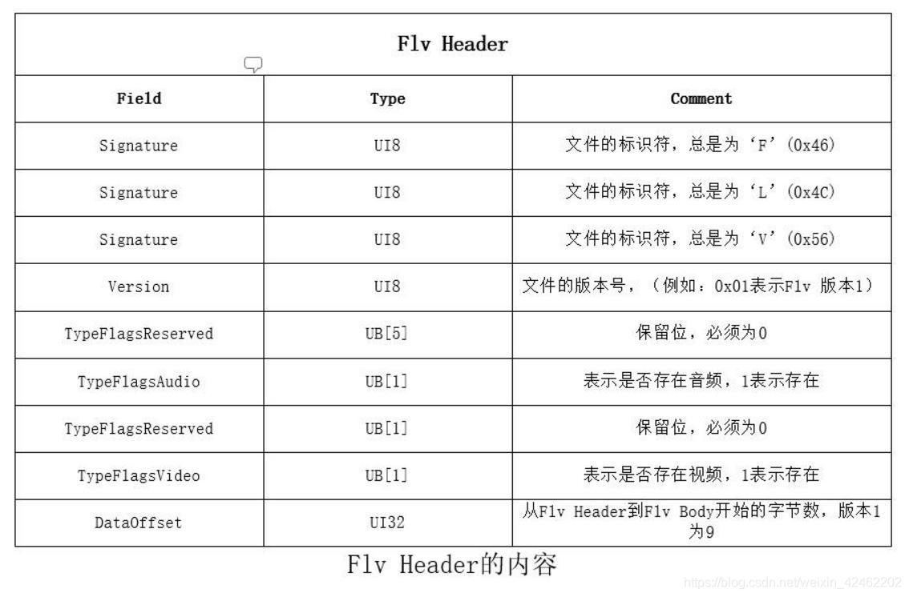

#### **2. flv body 格式图**  
    
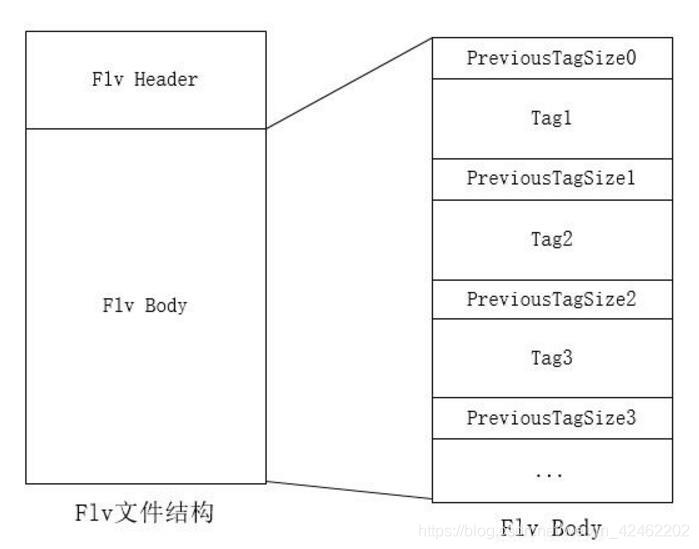

#### **3. flv tag 格式图**

> Tag有三种类型，Audio Tag（音频Tag），Video Tag（视频Tag），script Tag（又称Metadata Tag）

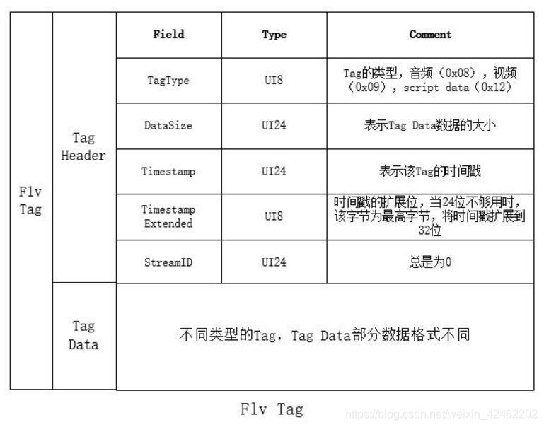

#### **4. flv 总体结构图**
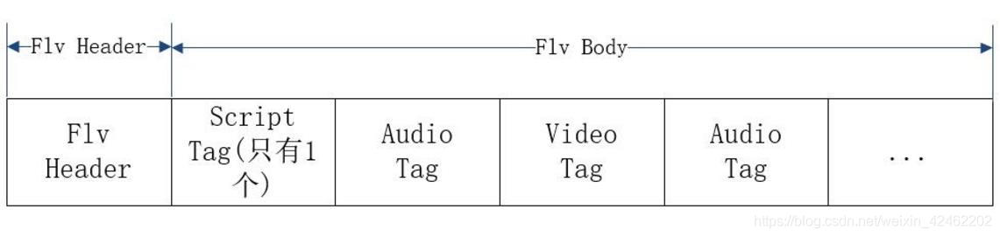
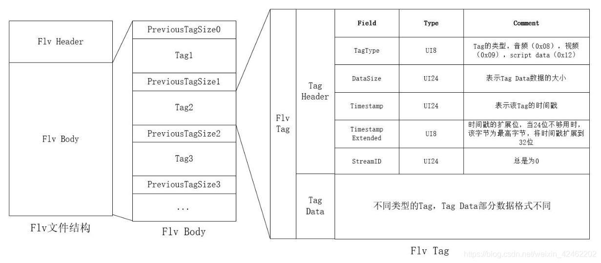

### **二. flvTag 三种数据类型格式**
#### **1. flvTag audio 数据格式**
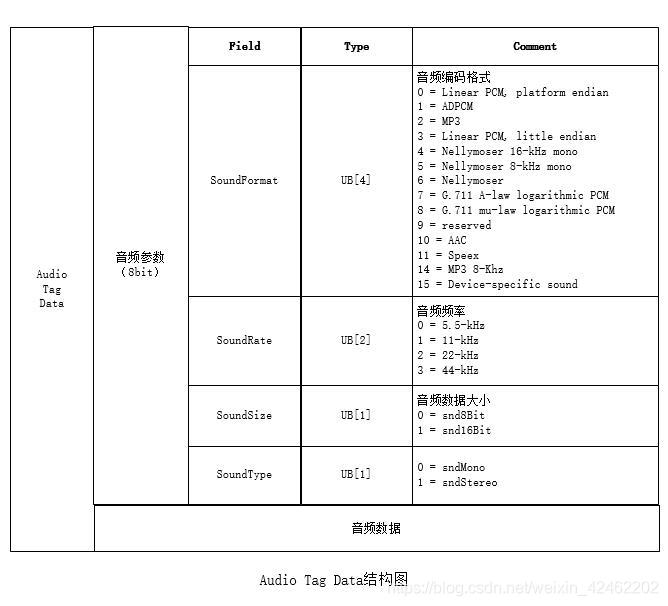

> **SoundFormat 等于 10 时， 音频数据格式为ACC**   

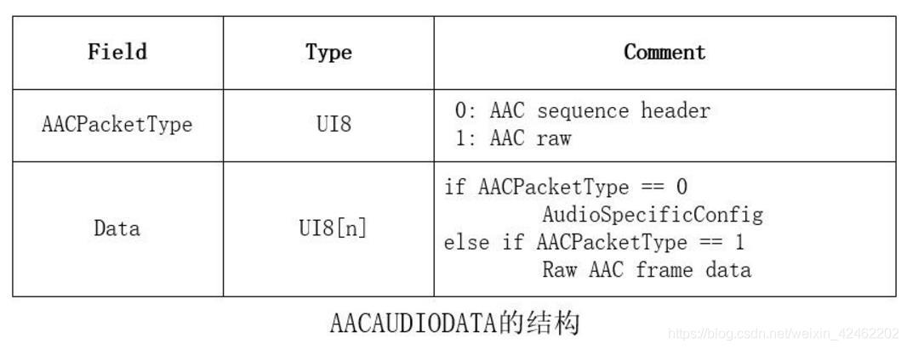

#### **2. flvTag video 数据格式** 

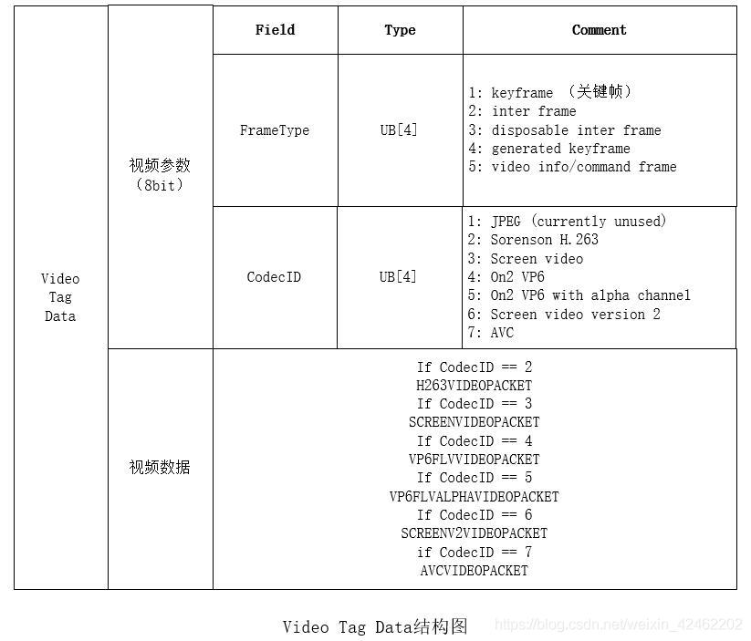

> **frameType 等于 7 时,视频数据格式为H264**   

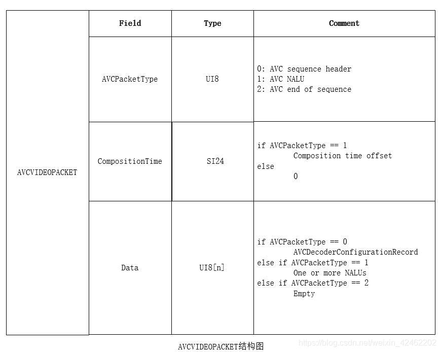

> **视频数据H264 AVCPacketType 等于 0 【H264配置信息】**     

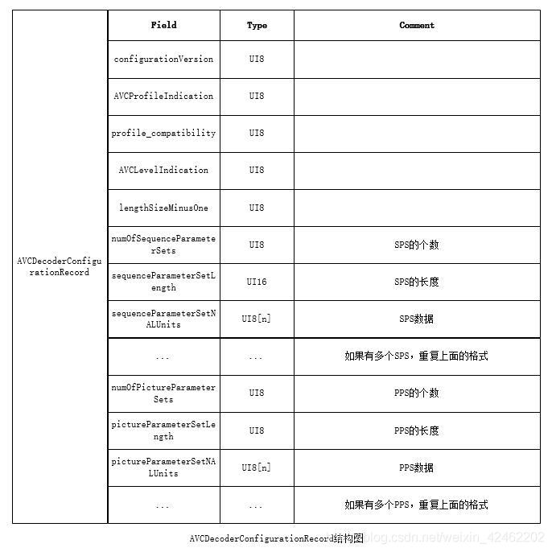

> **视频数据H264 AVCPacketType 等于 1**  

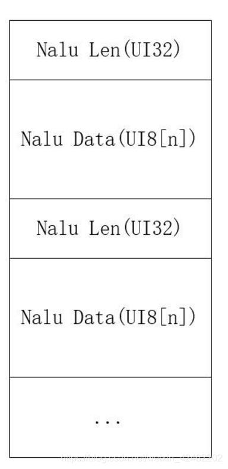

#### **3. flvTag script 数据格式** 
> **通常被称为MetadataTag，放一些关于FLV视频和音频的元数据信息如：duration、width、height等, 会跟在FileHeader后作为第一个Tag出现，而且只有一个。**

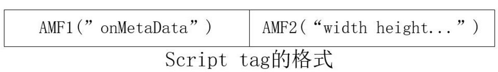

```sh
# 第一个AMF包：第一个字节一般为0x02，表示字符串，第2-3个字节表示字符串的长度，一般为0x000A，后面跟的就是字符串，一般为"onMetaData"。
# 第二AMF包：第一个字节为0x08，表示数组，第2-5个字节表示数组元素个数，后面跟着就是数组的元素。
#   格式为：元素名长度（UI16） + 元素名（UI8[n]） + 元素的值(double)，最后以“009”结尾。
```

> **flvTag script类型数据第一个字节表示 AMF 的类型**

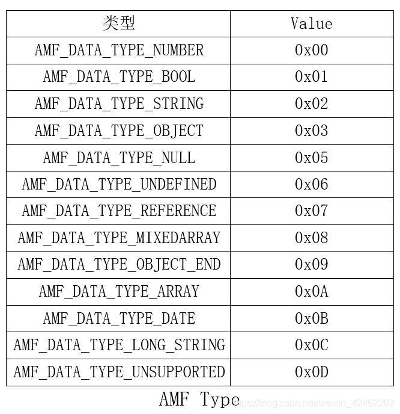


> **flvTag script类型数据第一个字节表示 AMF 的类型 【即上面的AMF2】**  

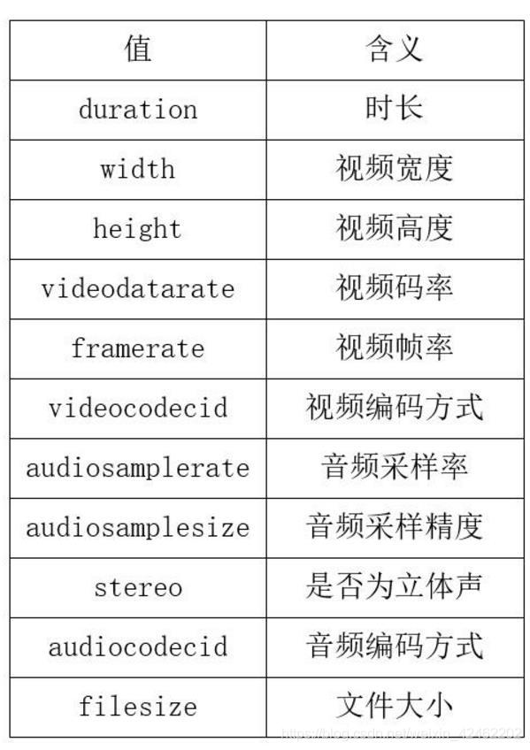

#### **FLV封装格式代码解析**
> [相关链接](!https://blog.csdn.net/leixiaohua1020/article/details/50535082)

```c
/**
 * 最简单的视音频数据处理示例
 * Simplest MediaData Test
 *
 * 雷霄骅 Lei Xiaohua
 * leixiaohua1020@126.com
 * 中国传媒大学/数字电视技术
 * Communication University of China / Digital TV Technology
 * http://blog.csdn.net/leixiaohua1020
 *
 * 本项目包含如下几种视音频测试示例：
 *  (1)像素数据处理程序。包含RGB和YUV像素格式处理的函数。
 *  (2)音频采样数据处理程序。包含PCM音频采样格式处理的函数。
 *  (3)H.264码流分析程序。可以分离并解析NALU。
 *  (4)AAC码流分析程序。可以分离并解析ADTS帧。
 *  (5)FLV封装格式分析程序。可以将FLV中的MP3音频码流分离出来。
 *  (6)UDP-RTP协议分析程序。可以将分析UDP/RTP/MPEG-TS数据包。
 *
 * This project contains following samples to handling multimedia data:
 *  (1) Video pixel data handling program. It contains several examples to handle RGB and YUV data.
 *  (2) Audio sample data handling program. It contains several examples to handle PCM data.
 *  (3) H.264 stream analysis program. It can parse H.264 bitstream and analysis NALU of stream.
 *  (4) AAC stream analysis program. It can parse AAC bitstream and analysis ADTS frame of stream.
 *  (5) FLV format analysis program. It can analysis FLV file and extract MP3 audio stream.
 *  (6) UDP-RTP protocol analysis program. It can analysis UDP/RTP/MPEG-TS Packet.
 *
 */
#include <stdio.h>
#include <stdlib.h>
#include <string.h>
 
//Important!
#pragma pack(1)
 
 
#define TAG_TYPE_SCRIPT 18
#define TAG_TYPE_AUDIO  8
#define TAG_TYPE_VIDEO  9
 
typedef unsigned char byte;
typedef unsigned int uint;
 
typedef struct {
	byte Signature[3];
	byte Version;
	byte Flags;
	uint DataOffset;
} FLV_HEADER;
 
typedef struct {
	byte TagType;
	byte DataSize[3];
	byte Timestamp[3];
	uint Reserved;
} TAG_HEADER;
 
 
//reverse_bytes - turn a BigEndian byte array into a LittleEndian integer
uint reverse_bytes(byte *p, char c) {
	int r = 0;
	int i;
	for (i=0; i<c; i++) 
		r |= ( *(p+i) << (((c-1)*8)-8*i));
	return r;
}
 
/**
 * Analysis FLV file
 * @param url    Location of input FLV file.
 */
 
int simplest_flv_parser(char *url){
 
	//whether output audio/video stream
	int output_a=1;
	int output_v=1;
	//-------------
	FILE *ifh=NULL,*vfh=NULL, *afh = NULL;
 
	//FILE *myout=fopen("output_log.txt","wb+");
	FILE *myout=stdout;
 
	FLV_HEADER flv;
	TAG_HEADER tagheader;
	uint previoustagsize, previoustagsize_z=0;
	uint ts=0, ts_new=0;
 
	ifh = fopen(url, "rb+");
	if ( ifh== NULL) {
		printf("Failed to open files!");
		return -1;
	}
 
	//FLV file header
	fread((char *)&flv,1,sizeof(FLV_HEADER),ifh);
 
	fprintf(myout,"============== FLV Header ==============\n");
	fprintf(myout,"Signature:  0x %c %c %c\n",flv.Signature[0],flv.Signature[1],flv.Signature[2]);
	fprintf(myout,"Version:    0x %X\n",flv.Version);
	fprintf(myout,"Flags  :    0x %X\n",flv.Flags);
	fprintf(myout,"HeaderSize: 0x %X\n",reverse_bytes((byte *)&flv.DataOffset, sizeof(flv.DataOffset)));
	fprintf(myout,"========================================\n");
 
	//move the file pointer to the end of the header
	fseek(ifh, reverse_bytes((byte *)&flv.DataOffset, sizeof(flv.DataOffset)), SEEK_SET);
 
	//process each tag
	do {
 
		previoustagsize = _getw(ifh);
 
		fread((void *)&tagheader,sizeof(TAG_HEADER),1,ifh);
 
		//int temp_datasize1=reverse_bytes((byte *)&tagheader.DataSize, sizeof(tagheader.DataSize));
		int tagheader_datasize=tagheader.DataSize[0]*65536+tagheader.DataSize[1]*256+tagheader.DataSize[2];
		int tagheader_timestamp=tagheader.Timestamp[0]*65536+tagheader.Timestamp[1]*256+tagheader.Timestamp[2];
 
		char tagtype_str[10];
		switch(tagheader.TagType){
		case TAG_TYPE_AUDIO:sprintf(tagtype_str,"AUDIO");break;
		case TAG_TYPE_VIDEO:sprintf(tagtype_str,"VIDEO");break;
		case TAG_TYPE_SCRIPT:sprintf(tagtype_str,"SCRIPT");break;
		default:sprintf(tagtype_str,"UNKNOWN");break;
		}
		fprintf(myout,"[%6s] %6d %6d |",tagtype_str,tagheader_datasize,tagheader_timestamp);
 
		//if we are not past the end of file, process the tag
		if (feof(ifh)) {
			break;
		}
 
		//process tag by type
		switch (tagheader.TagType) {
 
		case TAG_TYPE_AUDIO:{ 
			char audiotag_str[100]={0};
			strcat(audiotag_str,"| ");
			char tagdata_first_byte;
			tagdata_first_byte=fgetc(ifh);
			int x=tagdata_first_byte&0xF0;
			x=x>>4;
			switch (x)
			{
			case 0:strcat(audiotag_str,"Linear PCM, platform endian");break;
			case 1:strcat(audiotag_str,"ADPCM");break;
			case 2:strcat(audiotag_str,"MP3");break;
			case 3:strcat(audiotag_str,"Linear PCM, little endian");break;
			case 4:strcat(audiotag_str,"Nellymoser 16-kHz mono");break;
			case 5:strcat(audiotag_str,"Nellymoser 8-kHz mono");break;
			case 6:strcat(audiotag_str,"Nellymoser");break;
			case 7:strcat(audiotag_str,"G.711 A-law logarithmic PCM");break;
			case 8:strcat(audiotag_str,"G.711 mu-law logarithmic PCM");break;
			case 9:strcat(audiotag_str,"reserved");break;
			case 10:strcat(audiotag_str,"AAC");break;
			case 11:strcat(audiotag_str,"Speex");break;
			case 14:strcat(audiotag_str,"MP3 8-Khz");break;
			case 15:strcat(audiotag_str,"Device-specific sound");break;
			default:strcat(audiotag_str,"UNKNOWN");break;
			}
			strcat(audiotag_str,"| ");
			x=tagdata_first_byte&0x0C;
			x=x>>2;
			switch (x)
			{
			case 0:strcat(audiotag_str,"5.5-kHz");break;
			case 1:strcat(audiotag_str,"1-kHz");break;
			case 2:strcat(audiotag_str,"22-kHz");break;
			case 3:strcat(audiotag_str,"44-kHz");break;
			default:strcat(audiotag_str,"UNKNOWN");break;
			}
			strcat(audiotag_str,"| ");
			x=tagdata_first_byte&0x02;
			x=x>>1;
			switch (x)
			{
			case 0:strcat(audiotag_str,"8Bit");break;
			case 1:strcat(audiotag_str,"16Bit");break;
			default:strcat(audiotag_str,"UNKNOWN");break;
			}
			strcat(audiotag_str,"| ");
			x=tagdata_first_byte&0x01;
			switch (x)
			{
			case 0:strcat(audiotag_str,"Mono");break;
			case 1:strcat(audiotag_str,"Stereo");break;
			default:strcat(audiotag_str,"UNKNOWN");break;
			}
			fprintf(myout,"%s",audiotag_str);
 
			//if the output file hasn't been opened, open it.
			if(output_a!=0&&afh == NULL){
				afh = fopen("output.mp3", "wb");
			}
 
			//TagData - First Byte Data
			int data_size=reverse_bytes((byte *)&tagheader.DataSize, sizeof(tagheader.DataSize))-1;
			if(output_a!=0){
				//TagData+1
				for (int i=0; i<data_size; i++)
					fputc(fgetc(ifh),afh);
 
			}else{
				for (int i=0; i<data_size; i++)
					fgetc(ifh);
			}
			break;
		}
		case TAG_TYPE_VIDEO:{
			char videotag_str[100]={0};
			strcat(videotag_str,"| ");
			char tagdata_first_byte;
			tagdata_first_byte=fgetc(ifh);
			int x=tagdata_first_byte&0xF0;
			x=x>>4;
			switch (x)
			{
			case 1:strcat(videotag_str,"key frame  ");break;
			case 2:strcat(videotag_str,"inter frame");break;
			case 3:strcat(videotag_str,"disposable inter frame");break;
			case 4:strcat(videotag_str,"generated keyframe");break;
			case 5:strcat(videotag_str,"video info/command frame");break;
			default:strcat(videotag_str,"UNKNOWN");break;
			}
			strcat(videotag_str,"| ");
			x=tagdata_first_byte&0x0F;
			switch (x)
			{
			case 1:strcat(videotag_str,"JPEG (currently unused)");break;
			case 2:strcat(videotag_str,"Sorenson H.263");break;
			case 3:strcat(videotag_str,"Screen video");break;
			case 4:strcat(videotag_str,"On2 VP6");break;
			case 5:strcat(videotag_str,"On2 VP6 with alpha channel");break;
			case 6:strcat(videotag_str,"Screen video version 2");break;
			case 7:strcat(videotag_str,"AVC");break;
			default:strcat(videotag_str,"UNKNOWN");break;
			}
			fprintf(myout,"%s",videotag_str);
 
			fseek(ifh, -1, SEEK_CUR);
			//if the output file hasn't been opened, open it.
			if (vfh == NULL&&output_v!=0) {
				//write the flv header (reuse the original file's hdr) and first previoustagsize
					vfh = fopen("output.flv", "wb");
					fwrite((char *)&flv,1, sizeof(flv),vfh);
					fwrite((char *)&previoustagsize_z,1,sizeof(previoustagsize_z),vfh);
			}
#if 0
			//Change Timestamp
			//Get Timestamp
			ts = reverse_bytes((byte *)&tagheader.Timestamp, sizeof(tagheader.Timestamp));
			ts=ts*2;
			//Writeback Timestamp
			ts_new = reverse_bytes((byte *)&ts, sizeof(ts));
			memcpy(&tagheader.Timestamp, ((char *)&ts_new) + 1, sizeof(tagheader.Timestamp));
#endif
 
 
			//TagData + Previous Tag Size
			int data_size=reverse_bytes((byte *)&tagheader.DataSize, sizeof(tagheader.DataSize))+4;
			if(output_v!=0){
				//TagHeader
				fwrite((char *)&tagheader,1, sizeof(tagheader),vfh);
				//TagData
				for (int i=0; i<data_size; i++)
					fputc(fgetc(ifh),vfh);
			}else{
				for (int i=0; i<data_size; i++)
					fgetc(ifh);
			}
			//rewind 4 bytes, because we need to read the previoustagsize again for the loop's sake
			fseek(ifh, -4, SEEK_CUR);
 
			break;
			}
		default:
 
			//skip the data of this tag
			fseek(ifh, reverse_bytes((byte *)&tagheader.DataSize, sizeof(tagheader.DataSize)), SEEK_CUR);
		}
 
		fprintf(myout,"\n");
 
	} while (!feof(ifh));
 
 
	_fcloseall();
 
	return 0;
}
```
