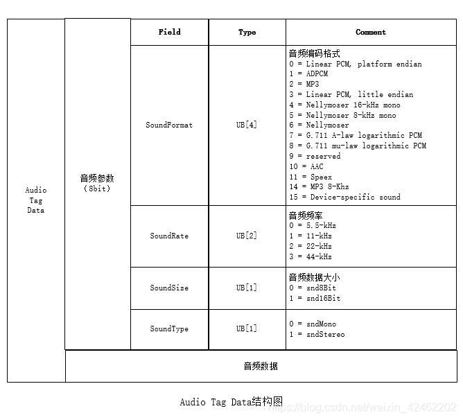

## **flv文件格式介绍**

### **一. flv文件格式**
> **flv**由flv header 和 flv body组成.**flv body**由多个flv tag 组成. **flv tag**前面的跟着一个**preTagSize**.

#### **1. flv header 格式图** 


#### **2. flv body 格式图**  
    


#### **3. flv tag 格式图**

> Tag有三种类型，Audio Tag（音频Tag），Video Tag（视频Tag），script Tag（又称Metadata Tag）


#### **4. flv 总体结构图**


### **二. flvTag 三种数据类型格式**
#### **1. flvTag audio 数据格式**


> **SoundFormat 等于 10 时， 音频数据格式为ACC**   


#### **2. flvTag video 数据格式** 


> **frameType 等于 7 时,视频数据格式为H264**   


> **视频数据H264 AVCPacketType 等于 0 【H264配置信息】**     


> **视频数据H264 AVCPacketType 等于 1**  


#### **3. flvTag script 数据格式** 
> **通常被称为MetadataTag，放一些关于FLV视频和音频的元数据信息如：duration、width、height等, 会跟在FileHeader后作为第一个Tag出现，而且只有一个。**


```sh
# 第一个AMF包：第一个字节一般为0x02，表示字符串，第2-3个字节表示字符串的长度，一般为0x000A，后面跟的就是字符串，一般为"onMetaData"。
# 第二AMF包：第一个字节为0x08，表示数组，第2-5个字节表示数组元素个数，后面跟着就是数组的元素。
#   格式为：元素名长度（UI16） + 元素名（UI8[n]） + 元素的值(double)，最后以“009”结尾。
```

> **flvTag script类型数据第一个字节表示 AMF 的类型**


> **flvTag script类型数据第一个字节表示 AMF 的类型 【即上面的AMF2】**  


