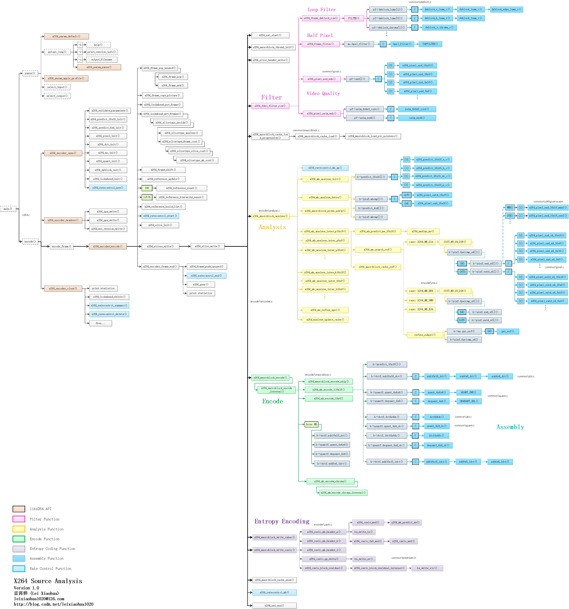

## **libx264 简介**
> **抄自:** [x264源代码简单分析：概述](https://blog.csdn.net/leixiaohua1020/article/details/45536607)



### **libx264 YUV 编码成 H264**
> **最简单编码流程**
- x264_param_default()：设置参数集结构体x264_param_t的缺省值。
- x264_picture_alloc()：为图像结构体x264_picture_t分配内存。
- x264_encoder_open()：打开编码器。
- x264_encoder_headers()：输出SPS，PPS，SEI等信息。
- x264_encoder_encode()：编码一帧图像。
- x264_encoder_close()：关闭编码器。
- x264_picture_clean()：释放x264_picture_alloc()申请的资源。 

### **libx264 函数介绍**
> **反映了图中从左到右，从用户API到库内部的调用逻辑过程**
- **x264_encoder_headers()调用了下面的函数**
    ```sh
    # x264_sps_write()：输出SPS
    # x264_pps_write()：输出PPS
    # x264_sei_version_write()：输出SEI
    ```
 
- **x264_encoder_encode()调用了下面的函数**
    ```sh
    # x264_frame_pop_unused()
    #   A. 获取1个x264_frame_t类型结构体fenc。如果frames.unused[]队列不为空，就调用x264_frame_pop()从unused[]队列取1个现成的
    #   B. 否则就调用x264_frame_new()创建一个新的。
    #
    # x264_frame_copy_picture()：将输入的图像数据拷贝至fenc。
    # x264_lookahead_put_frame()：将fenc放入lookahead.next.list[]队列，【等待确定帧类型】。
    #
    # x264_lookahead_get_frames(): 通过lookahead分析帧类型。
    #   A. 调用x264_slicetype_decide()，x264_slicetype_analyse()和x264_slicetype_frame_cost()等函数。确定帧类型信息，并将帧放入frames.current[]队列。
    #
    # x264_frame_shift()：从frames.current[]队列取出一帧用于编码。
    # x264_reference_update()：更新参考帧列表。
    # x264_reference_reset()：如果为IDR帧，调用该函数清空参考帧列表。
    # x264_reference_hierarchy_reset()：如果是I（非IDR帧）、P帧、B帧（可做为参考帧），调用该函数（还没研究）。
    # x264_reference_build_list()：创建参考帧列表list0和list1。
    # x264_ratecontrol_start()：开启码率控制。
    # x264_slice_init()：创建 Slice Header。
    # x264_slices_write(): 编码数据（最关键的步骤）。其中调用了x264_slice_write()完成了编码的工作
    # x264_encoder_frame_end()：编码结束后做一些后续处理[释放中间变量|统计信息|将fenc重新放回frames.unused[]队列|关闭码率控制]
    #   A. 将fenc重新放回frames.unused[]队列: x264_frame_push_unused()
    #   B. 关闭码率控制: x264_ratecontrol_end()
    ```

- **x264_slice_write()调用了下面的函数**
    > **调用了x264_slice_write()完成了编码的工作,该循环每执行一遍编码一个宏块。**

    ```sh
    # x264_nal_start()：开始写一个NALU。
    # x264_macroblock_thread_init()：初始化存储宏块的重建数据缓存fdec_buf[]和编码数据缓存fenc_buf[]。
    # x264_slice_header_write()：输出 Slice Header。
    # x264_fdec_filter_row()：滤波模块。该模块包含了环路滤波，半像素插值，SSIM/PSNR的计算。
    # x264_macroblock_cache_load()：将要编码的宏块的周围的宏块的信息读进来。
    # x264_macroblock_analyse()：分析模块。该模块包含了帧内预测模式分析以及帧间运动估计等。
    # x264_macroblock_encode()：宏块编码模块。该模块通过对残差的DCT变换、量化等方式对宏块进行编码。
    # x264_macroblock_write_cabac()：CABAC熵编码模块。
    # x264_macroblock_write_cavlc()：CAVLC熵编码模块。
    # x264_macroblock_cache_save()：保存当前宏块的信息。
    # x264_ratecontrol_mb()：码率控制。
    # x264_nal_end()：结束写一个NALU。
    ```

- **滤波模块**
    > **滤波模块对应的函数是x264_fdec_filter_row()。该函数完成了环路滤波，半像素插值，SSIM/PSNR的计算的功能。**
    ```sh
    # x264_frame_deblock_row()：去块效应滤波器。
    # x264_frame_filter()：半像素插值。
    # x264_pixel_ssd_wxh()：PSNR计算。
    # x264_pixel_ssim_wxh()：SSIM计算。
    ```

- **分析模块**
    > **分析模块对应的函数是x264_macroblock_analyse()。该函数包含了帧内预测模式分析以及帧间运动估计等**
    ```sh
    # x264_mb_analyse_init()：Analysis模块初始化。
    # x264_mb_analyse_intra()：I宏块帧内预测模式分析。
    # x264_macroblock_probe_pskip()：分析是否是skip模式。
    # x264_mb_analyse_inter_p16x16()：P16x16宏块帧间预测模式分析。
    # x264_mb_analyse_inter_p8x8()：P8x8宏块帧间预测模式分析。
    # x264_mb_analyse_inter_p16x8()：P16x8宏块帧间预测模式分析。
    # x264_mb_analyse_inter_b16x16()：B16x16宏块帧间预测模式分析。
    # x264_mb_analyse_inter_b8x8()：B8x8宏块帧间预测模式分析。
    # x264_mb_analyse_inter_b16x8()：B16x8宏块帧间预测模式分析。
    ```

- **宏块编码模块**
    1. 宏块编码模块对应的函数是x264_macroblock_encode()。该模块通过对残差的DCT变换、量化等方式对宏块进行编码。
    2. 对于Intra16x16宏块，调用x264_mb_encode_i16x16()进行编码，对于Intra4x4，调用x264_mb_encode_i4x4()进行编码。
    3. 对于Inter类型的宏块则直接在函数体里面编码。

- **熵编码模块**
    > **CABAC熵编码对应的函数是x264_macroblock_write_cabac()。CAVLC熵编码对应的函数是x264_macroblock_write_cavlc()**
    ```sh
    # x264_macroblock_write_cavlc()调用了以下几个比较重要的函数
    #
    # x264_cavlc_mb_header_i()：写入I宏块MB Header数据。包含帧内预测模式等。
    # x264_cavlc_mb_header_p()：写入P宏块MB Header数据。包含MVD、参考帧序号等。
    # x264_cavlc_mb_header_b()：写入B宏块MB Header数据。包含MVD、参考帧序号等。
    # x264_cavlc_qp_delta()：写入QP。
    # x264_cavlc_block_residual()：写入残差数据。
    #
    ```
- **码率控制模块**
    > **码率控制模块函数分布在x264源代码不同的地方**
    ```sh
    # x264_encoder_open()中的x264_ratecontrol_new()：创建码率控制。
    # x264_encoder_encode()中的x264_ratecontrol_start()：开始码率控制。
    # x264_slice_write()中的x264_ratecontrol_mb()：码率控制算法。
    # x264_encoder_encode()中的x264_ratecontrol_end()：结束码率控制。
    # x264_encoder_close()中的x264_ratecontrol_summary()：码率控制信息。
    # x264_encoder_close()中的x264_ratecontrol_delete()：释放码率控制。
    ```

