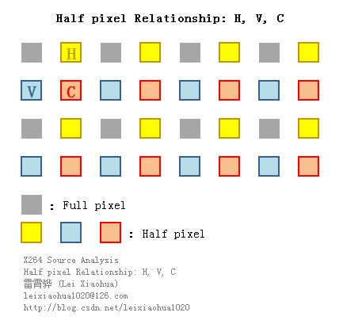

## **libx264 主干部分代码简介**
> **抄自:** [x264源代码简单分析：概述](https://blog.csdn.net/leixiaohua1020/article/details/45644367)


### **A. 帧内预测简述**
> **帧内预测根据宏块左边和上边的边界像素值推算宏块内部的像素值经.(经过帧内预测后叠加残差还原画面)**
  
- **16x16亮度帧内预测模式**  
    
    |模式|描述| 
    |:--|:--| 
    |Vertical|由上边像素推出相应像素值|
    |Horizontal|由左边像素推出相应像素值|
    |DC|由上边和左边像素平均值推出相应像素值|
    |Plane|由上边和左边像素推出相应像素值|
    |||

- **4x4亮度帧内预测模式**  
    

### **B. 像素值计算**
> **SAD和SATD主要用于帧内预测模式以及帧间预测模式的选择**

- **概念简介**
    ```sh
    # SAD（Sum of Absolute Difference）也称为SAE（Sum of Absolute Error）即绝对误差和。求出两个像素块对应像素点的差值绝对值，之后再进行累加。
    # SATD（Sum of Absolute Transformed Difference）即Hadamard变换后再绝对值求和。它和SAD的区别在于多了一个“变换”。
    #   将残差经哈德曼变换的4x4块的预测残差绝对值总和，可以将其看作简单的时频变换，其值在一定程度上可以反映生成码流的大小。
    #   [感觉差了一些基础性知识的积累]
    #
    # SSD（Sum of Squared Difference）也可以称为SSE（Sum of Squared Error），即差值的平方和。它和SAD的区别在于多了一个“平方”。
    ```

- **历史背景**
    ```sh
    # H.264中使用SAD和SATD进行宏块预测模式的判断。早期的编码器使用SAD进行计算，近期的编码器多使用SATD进行计算。
    # 关键原因在于编码之后码流的大小是和图像块DCT变换后频域信息紧密相关的，而和变换前的时域信息关联性小一些。
    # SAD只能反应时域信息；SATD却可以反映频域信息，而且计算复杂度也低于DCT变换，因此是比较合适的模式选择的依据。
    ```

- **应用例子**
    ```sh
    # 假设一个普通的Intra16x16的宏块的像素。使用Vertical，Horizontal，DC和Plane四种帧内预测模式预测的像素。
    # 通过计算可以得到这几种预测像素和原始像素之间的SAD（SAE）分别为3985，5097，4991，2539。
    # 由于Plane模式的SAD取值最小，由此可以断定Plane模式对于这个宏块来说是最好的帧内预测模式。
    ```

### **C. DCT变换简介**
> **DCT可以用于有损压缩去除人眼不敏感的高频信息**

- **DCT核心理念**
    ```sh
    # 1. 把图像的低频信息（对应大面积平坦区域）变换到系数矩阵的左上角，把高频信息变换到系数矩阵的右下角。
    # 2. 这样就可以在压缩的时候（量化）去除掉人眼不敏感的高频信息（位于矩阵右下角的系数）从而达到压缩数据的目的。
    # 3. 二维8x8DCT变换常见的示意图如下所示： 
    ```
    

- **具体变换数学公式，待续 >>>>**
    - 蝶形算法
    - 一维IDCT变换
    
### **D. 运动补偿/运动估计简介**
> **半像素插值是运动补偿/运动估计中的一种**

- **1个像素点拓展成4x4一共16个点 【由半象素点和1/4像素点组成】**
    > **《H.264标准》中规定，运动估计为1/4像素精度。因此在H.264编码和解码的过程中，需要将画面中的像素进行插值**

    ```sh
    # 下图显示了H.264编码和解码过程中像素插值情况。可以看出原先的G点的右下方通过插值的方式产生了a、b、c、d等一共16个点。     
    #   （1）半像素内插。这一步通过6抽头滤波器获得5个半像素点。
    #   （2）线性内插。这一步通过简单的线性内插获得剩余的1/4像素点。
    #
    # [获取半像素点的计算方法]
    # 图中半像素内插点为b、m、h、s、j五个点。半像素内插方法是对整像素点进行6 抽头滤波得出，
    # 滤波器的权重为(1/32, -5/32, 5/8, 5/8, -5/32, 1/32)。例如b的计算公式为：
    #       b=round( (E - 5F + 20G + 20H - 5I + J ) / 32)
    #
    # 剩下几个半像素点的计算关系如下：【六抽头滤波器】
    #       m：由B、D、H、N、S、U计算
    #       h：由A、C、G、M、R、T计算
    #       s：由K、L、M、N、P、Q计算
    #       j：由cc、dd、h、m、ee、ff计算。
    # j点的运算量比较大，因为cc、dd、ee、ff都需要通过半像素内插方法进行计算。
    ```
    
    ```sh
    # 1/4像素内插的方式如下图所示。例如图中a点的计算公式如下：
    #       A=round( (G+b)/2 )
    #
    # 位于4个角的e、g、p、r四个点是通过b、h、s、m四个半像素点计算的。
    ```
    

    ```sh
    # 去掉1/4像素点后的图片结构
    ```
    

### **E. 量化简介**
> **量化是H.264视频压缩编码中对视频质量影响最大的地方，也是会导致“信息丢失”的地方。【去除视觉冗余】**

- **量化的原理**
    ```sh
    # 量化公式：FQ=round(y/Qstep)
    # y 为输入样本点编码，Qstep为量化步长，FQ 为y 的量化值，
    #
    # 反量化公式：
    # y’＝FQ*Qstep
    #
    # Qstep越大，视频压缩编码后体积越小，视频质量越差
    #
    ```
    
    ```sh
    # 《H.264标准》中规定，量化过程除了完成本职工作外，还需要完成它前一步DCT变换中“系数相乘”的工作。
    # [这个公式完全为整数运算，同时避免了除法的使用]
    #
    # |Zij| = (|Wij|*MF + f)>>qbits
    # 
    # Wij: DCT变换后的系数。
    # MF值: 有对应表。如下表所示。表中只列出对应QP 值为0 到5 的MF 值。QP大于6之后，将QP实行对6取余数操作，再找到MF的值。
    # qbits: 为公式“qbits = 15 + floor(QP/6)”。即它的值随QP 值每增加6 而增加1。
    # f: 偏移量（用于改善恢复图像的视觉效果）。对帧内预测图像块取2^qbits/3，对帧间预测图像块取2^qbits/6。
    # 为了更形象的显示MF的取值，做了下面一张示意图。图中深蓝色代表MF取值较大的点，而浅蓝色代表MF取值较小的点。
    #
    ```
    
    

### **F. 环路滤波简介**

-  环路滤波（去块效应滤波）: X264的重建帧（通过解码得到）一般情况下会出现方块效应
    ```sh
    # 产生这种效应的原因主要有两个：
    # （1）DCT变换后的量化造成误差（主要原因）。
    # （2）运动补偿
    # 正是由于这种块效应的存在，才需要添加环路滤波器调整相邻的“块”边缘上的像素值以减轻这种视觉上的不连续感。
    ```
 
