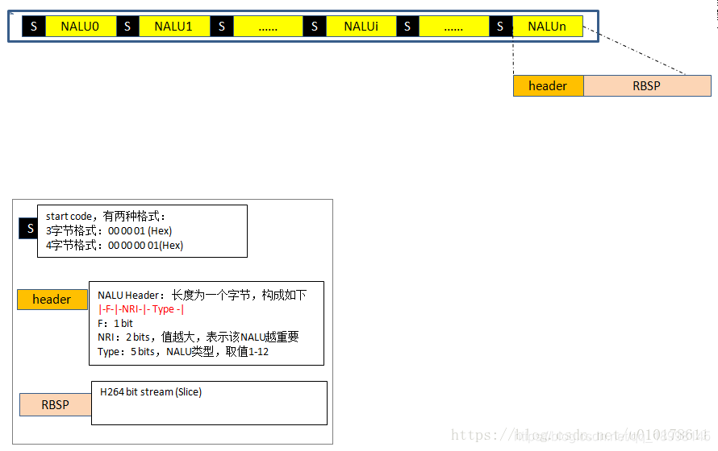
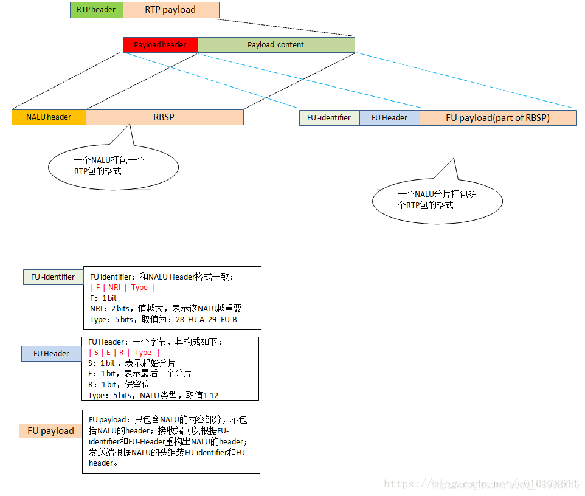

## **H264 NAL数据包格式**

### **A. H264协议数据包简介**
- H.264标准协议定义了两种不同的类型。
- **VCL**: Video Coding Layer. 编码器吐出来的原始编码数据，没有考虑传输和存储问题。
- **NAL**: Network Abstraction Layer. 对VCL输出的slice片数据进行了封装为NALUs(NAL  Units)便于网络传输。

### **B. NALU数据包格式**
> **NALU 数据包通常通过RTP进行传输**

> **NALU包F，NRI字段**

- F: 坏帧，则置1，其余H.264固定为0。
- NRI: 值越大，表示当前NALU越重要。大于0时取何值，没有具体规定。实际我们不太关心这个字段。

> **NALU类型 (数据报中的Type 5bit)**  

|**Type**|**内容**|**备注**|   
|:--|:--|:--|
|0|未指定||
|1|非IDR图像的slice|普通I,P,B帧 **slice_layer_without_partitioning_rbsp()**|
|2|	编码slice数据划分A|只传递片中最重要的信息，如片头，片中宏块的预测模式等；一般不会用到 **slice_data_partition_a_layer_rbsp()**|
|3|	编码slice数据划分B|	3类型是只传输残差；一般不会用到 **slice_data_partition_b_layer_rbsp()**|
|4|	编码slice数据划分C|	4时则只可以传输残差中的AC系数；一般不会用到 **slice_data_partition_c_layer_rbsp()**|
|5|	IDR图像中的编码slice|IDR帧，IDR一定是I帧 **slice_layer_without_partitioning_rbsp()**|
|6|	SEI补充增强信息单元|可以存一些私有数据等； **sei_rbsp()**|
|7|SPS 序列参数集|编码的参数配置 **seq_parameter_set_rbsp()**|
|8|PPS 图像参数集|编码的参数配置 **pic_parameter_set_rbsp(pps帧)**|
|9|接入单元界定符|**access_unit_delimiter_rbsp()**|
|10|序列结束|**end_of_seq_rbsp()**|
|11|码流结束|**end_of_stream_rbsp()**|
|12|填充数据|**filler_data_rbsp()**|
|13|序列参数集扩展|**seq_parameter_set_extension_rbsp( )**|
|19|未分割的辅助编码图像的编码条带|**slice_layer_without_partitioning_rbsp()**|
|24|STAP-A Single-time aggregation packet|单一时间聚合包模式，意味着一个RTP包可以传输多个NALU 这些NALU的编码时间要一样才能聚合到一个RTP|
|25|STAP-B Single-time aggregation packet||
|26|MTAP16|多个时间聚合包模式：意味着一个RTP包可以传输多个NALU 这些NALU的编码时间有可能不一样。|
|27|MTAP 24 Muti-time aggregation packet||
|28|FU-A Fragmentation unit|切包模式：当一个RTP容纳不下一个NALU时，就需要FUs这种格式。|
|29|FU-B Fragmention unit||
|30|未指定，保留||
|31|未指定，保留||
||||

### **C. H264视频流用RTP传输**
  
**纠正：FU-Header type(5 bit)的取值范围：1-23**

[参考链接](https://www.huaweicloud.com/articles79999bf7e4235d59927366e0dd1ca267.html)

     
