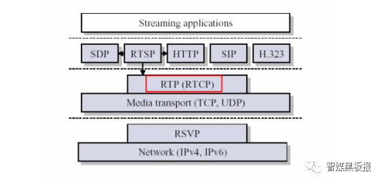
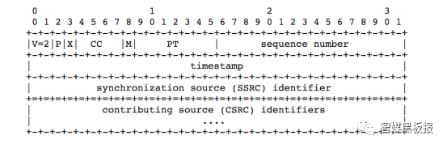
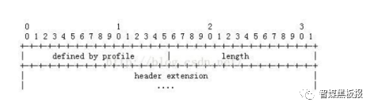

## **RTP 协议**

###  **RTP简介**
> **1996年的RFC1889给出RTP的规范和细节，其后在RFC3550中进行了更新【要系统性学习，直接看RFC3550规范】**

- **RTP:  实时传输协议(Real-time Transport Procotol): 一种网络传输协议，负责音视频数据的封包和传输**
- **RTCP: 实时传输控制协议(Read-time Transport Control Protocol): 流量和拥塞控制，媒体间的同步**
- **RTSP: 实时传输流协议(Real Time Streaming Procotol)**


### **RTP连接的建立**
- 通过RTSP、SIP或者HTTP等协议和接收端协商，确定了RTP要传输的对端IP地址和端口，传输内容格式【用SDP描述】
- 一般在协商过程中确定发送端RTP和RTCP的目的地址，偶数端口就是RTP媒体流的目的端口，偶数端口+1就是RTCP协议的目的端口

### **RTP报文结构**

```sh
# V:  RTP协议版本号.
# P:  填充标记(如果有填充数据，填充数据的第一个字节记录了填充数据的长度).
# X:  是否有拓展头.
# CC: CSRC个数【最多15个】
# M:  对于视频而言，表示帧结束
# PT: 有效载荷有效载荷类型(GSM音频、JPEM图像等)
# sequence number: 
#      网络不好时可用于检查丢包。网络抖动时可用于对数据重新排序;
#      音频包和视频包的sequence是分别记数的。
#
# timestamp:
#   单位是采样率到倒数，不是真实的时间，一般要根据采样率进行换算。
#   RTP报文第一个八位组的采样时刻，目的是为了接收端计算延迟、抖动和音视频同步。
#   一个视频帧的时间戳是相同的，如果视频帧数据量很大可能需要多个RTP包传输，它们的时间戳相同
#   音频帧数据小，不存在音频帧跨RTP的情况，所以不存在这个问题
# 
# SSRC: 同步信源标识符，用于标识同步信源。参加同一视频会议的两个同步信源不能有相同的SSRC。
# CSRC: 特约信源标识符
#     每个CSRC标识了包含在该RTP报文有效载荷中的所有特约信源
#     作用：混流和混音时，需要把各方的RTP同步信号源列出来
#
#
```


### **RTP头部拓展**

```sh
# 大部分音视频场景都没有启用RTP扩展部分，但是也有例外。在WebRTC中看到利用RTP扩展部分做了FEC
# 
# 扩展字段定义define by profile:16bit两字节，这个由上层的具体实现协议来决定
# 扩展头长度length:表示扩展头的长度字段，16bit即2字节，最大扩展长度1024字节
# 
```

### **RTP流解析代码**
> [雷神](!https://blog.csdn.net/leixiaohua1020/article/details/50535230)

```C
/**
 * 最简单的视音频数据处理示例
 * Simplest MediaData Test
 *
 * 雷霄骅 Lei Xiaohua
 * leixiaohua1020@126.com
 * 中国传媒大学/数字电视技术
 * Communication University of China / Digital TV Technology
 * http://blog.csdn.net/leixiaohua1020
 *
 * 本项目包含如下几种视音频测试示例：
 *  (1)像素数据处理程序。包含RGB和YUV像素格式处理的函数。
 *  (2)音频采样数据处理程序。包含PCM音频采样格式处理的函数。
 *  (3)H.264码流分析程序。可以分离并解析NALU。
 *  (4)AAC码流分析程序。可以分离并解析ADTS帧。
 *  (5)FLV封装格式分析程序。可以将FLV中的MP3音频码流分离出来。
 *  (6)UDP-RTP协议分析程序。可以将分析UDP/RTP/MPEG-TS数据包。
 *
 * This project contains following samples to handling multimedia data:
 *  (1) Video pixel data handling program. It contains several examples to handle RGB and YUV data.
 *  (2) Audio sample data handling program. It contains several examples to handle PCM data.
 *  (3) H.264 stream analysis program. It can parse H.264 bitstream and analysis NALU of stream.
 *  (4) AAC stream analysis program. It can parse AAC bitstream and analysis ADTS frame of stream.
 *  (5) FLV format analysis program. It can analysis FLV file and extract MP3 audio stream.
 *  (6) UDP-RTP protocol analysis program. It can analysis UDP/RTP/MPEG-TS Packet.
 *
 */
#include <stdio.h>
#include <winsock2.h>
 
#pragma comment(lib, "ws2_32.lib") 
 
#pragma pack(1)
 
/*
 * [memo] FFmpeg stream Command:
 * ffmpeg -re -i sintel.ts -f mpegts udp://127.0.0.1:8880
 * ffmpeg -re -i sintel.ts -f rtp_mpegts udp://127.0.0.1:8880
 */
 
typedef struct RTP_FIXED_HEADER{
	/* byte 0 */
	unsigned char csrc_len:4;       /* expect 0 */
	unsigned char extension:1;      /* expect 1 */
	unsigned char padding:1;        /* expect 0 */
	unsigned char version:2;        /* expect 2 */
	/* byte 1 */
	unsigned char payload:7;
	unsigned char marker:1;        /* expect 1 */
	/* bytes 2, 3 */
	unsigned short seq_no;            
	/* bytes 4-7 */
	unsigned  long timestamp;        
	/* bytes 8-11 */
	unsigned long ssrc;            /* stream number is used here. */
} RTP_FIXED_HEADER;
 
typedef struct MPEGTS_FIXED_HEADER {
	unsigned sync_byte: 8; 
	unsigned transport_error_indicator: 1; 
	unsigned payload_unit_start_indicator: 1;
	unsigned transport_priority: 1; 
	unsigned PID: 13;
	unsigned scrambling_control: 2;
	unsigned adaptation_field_exist: 2;
	unsigned continuity_counter: 4;
} MPEGTS_FIXED_HEADER;
 
 
 
int simplest_udp_parser(int port)
{
	WSADATA wsaData;
	WORD sockVersion = MAKEWORD(2,2);
	int cnt=0;
 
	//FILE *myout=fopen("output_log.txt","wb+");
	// 全局变量
    FILE *myout=stdout;
 
	FILE *fp1=fopen("output_dump.ts","wb+");
 
	if(WSAStartup(sockVersion, &wsaData) != 0){
		return 0;
	}
 
	SOCKET serSocket = socket(AF_INET, SOCK_DGRAM, IPPROTO_UDP); 
	if(serSocket == INVALID_SOCKET){
		printf("socket error !");
		return 0;
	}
 
	sockaddr_in serAddr;
	serAddr.sin_family = AF_INET;
	serAddr.sin_port = htons(port);
	serAddr.sin_addr.S_un.S_addr = INADDR_ANY;
	if(bind(serSocket, (sockaddr *)&serAddr, sizeof(serAddr)) == SOCKET_ERROR){
		printf("bind error !");
		closesocket(serSocket);
		return 0;
	}
 
	sockaddr_in remoteAddr;
	int nAddrLen = sizeof(remoteAddr); 
 
	//How to parse?
	int parse_rtp=1;
	int parse_mpegts=1;
 
	printf("Listening on port %d\n",port);
 
	char recvData[10000];  
	while (1){
 
		int pktsize = recvfrom(serSocket, recvData, 10000, 0, (sockaddr *)&remoteAddr, &nAddrLen);
		if (pktsize > 0){
			//printf("Addr:%s\r\n",inet_ntoa(remoteAddr.sin_addr));
			//printf("packet size:%d\r\n",pktsize);
			//Parse RTP
			//
			if(parse_rtp!=0){
				char payload_str[10]={0};
				RTP_FIXED_HEADER rtp_header;
				int rtp_header_size=sizeof(RTP_FIXED_HEADER);
				// RTP Header
                // 内存拷贝
				memcpy((void *)&rtp_header,recvData,rtp_header_size);
 
				//RFC3551
                // 结构体-字节的妙用
				char payload=rtp_header.payload;
				switch(payload){
				case 0:
				case 1:
				case 2:
				case 3:
				case 4:
				case 5:
				case 6:
				case 7:
				case 8:
				case 9:
				case 10:
				case 11:
				case 12:
				case 13:
				case 14:
				case 15:
				case 16:
				case 17:
				case 18: sprintf(payload_str,"Audio");break;
				case 31: sprintf(payload_str,"H.261");break;
				case 32: sprintf(payload_str,"MPV");break;
				case 33: sprintf(payload_str,"MP2T");break;
				case 34: sprintf(payload_str,"H.263");break;
				case 96: sprintf(payload_str,"H.264");break;
				default:sprintf(payload_str,"other");break;
				}
                // 网络字节序列转主机字节序
				unsigned int timestamp=ntohl(rtp_header.timestamp);
				unsigned int seq_no=ntohs(rtp_header.seq_no);
 
				fprintf(myout,"[RTP Pkt] %5d| %5s| %10u| %5d| %5d|\n",cnt,payload_str,timestamp,seq_no,pktsize);
 
				//RTP Data
				char *rtp_data=recvData+rtp_header_size;
				int rtp_data_size=pktsize-rtp_header_size;
				fwrite(rtp_data,rtp_data_size,1,fp1);
 
				//Parse MPEGTS
				if(parse_mpegts!=0&&payload==33){
					MPEGTS_FIXED_HEADER mpegts_header;
					for(int i=0;i<rtp_data_size;i=i+188){
						if(rtp_data[i]!=0x47)
							break;
						//MPEGTS Header
						//memcpy((void *)&mpegts_header,rtp_data+i,sizeof(MPEGTS_FIXED_HEADER));
						fprintf(myout,"   [MPEGTS Pkt]\n");
					}
				}
 
			}else{
				fprintf(myout,"[UDP Pkt] %5d| %5d|\n",cnt,pktsize);
				fwrite(recvData,pktsize,1,fp1);
			}
 
			cnt++;
		}
	}
	closesocket(serSocket); 
	WSACleanup();
	fclose(fp1);
 
	return 0;
}
```


[参考链接](https://www.huaweicloud.com/articles/79999bf7e4235d59927366e0dd1ca267.html)