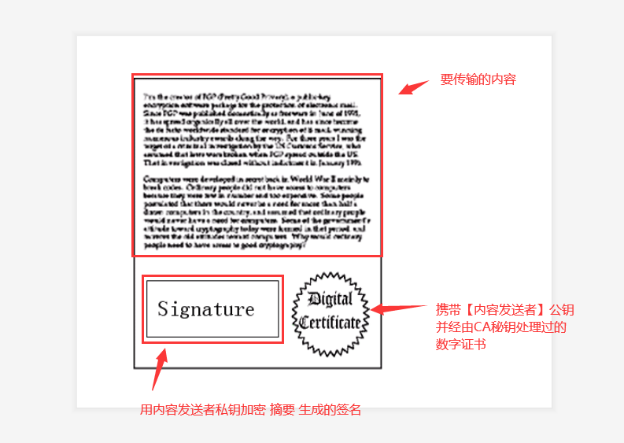
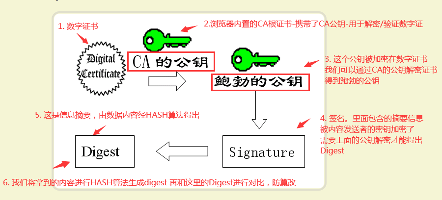

## **摘要信息，签名，证书** 
> [数字签名是什么？](http://www.ruanyifeng.com/blog/2011/08/what_is_a_digital_signature.html) [openssl几个加密算法使用介绍](https://blog.csdn.net/liangws_fzu/article/details/50035045)

- **一、要解决的问题**
1. 篡改风险
2. 冒充风险

- **二、摘要信息【解决篡改风险】**
1. 简介：对要传输内容进行 HASH 计算生成摘要信息
2. 效果：如果**传输内容被篡改**，则生成的摘要信息会对不上
3. 应用场景：
    ```sh
    # 实际应用过程中,因为需要加密的数据可能会很大,进行加密费时费力
    # 为了提高效率：一般把原数据先进行摘要,然后对这个摘要值进行公钥加密,将原数据的明文和加密后的摘要值一起传给你
    # 你用私钥解开加密后的摘要值,再和你得到的数据进行的摘要值对应一下就可以知道数据有没有被修改了
    # 因为私钥只有你有,只有你能解密摘要值,所以别人就算把原数据做了修改,然后生成一个假的摘要给你也是不行的,你这边用密钥也根本解不开.
    # 漏洞：私钥可能会被恶意替换
    ```

- **三、数字签名【解决篡改风险和冒充风险】**
1. 简介：消息发送者使用秘钥对摘要信息进行加密
2. 效果：摘要信息只能要用消息发送者的公钥才能解密，**防止摘要信息被篡改**

- **四、证书【解决冒充风险】**
1. 简介：携带消息发送者公钥的证书文件，这个文件经由第三方CA机构组织秘钥签名。
2. 流程：将消息发送者的公钥放在证书中发给客户端，客户端用CA的根证书解出证书中发送者的公钥
3. 效果：公钥是由消息发送者加密提供而不是内置在电脑中，避免第三方恶意病毒替换公钥，冒充消息发送者

- **五、图解**  
      

      

- **六、其他**
1. 公钥加密数据,然后私钥解密的情况被称为**加密解密**
2. 私钥加密数据,公钥解密一般被称为**签名和验证签名**
